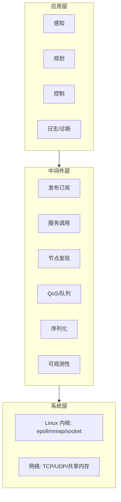
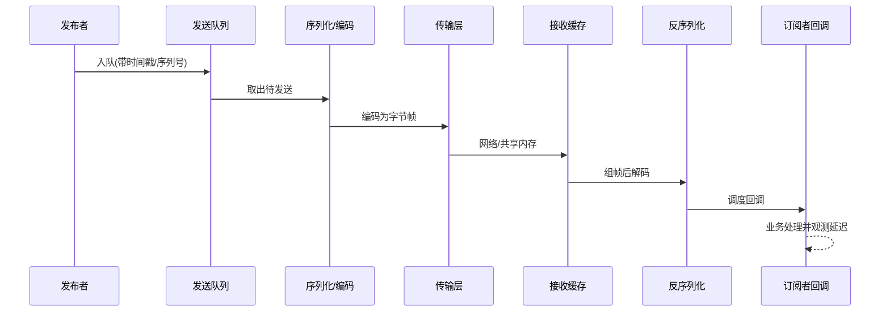
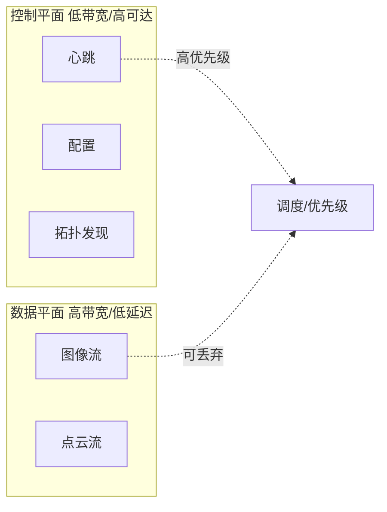
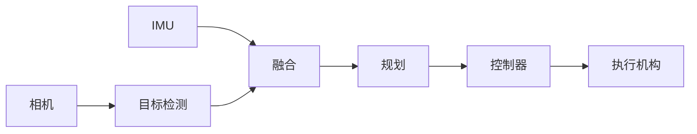

# 第 1 章：中间件全景与通信抽象

## 本章目标

你需要从"写一个网络程序"切换到"设计一套通信语义"：知道谁和谁通信、数据是什么性质、失败如何表达，以及中间件和业务节点的边界在哪里。学完本章，你能画出任意机器人系统的数据流图，并为每条边标注频率、大小、时效性、可靠性和失败策略。

## 1.1 中间件在系统中的位置

通信中间件是介于**操作系统/网络**和**业务算法**之间的一层。它把"字节在哪、发给谁、丢了怎么办"这类问题从算法里抽走，让感知、规划、控制专注业务。



{: .note }
> 中间件的价值不是"能收发消息"，而是把**不确定性变成明确协议**：发布者不必知道有多少订阅者，订阅者不必假设发布者永远在线。

## 1.2 核心概念与术语

- **Node（节点）**：拥有身份、生命周期、输入输出和健康状态的计算单元，可以是线程、进程或机器。
- **Topic（话题）**：持续的数据流，多对多，适合传感器、状态和事件。
- **Service（服务）**：有明确请求和响应的短操作，一对一。
- **Action（动作）**：可取消、有反馈、最终有结果的长操作。
- **Data plane（数据平面）**：图像、点云、IMU 等大量业务数据的传输路径。
- **Control plane（控制平面）**：发现、配置、健康、拓扑、租约和路由策略。
- **QoS（服务质量）**：可靠性、历史深度、deadline、持久性等行为契约（第 4 章展开）。

## 1.3 一条消息的生命周期

一条消息从产生到被消费，要经过多个可能增加延迟、拷贝或失败的阶段：



设计消息时，每条消息都应携带用于**去重、排序、延迟测量和版本兼容**的元数据（第 3 章给出具体结构）。

## 1.4 通信语义如何选择

| 需求 | 推荐语义 | 主要问题 |
| --- | --- | --- |
| 高频传感器（IMU/图像） | Pub-Sub | 旧数据是否应丢弃 |
| 参数查询/配置读取 | Service | 超时和服务不可用 |
| 导航/抓取等长任务 | Action | 取消、反馈和幂等 |
| 全局配置分发 | 可靠事件/快照 | 版本和一致性 |
| 大文件/日志上传 | 分片流 | 断点续传和校验 |

{: .warning }
> 不要用 Service 模拟持续流（会把异步流变成同步阻塞），也不要用无限重试的 Topic 传递"必须只执行一次"的控制命令（重复执行会造成危险动作）。

## 1.5 数据平面与控制平面为什么要分离



大数据流追求吞吐和低拷贝，发现/健康/配置追求可达性和一致性。分离后可以给控制消息更高优先级，避免一路图像拥塞把重连和安全控制一起拖死。

## 1.6 真实案例：相机到控制器的容量账

一帧 1920×1080 的 RGB888 图像大小：

$$1920 \times 1080 \times 3 = 6\,220\,800 \approx 6.2\,\text{MB}$$

30 FPS 时单路原始码率：

$$6.2\,\text{MB} \times 30 \approx 186\,\text{MB/s} \approx 1.5\,\text{Gbps}$$

**含义**：单路相机就逼近千兆网卡上限。这告诉我们：

- 跨机传输必须压缩（H.264/JPEG）或用多网卡/万兆。
- 同机应优先共享内存 + 零拷贝句柄，而不是 TCP 环回反复拷贝。
- 队列深度要有限；若消费者是 25 FPS 而生产是 30 FPS，每秒净积压 5 帧≈31MB，几秒就 OOM。

而控制指令可能只有 64 字节、500 Hz，即 32 KB/s，但它对 **deadline 和顺序**极端敏感。两类数据不能共用同一套无限可靠队列。

## 1.7 动手实验与验收

**实验**：为下面的计算图，给每条边标注 `频率 / 单条大小 / 时效性 / 可靠性 / 队列深度 / 丢弃策略`，并为每条消息设计一个消息头结构。



**消息头草案**（第 3 章会细化）：

```cpp
struct MessageHeader {
    uint32_t schema_id;        // 选择解码器
    uint16_t schema_version;   // 版本兼容
    uint16_t flags;            // 压缩/加密标志
    uint64_t message_id;       // 全局去重与追踪
    uint32_t source_id;        // 来源节点
    uint32_t sequence;         // 同源顺序/缺口检测
    uint64_t source_time_ns;   // 采集时间(传感器对齐)
    uint64_t send_time_ns;     // 发送单调时间(延迟测量)
    uint32_t deadline_ms;      // 过期即可丢弃
    uint32_t payload_len;      // 负载长度
};
```

**验收标准**：你能解释每个字段如何用于去重、排序、延迟测量或版本兼容；能说明当"融合"节点变慢时，检测和 IMU 两条上游会分别发生什么（积压？丢帧？背压？）。

## 1.8 面试问题与参考答案

**问：中间件和业务算法如何分层？**

答：中间件负责发现、传输、序列化、调度、QoS、容错和观测；算法节点负责业务语义。中间件应通过稳定的数据契约提供能力，不感知检测或规划的内部逻辑。判断标准是：换一个感知算法，中间件不需要改。

**问：为什么需要数据平面和控制平面分离？**

答：大数据流追求吞吐和低拷贝，发现、健康和配置追求可达性和一致性。分离后可以给控制消息独立通道和更高优先级，避免图像拥塞阻塞重连和安全控制。物理上可以是不同 socket、不同线程池、不同 QoS。

**问：Topic、Service、Action 如何区分？**

答：Topic 是异步持续流，一对多；Service 是短请求响应，一对一；Action 是带反馈和取消的长任务。本质区别是**生命周期、时效性、错误语义和重试语义**不同。导航任务用 Action 因为它需要中途反馈进度、支持取消，并在失败时给出明确结果码。

**问：一条消息端到端要经过哪些阶段？在哪些阶段最容易出问题？**

答：产生→入队→序列化→路由/发现→传输→接收缓存→反序列化→调度→处理。最常见的问题点是：入队（队列满/背压）、序列化（大对象拷贝耗 CPU）、调度（单线程 executor 被慢回调阻塞）、接收缓存（消费慢导致积压）。定位要靠分段打点，而不是只看端到端平均值。
