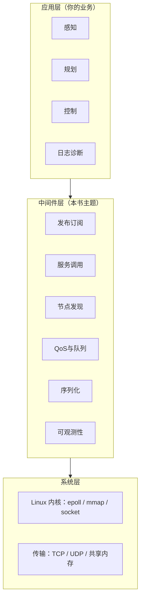
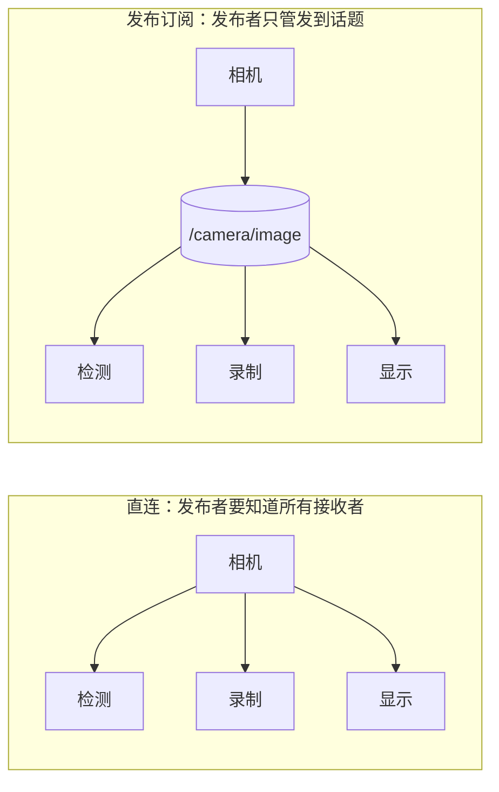
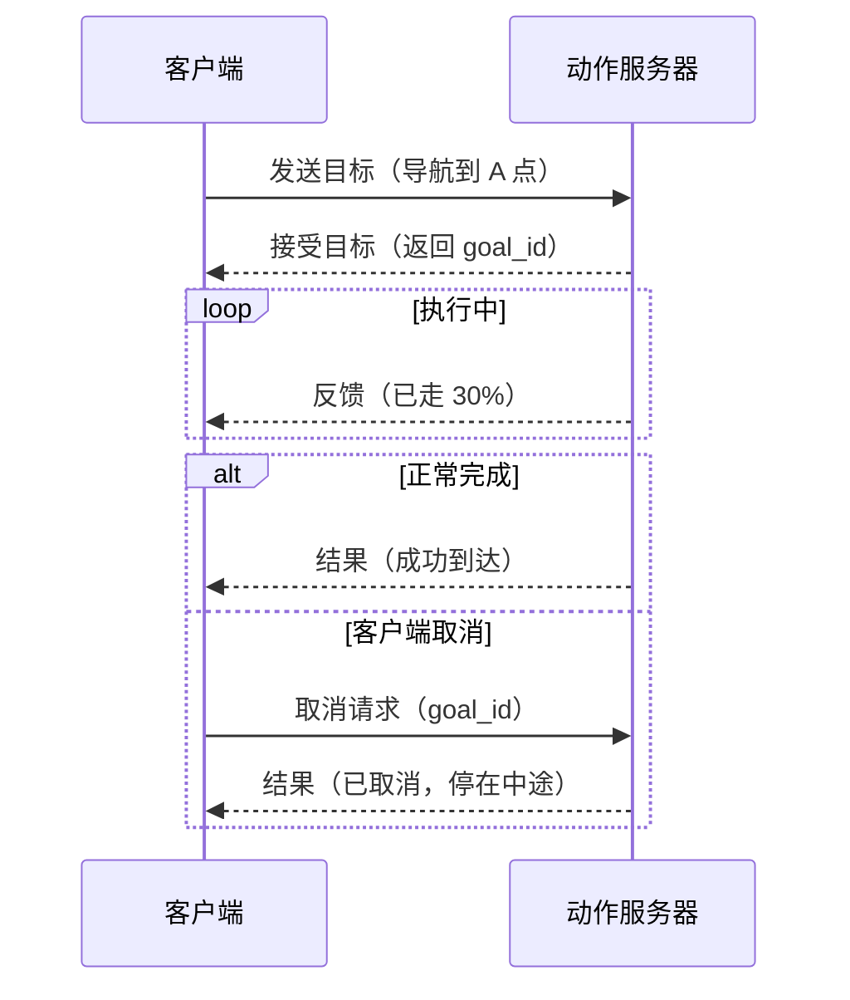
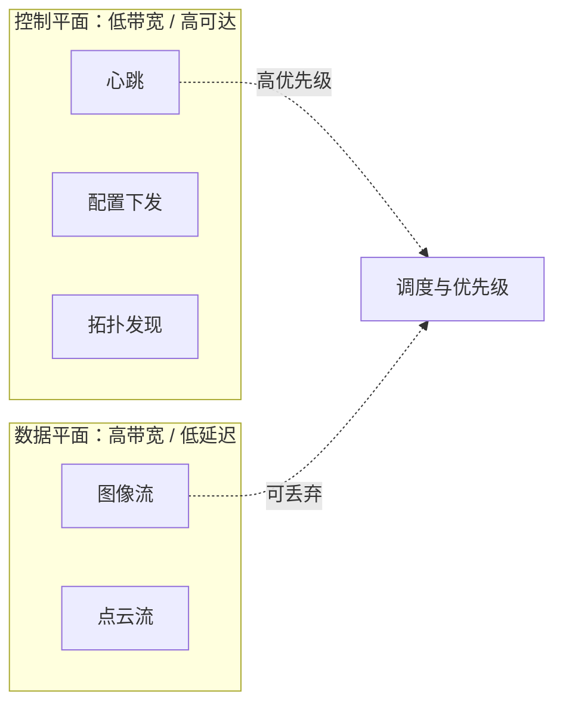
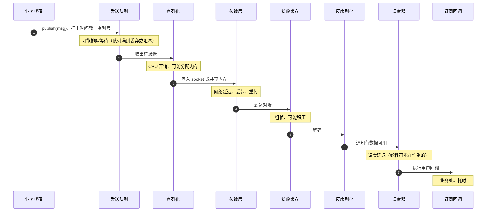
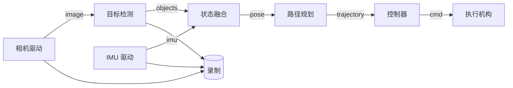

# 第 1 章：中间件全景与通信抽象

## 1.1 本章目标与前置知识

### 学完本章你能

- 说清楚"通信中间件"到底是什么，它在系统里占哪一层，边界在哪。
- 区分**发布订阅、请求响应、长任务动作**三种通信语义，并为具体场景选对。
- 区分**数据平面**和**控制平面**，说明为什么必须分开。
- 跟踪一条消息从产生到被消费的完整路径，指出每个阶段可能的延迟和失败。
- 用**容量估算**在写代码之前判断一个方案是否可行。

### 前置知识

只需要：知道进程和线程的区别，写过 socket 收发程序。本章不需要并发编程经验，那是第 2 章的内容。

## 1.2 为什么需要通信中间件

### 从一个具体困境开始

假设你要写一个简单的机器人程序：相机采集图像，检测算法找出障碍物，控制器根据结果刹车。

最直接的写法是把三件事写进一个进程、一个循环：

```cpp
// 版本 0：单进程单线程，看起来很简单
int main() {
    Camera cam;
    Detector det;
    Controller ctrl;
    while (true) {
        Image img = cam.capture();        // 33 ms
        auto objects = det.detect(img);   // 50 ms
        ctrl.apply(objects);              // 1 ms
    }
}
```

这个版本能跑，但很快会遇到一系列问题：

**问题一：一个模块崩溃，全部完蛋。** 检测算法用了第三方库，偶发段错误。整个进程挂掉，机器人在运动中失去控制。

**问题二：慢的拖累快的。** 检测要 50 ms，于是整个循环只能 12 FPS。但控制器本来应该以 100 Hz 运行才能稳定。

**问题三：加一个功能就要改主循环。** 现在要加录制、加日志上传、加一个新传感器，主循环变成几百行的泥潭。

**问题四：换台机器就跑不了。** 检测想放到有 GPU 的另一台机器上，代码要大改。

于是你自然会想到：**把模块拆成独立的进程，让它们之间传消息。**

### 拆开之后的新问题

```cpp
// 版本 1：拆成进程，用 socket 直连
// 相机进程
int sock = connect_to("127.0.0.1", 9000);
send(sock, img.data(), img.size(), 0);
```

拆开解决了崩溃隔离和速率解耦，但立刻产生新问题：

| 新问题 | 具体表现 |
| --- | --- |
| 检测进程还没启动 | 相机进程 `connect` 失败，崩溃退出 |
| 检测进程重启了 | 相机进程的连接断了，需要重连 |
| 又来一个录制进程也要图像 | 相机进程要维护两个连接、发两份 |
| 录制进程写盘慢 | `send` 阻塞，相机采集也卡住了 |
| 检测进程在另一台机器 | IP 硬编码，换机器要改代码重编译 |
| 消息格式改了 | 两边必须同时升级，否则解析错乱 |
| 出问题不知道卡在哪 | 没有任何统计和追踪 |

{: .important }
> **这就是中间件存在的意义。** 上面这张表里的每一行，都是中间件要替你解决的问题。中间件不是"帮你调 socket"，而是把"谁在、怎么找到、怎么分发、慢了怎么办、失败怎么办、怎么观测"这些**分布式系统的共性问题**收敛成一套可复用的机制。

### 中间件的层次位置



判断某个功能该放哪一层，用这个标准：

- **换一个感知算法，这段代码要改吗？** 不用改 → 属于中间件。
- **换一个通信框架，这段代码要改吗？** 不用改 → 属于业务。

## 1.3 核心概念与术语

### 节点（Node）

**节点**是拥有身份、生命周期、输入输出和健康状态的计算单元。它可以是一个线程、一个进程，或者一台机器上的一组进程。

节点的关键属性：

| 属性 | 说明 | 为什么重要 |
| --- | --- | --- |
| 身份（ID） | 全局唯一标识 | 用于寻址、去重、日志关联 |
| 代际（epoch） | 每次重启递增的编号 | 用于识别"这是重启后的新实例"（第 9 章） |
| 生命周期状态 | 初始化/就绪/降级/停止 | 让别的节点知道能否依赖它 |
| 输入输出契约 | 订阅什么、发布什么、类型和版本 | 用于发现和兼容性检查 |

{: .note }
> 为什么节点需要"代际"？设想节点 A 崩溃重启，它之前发出的消息可能还在网络里飘。如果没有代际编号，接收方无法区分"重启前的旧消息"和"重启后的新消息"，可能用旧数据覆盖新状态。这个问题在第 9 章会详细讨论。

### 话题（Topic）与发布订阅（Pub-Sub）

**话题**是一个具名的数据流通道，比如 `/camera/front/image`。**发布者（Publisher）**往话题里发数据，**订阅者（Subscriber）**从话题接收数据。

发布订阅的本质是**解耦**：



解耦带来三个好处：

1. **数量解耦**：新增一个订阅者，发布者代码不用改。
2. **时间解耦**：订阅者晚启动也能收到后续消息（甚至历史消息，取决于 QoS）。
3. **空间解耦**：订阅者在本机还是远程，发布者不关心。

### 服务（Service）：请求响应

**服务**是一对一的请求-响应调用，类似函数调用但跨进程。适合"查询参数""切换模式"这类**有明确开始和结束**的短操作。

与话题的关键差异：

| 维度 | 话题（Pub-Sub） | 服务（Service） |
| --- | --- | --- |
| 方向 | 单向 | 双向（请求+响应） |
| 数量关系 | 多对多 | 一对一 |
| 调用方是否等待 | 否 | 通常是 |
| 没有对端时 | 消息被丢弃 | 调用失败或超时 |
| 适合 | 持续数据流 | 短操作、查询 |

### 动作（Action）：可取消的长任务

**动作**用于"导航到某个点""抓取某个物体"这类**耗时长、需要进度反馈、可能要中途取消**的任务。



{: .warning }
> **常见错误**：用服务实现长任务。服务调用通常同步阻塞，一个 30 秒的导航任务会让调用方卡住 30 秒，期间无法响应急停。而且服务没有标准的取消机制。

### 数据平面与控制平面

这是从网络设备领域借来的概念，在中间件里同样关键：

- **数据平面（Data Plane）**：承载业务数据。特点是**量大、频率高**，追求吞吐和低延迟。例如图像、点云。
- **控制平面（Control Plane）**：承载发现、配置、健康、拓扑。特点是**量小、但必须可达**，追求可靠性和一致性。例如心跳、节点注册。



{: .important }
> **为什么必须分开？** 设想一个反例：图像流把网络打满，此时节点 B 崩溃了。控制平面的心跳消息因为和图像抢同一条拥塞的链路，迟迟送不到，导致系统 5 秒后才发现 B 已经挂了——而机器人在这 5 秒里一直在按 B 的旧数据行动。分离后可以给控制消息独立通道和更高优先级。

### 服务质量（QoS）

**QoS** 是发布者和订阅者之间关于**行为**的契约，回答这些问题：

- 消息丢了要不要重传？（可靠性）
- 队列存几条？满了丢哪条？（历史与深度）
- 消息多久算过期？（时限 deadline）
- 晚加入的订阅者能收到之前的消息吗？（持久性）

第 4 章会完整展开。这里只需记住：**QoS 不是"越强越好"，它是权衡**。

## 1.4 原理深入：一条消息的完整旅程

### 端到端路径分解



### 每个阶段的延迟来源与失败模式

| 阶段 | 典型延迟 | 主要失败模式 | 观测手段 |
| --- | --- | --- | --- |
| 入队 | < 1 μs | 队列满 → 丢弃或阻塞 | 队列水位、丢弃计数 |
| 序列化 | 图像约 1–10 ms | 内存不足、字段过大 | 分段计时、内存分配统计 |
| 传输 | 同机 < 0.1 ms，局域网 0.1–1 ms | 丢包、重传、拥塞 | `ss -tin` 看重传 |
| 接收缓存 | 取决于消费速度 | 积压、溢出 | 缓存占用 |
| 反序列化 | 与序列化同量级 | 版本不兼容、数据损坏 | 解析失败计数 |
| 调度 | 微秒到几十毫秒 | 线程被占用、优先级反转 | 调度延迟直方图 |
| 回调处理 | 业务决定 | 阻塞导致后续消息积压 | 回调耗时分布 |

{: .note }
> **这张表是全书的路线图**。第 2 章解决入队和调度，第 3 章解决序列化，第 4 章解决队列策略，第 6 章教你测量所有这些阶段，第 10 章教你在失败时定位。

### 消息为什么需要元数据

从上表可以推出：要诊断问题，消息本身必须携带足够信息。最小的消息头应该包含：

```cpp
// 消息头草案，第 3 章会给出完整版本
struct MessageHeader {
    uint32_t schema_id;        // 用哪个解码器
    uint16_t schema_version;   // 版本兼容检查
    uint16_t flags;            // 压缩、加密等标志位
    uint64_t message_id;       // 全局唯一，用于去重和链路追踪
    uint32_t source_id;        // 哪个节点发的
    uint32_t sequence;         // 同源递增，用于检测丢失和乱序
    uint64_t source_time_ns;   // 数据采集时刻（传感器对齐用）
    uint64_t send_time_ns;     // 发送时刻（计算传输延迟用）
    uint32_t deadline_ms;      // 超过这个时间就没有价值了
    uint32_t payload_len;      // 负载长度
};
```

逐个字段说明**为什么需要**：

- **`sequence`（序列号）**：接收方发现收到 1、2、4，就知道丢了 3。没有它，丢包是完全不可见的。
- **`source_time_ns` 和 `send_time_ns` 为什么要分开？** 采集时刻用于多传感器对齐（第 7 章），发送时刻用于计算网络延迟。相机可能在 T 时刻曝光，但因为处理排队到 T+20ms 才发出——这 20ms 是本机开销，不是网络延迟。
- **`deadline_ms`（时限）**：控制指令过期后执行反而危险。有了它，队列可以在出队时直接丢弃过期消息。
- **`message_id`（消息 ID）**：跨节点追踪一条消息的完整链路（第 10 章）。

## 1.5 工程实现：从零画一个系统的数据流图

设计中间件的第一步不是写代码，而是**画图并标注参数**。这是面试系统设计题的标准开场。

### 步骤一：画出节点和数据流



### 步骤二：为每条边标注参数

| 边 | 频率 | 单条大小 | 时效性 | 可靠性 | 队列深度 | 满了怎么办 |
| --- | --- | --- | --- | --- | --- | --- |
| image | 30 Hz | 6.2 MB | 100 ms | 可丢 | 2 | 丢最旧 |
| imu | 200 Hz | 64 B | 20 ms | 可丢 | 1 | 丢最旧（只要最新） |
| objects | 30 Hz | 4 KB | 100 ms | 尽量不丢 | 8 | 丢最旧 |
| pose | 100 Hz | 128 B | 20 ms | 可丢 | 1 | 丢最旧 |
| trajectory | 20 Hz | 2 KB | 100 ms | 不可丢 | 4 | 阻塞并告警 |
| cmd | 100 Hz | 64 B | 10 ms | 不可丢 | 1 | 丢最旧 + 过期检查 |

{: .tip }
> **表格里的每一列都对应一个后续章节的设计决策。** "队列深度"和"满了怎么办"来自第 4 章的 QoS；"时效性"决定 deadline；"可靠性"决定用可靠还是尽力传输。

### 步骤三：容量估算（决定架构可行性）

这一步经常被跳过，但它能在写代码前就否决掉不可行的方案。

**图像流的码率**：一帧 1920×1080 的 RGB888 图像，每像素 3 字节：

$$1920 \times 1080 \times 3 = 6\,220\,800\ \text{字节} \approx 6.2\ \text{MB}$$

30 FPS 时的码率：

$$6.2\ \text{MB} \times 30 = 186\ \text{MB/s} \approx 1.49\ \text{Gbps}$$

**结论一**：单路原始图像就超过千兆网（1 Gbps）的上限。因此跨机传输**必须**压缩（H.264/JPEG）或使用万兆网。

**结论二**：如果在同一台机器上，用 TCP 环回（loopback）传输意味着数据要在用户态和内核态之间来回拷贝。假设一次拷贝的内存带宽成本约 186 MB/s × 拷贝次数，4 次拷贝就是 744 MB/s 的额外内存带宽——这还只是一路相机。所以同机应该用**共享内存 + 零拷贝句柄**（第 3 章）。

**结论三：队列深度不能拍脑袋。** 假设消费者能力是 25 FPS，生产是 30 FPS，每秒净积压 5 帧：

$$5\ \text{帧/秒} \times 6.2\ \text{MB} = 31\ \text{MB/s}$$

如果队列无上限，10 秒后就积压 310 MB，几分钟后 OOM。所以**队列必须有界**，并明确满了之后的策略。

### 对比：控制指令的容量

控制指令 64 字节、100 Hz：

$$64 \times 100 = 6400\ \text{字节/秒} = 6.4\ \text{KB/s}$$

带宽完全不是问题。但它对**延迟和顺序**极端敏感：一条晚到 200 ms 的刹车指令，可能意味着一次碰撞。

{: .important }
> **这就是为什么不能"一套 QoS 走天下"。** 图像的矛盾是带宽和拷贝，控制的矛盾是延迟和确定性。两者用同一套无限可靠队列，结果是图像把内存吃光、控制指令排在过期数据后面。

## 1.6 常见错误与陷阱

### 陷阱一：用无限队列"避免丢消息"

```cpp
// 错误：无界队列
std::queue<Image> q;              // 没有容量限制
void on_image(Image img) {
    q.push(std::move(img));       // 消费者慢了就一直涨
}
```

**为什么错**：无限队列不能消除拥塞，只能把"丢消息"变成"延迟无限增长 + 内存耗尽"。而且队列里堆积的是**过期数据**，处理它们没有意义。

```cpp
// 正确：有界队列 + 明确策略
BoundedQueue<Image> q(2, FullPolicy::DropOldest);   // 第 2 章实现
if (!q.push(std::move(img))) {
    metrics.dropped_images++;      // 丢弃要计数，否则问题不可见
}
```

### 陷阱二：用服务实现流式数据

```cpp
// 错误：轮询式地"拉"图像
while (true) {
    auto img = client.call("get_image");   // 每次都要一个往返
    process(img);
}
```

**为什么错**：每次调用都有一个往返延迟（RTT），而且调用方和服务方紧耦合。图像是持续产生的，应该"推"而不是"拉"。

### 陷阱三：忽略时间戳的语义差异

```cpp
// 错误：用接收时刻当作数据时刻
void on_imu(const Imu& imu) {
    fuse(image_latest, imu, now_ns());   // now_ns() 不是采集时刻！
}
```

**为什么错**：从传感器采集到程序收到，中间有驱动、传输、排队等延迟，且延迟是**波动的**。用接收时刻做融合会引入系统性误差（第 7 章详解）。

### 陷阱四：把中间件当成万能胶水

有些团队把业务逻辑塞进中间件，比如在消息路由层做"如果检测到行人就提高图像帧率"。

**为什么错**：中间件一旦感知业务语义，就无法复用，也无法独立测试。正确做法是中间件提供"动态调整帧率"的机制，由业务节点决定何时调用。

## 1.7 真实案例：一条被图像拖垮的控制链路

### 现象

某室内配送机器人在走廊里正常行驶，但一进入光线复杂的大厅就开始"画龙"——轨迹左右摇摆，偶尔急停。

### 排查过程

1. 先看控制器日志：控制指令的下发周期从设计的 10 ms 变成了 10–250 ms 波动。
2. 检查控制器 CPU：只有 15%，不是算力问题。
3. 在控制链路上加分段打点，发现耗时集中在"等待位姿消息"。
4. 查位姿发布者（融合节点）：它的输入队列里积压了大量图像。

### 根因

大厅光线复杂 → 检测算法耗时从 30 ms 涨到 120 ms → 检测节点消费图像变慢 → 图像队列（当时是无界的）积压 → 融合节点和检测节点在同一进程、共用一个线程池 → 融合被图像处理挤占 → 位姿输出延迟且抖动 → 控制器拿到的是过期位姿。


### 方案与取舍

采取了三项措施：

1. **图像队列改为有界 + 丢最旧**，深度 2。代价是丢帧，但检测本来就跟不上 30 FPS，丢的是注定处理不了的帧。
2. **融合与检测分离到不同线程池**，融合线程绑定独立 CPU 核。代价是多占一个核。
3. **位姿消息加 deadline**，控制器发现位姿超过 50 ms 未更新就进入降速模式。代价是保守，但安全。

{: .note }
> 注意第 3 条：**中间件不能保证消息一定及时到达，所以消费者必须有"数据过期"的处理逻辑**。这是防御性设计，不能假设上游永远正常。

### 验证

- 注入"检测耗时 200 ms"的故障，控制指令周期 p99 从 250 ms 降到 12 ms。
- 图像丢帧率从 0（无界队列不丢但积压）变成 45%，但检测的**有效输出频率不变**——之前处理的都是过期帧。
- 控制器降速触发次数被记录，用于后续判断是否需要增强算力。

## 1.8 动手实验与验收

### 实验一：画图并标注（30 分钟）

为下面的系统画出数据流图，并填写完整的参数表（频率、大小、时效性、可靠性、队列深度、满队列策略）：

> 一个仓储 AGV：2 个相机（1280×720，20 FPS）、1 个 2D 激光雷达（10 Hz，每帧 1440 个测距点，每点 4 字节）、1 个 IMU（100 Hz）、轮速里程计（50 Hz）。需要做定位、避障、路径跟踪，并录制全部原始数据用于回放分析。

### 实验二：容量估算（20 分钟）

基于实验一的系统，计算：

1. 所有传感器的**总原始码率**是多少 MB/s？
2. 如果全部录制到磁盘，一次 2 小时的任务需要多少存储空间？
3. 如果磁盘写入速度是 200 MB/s，能否实时录制？如果不能，有哪些方案？

参考答案要点：相机 $1280 \times 720 \times 3 \times 20 \times 2 \approx 110.6$ MB/s；激光雷达 $1440 \times 4 \times 10 = 57.6$ KB/s；IMU 和里程计可忽略。总计约 110.7 MB/s，2 小时约 797 GB。磁盘够快但存储成本高，方案包括：图像压缩、降采样录制、只录关键片段。

### 实验三：消息头设计（30 分钟）

为上述系统设计消息头结构体，并对每个字段写一句"如果没有它会发生什么"。

### 验收标准

- [ ] 数据流图包含所有节点和边，无遗漏。
- [ ] 每条边的六个参数都有具体数值，且能解释理由。
- [ ] 容量估算的计算过程正确，结论明确（可行/不可行/需要什么条件）。
- [ ] 能说出当某个节点变慢时，哪些下游会受影响、如何隔离。

## 1.9 本章小结与自查清单

### 核心结论

1. 中间件的价值是把**分布式共性问题**（发现、分发、背压、失败、观测）从业务里抽出来。
2. 三种通信语义对应三类问题：**流用话题、短操作用服务、长任务用动作**。
3. **数据平面和控制平面必须分离**，否则大流量会掩盖故障信号。
4. 一条消息要经过约 8 个阶段，每个阶段都有独立的延迟和失败模式。
5. **容量估算要在写代码之前做**，它能直接否决不可行的架构。

### 自查清单

- [ ] 我能说出发布订阅相比直连 socket 的三个具体好处。
- [ ] 我能举例说明什么场景适合服务、什么场景必须用动作。
- [ ] 我能解释为什么心跳消息不能和图像走同一个拥塞的通道。
- [ ] 我能默画出消息的端到端阶段图，并指出每阶段的失败模式。
- [ ] 我能独立完成一个机器人系统的容量估算。
- [ ] 我理解为什么无界队列不是"更安全"的选择。

## 1.10 面试问题与参考答案

**问：什么是通信中间件？它解决什么问题？**

答：中间件是介于操作系统网络能力和业务算法之间的一层，把分布式系统的共性问题收敛成可复用机制：节点发现与寻址、消息分发与路由、序列化与版本兼容、队列与背压、失败处理（超时、重连、重试）、可观测性。判断某功能是否属于中间件的标准是：换一个业务算法它是否需要改动。不需要，就属于中间件。

**问：Topic、Service、Action 如何区分？各举一个机器人场景。**

答：三者的本质差异是**生命周期、时效性和错误语义**。Topic 是异步、多对多的持续流，适合 IMU 数据这类连续产生、订阅者可能有多个的场景；Service 是一对一的短请求响应，适合"读取当前配置参数"这类有明确开始结束的操作；Action 支持进度反馈和取消，适合"导航到 A 点"这类耗时数十秒、需要中途汇报进度并可能被急停打断的任务。用 Service 做长任务会导致调用方长时间阻塞且无法取消。

**问：为什么要区分数据平面和控制平面？**

答：两者的目标不同。数据平面追求吞吐和低拷贝，允许丢弃；控制平面追求可达性和一致性，量小但不能丢。如果混在一起，图像流打满带宽时，心跳和重连消息也会被拖延，导致故障发现和恢复变慢——恰恰在最需要控制平面工作的时候它失效了。工程上通过独立通道、独立线程池、优先级和带宽配额实现分离。

**问：一条消息从发布到被处理经历哪些阶段？哪些阶段最容易成为瓶颈？**

答：入队、序列化、传输、接收缓存、反序列化、调度、回调处理。最常见的瓶颈是：入队时队列满（表现为丢弃或阻塞）、序列化大对象消耗 CPU 和内存带宽、调度阶段线程被慢回调占用、接收端消费慢导致积压。定位方法是在每个阶段打点记录时间戳，看分段耗时分布，而不是只看端到端平均值。

**问：给你一个 30 FPS 的 1080p 相机，你会怎么设计它的传输？**

答：先算容量：$1920 \times 1080 \times 3 \times 30 \approx 186$ MB/s，约 1.5 Gbps，超过千兆网上限。所以要分情况：同机部署时用共享内存加引用计数句柄，避免多次拷贝；跨机时必须压缩（H.264 可以降到几 Mbps）或用万兆网。队列深度设为 1–2 并采用丢最旧策略，因为过期的图像帧没有处理价值。同时要监控丢帧率和端到端延迟 p99，确认消费者能力是否匹配。

**问：为什么消息里需要序列号和时间戳？只有时间戳不行吗？**

答：不行。序列号用于检测丢失和乱序——收到 1、2、4 就知道丢了 3，这靠时间戳无法可靠判断（时间戳可能相同或时钟有抖动）。时间戳又要区分两种：采集时刻用于多传感器对齐，发送时刻用于计算传输延迟。三者语义不同，不能互相替代。此外跨机器时本地时钟可能不同步，因果顺序更要依赖序列号或逻辑版本。

**问：无界队列有什么问题？**

答：无界队列不消除拥塞，只把"丢消息"转换成"延迟无限增长加内存耗尽"，而且最终仍会因 OOM 而丢掉全部数据。更严重的是队列里堆积的往往是过期数据，处理它们不但无价值还挤占资源。正确做法是有界队列加明确的满队列策略（阻塞、丢最新、丢最旧），并对丢弃计数，让问题可观测。

## 1.11 延伸阅读

- **ROS 2 概念文档**：官方对 Node、Topic、Service、Action 的定义与设计意图，可作为术语基准。
- **DDS 规范（OMG DDS）**：以数据为中心的发布订阅模型，第 5 章会用到其 QoS 部分。
- **《Designing Data-Intensive Applications》第 1 章**：可靠性、可扩展性、可维护性的定义方式，与本章的"四问法"思路一致。
- **Google SRE Book 中关于监控的章节**：理解"可观测性优先"的工程文化，对应本书第 10 章。

下一章将补齐并发与 Linux IPC 的基础，那是实现上述所有机制的地基。
