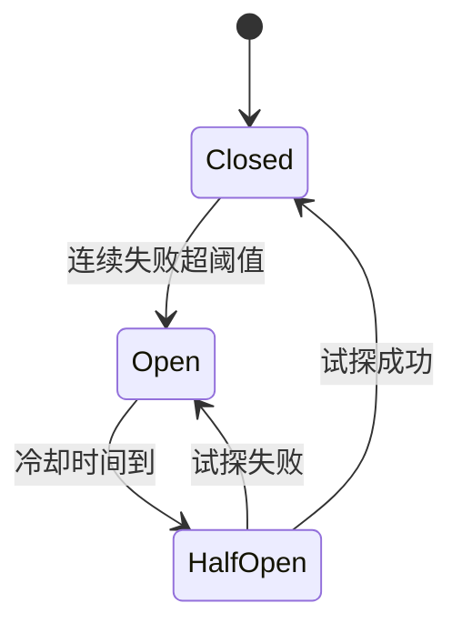
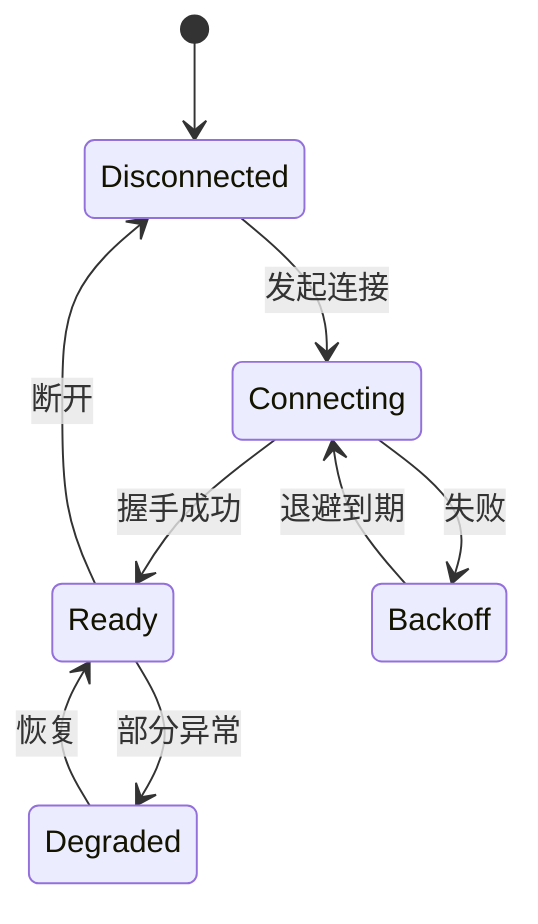
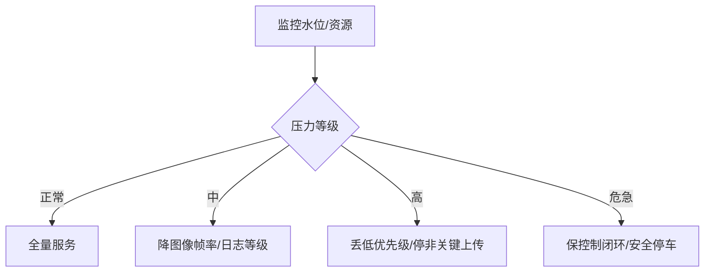
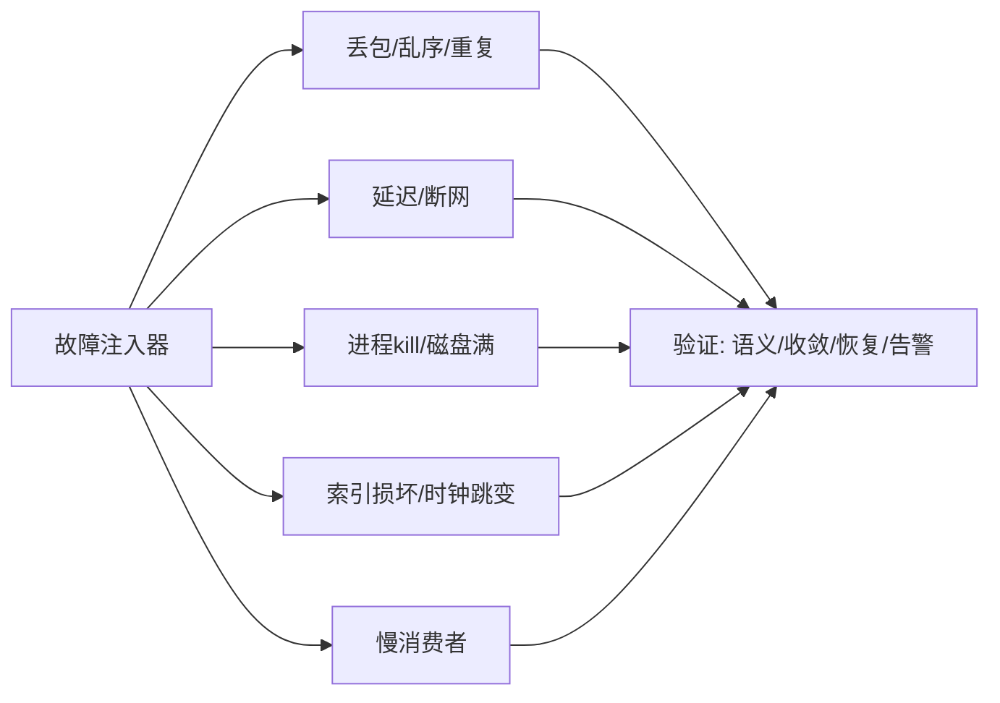

# 第 10 章：可靠性与可观测性

## 本章目标

让通信链路可以**失败、恢复和解释**。设计超时重试、指数退避、熔断、限流降级、状态机、trace 和故障注入，而不是只在成功路径上验证收发。

## 10.1 超时与指数退避重试

```cpp
#include <chrono>
#include <thread>
#include <random>
#include <functional>

struct RetryPolicy {
    int max_attempts = 5;
    std::chrono::milliseconds base{50};
    std::chrono::milliseconds cap{5000};
};

// 指数退避 + 抖动，避免重试风暴
template <typename Fn>
bool retry_with_backoff(Fn&& op, RetryPolicy p) {
    static thread_local std::mt19937 rng{std::random_device{}()};
    for (int attempt = 0; attempt < p.max_attempts; ++attempt) {
        if (op()) return true;                       // 成功
        if (attempt + 1 == p.max_attempts) break;
        auto exp = p.base * (1 << attempt);          // 指数增长
        auto backoff = std::min(exp, p.cap);
        std::uniform_int_distribution<long> jitter(0, backoff.count());
        std::this_thread::sleep_for(std::chrono::milliseconds(jitter(rng)));  // 全抖动
    }
    return false;
}
```

{: .warning }
> 重试必须配 **deadline、最大次数、指数退避、抖动**。多个节点同时超时后立即重试会造成**重试风暴**，把瞬时拥塞变成雪崩。抖动打散重试时刻。

## 10.2 熔断器：快速失败，保护下游



```cpp
class CircuitBreaker {
public:
    CircuitBreaker(int threshold, std::chrono::milliseconds cooldown)
        : threshold_(threshold), cooldown_(cooldown) {}

    bool allow() {
        auto now = std::chrono::steady_clock::now();
        if (state_ == Open) {
            if (now - opened_at_ >= cooldown_) { state_ = HalfOpen; return true; }
            return false;                         // 快速失败，不打下游
        }
        return true;
    }
    void on_success() { failures_ = 0; state_ = Closed; }
    void on_failure() {
        if (++failures_ >= threshold_) { state_ = Open;
            opened_at_ = std::chrono::steady_clock::now(); }
    }
private:
    enum State { Closed, Open, HalfOpen };
    State state_ = Closed;
    int failures_ = 0, threshold_;
    std::chrono::milliseconds cooldown_;
    std::chrono::steady_clock::time_point opened_at_;
};
```

## 10.3 连接状态机

为连接、订阅、发现、录制、上传建模，而不是散落的布尔变量：



每次状态迁移记录**原因、时间、代际（epoch）和待处理动作**。状态机比布尔变量更易测试和诊断。

## 10.4 限流与降级

根据队列水位、CPU、内存、磁盘、带宽动态决策：



{: .important }
> 降级要**可见、可恢复、有安全边界**。控制闭环绝不能依赖云端或非关键路径。降级动作要打点，恢复要自动。

## 10.5 链路追踪与指标

为消息设 message ID 和 trace ID，在关键点记 span：

```cpp
struct Span { const char* stage; uint64_t t_ns; };

struct Trace {
    uint64_t trace_id;
    std::vector<Span> spans;
    void mark(const char* stage) { spans.push_back({stage, now_ns()}); }
    void dump() {
        for (size_t i = 1; i < spans.size(); ++i)
            printf("  %s->%s: %.3fms\n", spans[i-1].stage, spans[i].stage,
                   (spans[i].t_ns - spans[i-1].t_ns) / 1e6);
    }
};
// 采集/入队/编码/发送/接收/解码/回调/写盘 各 mark 一次
```

核心指标：p50/p95/p99、队列水位、丢弃、重传、deadline miss、连接状态、磁盘错误、恢复时间、数据校验失败数。日志要**结构化**（node/topic/peer/message/error_code/状态变化），不要只输出无法关联的自然语言。

## 10.6 真实案例：云端不可用

某机器人上传服务依赖云端。云端故障时，上传重试线程疯狂重连，抢占了 CPU 和网络，**控制消息延迟飙升**，机器人开始画龙。

**根因**：重试没有隔离和限额，故障从"非关键上传"扩散到"关键控制"。

**修复**：控制、心跳、数据、上传分优先级和独立资源；上传用熔断器 + 低优先级线程 + 带宽配额；云端不可用时本地缓存、低优先级补传；控制闭环完全在边缘。

**验证**：注入云端故障，断言控制延迟 p99 不受影响、上传数据在恢复后完整补齐。

## 10.7 故障注入实验



## 10.8 动手实验与验收

**实验**：
1. 给第 4 章总线加断线重连状态机 + 指数退避 + 熔断器。
2. 实现 trace 打点，输出一条消息各阶段耗时。
3. 注入丢包、乱序、重复、断网、`kill -9`、磁盘满、时钟跳变、慢消费者。
4. 验证消息语义、状态收敛、无重复执行、恢复时间、告警和 trace 完整。

**验收标准**：故障下不崩溃、可恢复、可定位；重试不引发风暴；控制路径不被非关键路径拖累；每个故障都有对应指标和日志。

## 10.9 面试问题与参考答案

**问：重试为什么可能放大故障？**

答：多节点同步超时后立即重试形成重试风暴，进一步消耗 CPU 和带宽，把局部拥塞变成雪崩。要用指数退避 + 抖动 + 最大次数 + 总预算 + 错误分类（可重试 vs 业务拒绝）+ 优先级隔离。熔断器可在下游持续失败时快速失败，避免无谓打击。

**问：熔断器解决什么问题？**

答：当下游持续失败时，继续请求只会浪费资源并拖慢自己。熔断器在失败超阈值后进入 Open 快速失败，冷却后 HalfOpen 试探，成功才恢复 Closed。它把"慢速失败"变成"快速失败"，保护调用方和下游。

**问：怎样判断系统真的可靠？**

答：定义故障模型和可接受语义，再用故障注入验证：消息是否重复执行、状态是否收敛、数据是否可恢复、恢复时间是否达标、指标和日志能否定位根因。只跑成功路径不能证明可靠——可靠性是被失败测试出来的。

**问：日志和 trace 有什么区别？**

答：日志记录离散事件和上下文（结构化字段），trace 描述一条消息/请求跨线程、进程、机器的时序（span 链）。二者通过 trace ID、message ID 和时间关联。排查尾延迟主要靠 trace 分段，排查逻辑错误主要靠日志。

**问：降级设计的原则是什么？**

答：可见（打点告警）、可恢复（压力解除自动回全量）、有安全边界（控制闭环和安全动作永不降级）。按压力等级分级降低非关键负载（日志等级、图像帧率、非关键上传），把资源让给关键路径。绝不让关键路径依赖可降级的部分。
