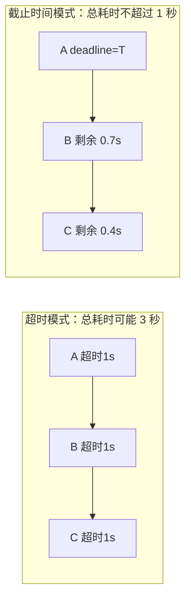
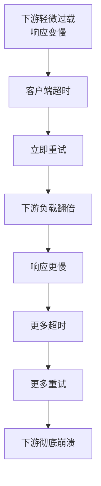
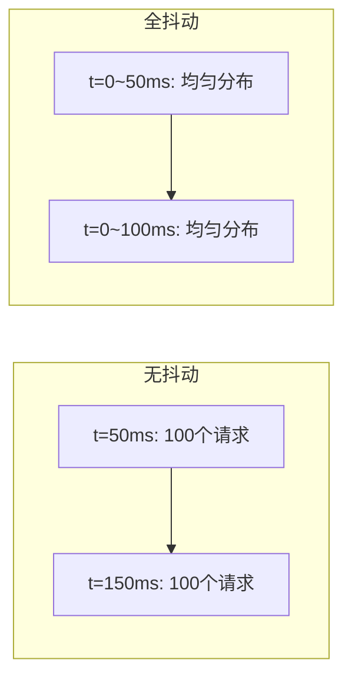
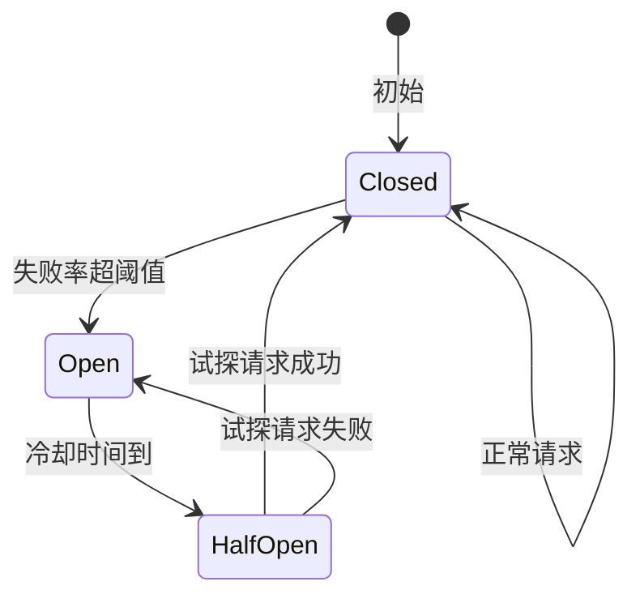
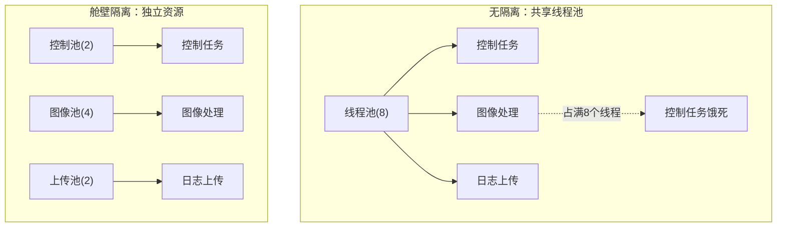
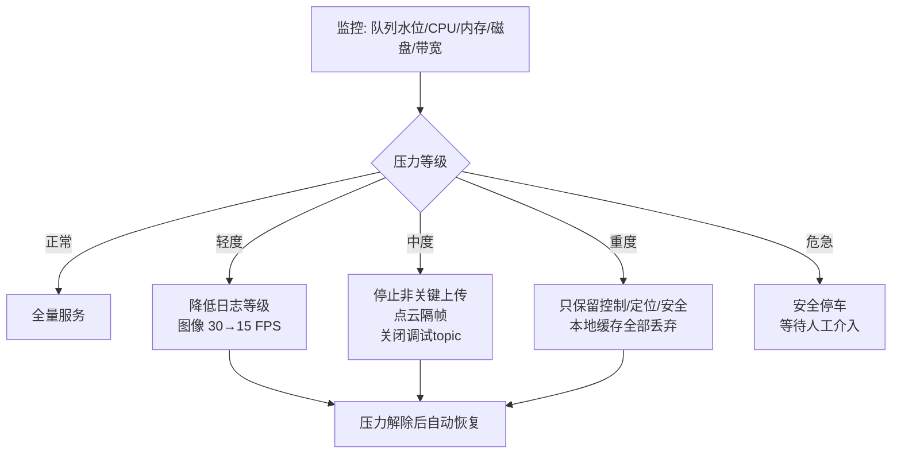
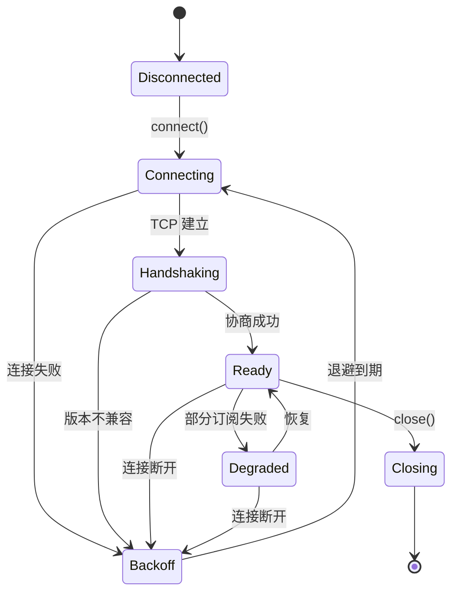
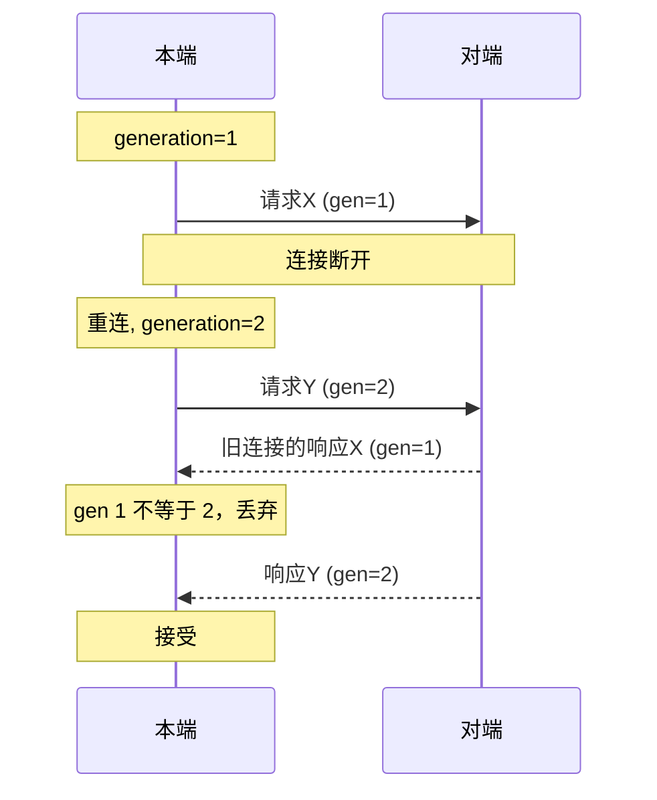
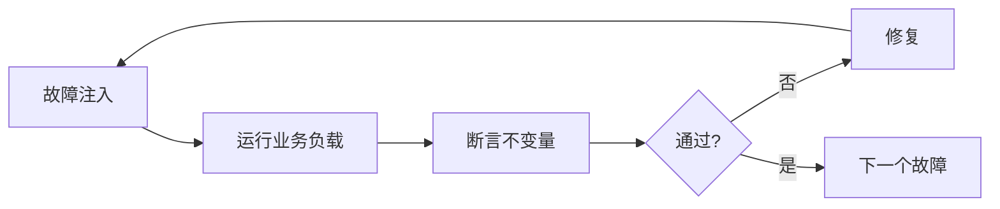

# 第 10 章：可靠性与可观测性

## 10.1 本章目标与前置知识

### 学完本章你能做到

- 建立一个明确的故障模型：列出系统会遇到哪些失败，以及每种失败的可接受行为。
- 正确设计超时、重试、退避和抖动，并解释为什么错误的重试会把局部故障放大成雪崩。
- 实现熔断器、限流器和分级降级，让关键路径在压力下仍然可用。
- 用状态机管理连接、订阅、录制和上传的生命周期，而不是散落的布尔变量。
- 设计链路追踪和结构化日志，让"p99 为什么高"这类问题在几分钟内定位。
- 用故障注入证明系统可靠，而不是只跑成功路径。

### 需要先掌握

| 前置知识 | 在哪一章 | 为什么需要 |
| --- | --- | --- |
| 有界队列与背压 | 第 2 章 | 限流和降级的基础 |
| QoS 与丢弃策略 | 第 4 章 | 分级降级依赖数据分级 |
| 延迟分位与测量 | 第 6 章 | 可观测性指标的基础 |
| epoch 与幂等 | 第 9 章 | 重试安全的前提 |

{: .important }
> 本章的核心观点：**可靠性不是"不出错"，而是"出错时行为可预期、可恢复、可解释"**。任何声称"不会失败"的设计都是没有想清楚失败模式。

---

## 10.2 为什么可靠性必须被设计

### 10.2.1 成功路径只占代码的一小部分

一个真实的通信模块，处理成功路径的代码可能只有 20%，其余 80% 都在处理各种失败。新手常犯的错误是把这 80% 当成"边界情况"事后补，结果是补不完、补不对。

```cpp
// 新手版本：只有成功路径
void send_command(const Command& cmd) {
    socket_.send(serialize(cmd));      // 失败了怎么办？
}

// 稍微好一点：知道会失败
void send_command(const Command& cmd) {
    if (!socket_.send(serialize(cmd)))
        log_error("send failed");      // 记了日志，然后呢？命令丢了
}

// 真正可用：失败有明确语义
SendResult send_command(const Command& cmd) {
    if (now() > cmd.deadline)
        return SendResult::Expired;             // 过期的命令不该发
    if (!breaker_.allow())
        return SendResult::CircuitOpen;         // 下游持续失败，快速失败
    if (!socket_.send(serialize(cmd))) {
        breaker_.on_failure();
        return SendResult::TransportError;      // 调用方决定是否重试
    }
    breaker_.on_success();
    return SendResult::Ok;
}
```

第三个版本的关键不是"代码更长"，而是**每种失败都有名字**。有名字才能被计数、被告警、被测试。

### 10.2.2 机器人场景的特殊性

| 特点 | 对可靠性的影响 |
| --- | --- |
| 物理动作不可撤销 | 重复执行可能造成碰撞，必须幂等 |
| 无线网络不稳定 | 断连是常态而非异常 |
| 断电可能随时发生 | 急停会切断总电源 |
| 现场无人干预 | 必须自动恢复，不能等人重启 |
| 安全要求高 | 通信失败时必须有本地兜底 |

{: .warning }
> 互联网服务失败了，用户刷新页面就行。机器人失败了，可能撞坏货物或伤人。这决定了机器人中间件在"可用性"和"安全"冲突时，**永远优先安全**——宁可停下来，不可带着不确定状态继续动。

### 10.2.3 故障模型：先列清单再写代码

设计前先列出系统会遇到的失败。下面是一个机器人通信中间件的典型清单：

| 故障类型 | 具体表现 | 可接受行为 |
| --- | --- | --- |
| 消息丢失 | 订阅者收不到某条消息 | 传感器可丢；命令需重传或报错 |
| 消息重复 | 同一消息到达两次 | 必须幂等，不产生重复副作用 |
| 消息乱序 | 后发的先到 | 用序列号排序或丢弃过期 |
| 消息延迟 | 到达时已过 deadline | 丢弃并计数，不执行 |
| 连接断开 | TCP 断开、对端重启 | 自动重连，重连后重新同步 |
| 网络分区 | 部分节点互不可见 | 本地继续安全动作，恢复后收敛 |
| 对端进程崩溃 | 无响应 | 心跳检测，租约过期，接管 |
| 本进程崩溃 | 自身被杀 | 重启后从持久化状态恢复 |
| 磁盘写满 | 写入失败 | 停止录制，告警，保留最新数据 |
| 内存不足 | 分配失败 | 有界队列防止，触发降级 |
| CPU 过载 | 处理不过来 | 降级非关键任务 |
| 时钟跳变 | NTP 校时 | 用单调时钟，不受影响 |
| 版本不兼容 | 新旧节点混跑 | 明确报错，不静默错误解释 |

{: .tip }
> 这张表本身就是一份测试用例清单。10.11 节的故障注入实验就是逐条验证它。面试时如果被问"你怎么保证可靠性"，先给出这样一张表，比说任何形容词都有说服力。

---

## 10.3 核心概念与术语

| 中文 | 英文 | 含义 |
| --- | --- | --- |
| 超时 | Timeout | 等待的最长时间，超过即放弃 |
| 截止时间 | Deadline | 绝对时间点，过期即无价值 |
| 退避 | Backoff | 重试间隔逐次增大 |
| 抖动 | Jitter | 给退避加随机量，打散重试时刻 |
| 熔断器 | Circuit breaker | 下游持续失败时快速失败，保护双方 |
| 限流 | Rate limiting | 限制单位时间的请求量 |
| 降级 | Degradation | 压力下主动放弃非关键功能 |
| 舱壁隔离 | Bulkhead | 给不同流量分配独立资源池 |
| 重试风暴 | Retry storm | 大量客户端同时重试造成的雪崩 |
| 惊群 | Thundering herd | 大量请求在同一时刻涌向同一资源 |
| 链路追踪 | Distributed tracing | 记录一次请求跨组件的完整时序 |
| 跨度 | Span | 追踪中的一个阶段 |
| 结构化日志 | Structured logging | 带字段的机器可读日志 |
| 故障注入 | Fault injection | 主动制造故障验证系统行为 |

---

## 10.4 超时与截止时间

### 10.4.1 超时 vs 截止时间

这两个概念经常被混用，但语义不同：

```cpp
// 超时：相对时间，每一跳独立计算
bool call_with_timeout(Request r) {
    return rpc(r, /*timeout=*/1000ms);      // 每一跳都等 1 秒
}

// 截止时间：绝对时间，跨越整条调用链
bool call_with_deadline(Request r, TimePoint deadline) {
    if (Clock::now() >= deadline) return false;   // 已过期，不必再发
    auto remaining = deadline - Clock::now();
    return rpc(r, remaining);                     // 剩余时间传给下一跳
}
```

**为什么截止时间更好**：



三跳调用链，每跳超时 1 秒，最坏总耗时 3 秒；而调用方可能 1 秒后就不需要结果了。用截止时间可以让整条链在真正无意义时立即放弃，节省所有下游的资源。

{: .important }
> 机器人控制场景尤其需要 deadline：一条 50 ms 前就该执行的速度指令，现在到达已经有害无益，应该丢弃而不是执行。

### 10.4.2 超时值怎么定

不要拍脑袋。基本方法：

$$T_{\text{timeout}} = \text{RTT}_{p99} \times k + \text{处理时间}_{p99}$$

**例**：某服务 RTT p99 = 20 ms，处理时间 p99 = 30 ms，$k = 2$：

$$T = 20 \times 2 + 30 = 70\ \text{ms}$$

设成 100 ms 留点余量。

**常见错误**：把超时设成平均值的几倍。平均值 5 ms、p99 是 50 ms 的服务，超时设 20 ms（4 倍平均值）会导致 1% 以上的请求被误判为超时。**必须用高分位数**。

### 10.4.3 超时的传播

```cpp
struct RequestContext {
    Clock::time_point deadline;
    uint64_t trace_id;

    std::chrono::milliseconds remaining() const {
        auto d = deadline - Clock::now();
        return d.count() > 0
            ? std::chrono::duration_cast<std::chrono::milliseconds>(d)
            : std::chrono::milliseconds(0);
    }
    bool expired() const { return Clock::now() >= deadline; }
};

// 每一层都检查并传递
Result handle(const RequestContext& ctx, const Request& req) {
    if (ctx.expired()) return Result::DeadlineExceeded;
    // 调用下游时把剩余时间传下去，而不是重新计一个超时
    return downstream_.call(ctx, req);
}
```

---

## 10.5 重试：最容易做错的机制

### 10.5.1 天真的重试会放大故障

```cpp
// 危险：立即重试，无限次
while (!send(msg)) { /* 立刻再试 */ }
```

这段代码在下游正常时无害，但在下游过载时是灾难：



这就是**重试风暴**。原本只是轻微过载，被重试放大成完全不可用。

### 10.5.2 指数退避与抖动

正确的重试需要四个要素：**最大次数、指数退避、随机抖动、错误分类**。

```cpp
// retry.hpp
#pragma once
#include <chrono>
#include <random>
#include <thread>
#include <functional>

namespace rel {

enum class ErrorKind {
    Retryable,     // 网络抖动、临时过载 —— 可以重试
    Permanent,     // 参数错误、权限不足 —— 重试无用
    Overload,      // 下游明确说"我忙" —— 重试但要更长退避
};

struct RetryPolicy {
    int max_attempts = 5;
    std::chrono::milliseconds base{50};
    std::chrono::milliseconds cap{5000};
    std::chrono::milliseconds total_budget{15000};   // 总时间预算
};

// 全抖动（full jitter）：在 [0, backoff] 区间随机
inline std::chrono::milliseconds full_jitter(
        std::chrono::milliseconds backoff) {
    static thread_local std::mt19937 rng{std::random_device{}()};
    std::uniform_int_distribution<long long> d(0, backoff.count());
    return std::chrono::milliseconds(d(rng));
}

template <typename Op>
bool retry(Op&& op, RetryPolicy p) {
    auto start = std::chrono::steady_clock::now();
    for (int attempt = 0; attempt < p.max_attempts; ++attempt) {
        ErrorKind kind;
        if (op(kind)) return true;                   // 成功
        if (kind == ErrorKind::Permanent) return false;  // 重试无意义

        if (attempt + 1 == p.max_attempts) break;

        // 指数退避：base * 2^attempt，封顶 cap
        auto exp = p.base * (1LL << attempt);
        auto backoff = exp > p.cap ? p.cap : exp;
        auto sleep = full_jitter(backoff);

        // 检查总预算，避免重试拖过 deadline
        auto elapsed = std::chrono::steady_clock::now() - start;
        if (elapsed + sleep > p.total_budget) break;

        std::this_thread::sleep_for(sleep);
    }
    return false;
}

} // namespace rel
```

### 10.5.3 为什么必须有抖动

假设 100 个客户端在同一时刻超时，都用 `base * 2^attempt` 退避：

- 无抖动：100 个客户端在同一毫秒同时重试，第 1 次、第 2 次、第 3 次全都撞在一起。
- 有全抖动：第 1 次重试分散在 $[0, 50]$ ms，第 2 次分散在 $[0, 100]$ ms，负载被摊平。



{: .warning }
> 抖动不是可选优化，是**必需品**。没有抖动的指数退避在大规模下仍然会造成同步的负载尖峰。

### 10.5.4 重试的前提是幂等

```cpp
// 危险：重试会导致机器人前进两次
void move_forward(double meters) {
    retry([&](ErrorKind& k) { return send_move_cmd(meters, k); }, policy);
}

// 安全：带幂等键，下游去重
void move_forward(double meters, uint64_t cmd_id) {
    retry([&](ErrorKind& k) {
        return send_move_cmd(cmd_id, meters, k);   // 下游按 cmd_id 去重
    }, policy);
}
```

{: .important }
> 重试的正确性完全依赖幂等。如果操作不幂等，重试可能比不重试更危险——因为超时不代表下游没执行，可能只是响应丢了。这时重试就是重复执行。

### 10.5.5 错误分类表

| 错误 | 分类 | 处理 |
| --- | --- | --- |
| 连接被拒绝 | Retryable | 退避重试 |
| 超时 | Retryable（若幂等） | 退避重试 |
| 服务返回"过载" | Overload | 更长退避 + 降低发送速率 |
| 参数校验失败 | Permanent | 立即失败，记录并告警 |
| 权限不足 | Permanent | 立即失败 |
| 版本不兼容 | Permanent | 立即失败，触发升级流程 |
| 已过 deadline | Permanent | 放弃，不再重试 |

---

## 10.6 熔断器

### 10.6.1 解决什么问题

当下游持续失败时，继续请求只有坏处：浪费自己的线程和内存、给下游雪上加霜、让自己的响应时间被拖垮。熔断器把"慢速失败"变成"快速失败"。



| 状态 | 行为 |
| --- | --- |
| Closed（闭合） | 正常放行，统计失败率 |
| Open（断开） | 直接拒绝，不发请求，返回快速失败 |
| HalfOpen（半开） | 放行少量试探请求，根据结果决定回到 Closed 还是 Open |

### 10.6.2 实现

```cpp
// circuit_breaker.hpp
#pragma once
#include <chrono>
#include <mutex>
#include <atomic>

namespace rel {

class CircuitBreaker {
public:
    struct Config {
        int      failure_threshold = 5;      // 连续失败多少次后断开
        double   failure_rate = 0.5;         // 或失败率超过多少
        int      min_samples = 20;           // 计算失败率的最小样本数
        std::chrono::milliseconds cooldown{5000};
        int      half_open_max = 3;          // 半开时允许几个试探
    };

    explicit CircuitBreaker(Config c) : cfg_(c) {}

    // 请求前调用，返回 false 表示被熔断
    bool allow() {
        std::lock_guard lk(mu_);
        auto now = Clock::now();
        switch (state_) {
            case State::Closed:
                return true;
            case State::Open:
                if (now - opened_at_ >= cfg_.cooldown) {
                    state_ = State::HalfOpen;
                    half_open_inflight_ = 0;
                    half_open_success_ = 0;
                    return true;
                }
                rejected_.fetch_add(1, std::memory_order_relaxed);
                return false;                 // 快速失败
            case State::HalfOpen:
                if (half_open_inflight_ >= cfg_.half_open_max) return false;
                ++half_open_inflight_;
                return true;
        }
        return true;
    }

    void on_success() {
        std::lock_guard lk(mu_);
        ++total_; ++success_;
        consecutive_failures_ = 0;
        if (state_ == State::HalfOpen) {
            if (++half_open_success_ >= cfg_.half_open_max) {
                state_ = State::Closed;       // 试探全部成功，恢复
                reset_window();
            }
        }
    }

    void on_failure() {
        std::lock_guard lk(mu_);
        ++total_;
        ++consecutive_failures_;
        if (state_ == State::HalfOpen) {
            trip();                            // 试探失败，立即回到 Open
            return;
        }
        bool by_count = consecutive_failures_ >= cfg_.failure_threshold;
        bool by_rate  = total_ >= cfg_.min_samples &&
                        double(total_ - success_) / total_ > cfg_.failure_rate;
        if (by_count || by_rate) trip();
    }

    uint64_t rejected() const {
        return rejected_.load(std::memory_order_relaxed);
    }

private:
    using Clock = std::chrono::steady_clock;
    enum class State { Closed, Open, HalfOpen };

    void trip() {
        state_ = State::Open;
        opened_at_ = Clock::now();
        reset_window();
    }
    void reset_window() { total_ = 0; success_ = 0; consecutive_failures_ = 0; }

    std::mutex mu_;
    Config cfg_;
    State state_ = State::Closed;
    Clock::time_point opened_at_{};
    int consecutive_failures_ = 0;
    int total_ = 0, success_ = 0;
    int half_open_inflight_ = 0, half_open_success_ = 0;
    std::atomic<uint64_t> rejected_{0};
};

} // namespace rel
```

### 10.6.3 熔断器的两个陷阱

**陷阱一：熔断粒度太粗**

给整个"云端服务"配一个熔断器，那么上传日志失败会导致下发配置也被熔断。应该**按下游端点分别熔断**。

**陷阱二：关键路径不该熔断**

紧急停止指令不应该因为熔断器 Open 就不发。安全相关的操作要有独立通道，或者绕过熔断直接尝试。

---

## 10.7 限流与舱壁隔离

### 10.7.1 令牌桶限流

```cpp
// rate_limiter.hpp
#pragma once
#include <chrono>
#include <mutex>

namespace rel {

// 令牌桶：允许一定突发，长期速率受限
class TokenBucket {
public:
    TokenBucket(double rate_per_sec, double burst)
        : rate_(rate_per_sec), capacity_(burst), tokens_(burst),
          last_(Clock::now()) {}

    bool try_acquire(double n = 1.0) {
        std::lock_guard lk(mu_);
        refill();
        if (tokens_ < n) return false;
        tokens_ -= n;
        return true;
    }

private:
    using Clock = std::chrono::steady_clock;
    void refill() {
        auto now = Clock::now();
        double dt = std::chrono::duration<double>(now - last_).count();
        last_ = now;
        tokens_ = std::min(capacity_, tokens_ + dt * rate_);
    }

    std::mutex mu_;
    double rate_, capacity_, tokens_;
    Clock::time_point last_;
};

} // namespace rel
```

**令牌桶 vs 漏桶**：

| 算法 | 特点 | 适用 |
| --- | --- | --- |
| 令牌桶 | 允许突发（最多 burst 个） | 大多数场景 |
| 漏桶 | 输出速率恒定，完全平滑 | 需要严格匀速的场景 |

### 10.7.2 舱壁隔离

舱壁（bulkhead）来自船舶设计：船体分成多个隔舱，一个进水不会沉船。



```cpp
// 按流量等级分配独立资源
struct TrafficClass {
    std::string name;
    size_t max_threads;
    size_t max_queue;
    size_t max_memory_bytes;
    int    priority;
};

const TrafficClass kClasses[] = {
    {"safety",  2, 64,   4 * 1024 * 1024, 100},  // 安全：最高优先级
    {"control", 2, 256,  8 * 1024 * 1024, 90},
    {"percept", 4, 128, 256 * 1024 * 1024, 50},
    {"upload",  1, 1024, 64 * 1024 * 1024, 10},  // 上传：最低
};
```

{: .important }
> 舱壁隔离是防止"局部故障扩散"最有效的手段。第 9 章的心跳、第 8 章的录制、本章的重试，都应该有自己的资源配额，绝不能挤占控制路径。

---

## 10.8 分级降级

### 10.8.1 降级决策



### 10.8.2 实现

```cpp
enum class PressureLevel { Normal = 0, Light = 1, Medium = 2, Heavy = 3, Critical = 4 };

struct SystemMetrics {
    double queue_utilization;   // 0.0 ~ 1.0
    double cpu_utilization;
    double memory_utilization;
    double disk_utilization;
};

PressureLevel evaluate(const SystemMetrics& m) {
    double worst = std::max({m.queue_utilization, m.cpu_utilization,
                             m.memory_utilization, m.disk_utilization});
    if (worst < 0.60) return PressureLevel::Normal;
    if (worst < 0.75) return PressureLevel::Light;
    if (worst < 0.85) return PressureLevel::Medium;
    if (worst < 0.95) return PressureLevel::Heavy;
    return PressureLevel::Critical;
}

// 带滞回，避免在阈值附近反复切换
class DegradationController {
public:
    PressureLevel update(const SystemMetrics& m) {
        auto target = evaluate(m);
        if (target > current_) {
            current_ = target;                 // 升级立即生效
            enter_at_ = Clock::now();
        } else if (target < current_) {
            // 降级要观察一段时间，防止抖动
            if (Clock::now() - enter_at_ > hold_) {
                current_ = target;
                enter_at_ = Clock::now();
            }
        }
        return current_;
    }
private:
    using Clock = std::chrono::steady_clock;
    PressureLevel current_ = PressureLevel::Normal;
    Clock::time_point enter_at_{};
    std::chrono::seconds hold_{10};   // 至少保持 10 秒才允许恢复
};
```

{: .warning }
> **滞回（hysteresis）是必需的**。没有滞回时，系统会在阈值附近反复升降级，造成行为抖动，比一直保持降级还糟。升级要快（保护系统），降级要慢（确认稳定）。

### 10.8.3 降级的三条原则

1. **可见**：每次降级都要打点和告警，运维必须知道系统在降级运行。
2. **可恢复**：压力解除后自动回到全量，不需要人工重启。
3. **有安全边界**：控制闭环和安全动作永不降级，且不依赖任何可降级的组件。

---

## 10.9 状态机：把隐式状态显式化

### 10.9.1 为什么不用布尔变量

```cpp
// 反面教材：散落的布尔变量
bool connected_ = false;
bool subscribing_ = false;
bool reconnecting_ = false;
bool degraded_ = false;
// 问题：connected_ && reconnecting_ 是什么意思？
// 4 个布尔有 16 种组合，其中大部分是非法状态
```

```cpp
// 正确：显式状态机
enum class LinkState {
    Disconnected,   // 未连接
    Connecting,     // 正在建连
    Handshaking,    // 建连成功，协商版本/订阅
    Ready,          // 正常工作
    Degraded,       // 部分功能不可用
    Backoff,        // 失败后等待重试
    Closing,        // 主动关闭中
};
```

### 10.9.2 连接状态机



```cpp
// link_state_machine.hpp
#pragma once
#include <chrono>
#include <functional>
#include <string>

namespace rel {

class LinkStateMachine {
public:
    struct Transition {
        LinkState from, to;
        std::string reason;
        uint64_t generation;                  // 连接代际，防止旧连接消息污染
        std::chrono::steady_clock::time_point at;
    };
    using Observer = std::function<void(const Transition&)>;

    explicit LinkStateMachine(Observer obs) : obs_(std::move(obs)) {}

    void transition(LinkState to, const std::string& reason) {
        if (to == state_) return;
        // 每次重新进入 Connecting 就递增代际
        if (to == LinkState::Connecting) ++generation_;
        Transition t{state_, to, reason, generation_,
                     std::chrono::steady_clock::now()};
        state_ = to;
        if (obs_) obs_(t);                    // 打点/日志/告警
    }

    LinkState state() const { return state_; }
    uint64_t generation() const { return generation_; }

    // 收到消息时校验代际，丢弃旧连接的残留消息
    bool accept(uint64_t msg_generation) const {
        return msg_generation == generation_;
    }

private:
    LinkState state_ = LinkState::Disconnected;
    uint64_t generation_ = 0;
    Observer obs_;
};

} // namespace rel
```

### 10.9.3 连接代际的作用



{: .important }
> 重连后收到旧连接的延迟响应是很常见的。没有代际检查，这些"幽灵响应"会污染新连接的状态，产生极难排查的 bug。

---

## 10.10 可观测性

### 10.10.1 三根支柱

| 支柱 | 回答什么问题 | 形式 |
| --- | --- | --- |
| 指标（Metrics） | 系统整体健康吗？ | 计数器、直方图、仪表盘 |
| 日志（Logs） | 具体发生了什么？ | 结构化事件记录 |
| 追踪（Tracing） | 这条消息慢在哪一步？ | 跨组件的 span 链 |

### 10.10.2 必须暴露的指标

```cpp
struct MiddlewareMetrics {
    // 吞吐
    Counter messages_published;
    Counter messages_delivered;
    Counter bytes_sent;

    // 延迟（直方图，见第 6 章）
    Histogram publish_to_deliver_ns;
    Histogram serialize_ns;
    Histogram callback_ns;

    // 失败
    Counter dropped_queue_full;
    Counter dropped_deadline_exceeded;
    Counter dropped_duplicate;
    Counter send_errors;
    Counter deserialize_errors;

    // 资源
    Gauge queue_depth;
    Gauge queue_high_water;
    Gauge active_connections;
    Gauge memory_bytes;

    // 可靠性
    Counter reconnects;
    Counter retries;
    Counter circuit_open_rejections;
    Counter degradation_events;
    Gauge   current_pressure_level;
};
```

{: .tip }
> 指标设计的判断标准：**发生故障时，能否只看指标就大致定位问题**？如果只有"消息数"没有"丢弃原因分类"，那么故障时你只能看到"少了"，不知道为什么少。

### 10.10.3 链路追踪

```cpp
// trace.hpp
#pragma once
#include <chrono>
#include <cstdint>
#include <string>
#include <vector>

namespace rel {

struct Span {
    const char* name;
    uint64_t start_ns;
    uint64_t end_ns;
    uint64_t duration_ns() const { return end_ns - start_ns; }
};

class Trace {
public:
    explicit Trace(uint64_t trace_id, uint64_t message_id)
        : trace_id_(trace_id), message_id_(message_id) {
        spans_.reserve(12);
    }

    // RAII 计时：作用域结束自动记录
    class Scope {
    public:
        Scope(Trace& t, const char* name)
            : t_(t), name_(name), start_(now_ns()) {}
        ~Scope() { t_.add(name_, start_, now_ns()); }
    private:
        Trace& t_; const char* name_; uint64_t start_;
    };

    void add(const char* name, uint64_t s, uint64_t e) {
        spans_.push_back({name, s, e});
    }

    // 输出各阶段耗时，用于定位尾延迟
    std::string format() const {
        std::string out = "trace=" + std::to_string(trace_id_) +
                          " msg=" + std::to_string(message_id_);
        for (const auto& s : spans_) {
            out += " ";
            out += s.name;
            out += "=";
            out += std::to_string(s.duration_ns() / 1000);  // 微秒
            out += "us";
        }
        return out;
    }

    static uint64_t now_ns() {
        return std::chrono::duration_cast<std::chrono::nanoseconds>(
            std::chrono::steady_clock::now().time_since_epoch()).count();
    }

private:
    uint64_t trace_id_, message_id_;
    std::vector<Span> spans_;
};

#define TRACE_SCOPE(trace, name) rel::Trace::Scope _scope_##__LINE__((trace), (name))

} // namespace rel
```

使用：

```cpp
void publish(Trace& tr, const Message& m) {
    { TRACE_SCOPE(tr, "serialize");  auto buf = serialize(m); }
    { TRACE_SCOPE(tr, "enqueue");    queue_.push(std::move(buf)); }
    { TRACE_SCOPE(tr, "send");       transport_.send(buf); }
}
// 输出示例：
// trace=8891 msg=442 serialize=210us enqueue=3us send=1840us
```

### 10.10.4 采样：不能给每条消息都做追踪

200 Hz 的 IMU 每秒 200 条消息，全量追踪的开销和数据量都不可接受。常用策略：

| 策略 | 说明 | 适用 |
| --- | --- | --- |
| 固定比例 | 每 N 条采一条 | 常规监控 |
| 尾部采样 | 先全采，只保留慢的 | 排查尾延迟 |
| 按需开启 | 平时关闭，排查时打开 | 生产环境 |
| 异常必采 | 失败/超时的一定记录 | 始终启用 |

{: .note }
> **尾部采样对排查 p99 特别有用**：先记录所有 trace 到环形缓冲，只有当某条消息的端到端延迟超过阈值时才真正输出。这样既能抓到慢的样本，又不产生海量数据。

### 10.10.5 结构化日志

```cpp
// 错误：自然语言，无法聚合和检索
log("连接失败了，正在重试");

// 正确：结构化字段
log_event({
    {"event", "link_state_change"},
    {"node", "perception"},
    {"peer", "10.0.0.7:9000"},
    {"from", "Ready"},
    {"to", "Backoff"},
    {"reason", "recv_timeout"},
    {"generation", "3"},
    {"retry_attempt", "2"},
    {"backoff_ms", "400"},
});
```

结构化日志能被工具聚合统计："过去一小时 `reason=recv_timeout` 的状态迁移有多少次、分布在哪些 peer 上"。自然语言日志做不到这一点。

---

## 10.11 故障注入

### 10.11.1 注入器设计

```cpp
// fault_injector.hpp
#pragma once
#include <atomic>
#include <chrono>
#include <random>
#include <thread>

namespace rel {

class FaultInjector {
public:
    struct Config {
        double drop_rate = 0.0;         // 丢包概率
        double duplicate_rate = 0.0;    // 重复概率
        double reorder_rate = 0.0;      // 乱序概率
        std::chrono::milliseconds extra_delay{0};
        std::chrono::milliseconds delay_jitter{0};
        bool   partition = false;       // 完全隔断
    };

    void configure(const Config& c) {
        std::lock_guard lk(mu_);
        cfg_ = c;
    }

    // 返回值：0=正常发送, 1=丢弃, 2=发送两次
    int before_send() {
        Config c;
        { std::lock_guard lk(mu_); c = cfg_; }
        if (c.partition) return 1;

        auto r = uniform();
        if (r < c.drop_rate) { dropped_++; return 1; }
        if (r < c.drop_rate + c.duplicate_rate) { duplicated_++; return 2; }

        if (c.extra_delay.count() > 0) {
            auto d = c.extra_delay;
            if (c.delay_jitter.count() > 0) {
                std::uniform_int_distribution<long long> j(
                    0, c.delay_jitter.count());
                d += std::chrono::milliseconds(j(rng()));
            }
            std::this_thread::sleep_for(d);
        }
        return 0;
    }

    uint64_t dropped() const { return dropped_.load(); }
    uint64_t duplicated() const { return duplicated_.load(); }

private:
    static std::mt19937& rng() {
        static thread_local std::mt19937 g{std::random_device{}()};
        return g;
    }
    static double uniform() {
        std::uniform_real_distribution<double> d(0.0, 1.0);
        return d(rng());
    }
    std::mutex mu_;
    Config cfg_;
    std::atomic<uint64_t> dropped_{0}, duplicated_{0};
};

} // namespace rel
```

### 10.11.2 系统级注入手段

| 故障 | Linux 工具 |
| --- | --- |
| 网络延迟/丢包/乱序 | `tc qdisc add dev eth0 root netem delay 100ms loss 5%` |
| 网络分区 | `iptables -A INPUT -s <peer> -j DROP` |
| 带宽限制 | `tc qdisc ... tbf rate 1mbit` |
| 进程崩溃 | `kill -9` |
| 磁盘写满 | 挂载小 tmpfs 或 `fallocate` 占满 |
| 磁盘慢 | `dm-delay` 或 cgroup blkio 限速 |
| CPU 争抢 | `stress-ng --cpu N` |
| 内存压力 | cgroup memory.limit |
| 时钟跳变 | `date -s` 或 `libfaketime` |

### 10.11.3 混沌测试清单

对照 10.2.3 的故障模型逐条验证：



**关键不变量**（无论注入什么故障都必须成立）：

1. 进程不崩溃、不死锁、不 OOM。
2. 控制指令不被重复执行（幂等）。
3. 内存和队列不无限增长。
4. 故障解除后自动恢复，无需人工重启。
5. 每次丢弃/失败都有对应的计数器增加。
6. 安全动作（急停）在任何情况下都能执行。

---

## 10.12 常见错误与陷阱

### 陷阱 1：重试没有退避和抖动

见 10.5.1，会造成重试风暴。

### 陷阱 2：超时用平均值估算

```cpp
// 错误：平均 5ms，设 20ms 超时 —— p99 是 50ms，会误判大量请求
timeout = avg_latency * 4;

// 正确：用高分位
timeout = p99_latency * 2 + processing_p99;
```

### 陷阱 3：所有下游共用一个熔断器

日志上传失败导致配置下发被熔断。要按端点分别熔断。

### 陷阱 4：降级没有滞回

在阈值附近反复升降级，行为抖动。要"升级快、降级慢"。

### 陷阱 5：用布尔变量表示状态

多个布尔的组合中大部分是非法状态，且难以测试。用显式枚举状态机。

### 陷阱 6：重连后不检查代际

旧连接的延迟响应污染新连接状态。每次重连递增 generation 并校验。

### 陷阱 7：日志是自然语言

```cpp
// 错误：无法聚合
log("Failed to send to robot 7, will retry");

// 正确：结构化
log_event({{"event","send_failed"},{"peer","robot7"},{"attempt","2"}});
```

### 陷阱 8：只测成功路径

单元测试全过，一上线就崩。必须做故障注入。

### 陷阱 9：安全动作依赖可降级的组件

```cpp
// 错误：急停要经过可能被熔断的 RPC
void emergency_stop() { rpc_client_.call("stop"); }

// 正确：本地直接执行，上报是尽力而为
void emergency_stop() {
    motor_.stop();                    // 本地立即执行
    try_report_async("stopped");      // 失败也不影响停止
}
```

### 陷阱 10：告警没有分级

所有异常都告警，运维会麻木。要区分：需要立即人工介入的、需要观察的、只需记录的。

---

## 10.13 真实案例

### 案例 1：云端故障拖垮本地控制

**现象**：某天云端数据接收服务故障，园区内所有机器人的运动开始出现明显卡顿，部分机器人甚至画龙偏离路线。

**排查**：`pidstat -t` 显示上传线程 CPU 占用从平时的 2% 飙到 45%；`ss -s` 显示大量 TIME_WAIT 连接。上传模块的实现是：发送失败立即重连并重试，无退避无上限。云端不可用后，上传线程进入了紧密循环。

**根因**：三个问题叠加。第一，重试无退避，形成紧密循环。第二，上传线程与控制线程共用同一个线程池，上传占满线程导致控制回调排队。第三，没有熔断器，明知下游全挂仍持续尝试。

**修复**：

1. 上传重试改为指数退避加全抖动，设置最大次数和总预算。
2. 增加熔断器：连续失败 5 次后 Open，冷却 30 秒再半开试探。
3. 舱壁隔离：控制、感知、上传各自独立线程池和内存配额，上传池只有 1 个线程。
4. 云端不可用时进入降级模式，数据本地缓存，网络恢复后低优先级补传。

**取舍**：舱壁隔离降低了资源利用率（上传只有 1 个线程，恢复后补传较慢），但保证了控制路径的资源不被侵占。对机器人来说这个取舍是显然的。

**验证**：注入云端完全不可用 30 分钟，断言：控制指令延迟 p99 不超过基线的 1.1 倍；上传线程 CPU 占用低于 5%；恢复后 10 分钟内补传完成且无数据重复。

### 案例 2：重试风暴把网关打垮

**现象**：一次网关短暂抖动（约 2 秒）后，整个系统失联了 8 分钟，远超抖动本身的时长。

**排查**：网关日志显示抖动结束后，QPS 从平时的 200 瞬间冲到 12000，是平时的 60 倍，网关直接过载崩溃；重启后又被再次冲垮，如此反复。

**根因**：60 台机器人在抖动期间积压了大量待发消息，抖动结束后**同时**重试。虽然实现了指数退避，但**没有抖动**——所有客户端的退避时刻完全同步，重试请求撞在同一毫秒。

**修复**：

1. 退避加全抖动：`sleep = random(0, base * 2^attempt)`。
2. 重连成功后不立即冲发积压消息，而是按令牌桶限速逐步释放。
3. 网关侧增加限流，过载时返回明确的 `Overload` 错误码，客户端据此使用更长退避。

**取舍**：加抖动会让个别请求的恢复时间变长（最坏等一个完整退避周期），但把恢复时的负载尖峰削平了。限速释放积压同理。

**验证**：模拟 60 个客户端，注入 2 秒网络中断，测量恢复后 10 秒内的 QPS 峰值。修复前峰值 12000，修复后峰值 480（约 2.4 倍基线），网关未过载。

### 案例 3：p99 高但找不到原因

**现象**：端到端延迟 p50 只有 3 ms，p99 却高达 180 ms。团队花了两周优化序列化，p99 纹丝不动。

**排查**：引入分段 trace 后，一条慢消息的输出是：

```text
trace=99213 msg=88117 serialize=180us enqueue=2us
  queue_wait=176300us deserialize=210us callback=1900us
```

序列化只占 180 微秒，而队列等待占了 176 毫秒——占总延迟的 98%。

**根因**：订阅者的回调里有一次同步磁盘写入，偶发的磁盘抖动导致回调阻塞几百毫秒，上游队列积压。序列化根本不是瓶颈。

**修复**：

1. 回调内不做阻塞 I/O，改为投递到写盘线程的有界队列（第 8 章的做法）。
2. 给该订阅者配置 `DropOldest` 策略和较小的队列深度，避免积压过期数据。
3. 增加尾部采样：端到端超过 50 ms 的消息自动输出完整 trace。

**取舍**：异步写盘意味着崩溃时可能丢失队列中的数据，通过定期 fsync 和有界队列把丢失窗口控制在可接受范围。

**验证**：修复后 p99 从 180 ms 降到 8 ms，p50 几乎不变（3.1 ms）。这个结果本身就说明：**优化均值和优化尾延迟是两件不同的事**。

---

## 10.14 动手实验与验收

### 实验 1：重试风暴复现与修复

搭建 1 个服务端和 50 个客户端：

- 服务端处理能力 500 QPS，超过则拒绝。
- 客户端正常 QPS 总计 200。
- 注入 2 秒服务端不可用。

分别测试三种重试策略：立即重试、指数退避无抖动、指数退避加全抖动。

**验收**：填写下表，并解释为什么抖动如此关键。

| 策略 | 恢复后 QPS 峰值 | 服务端是否再次过载 | 完全恢复耗时 |
| --- | --- | --- | --- |
| 立即重试 | | | |
| 退避无抖动 | | | |
| 退避加抖动 | | | |

### 实验 2：熔断器行为验证

实现 `CircuitBreaker`，注入下游 100% 失败持续 20 秒，然后恢复：

**验收**：

- 断开后请求被快速拒绝，耗时低于 1 ms（对比正常请求的超时耗时）。
- 冷却时间到后进入半开，试探请求数量不超过配置值。
- 下游恢复后自动回到 Closed，全程无需人工干预。
- `rejected` 计数与实际拒绝数一致。

### 实验 3：舱壁隔离

用共享线程池和独立线程池两种方案，让图像处理任务阻塞 5 秒：

**验收**：

- 共享方案：控制任务延迟明显上升（记录 p99）。
- 隔离方案：控制任务延迟不受影响（p99 变化小于 10%）。
- 用数据说明隔离的收益和资源利用率的代价。

### 实验 4：分级降级

模拟队列水位从 0% 逐步升到 100% 再降回：

**验收**：

- 各等级的降级动作按预期触发。
- 有滞回，不出现反复抖动（记录切换次数）。
- 压力解除后自动恢复到 Normal。
- 每次降级都有事件记录。

### 实验 5：链路追踪定位尾延迟

在第 4 章的总线上接入 `Trace`，在某个订阅者回调里注入随机的 100 ms 阻塞（5% 概率）：

**验收**：

- 用尾部采样抓到慢消息的完整 span 链。
- 从 trace 输出能直接指出是哪个阶段慢，无需猜测。
- 计算各阶段耗时占总延迟的比例。

### 实验 6：混沌测试

对照 10.2.3 的故障模型，逐条注入并验证 10.11.3 的六条不变量：

**验收**：所有故障下六条不变量全部成立；每条故障都有对应的指标变化可以观察到。

---

## 10.15 本章小结与自查清单

### 核心结论

1. **可靠性是设计出来的，不是补出来的**。先列故障模型，再写代码。
2. **每种失败都要有名字**，才能被计数、告警和测试。
3. **重试需要四要素**：最大次数、指数退避、随机抖动、错误分类。缺一都可能造成雪崩。
4. **重试的正确性依赖幂等**，不幂等的操作重试比不重试更危险。
5. **熔断器把慢速失败变成快速失败**，保护调用方和下游。
6. **舱壁隔离防止局部故障扩散**，关键路径必须有独立资源。
7. **降级要可见、可恢复、有安全边界**，且必须有滞回。
8. **显式状态机优于散落的布尔变量**，连接代际能防止幽灵响应。
9. **可观测性的判断标准**：故障时能否只看指标和 trace 就定位问题。
10. **只跑成功路径不能证明可靠**，必须故障注入。

### 自查清单

- [ ] 我能为一个通信模块列出至少 10 种故障和对应的可接受行为。
- [ ] 我能解释超时和截止时间的区别，以及为什么 deadline 更适合调用链。
- [ ] 我能说出重试风暴的形成过程，并写出正确的退避加抖动代码。
- [ ] 我能实现熔断器的三个状态，并说明半开状态的作用。
- [ ] 我能解释为什么降级需要滞回，以及升降级速度为什么应该不对称。
- [ ] 我能说出连接代际（generation）解决什么问题。
- [ ] 我能设计一组指标，使得故障时只看指标就能大致定位。
- [ ] 我能列出至少 6 条"无论注入什么故障都必须成立"的不变量。

---

## 10.16 面试问题与参考答案

**问：重试为什么可能让故障更严重？**

答：因为重试会放大负载。典型过程是：下游轻微过载导致响应变慢，客户端超时后立即重试，下游负载翻倍，响应更慢，触发更多超时和重试，最终把原本只是抖动的问题放大成彻底不可用，这就是重试风暴。正确的重试需要四个要素：最大次数和总时间预算防止无限重试；指数退避让间隔逐次拉长；随机抖动打散不同客户端的重试时刻，这一点最容易被忽略但极其关键——没有抖动时所有客户端的退避是同步的，重试仍然撞在一起；错误分类区分可重试和永久错误，参数错误重试多少次都没用。另外重试的前提是操作幂等，因为超时不代表下游没执行，可能只是响应丢了。

**问：超时值应该怎么定？**

答：不能拍脑袋，也不能用平均值的倍数。基本方法是 $T = \text{RTT}_{p99} \times k + \text{处理时间}_{p99}$，用高分位而不是均值。比如 RTT p99 是 20 毫秒、处理 p99 是 30 毫秒，取 $k=2$ 就是 70 毫秒，实际配 100 毫秒留余量。用均值的常见错误是：平均 5 毫秒的服务 p99 可能是 50 毫秒，如果按 4 倍均值设 20 毫秒超时，就会有超过 1% 的正常请求被误判超时，进而触发不必要的重试。另外在调用链场景应该用截止时间而不是每跳独立超时，把剩余时间传给下游，这样整条链不会累加成几倍的总耗时。

**问：熔断器解决什么问题？三个状态分别做什么？**

答：解决"下游持续失败时继续请求只有坏处"的问题——浪费自己的线程和内存、给下游雪上加霜、拖垮自己的响应时间。三个状态：Closed 是正常放行并统计失败率；失败超阈值后进入 Open，直接拒绝请求不再发出，把慢速失败变成快速失败；冷却时间到后进入 HalfOpen，放行少量试探请求，成功就回 Closed，失败就立即回 Open。两个常见陷阱：一是熔断粒度太粗，给整个"云端"配一个熔断器会导致日志上传失败连累配置下发，应该按端点分别熔断；二是关键路径不该熔断，紧急停止这类安全操作要有独立通道。

**问：什么是舱壁隔离？为什么机器人系统特别需要？**

答：舱壁来自船舶设计，船体分成多个隔舱，一个进水不会沉船。在软件里就是给不同流量等级分配独立的线程池、队列和内存配额。机器人系统特别需要它，是因为存在优先级差异极大的流量：控制指令延迟敏感且关系安全，图像处理吃资源，日志上传完全可以延迟。如果共用线程池，一次图像处理卡顿或上传重试风暴就会让控制回调排队，直接影响运动质量甚至安全。我处理过一个真实案例：云端故障后上传线程紧密重试占满线程池，导致机器人运动卡顿画龙。修复方案就是舱壁隔离加熔断器加退避。代价是资源利用率下降，但对机器人来说这个取舍是显然的。

**问：降级设计要注意什么？**

答：三条原则加一个技术要点。原则一是可见：每次降级都要打点告警，运维必须知道系统在降级运行，否则会误以为一切正常。原则二是可恢复：压力解除后自动回到全量，不需要人工重启。原则三是有安全边界：控制闭环和安全动作永不降级，且不能依赖任何可降级的组件——比如急停不能走可能被熔断的 RPC。技术要点是必须有滞回：升级要快以保护系统，降级要慢以确认稳定，否则会在阈值附近反复切换造成行为抖动，比一直保持降级还糟。我一般让降级至少保持 10 秒才允许恢复。

**问：为什么要用状态机而不是布尔变量管理连接？**

答：因为布尔变量的组合中大部分是非法状态。四个布尔就有 16 种组合，比如 `connected` 和 `reconnecting` 同时为真是什么意思？这些非法组合既难以推理也难以测试，而且随着功能增加会指数级恶化。显式状态机把合法状态和合法迁移都写出来，每次迁移记录原因、时间和代际，既容易测试也容易诊断。另外状态机天然带来一个重要机制：连接代际。每次重连递增 generation，收到消息时校验代际，可以丢弃旧连接的延迟响应。没有这个机制，重连后的"幽灵响应"会污染新连接状态，产生极难排查的 bug。

**问：日志和链路追踪有什么区别？**

答：日志记录离散事件和上下文，回答"发生了什么"；追踪记录一条消息或请求跨线程、进程、机器的完整时序，回答"慢在哪一步"。两者通过 trace ID 和 message ID 关联。排查逻辑错误主要靠日志，排查尾延迟必须靠追踪——我遇到过一个案例，p50 是 3 毫秒但 p99 是 180 毫秒，团队优化了两周序列化毫无效果，接入分段 trace 后一眼看到队列等待占了 176 毫秒，占总延迟 98%，真正的原因是订阅者回调里有同步磁盘写入。另外日志必须结构化，用字段而不是自然语言，否则无法聚合统计。

**问：怎样证明系统真的可靠？**

答：只跑成功路径不能证明可靠，必须故障注入。方法是先列一份故障模型清单：消息丢失、重复、乱序、延迟、连接断开、网络分区、对端崩溃、本进程崩溃、磁盘满、内存不足、CPU 过载、时钟跳变、版本不兼容，每一条写明可接受行为。然后逐条注入并断言不变量：进程不崩溃不死锁不 OOM、控制指令不重复执行、内存和队列不无限增长、故障解除后自动恢复、每次丢弃都有计数器增加、安全动作在任何情况下都能执行。注入手段包括应用层的故障注入器和系统层工具，比如 `tc netem` 造延迟丢包、`iptables` 造分区、`kill -9` 造崩溃、cgroup 限制资源。这份清单本身就是测试用例，也是面试时最有说服力的回答。

**问：如果控制延迟突然变高，你怎么排查？**

答：按分层顺序缩小范围。第一步看指标：队列水位是否上升、丢弃计数是否增加、CPU 和内存是否异常、是否有降级事件、连接是否在反复重连。这一步通常能判断是资源问题、网络问题还是逻辑问题。第二步看分段 trace，特别是尾部采样抓到的慢样本，确定时间花在序列化、排队、传输、反序列化还是回调。第三步针对定位到的阶段深入：排队慢就查消费者为什么慢，可能是回调里有阻塞 I/O 或锁竞争；传输慢就查网络重传和拥塞；回调慢就用 perf 抓火焰图。关键是每一步都用数据缩小范围，而不是凭猜测直接改代码——我见过团队猜是序列化慢优化了两周，结果真正原因是回调阻塞。

---

## 10.17 延伸阅读

| 主题 | 建议材料 | 关注点 |
| --- | --- | --- |
| 重试与退避 | AWS《Exponential Backoff and Jitter》 | 三种抖动策略的定量对比 |
| 熔断与舱壁 | 《Release It!》 | 稳定性模式与反模式的系统总结 |
| 超时传播 | gRPC deadline 文档 | 调用链中的 deadline 语义 |
| 可观测性 | OpenTelemetry 规范 | span、上下文传播、采样策略 |
| 混沌工程 | Netflix Chaos Monkey 相关文章 | 生产环境故障注入的组织实践 |
| Linux 故障注入 | `tc netem`、cgroup、`libfaketime` 手册 | 系统级注入手段 |
| 尾延迟 | Dean 与 Barroso《The Tail at Scale》 | 大规模系统尾延迟的成因与对策 |

{: .note }
> 本章的机制大多来自互联网大规模服务的实践，但机器人场景有一个根本差异：**失败的后果是物理的**。因此在"可用性"和"安全"冲突时，机器人系统永远选择安全——宁可停下来，也不能带着不确定的状态继续运动。这个原则应该贯穿你所有的可靠性设计。
