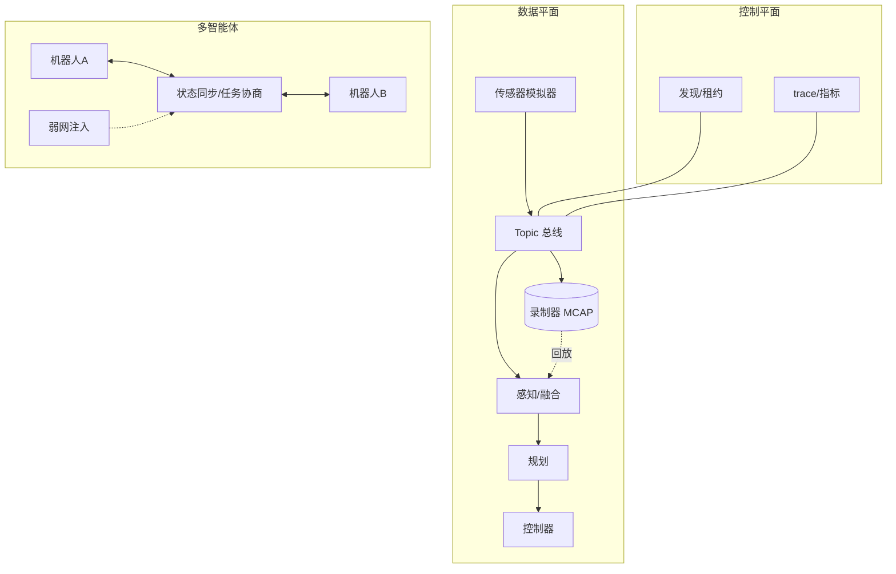
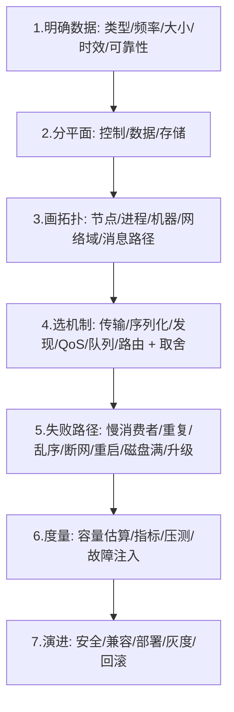

# 第 11 章：综合项目与面试

## 本章目标

把前十章变成一个可以展示、压测、讲清楚的**机器人数据总线实验室**，并建立系统设计题的答题框架和面试表达能力。

## 11.1 项目总架构

## 11.2 分阶段实现

### 阶段一：单机通信骨架（第 2、4 章）

C++ topic bus：Unix socket 控制面 + 共享内存数据面、topic/type 匹配、序列号、有界队列、优雅停止。

### 阶段二：框架接入（第 5 章）

用 ROS 2 实现 IMU/图像/控制 topic + service/action，对比 QoS、executor、RMW、进程边界。

### 阶段三：录制回放（第 8 章）

MCAP/rosbag 记录，支持 chunk、索引、压缩、CRC、崩溃恢复、时间/topic 过滤、倍速回放。

### 阶段四：多智能体（第 9 章）

5–20 个机器人，实现发现、心跳、能力、状态快照/增量、任务租约、epoch、弱网注入。

### 阶段五：性能与可靠性报告（第 6、10 章）

基线、优化前后对比、故障注入结果、设计取舍——**用数据而非形容词**。

## 11.3 验收指标

至少报告：

- 端到端 p50/p95/p99 和 max 延迟。
- 消息/秒、字节/秒、峰值突发。
- CPU、RSS、内存分配、网络带宽、磁盘写入。
- 丢帧、重传、deadline miss、断线重连和恢复时间。
- 录制压缩率、索引查询耗时、损坏恢复结果。
- 多 agent 状态收敛时间、任务重复率、网络分区行为。

{: .important }
> 报告必须写清**硬件、内核、编译选项、消息大小、频率、消费者数量、网络条件**。脱离测试条件的数字没有意义。

## 11.4 系统设计答题模板

面试遇到"设计一个 XX 通信系统"时，按这个顺序展开：

{: .tip }
> 面试官最看重第 5 步（失败路径）和第 6 步（度量）。多数候选人只讲成功路径，讲清失败处理和验证方法能立刻区分水平。

## 11.5 高频面试问题

**问：为什么不用自研 TCP 代替 ROS 2/DDS？**

答：自研可针对特定链路优化，但要自行解决类型、发现、QoS、生命周期、工具、诊断和兼容，成本巨大且易出坑。若系统需要完整机器人生态，优先用成熟框架；在明确瓶颈和边界后，可替换特定数据平面（如某条高频链路走自研共享内存），而不是重造全部控制面。

**问：可靠 QoS 是否总是更好？**

答：不是。控制消息需要可靠但要配 deadline；高频传感器更适合 best effort + 丢旧保新。可靠机制若让旧消息排队重传，反而恶化控制延迟，还多耗内存和带宽。QoS 是按数据语义的权衡，不是"越可靠越好"。

**问：如何避免一个慢订阅者拖垮所有发布者？**

答：每订阅者独立有界队列 + 独立处理线程；发布者只入队不同步等待回调；队列满按该订阅者的 QoS 丢弃或背压；关键路径资源隔离（独立线程池/优先级）。核心是故障隔离——慢的自己承担后果。

**问：如何做到跨进程零拷贝？对象生命周期怎么办？**

答：预分配共享内存 buffer，传句柄而非 payload，在共享区放引用计数建立 owner/reader 协议；通知与数据分离（eventfd）；处理某端崩溃的回收（超时或探活）、权限、对齐、版本。最后用端到端数据证明收益。零拷贝的难点全在生命周期。

**问：如何实现消息录制的崩溃恢复和随机回放？**

答：数据分 chunk 顺序写，每 chunk 带长度和 CRC；footer 存索引和提交标记。恢复时若 footer 缺失就从头扫描校验、保留完整 chunk、重建索引。随机回放靠索引按时间/topic 定位 chunk。索引是加速结构，数据本身才是事实来源。

**问：如何处理重复、乱序和过期控制指令？**

答：消息带 ID、序列号、epoch、deadline；接收端维护去重表和最新版本，拒绝过期（超 deadline）或旧代（低 epoch）消息；执行操作幂等；重连后用连接代际防止旧连接消息污染新状态。控制指令尤其要防重复执行造成危险动作。

**问：网络分区后多机器人状态如何收敛？**

答：分区期间各自本地继续安全动作；状态用带版本的增量 + 周期快照，恢复后按 version/epoch 收敛，旧版本不覆盖新版本；任务用 epoch fencing 防双主。要处理乱序、重复、缺口，并对不可自动收敛的冲突定义解决规则（如 owner 优先或人工介入）。

**问：如何区分平均延迟优化和尾延迟优化？**

答：均值反映整体吞吐效率，尾延迟（p99/max）反映最坏情况和 deadline 命中率。优化均值常靠减少每条消息的固定开销（拷贝、序列化）；优化尾延迟常靠消除偶发阻塞（隔离慢消费者、去掉锁竞争、避免 GC/分配抖动、限制队列）。两者手段不同，要分别测量和优化。

**问：线程模型如何设计，怎样避免优先级反转？**

答：按角色和优先级分线程池（接收/工作/写盘/监控），关键路径独立；共享状态用短临界区或无共享设计；避免高优先级线程等待低优先级线程持有的锁（可用优先级继承互斥量或无锁单写者结构）。控制路径不与图像处理抢线程。

**问：你如何证明一次性能优化确实有效？**

答：固定环境和数据集，先记基线；用 profiling 定位热点；单变量修改后重测；对比 p50/p99、吞吐、CPU、内存、带宽、丢帧，确认没把成本转移到别处（如吞吐涨了但 p99 或内存爆了）。优化结论必须可复现、有数据、有测试条件。

## 11.6 一分钟自我介绍模板

> "我有 Linux C++ 应用、多线程和网络编程经验，擅长处理并发 I/O、资源生命周期和性能问题。围绕机器人中间件，我系统学习并实现了发布订阅、QoS、发现、序列化、录制回放、弱网重连和多智能体状态同步，并通过基准和故障注入验证端到端延迟、吞吐、丢帧和恢复时间。我关注的不只是 API 调用，而是通信语义、失败处理、数据契约和可观测的性能闭环。"

## 11.7 最终能力清单

达到岗位要求前，你应该能够：

- [ ] 从数据语义选择 Topic、Service、Action 和 QoS。
- [ ] 设计同机 IPC、跨机传输和云边路由。
- [ ] 解释序列化、零拷贝、生命周期和版本兼容。
- [ ] 设计可恢复的录制、索引、压缩和回放链路。
- [ ] 处理发现、租约、状态版本、重复、乱序和网络分区。
- [ ] 用 trace、perf 和指标定位尾延迟及资源瓶颈。
- [ ] 对断线、重试、限流、降级和故障注入给出具体方案。
- [ ] 用测试数据而不是形容词证明"高性能"和"可靠"。

{: .important }
> 全部打勾并能用第 11.4 的模板讲清一个真实设计，你就具备了这个岗位要求的核心能力。剩下的是在真实项目里积累框架细节和工程手感。

## 11.8 进阶阅读方向

- DDS 规范与 Fast DDS / Cyclone DDS 源码的发现与 QoS 实现。
- Zenoh 的路由与存储模型、Cyber RT 的调度与共享内存、DORA 的 dataflow。
- MCAP 格式规范与实现细节。
- eBPF / LTTng 做跨进程时序追踪。
- 实时 Linux（PREEMPT_RT）、CPU 隔离与 IRQ 亲和性。
- 无锁数据结构与内存回收（hazard pointer、RCU）。
