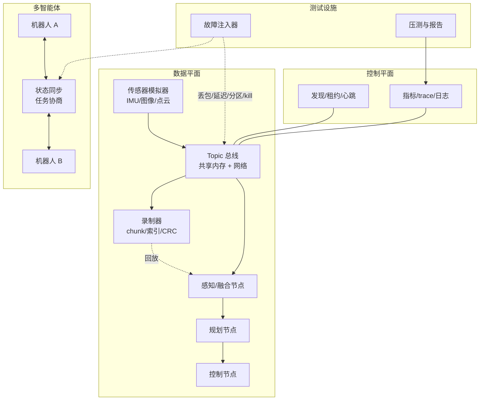
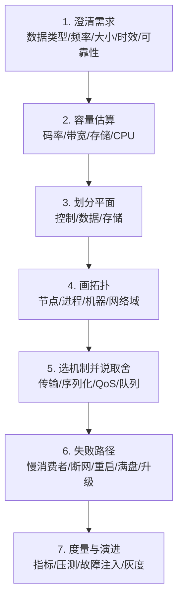
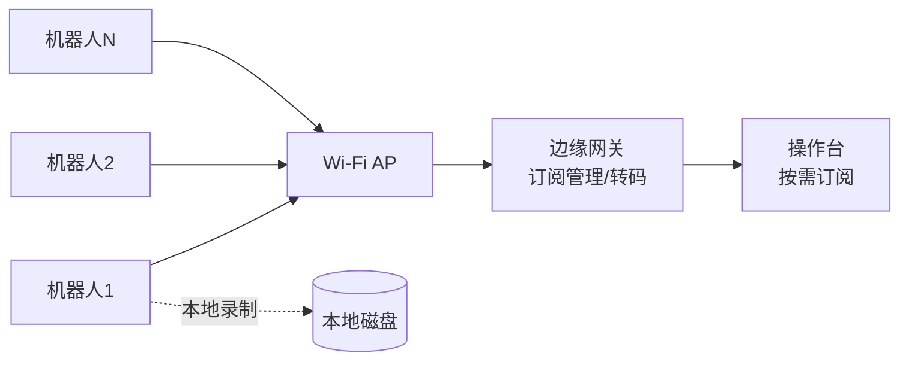

# 第 11 章：综合项目与面试

## 11.1 本章目标与前置知识

### 学完本章你能做到

- 把前十章的机制组装成一个可运行、可压测、可演示的完整项目。
- 用一份有测试条件的性能报告代替"我做过高性能通信"这种空话。
- 用固定框架回答系统设计题，覆盖失败路径和度量方法。
- 判断自己是否已经具备岗位要求的能力，并知道差在哪里。

### 需要先掌握

本章是全书的汇总，需要前十章的全部内容。如果某一部分不熟，先回去补：

| 项目阶段 | 依赖章节 |
| --- | --- |
| 通信骨架 | 第 2、3、4 章 |
| 框架对比 | 第 5 章 |
| 性能压测 | 第 6 章 |
| 计算图 | 第 7 章 |
| 录制回放 | 第 8 章 |
| 多智能体 | 第 9 章 |
| 可靠性与观测 | 第 10 章 |

{: .important }
> 面试中真正拉开差距的，不是你能背出多少术语，而是**你能不能讲清楚一个自己做过的系统：它的失败路径是什么，你用什么数据证明它工作正常**。这个项目就是为了让你有这样一个可讲的东西。

---

## 11.2 项目总览：机器人数据总线实验室

### 11.2.1 系统架构



### 11.2.2 数据流规格

这份规格表是整个项目的设计依据，也是面试时能立刻拿出来的东西：

| 数据 | 频率 | 单条大小 | 码率 | QoS | 队列策略 |
| --- | --- | --- | --- | --- | --- |
| IMU | 200 Hz | 64 B | 12.8 KB/s | BestEffort, depth=1 | DropOldest |
| 图像 | 30 Hz | 300 KB | 9 MB/s | BestEffort, depth=4 | DropOldest |
| 点云 | 10 Hz | 1.6 MB | 16 MB/s | BestEffort, depth=2 | DropOldest |
| 控制指令 | 100 Hz | 128 B | 12.8 KB/s | Reliable, deadline=20ms | Block + 过期丢弃 |
| 任务/状态 | 10 Hz | 2 KB | 20 KB/s | Reliable, 幂等 | Block |
| 心跳 | 1 Hz | 64 B | 64 B/s | BestEffort, 最高优先级 | 独立通道 |

总码率约 25 MB/s。按第 1 章的方法，这个量级同机用共享内存无压力，跨机千兆网需要压缩或降采样。

### 11.2.3 目录结构建议

```text
robot-databus-lab/
├── core/
│   ├── bounded_queue.hpp        # 第 2 章
│   ├── shm_ring.hpp             # 第 2 章
│   ├── frame_reader.hpp         # 第 2 章
│   ├── buffer_pool.hpp          # 第 3 章
│   ├── message_header.hpp       # 第 3 章
│   └── bus.hpp                  # 第 4 章
├── discovery/
│   ├── registry.hpp             # 第 4 章
│   └── lease.hpp                # 第 9 章
├── record/
│   ├── recorder.hpp             # 第 8 章
│   ├── recover.hpp              # 第 8 章
│   └── player.hpp               # 第 8 章
├── graph/
│   ├── approx_time_sync.hpp     # 第 7 章
│   └── dag_executor.hpp         # 第 7 章
├── agent/
│   ├── failure_detector.hpp     # 第 9 章
│   ├── state_replica.hpp        # 第 9 章
│   └── task_manager.hpp         # 第 9 章
├── reliability/
│   ├── retry.hpp                # 第 10 章
│   ├── circuit_breaker.hpp      # 第 10 章
│   ├── rate_limiter.hpp         # 第 10 章
│   └── degradation.hpp          # 第 10 章
├── observability/
│   ├── metrics.hpp              # 第 10 章
│   ├── trace.hpp                # 第 10 章
│   └── histogram.hpp            # 第 6 章
├── testing/
│   ├── fault_injector.hpp       # 第 10 章
│   └── chaos_scenarios.cpp
├── bench/
│   ├── latency_bench.cpp        # 第 6 章
│   └── report_gen.py
└── apps/
    ├── sensor_sim.cpp
    ├── perception_node.cpp
    ├── control_node.cpp
    └── multi_agent_sim.cpp
```

---

## 11.3 阶段一：单机通信骨架

### 目标

实现一个能跑通"发布到订阅"全链路的最小总线，同机进程间通信。

### 交付清单

- [ ] `BoundedQueue`：MPMC、有界、优雅停止、水位与丢弃统计（第 2 章）。
- [ ] `FrameReader`：长度前缀分帧，正确处理半包和粘包（第 2 章）。
- [ ] `ShmRing`：共享内存环形队列 + `eventfd` 通知（第 2 章）。
- [ ] `BufferPool`：引用计数句柄，分发零拷贝（第 3 章）。
- [ ] `MessageHeader`：含 schema、版本、序列号、时间戳、deadline（第 3 章）。
- [ ] `Bus`：topic 匹配、每订阅者独立队列、QoS 策略（第 4 章）。
- [ ] 控制面用 Unix socket，数据面用共享内存。

### 验收标准

| 检查项 | 期望 |
| --- | --- |
| 半包/粘包 | 每次只发 1 字节也能正确组帧 |
| 慢订阅者 | 一个订阅者 sleep 1 秒，其他订阅者延迟不受影响 |
| 发布者重启 | 订阅者检测到 incarnation 变化并重置状态 |
| 订阅者退出 | 发布者不阻塞，资源正确回收 |
| 零拷贝 | 一帧 6 MB 图像分发给 3 个订阅者，总拷贝次数为 1 |
| 内存 | 持续运行 1 小时，RSS 稳定不增长 |
| Sanitizer | ASan + TSan 全程无告警 |

{: .tip }
> "总拷贝次数为 1" 怎么验证？在 `BufferPool` 里加一个全局计数器，每次真正的 `memcpy` 就加一，运行结束打印。这种可验证的设计本身就是面试加分项。

---

## 11.4 阶段二：框架对比

### 目标

用 ROS 2 实现同样的数据流，与自研骨架对比，理解框架的边界。

### 交付清单

- [ ] ROS 2 实现 IMU、图像、控制三个 topic。
- [ ] 增加一个 service（如查询节点状态）和一个 action（如"移动到目标点"）。
- [ ] 分别配置 Reliable/BestEffort、不同 history depth、deadline。
- [ ] 用 SingleThreaded 和 MultiThreaded executor 各测一次。
- [ ] 换一种 RMW 实现（如 Cyclone DDS 与 Fast DDS）再测。

### 对比表模板

| 方案 | p50 | p99 | max | CPU | RSS | 丢帧率 |
| --- | --- | --- | --- | --- | --- | --- |
| 自研（共享内存） | | | | | | |
| ROS 2 同进程 intra-process | | | | | | |
| ROS 2 跨进程 默认 | | | | | | |
| ROS 2 跨进程 + SHM | | | | | | |
| RMW A vs RMW B | | | | | | |

### 验收标准

- 能画出一条 ROS 2 消息从 `publish` 到回调的完整路径。
- 能复现 executor 阻塞：在图像回调里 sleep 50 ms，观察控制回调延迟变化。
- 能解释一个 QoS 不匹配的具体案例（发布 BestEffort、订阅 Reliable）。
- 能说明该 RMW 在你的配置下是否真的走了共享内存，用什么方法验证的。

{: .warning }
> 不要写"ROS 2 支持零拷贝"这种结论。要写"在 X 版本、Y RMW、Z 配置、消息大于 N 字节时，实测拷贝次数为 M"。前者是道听途说，后者是工程证据。

---

## 11.5 阶段三：计算图与时间同步

### 目标

把消息分发接入计算图，处理多传感器时间对齐。

### 交付清单

- [ ] `ApproxTimeSync`：图像 30 Hz 与 IMU 200 Hz 按源时间戳配对（第 7 章）。
- [ ] `DagExecutor`：三阶段 DAG（同步 → 推理模拟 → 控制输出）。
- [ ] 四种触发策略：全输入、近似时间、最新值、超时降级。
- [ ] 每个节点记录排队时间、执行时间、输入年龄、deadline miss。

### 验收标准

| 检查项 | 期望 |
| --- | --- |
| 配对正确性 | 配对时间差 p99 小于同步窗口 |
| 单输入缺失 | 不无限等待，按策略降级并计数 |
| 队列有界 | 一路停止发送时，另一路队列不无限增长 |
| 取消传播 | 取消上游任务，下游收到取消而不是超时 |
| 确定性 | 同样输入重放三次，输出序列一致 |

---

## 11.6 阶段四：录制与回放

### 目标

实现完整的数据闭环，并证明崩溃后可恢复。

### 交付清单

- [ ] `Recorder`：分级队列、chunk 聚合、压缩、CRC、索引、footer（第 8 章）。
- [ ] `Recovery`：footer 缺失时扫描重建索引，截断损坏尾部（第 8 章）。
- [ ] `Player`：原速/倍速/仿真时钟，时间段与 topic 过滤（第 8 章）。
- [ ] 多 chunk 按 `log_time` 归并，保证全局有序。
- [ ] 分片与幂等上传（可用本地目录模拟云端）。

### 验收标准

| 检查项 | 期望 |
| --- | --- |
| 采集不阻塞 | 注入 2 秒磁盘停顿，控制 topic 零丢弃 |
| 崩溃恢复 | 三个时机 kill -9，均能恢复出全部完整 chunk |
| 索引正确 | 按时间查询耗时小于 100 ms，结果与全扫一致 |
| 回放确定性 | 仿真时钟回放三次，消息序列哈希一致 |
| 压缩选型 | 有对比表，且能解释为什么 JPEG 不再压缩 |
| 上传幂等 | 重复上传同一分片不产生重复数据 |

---

## 11.7 阶段五：多智能体协同

### 目标

把单机系统扩展到多机器人，处理分区和重连。

### 交付清单

- [ ] `FailureDetector`：心跳、超时、incarnation 检测（第 9 章）。
- [ ] `LeaseManager` + 资源侧 epoch 校验（第 9 章）。
- [ ] `StateReplica`：快照加增量、缺口检测、墓碑（第 9 章）。
- [ ] `TaskManager`：任务状态机、租约、幂等结果收集（第 9 章）。
- [ ] 能力发现与拓扑视图。
- [ ] 模拟 5 到 20 个 agent。

### 验收标准

| 检查项 | 期望 |
| --- | --- |
| 无双主 | 注入 1000 次断网重连，任意时刻每任务活跃执行者恒为 1 |
| 状态收敛 | 30 秒分区恢复后 10 秒内全部一致 |
| 幂等 | 结果重复上报 3 次，副作用只发生一次 |
| 无风暴 | 分区恢复时快照请求有抖动，QPS 峰值小于基线 3 倍 |
| 拒绝可观测 | 每次 epoch 拒绝都有计数，与注入次数匹配 |

---

## 11.8 阶段六：可靠性与可观测性

### 目标

让系统能失败、能恢复、能解释。

### 交付清单

- [ ] `retry` + 指数退避 + 全抖动 + 错误分类（第 10 章）。
- [ ] `CircuitBreaker`、`TokenBucket`、舱壁隔离（第 10 章）。
- [ ] `DegradationController`：分级降级 + 滞回（第 10 章）。
- [ ] `LinkStateMachine`：连接状态机 + 代际校验（第 10 章）。
- [ ] `Trace` + 尾部采样；结构化日志；完整指标集（第 10 章）。
- [ ] `FaultInjector` + 混沌场景脚本（第 10 章）。

### 验收标准

对照第 10 章 10.2.3 的故障模型逐条注入，验证六条不变量全部成立：

1. 不崩溃、不死锁、不 OOM。
2. 控制指令不重复执行。
3. 内存和队列不无限增长。
4. 故障解除后自动恢复。
5. 每次丢弃/失败都有计数器增加。
6. 安全动作任何情况下都能执行。

---

## 11.9 性能报告怎么写

### 11.9.1 报告模板

一份合格的性能报告必须包含测试条件，否则数字没有意义。

```text
## 测试环境
- CPU: Intel i7-11800H, 8C16T, 关闭睿频, performance governor
- 内存: 32 GB DDR4-3200
- 磁盘: NVMe SSD, ext4, noatime
- 内核: 5.15.0, PREEMPT_RT 未启用
- 编译: g++ 11.4, -O2 -march=native, 无 sanitizer
- 网络: 本机 loopback / 千兆有线

## 负载
- IMU 200 Hz × 64 B
- 图像 30 Hz × 300 KB
- 点云 10 Hz × 1.6 MB
- 控制 100 Hz × 128 B
- 订阅者数量: 3
- 运行时长: 600 秒
- 预热: 前 60 秒数据丢弃

## 结果
| 指标 | 基线 | 优化后 | 变化 |
| --- | --- | --- | --- |
| 端到端 p50 | 3.2 ms | 2.9 ms | -9% |
| 端到端 p99 | 180 ms | 8.1 ms | -95% |
| 端到端 max | 412 ms | 22 ms | -95% |
| 吞吐 | 25.1 MB/s | 25.1 MB/s | 持平 |
| CPU (总) | 145% | 118% | -19% |
| RSS | 780 MB | 340 MB | -56% |
| 丢帧率 | 2.1% | 0.02% | -99% |

## 变更内容
1. 回调内的同步磁盘写改为投递到写盘线程有界队列
2. 图像 topic 队列策略从 Block 改为 DropOldest, depth 8→4
3. 写盘线程独立 CPU 亲和性

## 结论与边界
- p99 改善主要来自消除回调阻塞，而非序列化优化
- DropOldest 带来 0.02% 丢帧，对图像可接受，对控制不可用
- 未测试跨机场景，千兆网下点云可能成为瓶颈
```

### 11.9.2 报告的三个要求

{: .important }
> 1. **可复现**：别人按你的条件能测出相近结果。
> 2. **有边界**：明确说明没测什么、结论在什么条件下成立。
> 3. **有取舍**：优化换来了什么，付出了什么。只报好消息的报告没有可信度。

### 11.9.3 常见的报告错误

| 错误 | 为什么是错的 |
| --- | --- |
| 只报平均延迟 | 掩盖尾延迟，第 6 章有算例 |
| 不写测试条件 | 无法复现，无法判断适用范围 |
| 不写预热 | 冷启动数据会污染结果 |
| 只跑几秒 | 抓不到偶发的尾延迟 |
| 开着 sanitizer 测性能 | ASan 会让程序慢 2 到 5 倍 |
| 只报改善不报代价 | 隐藏了取舍，缺乏可信度 |

---

## 11.10 系统设计题答题框架

### 11.10.1 七步框架



{: .important }
> 面试官最看重第 6 步和第 7 步。绝大多数候选人只讲到第 5 步就停了——能设计出正常路径的人很多，能讲清失败处理和验证方法的人很少。

### 11.10.2 示例：设计一个多机器人图像回传系统

**第 1 步：澄清需求**

先问清楚，不要直接开始画图：

- 多少台机器人？每台几路相机？分辨率和帧率？
- 图像是原始还是编码？延迟要求是多少？
- 是所有帧都要传，还是只传关键帧或按需？
- 网络是有线还是无线？带宽多少？
- 丢帧可接受吗？丢多少？

假设答案：20 台机器人，每台 2 路 1080p@30fps H.264 编码（约 4 Mbps 每路），Wi-Fi，延迟要求小于 500 ms，允许丢帧但不能花屏。

**第 2 步：容量估算**

$$20 \times 2 \times 4\ \text{Mbps} = 160\ \text{Mbps}$$

Wi-Fi 5 实际可用吞吐约 300 到 400 Mbps（还要与其他流量共享），160 Mbps 已占约一半，**接近瓶颈**。结论：必须支持按需订阅和动态降码率，不能always-on 全量回传。

**第 3 步：划分平面**

- 控制平面：订阅请求、码率协商、心跳。低带宽、高可靠。
- 数据平面：图像流。高带宽、可丢。
- 存储平面：本地录制，网络好时补传。

**第 4 步：拓扑**



**第 5 步：机制与取舍**

| 选择 | 理由 | 代价 |
| --- | --- | --- |
| H.264 编码 | 码率降低约 100 倍 | 编解码延迟约 30 ms，需硬件编码器 |
| 按需订阅 | 只传被观看的流，省带宽 | 切换时有首帧延迟 |
| I 帧优先丢弃 P 帧 | 保证不花屏 | 拥塞时帧率下降 |
| 控制面独立通道 | 拥塞时仍能协商 | 多一条连接 |
| BestEffort + deadline | 旧帧无价值 | 需要发送端主动丢弃 |

**第 6 步：失败路径**

| 故障 | 行为 |
| --- | --- |
| 带宽不足 | 逐级降码率，再降帧率，最后只保关键帧 |
| 某机器人离开覆盖 | 本地继续录制，回到覆盖后低优先级补传 |
| 网关故障 | 机器人本地录制不受影响；操作台显示失联 |
| 操作台断开 | 自动取消订阅，释放带宽 |
| 编码器故障 | 降级为低分辨率软编码或停止该路 |
| 版本不兼容 | 协商阶段明确报错，不建立流 |

**第 7 步：度量与演进**

- 指标：每流码率、帧率、丢帧率、端到端延迟 p99、Wi-Fi 信号强度、重传率。
- 压测：模拟 20 台同时回传，逐步增加负载直到出现丢帧，找出实际容量上限。
- 故障注入：`tc netem` 限带宽和加丢包，验证降级策略生效且能恢复。
- 演进：先做固定码率单路，再加按需订阅，最后加自适应码率，每步都有指标对比。

### 11.10.3 面试中的常见反模式

| 反模式 | 更好的做法 |
| --- | --- |
| 上来就说"用 Kafka" | 先澄清需求和容量，再选型 |
| 只讲正常路径 | 主动讲失败路径，这是加分项 |
| 说"用可靠传输就行了" | 说明可靠的代价和边界 |
| 不给数字 | 做容量估算，哪怕是粗略的 |
| 说"这个我们没遇到过" | 说"我会这样验证它" |
| 堆砌技术名词 | 每个选择都给理由和代价 |

---

## 11.11 高频面试问题与参考答案

**问：为什么不用自研 TCP 方案代替 ROS 2 或 DDS？**

答：自研在特定链路上确实可能更优，比如我用共享内存加句柄传递做同机大消息分发，能做到零拷贝且延迟比走 DDS 低。但自研要自己解决类型系统、节点发现、QoS、生命周期管理、诊断工具、跨语言支持和版本兼容，这些加起来的工作量远超通信本身。我的判断标准是：如果项目需要完整的机器人生态和工具链，主干用成熟框架；在明确定位了瓶颈之后，可以替换特定的数据平面路径，比如把某条高频链路换成自研共享内存通道，而不是重造整个控制面。这样既拿到了性能，又保留了生态。

**问：可靠 QoS 是不是总比 BestEffort 好？**

答：不是，这是个常见误解。可靠意味着确认和重传，代价是更多内存、更多带宽和可能的队头阻塞。对 IMU 这类高频传感器，控制器只需要最新值，用可靠加大队列反而有害——我遇到过消费者停顿 200 毫秒后，队列里积压了 40 个已经过期的样本，控制器逐条处理这些旧数据，延迟从 5 毫秒飙到 200 毫秒。正确做法是 BestEffort 加 depth=1 加 deadline，停顿后直接拿最新值。可靠适合任务下发、配置分发这类"必须送达且每条都有意义"的数据。选择依据是数据语义，不是"越可靠越好"。

**问：怎样避免一个慢订阅者拖垮整个系统？**

答：核心是故障隔离，分三层。第一，每个订阅者独立的有界队列，发布者只负责入队不等待回调，这样慢的那个只影响自己的队列。第二，每个订阅者独立的处理线程或独立线程池，避免共享线程池被占满——这就是舱壁隔离。第三，队列满时按该订阅者自己的 QoS 处理：BestEffort 就丢旧保新，Reliable 就阻塞但只阻塞它自己。另外要有可观测性，每个订阅者的队列水位和丢弃计数都要暴露，这样慢消费者能被立刻发现而不是等到出故障。绝对不能用无界队列，那只是把丢一帧变成 OOM 之后丢全部。

**问：如何做到跨进程零拷贝？对象生命周期怎么管？**

答：技术上是预分配共享内存池，发布时把数据写入池中的一个 block，然后只传递句柄（block 索引加长度）而不是数据本身；通知走 eventfd 或 Unix socket。难点全在生命周期：共享区里要放引用计数，发布者写完加一，每个订阅者读完减一，归零才回收。还要处理三个问题：一是某个订阅者进程崩溃导致引用计数永远不归零，需要超时回收或 owner 探活；二是内存对齐和结构布局要跨进程一致，不能依赖编译器默认对齐；三是版本兼容，共享内存布局变了要能检测。我的经验是先用引用计数句柄在同进程内验证正确性，再扩展到跨进程，并且一定要用计数器验证真实拷贝次数，而不是假设它零拷贝了。

**问：如何实现录制的崩溃恢复和随机回放？**

答：崩溃恢复靠三个设计。第一，数据分 chunk 顺序写，每个 chunk 带魔数、长度和 CRC，这样扫描时能识别边界和损坏。第二，文件尾有定长 footer，包含索引偏移和"正常关闭"标志。第三，读取器有降级路径：footer 完好就直接读索引，footer 缺失或 CRC 不匹配就从头扫描、逐个校验 chunk、重建索引，遇到第一个损坏就停止并截断尾部。这个设计的核心是"数据是事实，索引是加速结构"——我见过一个真实事故，两小时 340 GB 路测数据因为 footer 没写完全部读不出来，实际上数据都好好的。随机回放靠 chunk 级索引，每个 chunk 记录时间范围，查询时二分定位，读到 chunk 后在内存线性扫描找目标消息。

**问：怎样处理重复、乱序和过期的控制指令？**

答：靠消息头里的四个字段。序列号用于检测乱序和缺口，同源单调递增；幂等键用于去重，接收端维护一个有淘汰策略的去重表；epoch 用于拒绝旧代消息，重连或所有权转移时递增；deadline 用于过期检查，到达时已过期就直接丢弃并计数，因为迟到的控制指令有害无益。这四个必须配合：只有去重没有 epoch，重连后旧连接的延迟消息仍会污染状态；只有 deadline 没有幂等，重传会导致重复执行物理动作。另外去重表的淘汰窗口必须大于最大重试时长，否则一个延迟很久的重传会被当成新请求。

**问：网络分区之后多机器人状态如何收敛？**

答：分区期间两侧各自继续本地安全动作并缓存状态变化，不阻塞——这是选择了 CAP 里的可用性。恢复后按版本号和代际合并：同一条目版本大的赢，所有权以高 epoch 为准。集合类状态的删除要用墓碑标记，否则删除事件传播不过去，而且墓碑的保留期必须大于最长分区时长，太早清理会导致已删除条目复活。收敛时间大致等于心跳检测时间加快照传输时间，我算过一个例子：20 台机器人每台 2 KB 状态、10 Mbps 带宽，快照传输约 0.6 秒，加 3 秒心跳检测，总共约 3.6 秒。有个容易踩的坑是恢复瞬间所有节点同时发快照造成流量风暴，可能把刚恢复的网络再打垮，所以快照请求要加随机抖动。

**问：如何区分平均延迟优化和尾延迟优化？**

答：两者的成因和手段都不同。平均延迟由每条消息的固定开销决定，优化手段是减少拷贝、优化序列化、减少系统调用。尾延迟由偶发的阻塞事件决定，优化手段是消除阻塞源：隔离慢消费者、把阻塞 I/O 移出回调、消除锁竞争、限制队列深度、避免内存分配抖动、绑定 CPU 亲和性。我做过一个案例，p50 是 3 毫秒而 p99 是 180 毫秒，团队优化了两周序列化毫无效果，接入分段 trace 后发现队列等待占了 176 毫秒，根因是回调里有同步磁盘写。修复后 p99 降到 8 毫秒而 p50 几乎不变——这个结果本身就证明了两者是不同的问题。所以第一步永远是分段测量，而不是猜。

**问：线程模型怎么设计？如何避免优先级反转？**

答：按角色和优先级分组，不要"一条消息一个线程"。典型分组是接收线程、工作线程池、写盘线程、监控线程，每组有自己的队列和资源配额，这就是舱壁隔离。关键路径（控制、安全）必须有独立的线程和内存配额，绝不能和图像处理、日志上传抢资源。优先级反转的避免方法：一是尽量无共享设计，高优先级路径不访问被低优先级持有的锁；二是必须共享时缩短临界区，或用优先级继承互斥量；三是用单写者的无锁结构（如 seqlock）传递状态。另外要注意回调重入和回调内阻塞，这是最常见的隐性阻塞源。

**问：你怎么证明一次性能优化确实有效？**

答：五个步骤。第一，固定环境和负载：硬件、内核、编译选项、消息大小频率、订阅者数量、运行时长和预热时间都写下来。第二，记录基线，包括 p50、p99、max、吞吐、CPU、RSS、丢帧率，不能只记一个数。第三，用 profiling 定位热点，形成假设，而不是凭感觉改。第四，单变量修改后重测，一次只改一件事，否则无法归因。第五，检查副作用——很多"优化"只是把成本转移了，比如吞吐涨了但 p99 变差、或者延迟降了但内存翻倍。最后报告要写明边界：没测什么、结论在什么条件下成立、付出了什么代价。只报好消息的性能报告是没有可信度的。

**问：如果让你从零设计一个机器人通信中间件，你的第一步是什么？**

答：第一步不是选技术栈，是**列数据流规格表和故障模型**。规格表列出每类数据的频率、大小、时效性、可靠性要求和丢弃策略；故障模型列出会遇到哪些失败和每种失败的可接受行为。这两张表决定了后面所有的技术选择：码率决定要不要压缩和用什么传输，时效性决定 QoS 和队列策略，故障模型决定需要哪些可靠性机制。我见过太多项目一上来就争论用 DDS 还是 ZeroMQ，但连总码率是多少、丢帧能不能接受都没算过。有了这两张表，技术选型就变成了有依据的推导，而且这两张表本身就是测试用例和验收标准。

---

## 11.12 一分钟自我介绍模板

> "我有 Linux C++ 开发经验，熟悉多线程和网络编程。为了转向机器人通信中间件方向，我系统学习并动手实现了一套完整的数据总线：包括基于共享内存和引用计数句柄的零拷贝分发、每订阅者独立队列的发布订阅与 QoS、带 CRC 和索引重建的录制回放、多智能体的租约与代际隔离，以及重试退避、熔断、分级降级和链路追踪。
>
> 我比较看重用数据说话。比如我遇到过端到端 p50 只有 3 毫秒但 p99 高达 180 毫秒的问题，通过分段 trace 定位到是订阅者回调里的同步磁盘写导致队列积压，把写盘改成异步有界队列后 p99 降到 8 毫秒，而 p50 几乎不变——这让我理解了优化均值和优化尾延迟是两件不同的事。
>
> 我的关注点不只是 API 怎么调用，而是通信语义怎么定义、失败路径怎么处理、以及用什么指标证明它工作正常。"

{: .tip }
> 这段话的结构是：**背景 → 做过什么 → 一个有数据的具体案例 → 方法论**。中间那个案例是最关键的，它证明你真的动手做过而不是只读过书。把它换成你自己项目里的真实案例。

---

## 11.13 能力自查清单

### 基础层

- [ ] 能解释数据竞争、内存可见性、条件变量虚假唤醒和死锁的四个必要条件。
- [ ] 能写出正确的有界队列，处理优雅停止和超时。
- [ ] 能解释 TCP 为什么要组帧，能处理半包和粘包。
- [ ] 能说出共享内存、Unix socket、eventfd 各自的适用场景。

### 通信层

- [ ] 能从数据语义选择 Topic、Service、Action 和 QoS。
- [ ] 能解释 QoS 兼容矩阵，能诊断"偶尔收不到消息"。
- [ ] 能设计消息头，说明每个字段用于去重、排序、延迟测量还是版本兼容。
- [ ] 能实现引用计数句柄做零拷贝分发，并验证拷贝次数。
- [ ] 能说明 Protobuf 和 FlatBuffers 的取舍，并用数据支撑。

### 系统层

- [ ] 能做容量估算：码率、带宽、存储、CPU 预算。
- [ ] 能分段测量延迟，解释 p50 与 p99 的差异来源。
- [ ] 能用 perf、pidstat、iostat、ss 定位瓶颈。
- [ ] 能设计可恢复的录制链路，实现扫描重建索引。
- [ ] 能实现近似时间同步，处理缺失和乱序。

### 分布式层

- [ ] 能说出分布式相比单机新增的四个本质困难。
- [ ] 能用 epoch 加租约从协议层面消除双主。
- [ ] 能计算心跳超时和误判率。
- [ ] 能实现快照加增量同步，处理缺口和墓碑。
- [ ] 能判断一个场景是否真的需要共识协议。

### 工程层

- [ ] 能列出至少 10 种故障和对应的可接受行为。
- [ ] 能写出带退避、抖动、错误分类的重试。
- [ ] 能实现熔断器、限流器和分级降级（含滞回）。
- [ ] 能设计一组指标，使故障时只看指标就能大致定位。
- [ ] 能用故障注入验证六条不变量。
- [ ] 能写出一份有测试条件、有边界、有取舍的性能报告。

{: .important }
> 全部打勾，并且能用 11.10 的框架讲清一个真实设计，你就具备了这个岗位要求的核心能力。剩下的是在真实项目里积累框架细节和工程手感——那部分只能靠时间。

---

## 11.14 常见的学习误区

| 误区 | 问题 | 建议 |
| --- | --- | --- |
| 只读不写 | 看懂和写出来差距巨大 | 每章的实验都要动手 |
| 追新框架 | 框架会换，原理不会 | 先吃透一个，再横向对比 |
| 只学正常路径 | 面试和生产都栽在失败路径 | 每个机制都问"失败时会怎样" |
| 不做测量 | 结论都是猜的 | 每个性能结论都要有数据 |
| 背面试题 | 一追问就露馅 | 理解推导过程，能自己推出结论 |
| 忽视容量估算 | 架构决策没有依据 | 养成先算数的习惯 |

---

## 11.15 本章小结

1. **项目是能力的载体**。面试中真正有说服力的是"我做过一个 X，它的失败路径是 Y，我用 Z 数据证明它工作正常"。
2. **性能报告必须有测试条件、边界和取舍**，只报好消息的报告没有可信度。
3. **系统设计题的关键在第 6、7 步**：失败路径和度量方法，这是区分水平的地方。
4. **能力清单是路线图**，逐项打勾比泛泛地"再学学"有效得多。
5. **四问法贯穿始终**：解决什么问题、正常路径如何、失败时怎样、用什么指标证明。

---

## 11.16 延伸阅读与进阶方向

| 方向 | 材料 | 目标 |
| --- | --- | --- |
| DDS 深入 | DDS 规范、Cyclone DDS 源码 | 理解发现协议和 QoS 的实现 |
| Zenoh | Zenoh 官方文档与论文 | 分层路由与边云协同模型 |
| Cyber RT | Apollo Cyber RT 源码 | 自动驾驶场景的调度与共享内存 |
| MCAP | MCAP 规范 | 生产级录制格式的完整设计 |
| 实时 Linux | PREEMPT_RT 文档 | CPU 隔离、IRQ 亲和、实时调度 |
| 内核追踪 | eBPF、LTTng、bpftrace | 跨进程时序与内核态可观测性 |
| 无锁编程 | 《C++ Concurrency in Action》 | hazard pointer、RCU、内存序 |
| 大规模系统 | 《Designing Data-Intensive Applications》 | 分布式存储与一致性的系统视角 |

{: .note }
> 学到这里，你已经有了完整的知识框架。接下来最有价值的不是继续读更多书，而是**把这个项目真正跑起来，压测它，弄坏它，修好它**。中间件是一个必须在故障中才能真正学会的领域。
