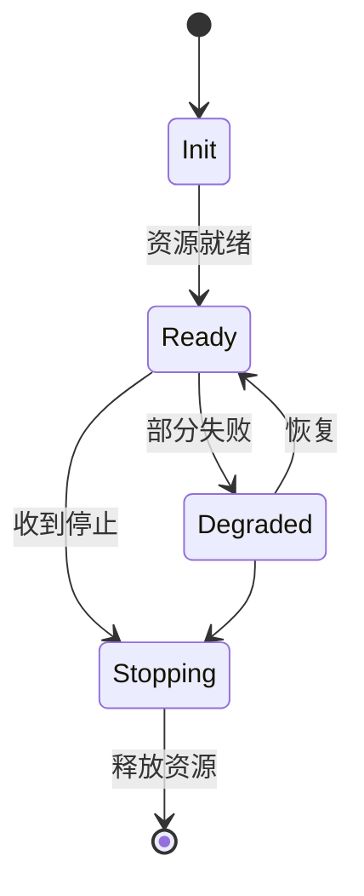
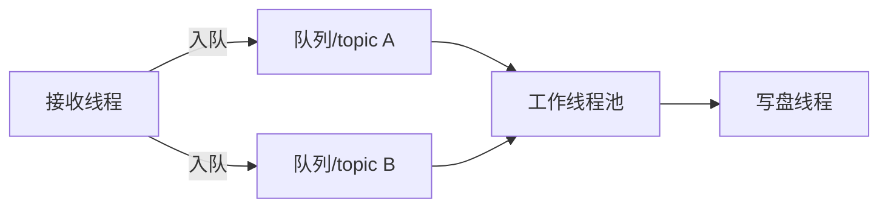

# 第 2 章：现代 C++ 与 Linux 基础设施

## 本章目标

把已有的 C++ 和 Linux 经验用于**长期运行的基础设施**：明确所有权、设计可停止的线程、实现有界队列、选择 IPC、写事件循环、处理消息分帧。本章的代码是后续所有章节的地基。

## 2.1 三类生命周期

中间件里有三类生命周期，每类都要有创建、就绪、失败、停止和销毁状态：



原则：用 RAII 管理 fd、共享内存映射、线程和订阅句柄；用 `std::jthread`/`stop_token` 或明确停止标志管理线程；用条件变量、`eventfd`、关闭 fd 或超时唤醒阻塞。**不要强杀线程，也不要让析构函数永远等待。**

## 2.2 一个生产级有界队列（MPMC）

有界队列是背压的核心。下面是一个可运行、带优雅停止、超时、水位和丢弃统计的实现：

```cpp
#include <condition_variable>
#include <mutex>
#include <deque>
#include <optional>
#include <atomic>
#include <chrono>

template <typename T>
class BoundedQueue {
public:
    enum class FullPolicy { Block, DropNewest, DropOldest };

    explicit BoundedQueue(size_t capacity, FullPolicy policy = FullPolicy::Block)
        : capacity_(capacity), policy_(policy) {}

    // 返回 false 表示被丢弃或已停止
    bool push(T value) {
        std::unique_lock lk(mu_);
        if (stopped_) return false;
        if (q_.size() >= capacity_) {
            switch (policy_) {
                case FullPolicy::DropNewest:
                    dropped_.fetch_add(1, std::memory_order_relaxed);
                    return false;
                case FullPolicy::DropOldest:
                    q_.pop_front();
                    dropped_.fetch_add(1, std::memory_order_relaxed);
                    break;
                case FullPolicy::Block:
                    not_full_.wait(lk, [&]{ return stopped_ || q_.size() < capacity_; });
                    if (stopped_) return false;
                    break;
            }
        }
        q_.push_back(std::move(value));
        high_water_ = std::max(high_water_, q_.size());
        not_empty_.notify_one();
        return true;
    }

    // 超时出队；nullopt 表示超时或已停止且队列空
    std::optional<T> pop(std::chrono::milliseconds timeout) {
        std::unique_lock lk(mu_);
        if (!not_empty_.wait_for(lk, timeout, [&]{ return stopped_ || !q_.empty(); }))
            return std::nullopt;
        if (q_.empty()) return std::nullopt;   // stopped_ 且空
        T v = std::move(q_.front());
        q_.pop_front();
        not_full_.notify_one();
        return v;
    }

    void stop() {
        { std::lock_guard lk(mu_); stopped_ = true; }
        not_empty_.notify_all();
        not_full_.notify_all();
    }

    size_t high_water() const { std::lock_guard lk(mu_); return high_water_; }
    uint64_t dropped() const { return dropped_.load(std::memory_order_relaxed); }

private:
    mutable std::mutex mu_;
    std::condition_variable not_empty_, not_full_;
    std::deque<T> q_;
    size_t capacity_, high_water_ = 0;
    FullPolicy policy_;
    bool stopped_ = false;
    std::atomic<uint64_t> dropped_{0};
};
```

{: .important }
> 先用带锁的有界队列建立基线，再用第 6 章的方法证明锁是瓶颈后，才考虑无锁队列。无锁会引入 ABA、内存序错误和复杂的内存回收，不是"默认更快"。

## 2.3 线程模型

不要默认"一条消息一个线程"。常见角色：接收线程、序列化线程、路由线程、回调线程、写盘线程、监控线程。更可控的做法是**固定线程池 + 每路有界队列 + 明确所有权**。



关注点：锁竞争、优先级反转、false sharing、回调重入、CPU 亲和性、NUMA。控制路径的关键线程不能和图像处理抢同一组线程。

## 2.4 IPC 选择

| 场景 | 机制 | 关键取舍 |
| --- | --- | --- |
| 同进程 | 环形队列/直接调用 | 延迟最低，隔离弱 |
| 同机控制面 | Unix domain socket | 支持 fd 传递，小消息友好 |
| 同机大数据 | mmap/共享内存 | 零拷贝，但要管生命周期和崩溃回收 |
| 通知/定时 | eventfd/timerfd | 可纳入 epoll 统一等待 |
| 跨主机 | TCP/UDP | 需自定义消息边界和失败语义 |

### 共享内存 + eventfd 通知示例

```cpp
#include <sys/mman.h>
#include <sys/eventfd.h>
#include <fcntl.h>
#include <unistd.h>
#include <cstring>
#include <cstdint>

struct ShmRing {
    std::atomic<uint64_t> write_seq;   // 生产者递增
    std::atomic<uint64_t> read_seq;    // 消费者递增
    uint32_t slot_size;
    uint32_t slot_count;
    // 后面紧跟 slot_count * slot_size 字节的数据区
};

// 生产者：写入一个 slot 并通过 eventfd 唤醒消费者
bool shm_publish(ShmRing* ring, int event_fd, const void* data, uint32_t len) {
    uint64_t w = ring->write_seq.load(std::memory_order_relaxed);
    uint64_t r = ring->read_seq.load(std::memory_order_acquire);
    if (w - r >= ring->slot_count) return false;      // 环满：背压
    if (len > ring->slot_size) return false;
    char* base = reinterpret_cast<char*>(ring + 1);
    char* slot = base + (w % ring->slot_count) * ring->slot_size;
    std::memcpy(slot, data, len);
    ring->write_seq.store(w + 1, std::memory_order_release);
    uint64_t one = 1;
    ::write(event_fd, &one, sizeof(one));             // 通知
    return true;
}
```

{: .warning }
> 共享内存 ≠ 自动零拷贝。数据可能仍从业务对象拷进共享区，接收方也可能反序列化再拷贝。真正零拷贝要解决 buffer 所有权、引用计数、对齐、跨进程崩溃回收（见第 3、6 章）。

## 2.5 epoll 事件循环与消息分帧

TCP 是**字节流**，没有消息边界。必须用长度前缀或固定头部处理部分读写：

```cpp
#include <sys/epoll.h>
#include <sys/socket.h>
#include <vector>
#include <cstdint>

// 长度前缀分帧：每帧 = [4字节长度(网络序)] + [payload]
class FrameReader {
public:
    // 把新读到的字节喂进来，取出完整帧
    void feed(const char* data, size_t n) { buf_.insert(buf_.end(), data, data + n); }

    std::optional<std::vector<char>> next() {
        if (buf_.size() < 4) return std::nullopt;
        uint32_t len;
        std::memcpy(&len, buf_.data(), 4);
        len = ntohl(len);
        if (buf_.size() < 4 + len) return std::nullopt;   // 半包，等更多数据
        std::vector<char> frame(buf_.begin() + 4, buf_.begin() + 4 + len);
        buf_.erase(buf_.begin(), buf_.begin() + 4 + len);
        return frame;
    }
private:
    std::vector<char> buf_;
};

void event_loop(int listen_fd) {
    int ep = epoll_create1(0);
    epoll_event ev{.events = EPOLLIN, .data = {.fd = listen_fd}};
    epoll_ctl(ep, EPOLL_CTL_ADD, listen_fd, &ev);

    std::vector<epoll_event> events(64);
    for (;;) {
        int n = epoll_wait(ep, events.data(), events.size(), -1);
        for (int i = 0; i < n; ++i) {
            int fd = events[i].data.fd;
            if (fd == listen_fd) {
                int c = accept4(listen_fd, nullptr, nullptr, SOCK_NONBLOCK);
                epoll_event cev{.events = EPOLLIN | EPOLLET, .data = {.fd = c}};
                epoll_ctl(ep, EPOLL_CTL_ADD, c, &cev);
            } else {
                // 边沿触发：必须循环读到 EAGAIN
                char tmp[4096];
                ssize_t r;
                while ((r = ::recv(fd, tmp, sizeof(tmp), 0)) > 0) {
                    // reader.feed(tmp, r); while (auto f = reader.next()) dispatch(*f);
                }
                if (r == 0) { /* 对端关闭：清理 */ }
            }
        }
    }
}
```

{: .note }
> 事件循环里**不要**做慢序列化、磁盘写入或阻塞锁等待，否则共享该线程的所有连接都被拖住。慢活儿交给工作线程池。

## 2.6 真实案例：慢磁盘拖垮接收线程

某录制进程用一个全局锁保护所有 topic 队列，写盘线程执行 `fsync` 时持锁。网络接收线程无法入队，几百毫秒内所有传感器同时丢帧。

**根因**：锁的粒度错误——把"接收"和"落盘"这两个速率完全不同的阶段耦合在一把锁下。

**修复**：采集与写盘解耦。接收线程只做轻量封装并入有界队列（`FullPolicy::DropOldest`），写盘线程批量取出、聚合成大块顺序写。队列满时按数据等级丢弃低优先级流。

**验证**：注入一次 2 秒磁盘停顿，观察接收线程的入队延迟 p99 是否仍 < 1ms、控制 topic 是否零丢弃。

## 2.7 动手实验与验收

**实验**：
1. 实现上面的 `BoundedQueue`，用 4 个生产者、2 个消费者压测；打开 TSan 验证无数据竞争。
2. 用 Unix socket 实现控制面握手，用共享内存 `ShmRing` 传一个 1MB buffer。
3. 给接收端接入 `FrameReader`，制造"半包"（每次只发一半字节）验证组帧正确。

**验收标准**：
- 生产者退出、消费者变慢、主进程收到 SIGTERM 时，无线程泄漏、无死锁、队列不无限增长。
- 共享内存 owner 崩溃后，另一端能检测到并安全退出（不 segfault）。
- TSan / ASan 全程无告警。

## 2.8 面试问题与参考答案

**问：如何安全停止一个阻塞中的工作线程？**

答：定义停止协议，唤醒阻塞点：条件变量配合谓词、`eventfd`、超时或关闭 fd；线程看到停止请求后释放资源并退出，主线程最后 `join`。绝不用 `pthread_cancel` 强杀，因为可能在持锁或半更新状态中断，破坏不变量。

**问：TCP 收到的数据为什么要"组帧"？**

答：TCP 是字节流，一次 `recv` 可能返回半条消息或多条消息拼接。必须用长度前缀或固定头部界定消息边界，并处理半包（缓存等待）和粘包（循环切分）。边沿触发 epoll 还必须循环读到 `EAGAIN`，否则会漏事件。

**问：共享内存为什么不等于零拷贝？**

答：数据可能仍需从业务对象复制到共享区，接收方也可能反序列化复制。真正零拷贝还要解决 buffer 所有权、引用计数、对齐、跨进程崩溃回收和版本兼容。共享内存只是消除了"内核态拷贝"，应用层拷贝要靠 buffer pool + 句柄协议单独消除。

**问：什么时候不该用无锁队列？**

答：当锁不是已证实的瓶颈，或无法明确满队列策略、内存回收和生命周期时。有界锁队列更易验证和观测，应先建立它的性能基线；只有 profiling 证明锁竞争是主要开销时，无锁才有正收益。

**问：如何定位偶发的 use-after-free？**

答：先用 ASan 在可复现测试中捕获；再检查跨线程所有权、回调注销顺序、队列里的裸指针和析构顺序。基础设施代码优先用 value、`shared_ptr`/`weak_ptr` 或句柄协议表达所有权，而不是用加锁掩盖生命周期问题。
