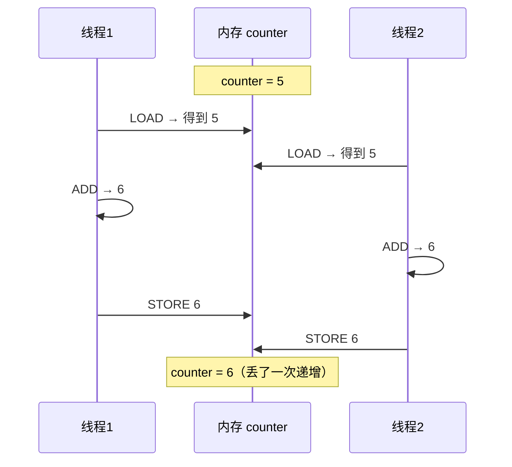
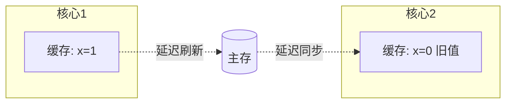
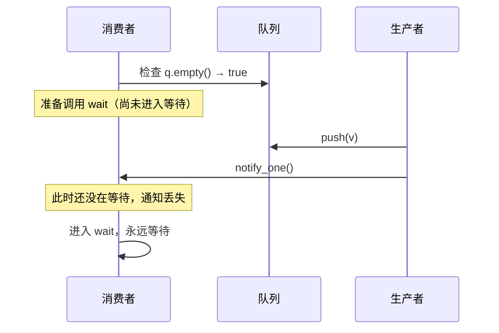
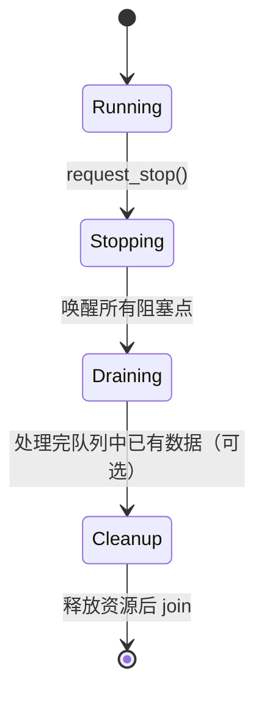
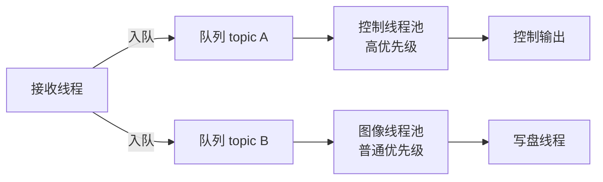
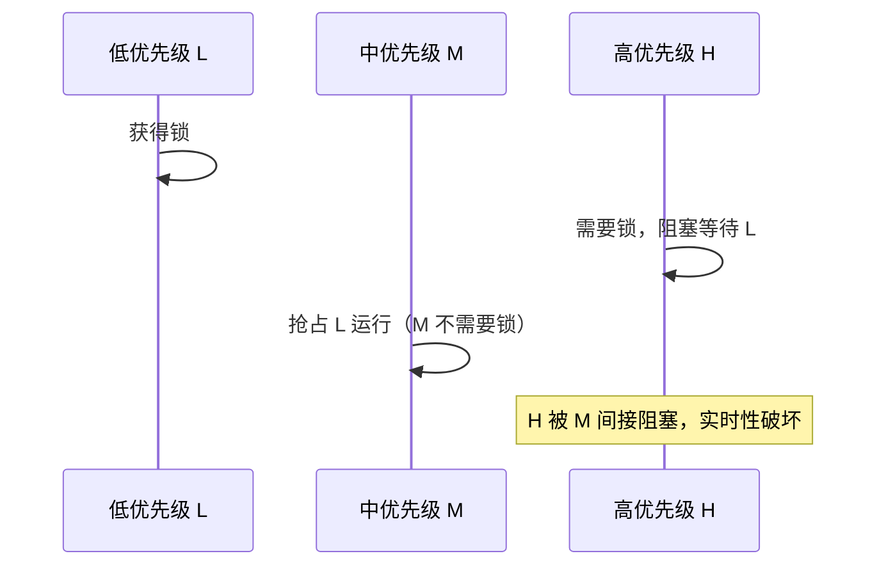

# 第 2 章：现代 C++ 与 Linux 基础设施

## 2.1 本章目标与前置知识

### 学完本章你能

- 解释**数据竞争**为什么是未定义行为，以及编译器和 CPU 做了什么。
- 正确使用互斥量、条件变量，避免**虚假唤醒、丢失唤醒、死锁**三类经典错误。
- 实现一个**生产级有界队列**：支持背压、丢弃策略、超时、优雅停止和水位统计。
- 设计**线程模型**：知道该开几个线程、怎么分组、怎么避免优先级反转。
- 选择合适的 **IPC** 机制，并实现共享内存环形缓冲区。
- 写出正确的 **epoll 事件循环**和**消息分帧**代码。
- 用 ASan/TSan/gdb 定位内存和并发缺陷。

### 前置知识

- 会写 C++ 类、模板、`std::vector`、`std::unique_ptr`。
- 知道进程、线程、文件描述符是什么。
- 写过 socket 的 `send`/`recv`。

{: .note }
> 本章篇幅最长，因为它是全书地基。如果你对并发只是"听说过 mutex"，请务必逐节动手验证，尤其是 2.2 到 2.5 节的错误示例——它们都能在你自己的机器上复现。

## 2.2 为什么并发这么难：从数据竞争说起

### 一个"看起来没问题"的程序

```cpp
#include <thread>
#include <iostream>

int counter = 0;                       // 共享变量，无保护

void worker() {
    for (int i = 0; i < 100000; ++i)
        ++counter;                     // 看起来是"一条语句"
}

int main() {
    std::thread t1(worker), t2(worker);
    t1.join(); t2.join();
    std::cout << counter << "\n";      // 期望 200000
}
```

实际运行，你会得到 100000 到 200000 之间的随机数。

### 为什么会这样

`++counter` 在机器层面不是一条指令，而是三步：

```text
1. LOAD   counter → 寄存器      (读)
2. ADD    寄存器 + 1            (改)
3. STORE  寄存器 → counter      (写)
```

两个线程交错执行时：



这叫 **read-modify-write 竞争**。

### 数据竞争的准确定义

C++ 标准的定义是：**两个线程并发访问同一个内存位置，其中至少一个是写操作，且没有用同步原语建立先后关系（happens-before），则程序有数据竞争，行为未定义（UB）。**

{: .warning }
> **"未定义行为"比"结果不对"严重得多。** 它不只是数值算错——编译器在优化时假设你的程序没有 UB，可能把循环里的读操作提升到循环外只读一次，导致线程永远看不到别人的修改。程序可能表现为死循环、崩溃，甚至在 debug 版本正常而 release 版本失败。

### 一个更隐蔽的例子

```cpp
// 错误：用 bool 做停止标志（无同步）
bool stop = false;

void worker() {
    while (!stop) {              // 编译器可能优化成 while(true)
        do_work();
    }
}

void main_thread() {
    stop = true;                 // 工作线程可能永远看不到
}
```

编译器看到循环内没有修改 `stop`，可以合法地把它优化为：

```cpp
if (!stop) { while (true) do_work(); }    // 只读一次
```

这不是编译器的 bug，而是因为你的程序有 UB，编译器有权假设它不存在。

**正确写法**：

```cpp
#include <atomic>
std::atomic<bool> stop{false};       // 原子变量，编译器不会做上述优化

void worker() {
    while (!stop.load(std::memory_order_acquire)) { do_work(); }
}
void main_thread() { stop.store(true, std::memory_order_release); }
```

## 2.3 内存可见性与内存序：你需要懂多少

### 问题的来源

现代 CPU 为了性能，每个核心有自己的缓存，写操作可能先进缓存再刷回主存。同时编译器和 CPU 都会**重排指令**（只要不改变单线程语义）。这意味着：

- 线程 A 的写，线程 B 不一定立刻看见（**可见性**问题）。
- 线程 A 按顺序写 x 再写 y，线程 B 可能先看到 y 再看到 x（**重排序**问题）。



### 实用建议：先掌握三档

C++ 提供了六种内存序，但**工程中 95% 的场景只需要三档**：

| 内存序 | 含义 | 什么时候用 |
| --- | --- | --- |
| `seq_cst`（默认） | 全局顺序一致，最强也最慢 | 拿不准时用它，先正确再优化 |
| `acquire` / `release` | 建立"写在前、读在后"的配对同步 | 标志位、无锁队列的常见模式 |
| `relaxed` | 只保证原子性，不保证顺序 | 纯计数器（如统计丢弃数） |

### acquire-release 配对的实际含义

```cpp
std::atomic<bool> ready{false};
int data = 0;                        // 普通变量

// 生产者线程
data = 42;                           // (1) 普通写
ready.store(true, std::memory_order_release);   // (2) release 写

// 消费者线程
if (ready.load(std::memory_order_acquire)) {    // (3) acquire 读
    assert(data == 42);              // (4) 保证能看到 42
}
```

**规则**：release 写之前的所有内存操作，对于看到该值的 acquire 读之后的操作都可见。这就像一道"栅栏"，保证 (1) 一定在 (4) 之前发生且可见。

{: .important }
> **给初学者的实用策略**：默认用 `std::atomic<T>` 的默认内存序（`seq_cst`），它总是正确的。只有在性能剖析证明它是瓶颈、并且你能画出 happens-before 关系图时，才降级到 acquire/release。**过早使用 relaxed 是并发 bug 的主要来源之一。**

### false sharing：一个性能陷阱

即使没有逻辑上的共享，两个变量落在同一条缓存行（通常 64 字节）也会导致性能骤降：

```cpp
// 错误：两个计数器挤在同一缓存行
struct Stats {
    std::atomic<uint64_t> produced;   // 线程 A 高频写
    std::atomic<uint64_t> consumed;   // 线程 B 高频写，与上面同一缓存行
};

// 正确：填充到不同缓存行
struct alignas(64) PaddedCounter {
    std::atomic<uint64_t> value{0};
    char pad[64 - sizeof(std::atomic<uint64_t>)];
};
struct Stats {
    PaddedCounter produced;
    PaddedCounter consumed;
};
```

两个核心反复争夺同一缓存行的所有权，称为 **false sharing（伪共享）**，可能让性能下降数倍。

## 2.4 互斥量与条件变量：正确用法

### 互斥量：用 RAII，永远不要手动 unlock

```cpp
// 错误：手动管理，异常或提前 return 会泄漏锁
std::mutex mu;
void bad() {
    mu.lock();
    if (something_wrong()) return;    // 忘记 unlock，死锁
    do_work();                        // 抛异常也会泄漏
    mu.unlock();
}

// 正确：RAII 自动释放
void good() {
    std::lock_guard<std::mutex> lk(mu);   // 构造加锁
    if (something_wrong()) return;        // 析构自动解锁
    do_work();
}                                          // 离开作用域自动解锁
```

| 工具 | 用途 |
| --- | --- |
| `std::lock_guard` | 最简单，构造加锁、析构解锁，不能中途解锁 |
| `std::unique_lock` | 可中途 `unlock`/`lock`，可配合条件变量 |
| `std::scoped_lock` | 同时锁多个互斥量且避免死锁（C++17） |
| `std::shared_mutex` | 读写锁，多读单写 |

### 条件变量：两个必须记住的规则

条件变量用于"等待某个条件成立"，避免忙等浪费 CPU。

```cpp
std::mutex mu;
std::condition_variable cv;
std::queue<int> q;

// 消费者
void consumer() {
    std::unique_lock<std::mutex> lk(mu);
    cv.wait(lk, []{ return !q.empty(); });   // 谓词版本，推荐
    int v = q.front(); q.pop();
}

// 生产者
void producer(int v) {
    { std::lock_guard<std::mutex> lk(mu); q.push(v); }
    cv.notify_one();
}
```

**规则一：必须用循环（或谓词版本）检查条件。**

```cpp
// 错误：if 检查
if (q.empty()) cv.wait(lk);          // 虚假唤醒后条件仍不满足，继续执行会崩溃

// 正确：while 循环
while (q.empty()) cv.wait(lk);       // 醒来后重新检查

// 更好：谓词版本，等价于上面的 while
cv.wait(lk, []{ return !q.empty(); });
```

**为什么？** 操作系统允许**虚假唤醒（spurious wakeup）**——线程可能在没有 notify 的情况下醒来。此外多个消费者被 `notify_all` 唤醒时，只有一个能拿到数据，其他必须重新等待。

**规则二：修改条件时必须持锁，否则会丢失唤醒。**

```cpp
// 错误：不持锁修改，可能丢失唤醒
void bad_producer(int v) {
    q.push(v);                       // 没加锁！
    cv.notify_one();
}
```

丢失唤醒的时序：



持锁修改能保证"检查条件"和"修改条件"不会交错。

### 死锁：四个必要条件与实用规避

死锁需要同时满足四个条件：互斥、持有并等待、不可抢占、循环等待。**打破任意一个即可避免**。

```cpp
// 错误：两个线程以不同顺序加锁 → 循环等待
void thread_a() { std::lock_guard l1(mu_a); std::lock_guard l2(mu_b); }
void thread_b() { std::lock_guard l1(mu_b); std::lock_guard l2(mu_a); }  // 顺序相反
```

三条实用规则：

1. **固定加锁顺序**：给所有互斥量定义全局顺序（比如按地址或编号），永远按序加锁。
2. **同时加多把锁用 `std::scoped_lock`**：它内部用避免死锁的算法。
3. **持锁期间不调用未知代码**：尤其不要在持锁时执行用户回调——回调可能反过来加锁。

```cpp
// 正确：一次性加多把锁
void safe() { std::scoped_lock lk(mu_a, mu_b); }   // 内部保证无死锁

// 正确：持锁只做数据搬运，回调在锁外执行
void dispatch(const Msg& m) {
    std::vector<Callback> snapshot;
    { std::lock_guard lk(mu_); snapshot = callbacks_; }   // 锁内只拷贝
    for (auto& cb : snapshot) cb(m);                      // 锁外调用
}
```

{: .warning }
> **在持锁时调用用户回调是中间件最常见的死锁来源。** 回调可能做任何事：加另一把锁、发布新消息（再次进入总线加锁）、阻塞等待。务必在锁外执行。

## 2.5 线程的生命周期与优雅停止

### 为什么不能强杀线程

`pthread_cancel` 或类似手段会在任意点中断线程，可能发生在：持有锁时（其他线程永久阻塞）、更新数据结构到一半（不变量被破坏）、持有资源时（泄漏）。

**正确做法是协作式停止**：线程自己检查停止请求并主动退出。

### C++20 的 jthread 与 stop_token

```cpp
#include <thread>

// C++20：jthread 自动 join，且提供 stop_token
std::jthread worker([](std::stop_token st) {
    while (!st.stop_requested()) {
        auto item = queue.pop(std::chrono::milliseconds(100));  // 带超时
        if (item) process(*item);
    }
    cleanup();
});
// worker 析构时自动 request_stop() 并 join()
```

### 唤醒阻塞中的线程

停止标志只在线程检查时生效。如果线程正阻塞在 `wait`、`recv` 或 `epoll_wait` 上，必须主动唤醒：

| 阻塞在 | 唤醒方法 |
| --- | --- |
| 条件变量 `wait` | 设置停止标志后 `notify_all()` |
| 带超时的 `wait_for` | 自然超时后检查标志（最简单，代价是延迟） |
| `epoll_wait` | 向一个专用的 `eventfd` 写入，它在 epoll 集合里 |
| `recv`/`accept` | `shutdown(fd, SHUT_RDWR)` 或关闭 fd |

```cpp
// 用 eventfd 唤醒 epoll 循环
int stop_fd = eventfd(0, EFD_NONBLOCK);
epoll_ctl(ep, EPOLL_CTL_ADD, stop_fd, &ev);    // 加入 epoll 集合

// 停止时
uint64_t one = 1;
write(stop_fd, &one, sizeof(one));             // epoll_wait 立即返回
```

### 完整的停止协议



{: .note }
> **是否要"排空队列"取决于语义**。录制器应该把缓冲区数据写完再退出（否则丢数据）；实时控制则应该立即停止（处理过期指令有害）。这个决策要写进设计文档。

## 2.6 工程实现：生产级有界队列

有界队列是背压（backpressure）的核心载体，也是中间件里最常用的数据结构。

### 完整实现

```cpp
#include <condition_variable>
#include <mutex>
#include <deque>
#include <optional>
#include <atomic>
#include <chrono>
#include <algorithm>

template <typename T>
class BoundedQueue {
public:
    // 队列满时的策略
    enum class FullPolicy {
        Block,        // 阻塞生产者（真正的背压）
        DropNewest,   // 丢弃新消息（保留历史顺序）
        DropOldest,   // 丢弃最旧（保留最新状态，传感器常用）
    };

    BoundedQueue(size_t capacity, FullPolicy policy)
        : capacity_(capacity), policy_(policy) {}

    // 返回 true 表示入队成功；false 表示被丢弃或队列已停止
    bool push(T value) {
        std::unique_lock<std::mutex> lk(mu_);
        if (stopped_) return false;

        if (q_.size() >= capacity_) {
            switch (policy_) {
            case FullPolicy::DropNewest:
                ++dropped_;
                return false;                     // 直接丢弃当前这条
            case FullPolicy::DropOldest:
                q_.pop_front();                   // 腾出位置
                ++dropped_;
                break;
            case FullPolicy::Block:
                // 等待有空位；stopped_ 也会唤醒，避免退出时卡死
                not_full_.wait(lk, [this] {
                    return stopped_ || q_.size() < capacity_;
                });
                if (stopped_) return false;
                break;
            }
        }

        q_.push_back(std::move(value));
        high_water_ = std::max(high_water_, q_.size());   // 记录峰值水位
        lk.unlock();               // 先解锁再通知，减少被唤醒者的锁争用
        not_empty_.notify_one();
        return true;
    }

    // 带超时出队；返回 nullopt 表示超时，或已停止且队列为空
    std::optional<T> pop(std::chrono::milliseconds timeout) {
        std::unique_lock<std::mutex> lk(mu_);
        bool ok = not_empty_.wait_for(lk, timeout, [this] {
            return stopped_ || !q_.empty();
        });
        if (!ok) return std::nullopt;             // 超时
        if (q_.empty()) return std::nullopt;      // 已停止且排空
        T v = std::move(q_.front());
        q_.pop_front();
        lk.unlock();
        not_full_.notify_one();                   // 唤醒可能阻塞的生产者
        return v;
    }

    // 停止：唤醒所有等待者，之后 push 返回 false，pop 排空后返回 nullopt
    void stop() {
        { std::lock_guard<std::mutex> lk(mu_); stopped_ = true; }
        not_empty_.notify_all();
        not_full_.notify_all();
    }

    size_t size() const { std::lock_guard<std::mutex> lk(mu_); return q_.size(); }
    size_t high_water() const { std::lock_guard<std::mutex> lk(mu_); return high_water_; }
    uint64_t dropped() const { std::lock_guard<std::mutex> lk(mu_); return dropped_; }

private:
    mutable std::mutex mu_;
    std::condition_variable not_empty_, not_full_;
    std::deque<T> q_;
    const size_t capacity_;
    const FullPolicy policy_;
    size_t high_water_ = 0;
    uint64_t dropped_ = 0;
    bool stopped_ = false;
};
```

### 逐段讲解

**为什么 `push` 返回 `bool` 而不是 `void`？**
调用方必须知道消息是否被丢弃，否则丢消息是不可观测的。中间件里"静默丢弃"是最难排查的问题之一。

**为什么 `pop` 要带超时？**
如果无限等待，线程停止时就必须依赖 `notify`。带超时能保证线程最多在 `timeout` 后检查一次停止标志，是最简单可靠的退出方式。代价是停止延迟最多为一个 timeout。

**为什么先 `unlock` 再 `notify`？**
如果持锁通知，被唤醒的线程会立刻发现锁被占用而再次睡眠（称为 hurry-up-and-wait）。先解锁能减少一次上下文切换。

**为什么要记录 `high_water_` 和 `dropped_`？**
这两个指标能直接回答"队列深度设置是否合理"：水位长期接近容量说明消费者跟不上；`dropped_` 持续增长说明需要扩容或优化下游。第 6 章会用到它们。

**三种 FullPolicy 分别用在哪？**

| 策略 | 适用数据 | 理由 |
| --- | --- | --- |
| `Block` | 任务指令、配置、录制数据 | 不能丢，宁可让上游慢下来 |
| `DropOldest` | IMU、图像、位姿 | 只关心最新状态，旧数据无价值 |
| `DropNewest` | 有序事件流 | 保持已有序列完整，拒绝新增 |

## 2.7 线程模型设计

### 不要"一消息一线程"

```cpp
// 错误：每条消息开一个线程
void on_message(Msg m) {
    std::thread([m]{ process(m); }).detach();   // 线程创建约几十微秒，且不可控
}
```

问题：线程创建开销大、数量不可控、无法背压、崩溃时无法追踪。

### 推荐：固定线程池 + 每路有界队列



### 简单线程池实现

```cpp
#include <vector>
#include <functional>
#include <thread>

class ThreadPool {
public:
    explicit ThreadPool(size_t n, size_t queue_cap = 1024)
        : tasks_(queue_cap, BoundedQueue<std::function<void()>>::FullPolicy::Block) {
        for (size_t i = 0; i < n; ++i) {
            workers_.emplace_back([this](std::stop_token st) {
                while (!st.stop_requested()) {
                    auto task = tasks_.pop(std::chrono::milliseconds(100));
                    if (task) (*task)();          // 生产环境需捕获异常
                }
            });
        }
    }
    ~ThreadPool() { tasks_.stop(); }              // jthread 析构自动 join

    bool submit(std::function<void()> f) { return tasks_.push(std::move(f)); }

private:
    BoundedQueue<std::function<void()>> tasks_;
    std::vector<std::jthread> workers_;           // 声明在队列之后，先析构
};
```

{: .warning }
> **成员声明顺序很重要。** 析构按声明的逆序进行，`workers_` 必须在 `tasks_` 之后声明，这样析构时先停线程再销毁队列。反过来会导致线程访问已销毁的队列。

### 线程数怎么定

| 工作类型 | 建议线程数 | 理由 |
| --- | --- | --- |
| CPU 密集（编解码、算法） | 约等于物理核数 | 再多只会增加上下文切换 |
| I/O 密集（网络、磁盘） | 可以多于核数 | 大部分时间在等待 |
| 实时控制 | 独立 1 个，绑核 | 避免与其他任务竞争 |

绑定 CPU 核心（减少缓存失效和调度抖动）：

```cpp
#include <pthread.h>
void pin_to_core(std::thread::native_handle_type h, int core) {
    cpu_set_t set;
    CPU_ZERO(&set);
    CPU_SET(core, &set);
    pthread_setaffinity_np(h, sizeof(set), &set);
}
```

### 优先级反转

高优先级线程 H 等待低优先级线程 L 持有的锁，而中优先级线程 M 抢占了 L，导致 H 被 M 间接阻塞：



缓解方法：关键路径不与其他任务共享锁；使用优先级继承互斥量（`PTHREAD_PRIO_INHERIT`）；或用无共享设计（每线程独立数据）。

## 2.8 进程间通信（IPC）选择

### 各机制对比

| 机制 | 延迟 | 吞吐 | 隔离性 | 适用场景 |
| --- | --- | --- | --- | --- |
| 同进程队列 | ~100 ns | 极高 | 无 | 同进程模块间 |
| Unix domain socket | ~5–20 μs | 中 | 好 | 控制面、小消息、传 fd |
| 共享内存 + 通知 | ~1–5 μs | 极高 | 中 | 同机大数据（图像、点云） |
| TCP 环回 | ~20–50 μs | 中 | 好 | 同机但需要网络语义 |
| TCP/UDP 跨机 | 0.1–1 ms | 受网卡限制 | 好 | 跨机器 |

{: .note }
> 表中数值是**数量级参考**，实际取决于硬件、内核版本、消息大小和系统负载。**必须在你的目标平台上实测**（第 6 章给出方法）。

### Unix domain socket 的独特能力：传递文件描述符

```cpp
// 通过 UDS 把一个 fd（比如共享内存 fd）传给另一个进程
#include <sys/socket.h>

bool send_fd(int sock, int fd_to_send) {
    char buf[1] = {0};
    struct iovec io = {.iov_base = buf, .iov_len = 1};
    char cmsg_buf[CMSG_SPACE(sizeof(int))] = {};

    struct msghdr msg = {};
    msg.msg_iov = &io; msg.msg_iovlen = 1;
    msg.msg_control = cmsg_buf; msg.msg_controllen = sizeof(cmsg_buf);

    struct cmsghdr* cmsg = CMSG_FIRSTHDR(&msg);
    cmsg->cmsg_level = SOL_SOCKET;
    cmsg->cmsg_type = SCM_RIGHTS;               // 传递 fd 的魔法
    cmsg->cmsg_len = CMSG_LEN(sizeof(int));
    memcpy(CMSG_DATA(cmsg), &fd_to_send, sizeof(int));

    return sendmsg(sock, &msg, 0) >= 0;
}
```

这在中间件里非常有用：控制面用 UDS 协商，把共享内存的 fd 传过去，数据面直接走共享内存。

### 共享内存环形缓冲区

```cpp
#include <sys/mman.h>
#include <sys/eventfd.h>
#include <fcntl.h>
#include <unistd.h>
#include <atomic>
#include <cstring>

// 放在共享内存开头的控制块
struct ShmRing {
    std::atomic<uint64_t> write_seq;   // 生产者递增
    std::atomic<uint64_t> read_seq;    // 消费者递增
    uint32_t slot_size;
    uint32_t slot_count;
    // 紧跟其后：slot_count * slot_size 字节的数据区
};

inline char* slot_at(ShmRing* r, uint64_t seq) {
    char* base = reinterpret_cast<char*>(r + 1);
    return base + (seq % r->slot_count) * r->slot_size;
}

// 生产者：写入并通知
bool shm_publish(ShmRing* r, int event_fd, const void* data, uint32_t len) {
    if (len > r->slot_size) return false;

    uint64_t w = r->write_seq.load(std::memory_order_relaxed);
    uint64_t rd = r->read_seq.load(std::memory_order_acquire);   // 与消费者配对
    if (w - rd >= r->slot_count) return false;                   // 环满：背压信号

    std::memcpy(slot_at(r, w), data, len);
    // release：保证上面的 memcpy 对看到新 write_seq 的消费者可见
    r->write_seq.store(w + 1, std::memory_order_release);

    uint64_t one = 1;
    ssize_t n = ::write(event_fd, &one, sizeof(one));            // 通知消费者
    (void)n;   // 生产环境需检查
    return true;
}

// 消费者：读取
bool shm_consume(ShmRing* r, void* out, uint32_t* len) {
    uint64_t rd = r->read_seq.load(std::memory_order_relaxed);
    uint64_t w = r->write_seq.load(std::memory_order_acquire);   // 与生产者配对
    if (rd == w) return false;                                    // 空

    std::memcpy(out, slot_at(r, rd), r->slot_size);
    *len = r->slot_size;
    r->read_seq.store(rd + 1, std::memory_order_release);
    return true;
}
```

**关键点解释**：

- `write_seq` 用 **release** 存储，`read_seq` 侧用 **acquire** 加载，这样消费者看到新的 `write_seq` 时，一定也能看到 `memcpy` 写入的数据。这是 acquire-release 配对的典型应用。
- 用单调递增的序号而非环形下标，可以直接用 `w - rd` 判断队列长度，天然避免"满和空无法区分"的问题。
- 共享内存里**不能放指针**（两个进程的虚拟地址不同），只能放偏移量。
- 共享内存里**不能放 `std::mutex`**（默认不是进程间共享的），需要用 `PTHREAD_PROCESS_SHARED` 属性的互斥量，或像上面这样用原子变量做无锁设计。

### 创建共享内存

```cpp
ShmRing* create_ring(const char* name, uint32_t slot_size, uint32_t slot_count) {
    size_t total = sizeof(ShmRing) + (size_t)slot_size * slot_count;
    int fd = shm_open(name, O_CREAT | O_RDWR, 0600);        // 生产环境需检查
    ftruncate(fd, total);
    void* p = mmap(nullptr, total, PROT_READ | PROT_WRITE, MAP_SHARED, fd, 0);
    close(fd);                                              // mmap 后 fd 可关闭
    auto* r = new (p) ShmRing{};                            // placement new
    r->slot_size = slot_size;
    r->slot_count = slot_count;
    return r;
}
```

{: .warning }
> **共享内存的崩溃恢复是个真问题。** 如果生产者在写入一半时崩溃，消费者可能读到半截数据。解决方案包括：写完整槽后才递增 `write_seq`（如上面的实现）、在数据里加校验和、用心跳检测对端存活、进程退出时清理 `shm_unlink`。

## 2.9 消息分帧：TCP 的字节流陷阱

### 问题

TCP 是**字节流**协议，不保留消息边界。发送方调用两次 `send`，接收方可能：

- 一次 `recv` 收到两条消息拼在一起（**粘包**）
- 一次 `recv` 只收到半条消息（**半包**）

```cpp
// 错误：假设一次 recv 收到完整消息
char buf[4096];
ssize_t n = recv(fd, buf, sizeof(buf), 0);
Message msg = parse(buf, n);          // 可能是半条或两条，解析必然出错
```

### 解决方案：长度前缀分帧

```cpp
#include <vector>
#include <optional>
#include <cstring>
#include <arpa/inet.h>

// 帧格式：[4 字节长度（网络字节序）][payload]
class FrameReader {
public:
    static constexpr uint32_t kMaxFrame = 64 * 1024 * 1024;   // 防御过大长度

    void feed(const char* data, size_t n) {
        buf_.insert(buf_.end(), data, data + n);
    }

    // 取出一个完整帧；nullopt 表示数据还不够
    std::optional<std::vector<char>> next() {
        if (buf_.size() < 4) return std::nullopt;             // 长度字段都不全

        uint32_t net_len;
        std::memcpy(&net_len, buf_.data(), 4);
        uint32_t len = ntohl(net_len);

        if (len > kMaxFrame) { corrupt_ = true; return std::nullopt; }  // 防攻击
        if (buf_.size() < 4 + (size_t)len) return std::nullopt;         // 半包

        std::vector<char> frame(buf_.begin() + 4, buf_.begin() + 4 + len);
        buf_.erase(buf_.begin(), buf_.begin() + 4 + len);
        return frame;
    }

    bool corrupt() const { return corrupt_; }

private:
    std::vector<char> buf_;
    bool corrupt_ = false;
};
```

**为什么要检查 `kMaxFrame`？** 如果对端发来一个长度字段为 `0xFFFFFFFF` 的恶意或损坏数据，你会尝试分配 4 GB 内存导致崩溃。这是真实存在的**拒绝服务风险**，所有解析代码都必须对长度设上限。

### 发送侧也要处理部分写

```cpp
// 错误：假设 send 一次发完
send(fd, data, len, 0);      // 返回值可能小于 len！

// 正确：循环发送
bool send_all(int fd, const char* data, size_t len) {
    size_t sent = 0;
    while (sent < len) {
        ssize_t n = ::send(fd, data + sent, len - sent, MSG_NOSIGNAL);
        if (n > 0) { sent += n; continue; }
        if (n < 0 && errno == EINTR) continue;               // 被信号中断，重试
        if (n < 0 && (errno == EAGAIN || errno == EWOULDBLOCK)) {
            return false;    // 非阻塞模式下缓冲区满：应注册 EPOLLOUT 稍后续发
        }
        return false;        // 真正的错误
    }
    return true;
}
```

{: .note }
> `MSG_NOSIGNAL` 防止对端关闭时进程收到 `SIGPIPE` 而被杀死。这是网络编程的必备标志，很多人忘记加。

## 2.10 epoll 事件循环

### 水平触发 vs 边沿触发

| 模式 | 行为 | 注意事项 |
| --- | --- | --- |
| 水平触发 LT（默认） | 只要还有数据可读就持续通知 | 简单不易错，可以一次只读一部分 |
| 边沿触发 ET | 只在状态**变化**时通知一次 | **必须循环读到 `EAGAIN`**，否则漏数据 |

```cpp
// 错误：ET 模式只读一次 → 剩余数据不会再触发
if (events[i].events & EPOLLIN) {
    recv(fd, buf, sizeof(buf), 0);       // 缓冲区里还有数据，但不会再通知了
}

// 正确：ET 模式必须循环读到 EAGAIN
while (true) {
    ssize_t n = recv(fd, buf, sizeof(buf), 0);
    if (n > 0) { reader.feed(buf, n); continue; }
    if (n == 0) { /* 对端关闭 */ break; }
    if (errno == EINTR) continue;
    if (errno == EAGAIN || errno == EWOULDBLOCK) break;   // 读完了
    /* 真正的错误 */ break;
}
```

### 完整事件循环骨架

```cpp
#include <sys/epoll.h>
#include <sys/eventfd.h>
#include <unistd.h>
#include <vector>

class EventLoop {
public:
    EventLoop() {
        ep_ = epoll_create1(EPOLL_CLOEXEC);
        stop_fd_ = eventfd(0, EFD_NONBLOCK | EFD_CLOEXEC);
        add_fd(stop_fd_, EPOLLIN);           // 停止信号也纳入 epoll
    }
    ~EventLoop() { close(stop_fd_); close(ep_); }

    void add_fd(int fd, uint32_t events) {
        epoll_event ev{};
        ev.events = events;
        ev.data.fd = fd;
        epoll_ctl(ep_, EPOLL_CTL_ADD, fd, &ev);   // 生产环境需检查
    }

    void stop() { uint64_t one = 1; ssize_t n = write(stop_fd_, &one, sizeof(one)); (void)n; }

    void run(const std::function<void(int fd, uint32_t ev)>& handler) {
        std::vector<epoll_event> events(64);
        while (true) {
            int n = epoll_wait(ep_, events.data(), (int)events.size(), -1);
            if (n < 0) { if (errno == EINTR) continue; break; }
            for (int i = 0; i < n; ++i) {
                if (events[i].data.fd == stop_fd_) return;    // 收到停止信号
                handler(events[i].data.fd, events[i].events);
            }
            if (n == (int)events.size()) events.resize(events.size() * 2);  // 自适应扩容
        }
    }
private:
    int ep_, stop_fd_;
};
```

{: .important }
> **事件循环线程里不要做慢操作。** 序列化大对象、写磁盘、等待锁都会阻塞该线程上的所有连接。正确做法是事件循环只负责读写字节和组帧，把解析和业务处理交给线程池。

## 2.11 常见错误与陷阱汇总

### 陷阱一：在锁内调用回调（死锁）

见 2.4 节。解决：锁内只拷贝回调列表，锁外执行。

### 陷阱二：`detach` 线程访问已销毁对象

```cpp
// 错误：对象销毁后线程还在跑
void Service::start() {
    std::thread([this]{ while(true) this->tick(); }).detach();   // this 可能已析构
}

// 正确：用 jthread 成员，析构时自动停止并 join
class Service {
    std::jthread worker_;
public:
    void start() {
        worker_ = std::jthread([this](std::stop_token st) {
            while (!st.stop_requested()) tick();
        });
    }
};
```

### 陷阱三：条件变量用 `if` 而非 `while`

见 2.4 节。虚假唤醒会导致条件不满足时继续执行。

### 陷阱四：忘记检查系统调用返回值

```cpp
// 错误
read(fd, buf, len);                    // 可能返回 -1 或小于 len

// 正确
ssize_t n = read(fd, buf, len);
if (n < 0) {
    if (errno == EINTR) { /* 重试 */ }
    else { /* 记录错误码并处理 */ }
} else if (n == 0) {
    /* EOF：对端关闭 */
}
```

### 陷阱五：共享内存里存了指针

```cpp
// 错误：进程 B 的地址空间里这个指针无效
struct Bad { char* data; };

// 正确：存偏移量
struct Good { uint64_t data_offset; };
char* ptr = base + g.data_offset;
```

### 陷阱六：用 ASan 跑性能测试

ASan 会显著改变时序和性能特征。性能数据必须用 `-O2` 且不带 sanitizer 的构建测量。

## 2.12 真实案例：一把全局锁引发的全局丢帧

### 现象

某数据录制服务同时接收 6 路传感器。运行 20 分钟后出现周期性的"全部传感器同时丢帧"，每次持续约 300–800 ms，间隔几分钟一次。丢帧是**同步的**——所有路一起丢，这很不寻常。

### 排查

1. `pidstat -t` 显示：丢帧期间接收线程 CPU 接近 0，说明它在**阻塞**而非忙碌。
2. `gdb` attach 后 `thread apply all bt`，看到接收线程卡在 `__lll_lock_wait`（等锁）。
3. 顺着看谁持有锁：写盘线程正在 `fsync`。
4. 查代码：所有 topic 的队列共用一把全局 `std::mutex`，写盘线程在持锁状态下调用 `fsync`。

### 根因

```cpp
// 问题代码（简化）
std::mutex g_mu;                        // 一把锁保护所有队列
std::map<std::string, std::deque<Msg>> g_queues;

void on_receive(const std::string& topic, Msg m) {
    std::lock_guard lk(g_mu);
    g_queues[topic].push_back(std::move(m));
}

void writer_thread() {
    std::lock_guard lk(g_mu);           // 持锁
    for (auto& [topic, q] : g_queues) write_to_disk(q);
    fsync(fd_);                          // 持锁做慢 I/O，可达数百毫秒
}
```

锁的粒度错误：把**接收**（微秒级）和**落盘**（毫秒到百毫秒级）这两个速率差三个数量级的阶段耦合在同一把锁下。

### 方案与取舍

```cpp
// 修复：每路独立有界队列，写盘先取出再落盘（不持锁做 I/O）
struct Channel {
    BoundedQueue<Msg> queue{256, BoundedQueue<Msg>::FullPolicy::DropOldest};
};
std::unordered_map<std::string, Channel> channels_;   // 启动时建好，运行期不改

void on_receive(const std::string& topic, Msg m) {
    auto& ch = channels_[topic];
    if (!ch.queue.push(std::move(m))) metrics_.dropped[topic]++;   // 丢弃可观测
}

void writer_thread(std::stop_token st) {
    std::vector<Msg> batch;
    while (!st.stop_requested()) {
        for (auto& [topic, ch] : channels_) {
            while (auto m = ch.queue.pop(std::chrono::milliseconds(0)))
                batch.push_back(std::move(*m));       // 取出时短暂持队列锁
        }
        if (!batch.empty()) { write_batch(batch); batch.clear(); }  // I/O 时不持锁
        else std::this_thread::sleep_for(std::chrono::milliseconds(5));
    }
}
```

**取舍**：
- 每路独立队列增加了内存占用（6 路 × 256 条），但换来故障隔离。
- `DropOldest` 意味着磁盘慢时会丢数据，但比"全部卡住"好；关键 topic 可以单独配 `Block` 或更大容量。
- 批量写入提高吞吐，但增加了最多一个批次的延迟——对录制场景可接受。

### 验证

- 注入磁盘停顿（`fsync` 前 sleep 2 秒），接收线程入队延迟 p99 保持在 50 μs 以下。
- 丢帧从"全部同时丢"变成"只有超出队列容量的那路丢"，且有精确计数。
- TSan 跑 30 分钟无数据竞争告警。

## 2.13 动手实验与验收

### 实验一：复现数据竞争（20 分钟）

1. 编译运行 2.2 节的 `counter` 例子，观察结果小于 200000。
2. 用 `-fsanitize=thread` 重新编译，确认 TSan 报告数据竞争的具体行号。
3. 改成 `std::atomic<int>`，确认结果正确且 TSan 无告警。

### 实验二：实现并压测有界队列（90 分钟）

1. 实现 2.6 节的 `BoundedQueue`。
2. 用 4 个生产者、2 个消费者压测 100 万条消息，验证：无丢失（`Block` 策略下）、无死锁、总数正确。
3. 切换到 `DropOldest`，让消费者 sleep 变慢，验证 `dropped()` 计数增长而队列不超容量。
4. 主线程调用 `stop()`，验证所有线程能在 200 ms 内退出。
5. 用 TSan 跑一遍，确认无告警。

### 实验三：共享内存 IPC（90 分钟）

1. 实现 2.8 节的 `ShmRing`，写两个进程：一个发 1 MB 数据，一个接收校验。
2. 用 `eventfd` 通知，接收进程用 epoll 等待。
3. 测试边界：环满时生产者的行为、消费者退出后生产者的行为。
4. 用 `kill -9` 杀掉生产者，验证消费者能检测到并安全退出（不 segfault）。

### 实验四：分帧正确性（60 分钟）

1. 实现 `FrameReader`。
2. 写一个测试：发送方**每次只发 1 个字节**，验证接收方仍能正确组帧。
3. 写一个测试：一次性发送 10 条消息的拼接数据，验证能拆出 10 条。
4. 构造一个长度字段为 `0xFFFFFFFF` 的恶意帧，验证不会崩溃或分配巨大内存。

### 验收标准

- [ ] 所有实验代码在 TSan 和 ASan 下均无告警。
- [ ] 队列在生产者退出、消费者变慢、收到停止信号三种情况下都能正确处理。
- [ ] 共享内存的一端崩溃时，另一端不崩溃。
- [ ] 分帧代码能处理半包、粘包和恶意长度。
- [ ] 能用 `pidstat -t` 观察各线程 CPU，解释哪个线程是瓶颈。

## 2.14 本章小结与自查清单

### 核心结论

1. **数据竞争是未定义行为**，不只是"结果可能不对"——编译器优化会让程序表现完全出乎意料。
2. 内存序先用默认的 `seq_cst`，理解 acquire-release 配对后再优化；`relaxed` 只用于独立计数器。
3. 条件变量必须用**谓词版本或 while 循环**，修改条件时**必须持锁**。
4. **不要强杀线程**，用协作式停止 + 唤醒阻塞点。
5. **有界队列是背压的载体**，丢弃必须计数，水位必须可观测。
6. **锁的粒度决定故障传播范围**：慢 I/O 绝不能在持锁时进行。
7. TCP 是字节流，**必须分帧**，且必须对长度字段设上限。
8. epoll 边沿触发**必须循环读到 `EAGAIN`**。

### 自查清单

- [ ] 我能解释为什么 `++counter` 在多线程下会丢失更新。
- [ ] 我能说出条件变量必须用 `while` 的两个原因。
- [ ] 我能列举死锁的四个必要条件，并说出三种规避手段。
- [ ] 我能独立实现带背压、超时和优雅停止的有界队列。
- [ ] 我知道为什么持锁调用用户回调很危险。
- [ ] 我能解释 acquire-release 配对在共享内存环形队列中的作用。
- [ ] 我能写出正确处理半包和粘包的分帧代码。
- [ ] 我知道 ET 模式漏读数据的原因。

## 2.15 面试问题与参考答案

**问：什么是数据竞争？为什么它是未定义行为而不只是"结果不确定"？**

答：数据竞争指两个线程并发访问同一内存位置、至少一个是写、且没有同步建立先后关系。它是未定义行为，因为编译器优化建立在"程序无 UB"的假设上：编译器可能把循环内的读提升到循环外只读一次，导致线程永远看不到修改；也可能重排指令顺序。所以后果不只是数值错误，还可能是死循环、崩溃，或者 debug 版正常而 release 版失败。必须用原子变量或互斥量消除竞争，而不是靠"应该不会同时发生"的侥幸。

**问：条件变量为什么必须配合循环使用？**

答：两个原因。第一，操作系统允许虚假唤醒，线程可能在没有 notify 的情况下返回，此时条件并未满足。第二，多个等待者被 `notify_all` 唤醒时只有一个能真正取到数据，其余必须重新等待。用 `if` 检查会让条件不满足的线程继续执行，访问空队列导致崩溃。推荐用带谓词的 `wait(lk, pred)`，它等价于 `while(!pred()) wait(lk)`。

**问：如何安全地停止一个正在阻塞的工作线程？**

答：绝不用强杀，因为可能中断在持锁或数据结构更新到一半的状态。正确做法是协作式停止：设置原子停止标志（或用 `stop_token`），然后唤醒阻塞点——条件变量用 `notify_all`，`epoll_wait` 向专用 eventfd 写入，socket 用 `shutdown` 或关闭 fd，或者干脆用带超时的等待让线程周期性检查标志。线程退出前释放资源，主线程最后 `join`。还要确认回调不会访问已析构的对象。

**问：什么时候不该用无锁队列？**

答：当锁竞争尚未被性能剖析证明是瓶颈时，或者当满队列策略、内存回收、生命周期语义还没设计清楚时。无锁不是"默认更快"——它引入 ABA 问题、内存序错误、复杂的内存回收（需要 hazard pointer 或 RCU），且难以调试和观测。工程做法是先用带锁的有界队列建立性能基线，用 perf 确认锁是主要开销后再考虑无锁。很多时候真正的瓶颈是拷贝或系统调用，换无锁毫无收益。

**问：TCP 收到的数据为什么要组帧？怎么防止恶意长度？**

答：TCP 是字节流协议，不保留应用层消息边界。一次 `recv` 可能返回半条消息（半包）或多条消息拼接（粘包），必须用长度前缀或固定头部界定边界。防御恶意长度的做法是设置最大帧长上限，超过则视为协议错误并断开连接——否则攻击者发一个 4 GB 的长度字段就能让你 OOM。这是真实存在的拒绝服务风险，所有解析代码都必须做长度校验。

**问：epoll 的 LT 和 ET 有什么区别？ET 有什么坑？**

答：水平触发只要缓冲区还有数据就持续通知，可以一次只处理一部分；边沿触发只在状态变化时通知一次。ET 的坑是必须循环读到返回 `EAGAIN` 为止，否则剩余数据不会再触发通知，表现为"消息偶尔丢失"。同理写事件也要处理完 `EPOLLOUT`。ET 能减少系统调用次数，但对代码正确性要求更高，初学建议先用 LT。

**问：共享内存传大数据时要注意什么？**

答：几点。第一，共享内存里不能存指针（两进程虚拟地址不同），只能存偏移量；不能存默认的 `std::mutex`，需要进程间共享属性的锁或无锁设计。第二，要用 acquire-release 配对保证数据写入对读者可见——先写数据，再用 release 更新序号。第三，要处理对端崩溃：写到一半崩溃会留下半截数据，需要"写完整槽再发布序号"、加校验和、心跳探活和退出时 `shm_unlink`。第四，共享内存不等于零拷贝，如果还要从业务对象拷进共享区，只是省掉了内核态拷贝。

**问：你会怎么设计一个中间件的线程模型？**

答：先分析工作类型和延迟要求。接收线程只做读字节和组帧，不做解析和业务；CPU 密集任务用约等于核数的线程池；I/O 密集可以多开；实时控制路径独立线程并绑核。每路数据独立有界队列，避免互相阻塞。关键路径与非关键路径隔离线程池，防止图像处理抢占控制线程。持锁时间要短，绝不在持锁时做 I/O 或调用用户回调。最后用 `pidstat -t` 和 perf 验证各线程负载是否符合预期。

## 2.16 延伸阅读

- **《C++ Concurrency in Action》(Anthony Williams)**：C++ 并发的权威教材，第 3–5 章覆盖本章的锁、条件变量和内存模型。
- **cppreference 的 memory_order 页面**：内存序的准确定义和示例。
- **《Linux 高性能服务器编程》或 UNP 卷 1**：socket、epoll、Unix domain socket 的系统性讲解。
- **`man 7 epoll`**：注意其中关于 ET 模式的说明与常见陷阱。
- **ThreadSanitizer 官方文档**：了解它能检测什么、不能检测什么。
- **Ulrich Drepper, "What Every Programmer Should Know About Memory"**：理解缓存行、false sharing 和 NUMA。

下一章将在这些基础之上，讨论消息应该如何表达——序列化、版本兼容和零拷贝句柄。
