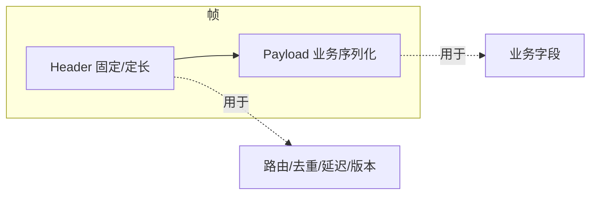

# 第 3 章：消息模型与数据契约

## 本章目标

学会设计**可跨进程、跨主机、跨语言、跨版本**使用的消息，而不是把 C++ 对象的内存直接发出去。掌握 Protobuf、FlatBuffers 的取舍，实现零拷贝句柄，制定版本兼容规则。

## 3.1 分层：传输元数据 vs 业务负载



Header 用定长、稳定布局，中间件解析它做路由和观测；Payload 用 Protobuf/FlatBuffers 等承载业务字段。二者分离让中间件**不解析业务也能路由**。

## 3.2 序列化选型

| 方案 | 优点 | 代价与边界 |
| --- | --- | --- |
| Protobuf | 跨语言、生态成熟、演进规则清晰 | 需解析到对象，分配和拷贝成本较高 |
| FlatBuffers | 可直接访问 buffer，近似零拷贝读 | schema 约束严格，写侧更繁琐 |
| Cap'n Proto | 零拷贝、支持 RPC | 生态相对小 |
| IDL（DDS/ROS） | 框架生成多语言代码 | 依赖工具链和代码生成 |
| 固定布局(POD) | 解析最快、可预测 | 演进和跨语言最难 |

{: .important }
> 选型必须用**基准数据**决定，而不是感觉。要测：编码耗时、解码耗时、消息大小、分配次数、峰值内存、端到端 p99。第 6 章给出压测方法。

## 3.3 Protobuf 实战

```proto
// sensor.proto  —  syntax = "proto3";
syntax = "proto3";
package robot;

message Imu {
  uint64 stamp_ns = 1;
  double ax = 2; double ay = 3; double az = 4;   // 单位: m/s^2
  double gx = 5; double gy = 6; double gz = 7;   // 单位: rad/s
  uint32 seq = 8;
}

message ControlCmd {
  uint64 stamp_ns = 1;
  double v = 2;        // 线速度 m/s
  double omega = 3;    // 角速度 rad/s
  uint32 seq = 4;
}
```

```cpp
// 序列化 / 反序列化
robot::Imu imu;
imu.set_stamp_ns(now_ns());
imu.set_ax(0.1);
std::string bytes;
imu.SerializeToString(&bytes);          // 编码

robot::Imu parsed;
if (!parsed.ParseFromString(bytes)) {   // 解码，务必检查返回值
    // 记录错误、丢弃、计数，不要继续用未初始化数据
}
```

## 3.4 FlatBuffers：高频大消息的近似零拷贝

对图像/点云这类大消息，Protobuf 的逐字段解析可能成为瓶颈。FlatBuffers 允许**不解析直接按偏移访问**：

```cpp
// 读取端无需完整反序列化，直接访问字段
auto* img = flatbuffers::GetRoot<robot::Image>(recv_buffer);
uint32_t w = img->width();          // O(1) 偏移访问
const uint8_t* pixels = img->data()->Data();  // 直接指向 buffer，零拷贝
// 注意：pixels 的生命周期 = recv_buffer 的生命周期
```

{: .warning }
> 零拷贝读的代价：返回的指针**绑定到底层 buffer 的生命周期**。若把 `pixels` 放进异步队列而 buffer 被回收，就是 use-after-free。必须配合 buffer pool + 引用计数（下一节）。

## 3.5 大对象与零拷贝句柄

图像、点云不应在每个阶段完整复制。用 buffer pool + 引用计数句柄：

```cpp
#include <memory>
#include <atomic>
#include <vector>

class BufferPool;

// 引用计数的 buffer 句柄：拷贝句柄不拷贝数据
class BufferHandle {
public:
    uint8_t* data() const { return block_->data.data(); }
    size_t size() const { return len_; }
    void set_size(size_t n) { len_ = n; }
private:
    friend class BufferPool;
    struct Block { std::vector<uint8_t> data; std::atomic<int> refs; };
    std::shared_ptr<Block> block_;   // shared_ptr 负责回收
    size_t len_ = 0;
};

class BufferPool {
public:
    explicit BufferPool(size_t block_bytes, size_t count) {
        for (size_t i = 0; i < count; ++i) {
            auto b = std::make_shared<BufferHandle::Block>();
            b->data.resize(block_bytes);
            free_.push_back(b);
        }
    }
    std::optional<BufferHandle> acquire() {
        std::lock_guard lk(mu_);
        if (free_.empty()) return std::nullopt;   // 池空即背压信号
        BufferHandle h; h.block_ = free_.back(); free_.pop_back();
        return h;
    }
    void release(std::shared_ptr<BufferHandle::Block> b) {
        std::lock_guard lk(mu_); free_.push_back(std::move(b));
    }
private:
    std::mutex mu_;
    std::vector<std::shared_ptr<BufferHandle::Block>> free_;
};
```

发布时把 `BufferHandle`（而非 payload）放入队列；所有订阅者共享同一份数据，最后一个引用释放时归还池。这就是"同机零拷贝分发"的核心。

## 3.6 版本兼容规则


Protobuf proto3 的演进规则：

- **字段编号永不复用**，删除字段要保留编号（用 `reserved`）。
- 新增字段给合理默认值；旧消费者自动忽略未知字段。
- 不改变已有字段的类型和语义（改单位/坐标系必须升版本）。
- 消息携带 `schema_version`，升级时跑兼容性测试。

{: .warning }
> 字段类型相同 ≠ 语义兼容。把坐标单位从米改成毫米，类型仍是 `double`，但数值差 1000 倍。单位、坐标系、时间基准必须在 schema 或版本里显式表达。

## 3.7 真实案例：米和毫米的静默错误

某团队把位姿的 `x/y/z` 从米改成毫米，只改了注释没升版本。旧的可视化节点按米解释毫米数据，物体瞬移到 1000 倍远处，但**没有任何崩溃或报错**，排查了两天。

**根因**：语义变更没有版本化，消费者无法检测。

**修复**：在消息里加 `unit` 枚举或 `schema_version`；回放/可视化工具遇到未知版本**明确报错**而不是静默按旧格式解释；CI 增加跨版本互读测试。

## 3.8 动手实验与验收

**实验**：
1. 用 Protobuf 定义 `Imu`、`Image`（含元数据）、`ControlCmd`。
2. 写"新增字段 / 删除字段 / 未知字段 / 单位变化"四种跨版本互读测试。
3. 用 `BufferPool` 分发一帧 6MB 图像给 3 个订阅者，统计总拷贝次数（目标：1 次入池，0 次分发拷贝）。
4. 对同一图像分别用 Protobuf 和 FlatBuffers，测编码/解码耗时和峰值内存。

**验收标准**：旧消费者能读兼容的新消息；不兼容变化能被检测；分发零拷贝；测试报告包含消息大小、CPU、分配次数和 p99。

## 3.9 面试问题与参考答案

**问：Protobuf 为什么不一定适合点云？**

答：点云大且频率高，逐字段解析和对象分配会消耗大量 CPU 和内存带宽。可考虑 FlatBuffers、固定布局或专用块格式做到近似零拷贝读。但必须用端到端测试证明收益，不能凭理论；有时点云字段少、Protobuf 的 `bytes` 直接装二进制也够快。

**问：如何设计跨语言数据契约？**

答：用 IDL/schema 作为唯一真源，生成各语言类型；固定字段编号和单位；消息携带版本和 schema ID；在 CI 跑兼容性测试。绝不依赖某语言的内存布局（对齐、端序、padding 都不可移植）。

**问：消息 ID 和序列号有什么区别？**

答：消息 ID 用于全局去重和链路追踪（通常全局唯一）；序列号用于同一来源同一流的顺序、缺口检测和"最新值"判断（同源单调递增）。二者语义不同，不能用一个字段承担。

**问：怎样在保证零拷贝的同时避免 use-after-free？**

答：用引用计数句柄（`shared_ptr` 或自管理 refcount）表达 buffer 所有权，句柄随消息流动，最后一个引用释放时归还池。禁止把裸指针放进异步队列。跨进程共享内存则需要在共享区里放引用计数，并处理某端崩溃时的回收（如超时回收或 owner 探活）。
