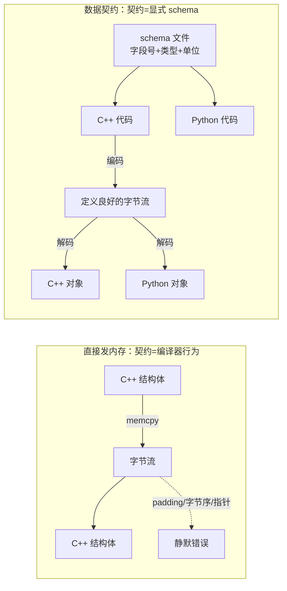
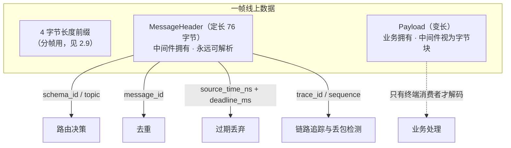
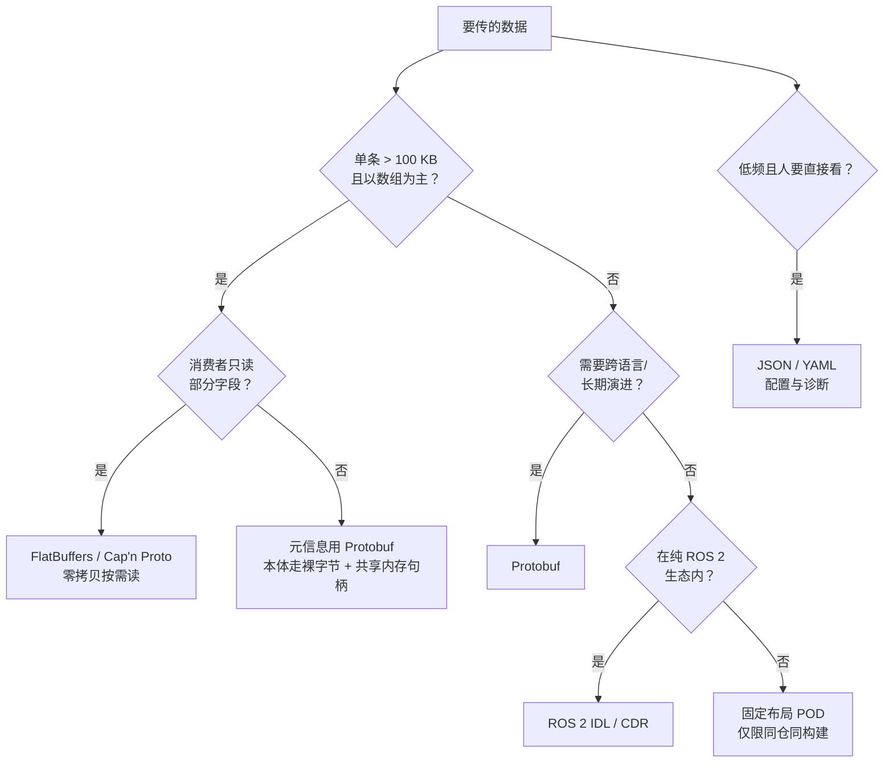
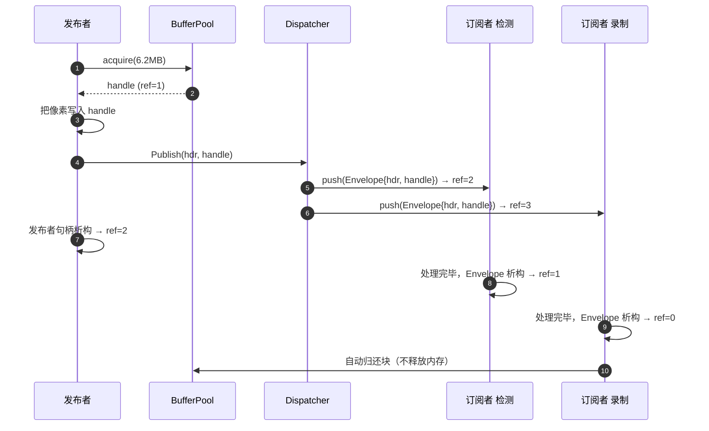
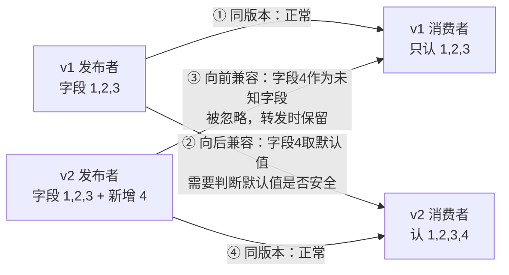
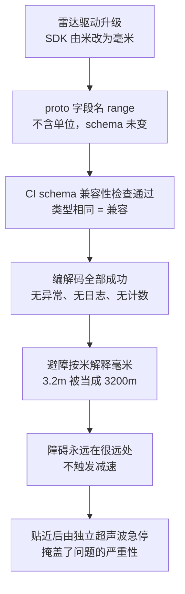

# 第 3 章：消息模型与数据契约

## 3.1 本章目标与前置知识

### 学完本章你能

- 说清楚为什么**不能直接把 C++ 结构体的内存发出去**，并逐条举出会出什么事故。
- 设计一个**消息头（Header）+ 负载（Payload）分层**的线上格式，让中间件在不理解业务的前提下完成路由、去重、过期丢弃和链路追踪。
- 在 **Protobuf / FlatBuffers / Cap'n Proto / ROS IDL / 固定布局 POD** 之间做出有依据的选型，而不是凭感觉。
- 写出**检查返回值**的编解码代码，并知道解析失败时该做什么。
- 实现一个 **BufferPool + 引用计数 BufferHandle**，让一帧图像分发给 5 个订阅者时仍然只有一份内存。
- 制定一套**版本演进规则**，让新旧节点在灰度期间可以互相读写而不出静默错误。

### 前置知识

- 第 2 章的内容：原子变量、acquire-release 配对、有界队列、分帧。引用计数的正确性直接依赖这些。
- 知道 `struct`、`memcpy`、指针和生命周期。
- 知道大端序和小端序的概念即可，细节本章会补。

{: .note }
> 本章是全书里**唯一一章的错误会"不报错"**。并发 bug 会崩溃，网络 bug 会超时，但数据契约的 bug 常常表现为"程序跑得好好的，结果是错的"。3.9 节的真实案例排查了两天，就是因为它不崩溃。

## 3.2 为什么需要数据契约：从一次"能跑"的偷懒说起

### 最直接的写法

你有一个 IMU 结构体，想把它发给另一个进程：

```cpp
// 版本 0：看起来最快、最省事
struct ImuSample {
    uint64_t stamp_ns;
    float    accel[3];
    float    gyro[3];
    bool     calibrated;
    double   temperature;
};

ImuSample s = read_from_device();
send(sock, &s, sizeof(s), 0);          // 直接把内存发出去
```

接收端：

```cpp
ImuSample s;
recv(sock, &s, sizeof(s), 0);          // 直接按内存解释
use(s.accel[0]);
```

这段代码在你的开发机上、两端用同一个编译器编译时，**完全正常**。于是它被合入主干，然后开始产生一连串事故。

### 事故清单

**事故一：结构体大小不是你以为的那样。**

编译器为了让每个成员落在自己类型要求的对齐边界上，会插入**填充字节（padding）**：

```text
偏移  0: stamp_ns     8 字节
偏移  8: accel[3]    12 字节
偏移 20: gyro[3]     12 字节
偏移 32: calibrated   1 字节
偏移 33: [填充]       7 字节   ← 为了让 double 落在 8 的倍数
偏移 40: temperature  8 字节
合计 48 字节，其中 7 字节是垃圾
```

这 7 个字节的内容是**未初始化的栈内存**。它们会被原样发到网络上——既浪费带宽，又是一个信息泄露渠道（栈上可能残留上一次调用的密钥、指针地址）。

**事故二：改一个字段顺序，两端就对不上了。**

有人为了"看起来整齐"把 `calibrated` 移到最前面。结构体布局变成另一副样子，但代码能编译、能运行。升级了发布者、没升级订阅者，订阅者读到的加速度值是温度的一部分字节——数值荒谬但不会崩溃。

**事故三：换一台机器就全错。**

x86 和大部分 ARM 是**小端序（little-endian）**，但某些网络设备、部分 MIPS/PowerPC 是**大端序（big-endian）**。同一个 `uint32_t` 值 `0x00000001`：

| 字节序 | 内存中的 4 个字节 |
| --- | --- |
| 小端序 | `01 00 00 00` |
| 大端序 | `00 00 00 01` |

大端机按小端解释会得到 16777216。**差 2^24 倍，但依然不崩溃**。

**事故四：结构体里一旦有指针，就彻底完了。**

```cpp
struct Image {
    uint32_t width, height;
    uint8_t* pixels;              // 指针
};
send(sock, &img, sizeof(img), 0); // 发过去的是一个 8 字节地址
```

接收进程拿到的是**发送进程地址空间里的一个数字**。在自己进程里解引用它，运气好是段错误（立刻崩溃，反而是好事），运气不好是恰好落在一块合法内存上，读到垃圾数据继续往下算。`std::string`、`std::vector` 里都藏着指针，同理不能直接发。

**事故五：Python 侧的同事没法接入。**

标定工具、离线分析、数据看板通常用 Python 写。`sizeof(ImuSample)` 是 C++ 编译器的内部知识，Python 侧只能靠人肉抄一份 `struct.unpack` 格式串，然后在下一次字段变更时忘记同步。

### 结论

{: .important }
> **"把内存发出去"不是一种序列化方案，而是把 C++ 编译器的实现细节当成了跨进程协议。** 你需要的是一份**数据契约（data contract）**：一份独立于任何编程语言和编译器的、明确规定了字段顺序、类型、字节序、单位和版本演进规则的约定。序列化只是执行这份契约的手段。



## 3.3 核心概念与术语

| 中文 | 英文 | 含义 |
| --- | --- | --- |
| 序列化 | Serialization | 把内存中的对象转换成一段可传输、可存储的字节序列 |
| 反序列化 | Deserialization | 把字节序列还原成对象（或提供访问接口） |
| 模式 | Schema | 描述数据结构的形式化定义：字段名、类型、编号、可选性 |
| 接口定义语言 | IDL | 写 schema 的语言，如 `.proto`、`.fbs`、`.idl`、`.msg` |
| 数据契约 | Data Contract | schema + 单位 + 坐标系 + 时间基准 + 版本演进规则的总和 |
| 线上格式 | Wire Format | 字节在网络或磁盘上的确切排布方式 |
| 向后兼容 | Backward Compatible | **新代码能读旧数据** |
| 向前兼容 | Forward Compatible | **旧代码能读新数据** |
| 自描述 | Self-describing | 数据本身携带字段名/类型，接收方无需 schema 也能解析（如 JSON） |
| 零拷贝读 | Zero-copy Read | 不把数据搬到新的对象里，直接在原缓冲区上按偏移访问 |

{: .warning }
> **向前和向后兼容非常容易记反。** 记忆法：主语永远是**代码**，宾语永远是**数据**。"向后兼容"是新代码回头去读旧数据；"向前兼容"是旧代码往前去读未来的数据。灰度发布时**两个方向都需要**，因为集群里新旧节点会同时存在。

### 数据契约 ≠ schema

这是本章最重要的一句话。`.proto` 文件只规定了"这里有一个 `double x`"，但它规定不了：

- `x` 的**单位**是米还是毫米。
- `x` 所在的**坐标系**是车体系、传感器系还是世界系。
- `stamp_ns` 的**时间基准**是系统墙钟（`CLOCK_REALTIME`，会被 NTP 跳变）还是单调时钟（`CLOCK_MONOTONIC`，重启归零）。
- 数组是**行优先**还是列优先，图像是 `rgb8` 还是 `bgr8`。

这些是**语义**。类型相同而语义不同的两条消息，编解码全部成功，结果却完全错误——这就是 3.9 节要讲的事故。

## 3.4 原理深入：消息分层（Header + Payload）

### 为什么要分层

设想中间件的转发节点收到一条消息，它需要做这些事：

1. 决定转发给哪些订阅者（按 topic 路由）。
2. 判断这条消息是不是重复的（去重）。
3. 判断它是否已经过期（超过 deadline 就丢掉，别浪费下游 CPU）。
4. 把它写进链路追踪日志。

**这四件事没有一件需要知道加速度是多少。** 如果中间件必须先反序列化整个 Protobuf 对象才能拿到时间戳，那么：

- 每一跳都要付出一次完整的编解码开销（图像消息可能是几毫秒）。
- 中间件必须编译进所有业务类型的 schema，业务加一个消息类型就要重新编译中间件。
- 业务 schema 版本升级会导致中间件解析失败，而中间件本不该关心。

所以正确的做法是**分层**：定长的消息头由中间件拥有，变长的负载由业务拥有，中间件把负载当成**不透明字节块（opaque blob）**。



### 完整的 MessageHeader

```cpp
#include <cstdint>

// 线上字节序统一为小端序（覆盖 x86 与主流 ARM）。
// 若要支持大端平台，只在编解码函数里做转换，不改结构体定义。
#pragma pack(push, 1)                  // 关闭填充，保证布局确定
struct MessageHeader {
    // ---- 帧识别 ----
    uint32_t magic;            // 固定魔数 0x4D57424D，校验帧起点是否正确
    uint8_t  header_version;   // 消息头自身的版本
    uint8_t  header_len;       // 头长度（字节），允许未来在尾部追加字段
    uint16_t flags;            // bit0 压缩 bit1 加密 bit2 分片 bit3 关键帧

    // ---- 数据契约 ----
    uint32_t schema_id;        // 业务类型标识，例如 ImageFrame
    uint16_t schema_version;   // 该业务类型的版本号
    uint16_t encoding;         // 0=raw 1=protobuf 2=flatbuffers 3=cdr

    // ---- 溯源与追踪 ----
    uint64_t message_id;       // 全局唯一，用于去重
    uint64_t trace_id;         // 同一因果链共享，用于跨节点串联
    uint32_t source_id;        // 发布者节点 ID
    uint32_t source_epoch;     // 发布者的重启代际（第 9 章）
    uint64_t sequence;         // 同 (source_id, topic) 内单调递增

    // ---- 时间 ----
    uint64_t source_time_ns;   // 数据采集/生成时刻（单调时钟）
    uint64_t send_time_ns;     // 进入传输层的时刻（单调时钟）
    uint32_t deadline_ms;      // 超过即无价值，0 表示不限制

    // ---- 负载 ----
    uint32_t payload_len;      // 负载字节数
    uint32_t payload_crc32;    // 负载校验和，0 表示未启用
};
#pragma pack(pop)

static_assert(sizeof(MessageHeader) == 76, "消息头布局被意外改变");
```

### 逐字段：没有它会发生什么

| 字段 | 没有它会发生什么 |
| --- | --- |
| `magic` | 一次分帧错位后，后面所有帧都按错误偏移解析，且没有任何机制能发现并重新同步 |
| `header_version` / `header_len` | 想给消息头加字段时，必须让全网所有节点同时停机升级 |
| `flags` | 无法表达"这条被压缩过"，只能靠 topic 名约定，改压缩算法要改所有订阅方 |
| `schema_id` | 收到字节块却不知道用哪个解码器，只能靠 topic 名硬编码映射 |
| `schema_version` | 无法在解码前做兼容性检查，只能等解析崩了才知道 |
| `encoding` | 无法在同一条链路上混用 Protobuf 与 FlatBuffers，也无法平滑迁移 |
| `message_id` | 重传或多路径送达时无法去重；也无法在日志里定位"就是这一条" |
| `trace_id` | 只能看到单跳延迟，看不到"相机→检测→融合→控制"整条链的耗时分布（第 10 章） |
| `source_id` | 多个发布者发同一 topic 时，无法区分是谁发的、谁在丢包 |
| `source_epoch` | 节点崩溃重启后 `sequence` 归零，接收方会误判为"巨量乱序"或用旧数据覆盖新状态 |
| `sequence` | **丢包完全不可见**。收到 1、2、4 才知道丢了 3，这是唯一可靠的丢失检测手段 |
| `source_time_ns` | 无法做多传感器时间对齐（第 7 章），只能用接收时刻，引入系统性误差 |
| `send_time_ns` | 无法把端到端延迟拆成"本机排队"和"网络传输"，性能问题定位不下去 |
| `deadline_ms` | 队列积压时会把过期的控制指令也执行掉，比不执行更危险 |
| `payload_len` | 无法界定负载边界，也无法在读之前预留缓冲区 |
| `payload_crc32` | 磁盘位翻转、内存 ECC 失效、网络校验漏检时，得到的是**静默错误的数据** |

{: .important }
> **`source_time_ns` 和 `send_time_ns` 为什么必须分开？** 相机在 $T$ 时刻曝光，但驱动排队、格式转换、序列化让它到 $T+20\text{ms}$ 才进传输层。如果只有一个时间戳，你无法回答"这 20 ms 是本机开销还是网络延迟"——而这两者的优化手段完全不同。有了两个时间戳，本机开销 $= t_{send} - t_{source}$，网络延迟 $\approx t_{recv} - t_{send}$。

### 消息 ID 与序列号：为什么两个都要

初学者常问：有了 `sequence` 为什么还要 `message_id`？

- `sequence` 是**局部有序**的：它在 `(source_id, source_epoch, topic)` 这个作用域里单调递增。它回答的是"我漏了吗、乱序了吗"。
- `message_id` 是**全局唯一**的：不同节点、不同 topic 之间也不重复。它回答的是"这两条是不是同一条"。

只有 `sequence` 时，A 节点的第 5 条和 B 节点的第 5 条无法区分，去重表会误杀。只有 `message_id` 时（比如用 UUID），你无法从 `id=0x8f3a...` 推断出前一条是谁，丢包检测就失效了。

## 3.5 序列化方案对比与选型

### 横向对比

| 方案 | 编码耗时 | 解码耗时 | 体积 | 跨语言 | 演进能力 | 零拷贝读 | 自描述 |
| --- | --- | --- | --- | --- | --- | --- | --- |
| **Protobuf** | 中 | 中（必须完整解析并构造对象） | 小（varint 压缩整数） | 极好（十余种语言官方支持） | 强（字段编号 + 默认值） | 否 | 否 |
| **FlatBuffers** | 中偏高（构建器逆序写入） | 极低（按需按偏移访问） | 中（vtable 与对齐填充） | 好 | 较强（vtable 槽位可追加） | **是** | 否 |
| **Cap'n Proto** | 低 | 极低 | 中偏大（固定槽位） | 好 | 较强 | **是** | 否 |
| **ROS 2 IDL / CDR** | 低 | 低（仍需完整解析） | 中 | 生态内好，生态外差 | 弱（结构变更即类型哈希不匹配） | 部分实现支持借出消息 | 否 |
| **固定布局 POD** | 极低 | 极低 | 最小 | 差（需人工同步定义） | 极弱（加字段即破坏兼容） | 是 | 否 |
| **JSON / YAML** | 高 | 高 | 大 | 极好 | 强 | 否 | **是** |

{: .warning }
> **上表的"耗时"和"体积"是数量级倾向，不是结论。** 实际结果强烈依赖消息形状：小而扁平的结构（IMU）和大数组（点云）的差距可以达到两个数量级；字符串多的消息和纯数值消息的表现也完全不同。**任何选型必须用你自己的真实消息跑基准**，3.10 节的实验二给出方法。

### 为什么大数组是分水岭

一个 64 线激光雷达，10 Hz，每帧约 12 万个点，每点存 $x, y, z, \text{intensity}$ 四个 `float`：

$$120000 \times 4 \times 4\ \text{字节} = 1.92\ \text{MB/帧}, \quad 1.92 \times 10 = 19.2\ \text{MB/s}$$

用 Protobuf 的 `repeated float` 表达，编码时需要对 48 万个 `float` 逐个调用 `add_x()`，解码时要构造一个 48 万元素的 `RepeatedField`。这个"逐元素"的 API 开销与数据量成正比，且**无法被跳过**——即使消费者只想读点数，也必须把整帧解析出来。

而 `memcpy` 1.92 MB 在现代机器上约需：

$$\frac{1.92\ \text{MB}}{10\ \text{GB/s}} \approx 0.19\ \text{ms}$$

{: .tip }
> **实用折中：头部结构化，本体裸字节。** 把点云的元信息（时间戳、坐标系、点数、每点字段布局、是否有强度通道）用 Protobuf 描述，把 1.92 MB 的点数据作为一个 `bytes` 字段或一个独立的缓冲区句柄传递。这样既保留了演进能力，又避免了对 MB 级数组做逐元素编解码。ROS 2 的 `PointCloud2` 正是这个思路：`fields` 描述布局，`data` 是裸字节。

### 选型决策



## 3.6 工程实现

### 3.6.1 Protobuf：定义与编解码

```proto
// robotbus/v1/imu.proto
syntax = "proto3";
package robotbus.v1;

// 通用三维向量。注意：单位不写在这里，而写在使用它的字段名上。
message Vector3 {
  double x = 1;
  double y = 2;
  double z = 3;
}

message ImuSample {
  // 采集时刻，纳秒。时间基准：CLOCK_MONOTONIC_RAW，由 header 的 source_epoch 界定有效区间。
  uint64 stamp_ns          = 1;
  // 坐标系名，例如 "imu_link"。右手系，X 前 Y 左 Z 上。
  string frame_id          = 2;
  // 线加速度，单位 m/s^2，已扣除标定零偏。
  Vector3 accel_mps2       = 3;
  // 角速度，单位 rad/s。
  Vector3 gyro_radps       = 4;
  // 器件温度，摄氏度。
  double temperature_c     = 5;

  reserved 6, 7;                 // 曾经存在、现已删除的字段，编号永久保留
  reserved "accel_g", "gyro_dps";// 旧字段名同样保留，防止被复用
}
```

{: .note }
> **单位为什么写进字段名而不是注释？** 注释不进入线上格式，也不进入其他语言的生成代码。`accel_mps2` 这个名字会出现在 C++、Python、日志、bag 文件的字段名里，任何人打开数据都能看到单位。这是成本最低、覆盖面最广的防御手段。

编解码代码。**每一个返回值都必须检查**：

```cpp
#include "robotbus/v1/imu.pb.h"
#include <string>
#include <limits>

// 编码：失败返回 false，调用方必须处理
bool EncodeImu(const ImuReading& in, std::string* out) {
    robotbus::v1::ImuSample msg;
    msg.set_stamp_ns(in.stamp_ns);
    msg.set_frame_id(in.frame_id);

    auto* a = msg.mutable_accel_mps2();
    a->set_x(in.ax_mps2); a->set_y(in.ay_mps2); a->set_z(in.az_mps2);

    auto* g = msg.mutable_gyro_radps();
    g->set_x(in.gx_radps); g->set_y(in.gy_radps); g->set_z(in.gz_radps);

    msg.set_temperature_c(in.temp_c);

    // SerializeToString 会在超过 2 GB 上限或内存不足时返回 false
    if (!msg.SerializeToString(out)) {
        return false;
    }
    return true;
}

// 解码：来自网络的数据一律视为不可信
bool DecodeImu(const void* data, size_t len, robotbus::v1::ImuSample* out) {
    // Protobuf 的 ParseFromArray 只接受 int，超长输入必须先拦截
    if (len > static_cast<size_t>(std::numeric_limits<int>::max())) {
        return false;
    }
    // 关键：ParseFromArray 返回 false 时 out 处于未定义状态，绝不能继续使用
    if (!out->ParseFromArray(data, static_cast<int>(len))) {
        return false;
    }
    // 解析成功不等于语义合法，业务层校验仍然必要
    if (out->frame_id().empty()) {
        return false;
    }
    return true;
}
```

{: .warning }
> **`ParseFromString` / `ParseFromArray` 返回 `bool`，而且非常容易被忽略。** proto3 里所有字段都是可选的，所以"缺字段"不会导致解析失败——返回 `false` 意味着**字节流本身损坏或被截断**。此时 `out` 里可能有一部分被填充的字段，看起来"有数据"，实际是半截数据。必须直接丢弃并计数。

### 3.6.2 FlatBuffers：零拷贝读与生命周期陷阱

```text
// robotbus/v1/image.fbs
namespace robotbus.v1;

table ImageFrame {
  stamp_ns : ulong;
  frame_id : string;
  width    : uint;
  height   : uint;
  encoding : string;   // "rgb8" / "bgr8" / "mono8"
  step     : uint;     // 每行字节数，含行末填充
  pixels   : [ubyte];  // 大数组：零拷贝读的意义所在
}

root_type ImageFrame;
```

读取端：

```cpp
#include "robotbus/v1/image_generated.h"

// buf 指向接收缓冲区，len 是长度。返回值指针的生命周期绑定在 buf 上。
const robotbus::v1::ImageFrame* OpenImage(const uint8_t* buf, size_t len) {
    // 来自网络或磁盘的缓冲区必须先验证，否则恶意/损坏数据会导致越界读
    flatbuffers::Verifier verifier(buf, len);
    if (!robotbus::v1::VerifyImageFrameBuffer(verifier)) {
        return nullptr;
    }
    return robotbus::v1::GetImageFrame(buf);   // 不拷贝，只是返回 buf 上的一个视图
}

void UseImage(const uint8_t* buf, size_t len) {
    const auto* frame = OpenImage(buf, len);
    if (!frame) return;

    uint32_t w = frame->width();               // 按偏移直接读，没有对象构造
    uint32_t h = frame->height();

    const auto* px = frame->pixels();
    if (!px) return;                            // 字段可能缺失，必须判空
    const uint8_t* pixels = px->Data();         // 指向 buf 内部，不是新分配的内存

    ProcessSync(pixels, w, h);                  // 同步使用：安全
}
```

{: .warning }
> **`pixels` 指向的是 `buf` 内部。** 一旦 `buf` 被释放、被复用或被下一帧覆盖，这个指针立刻悬空。零拷贝的本质是"把内存管理责任从库转移给你"——性能是拿责任换来的。下一节的 `BufferHandle` 就是为了系统性地承担这个责任。

### 3.6.3 BufferPool 与引用计数 BufferHandle

**要解决的问题**：一帧 6.2 MB 的图像要分发给检测、录制、显示三个订阅者。朴素做法拷贝三份，每秒 30 帧就是：

$$6.2\ \text{MB} \times 3 \times 30 = 558\ \text{MB/s}$$

纯粹浪费的内存带宽。而且每帧都 `new`/`delete` 6 MB 会造成堆碎片和分配抖动，`p99` 延迟毛刺明显。

**解决方案**：预分配固定大小的块组成池；分发时只传递句柄并增加引用计数；最后一个持有者析构时，块自动回到池里。

```cpp
#include <atomic>
#include <cstddef>
#include <cstdint>
#include <memory>
#include <mutex>
#include <utility>
#include <vector>

class BufferPool;

// 池中的一个块。data 指向预分配的存储，运行期不再申请释放内存。
struct BufferBlock {
    std::atomic<uint32_t> ref_count{0};
    BufferPool* owner    = nullptr;
    uint8_t*    data     = nullptr;
    size_t      capacity = 0;    // 块容量，固定
    size_t      size     = 0;    // 本次写入的有效字节数
};

// 值语义的句柄：拷贝即增引用，析构即减引用，归零则归还池。
class BufferHandle {
public:
    BufferHandle() = default;
    // 由 BufferPool::acquire 调用，此时 ref_count 已被置为 1，不再自增
    explicit BufferHandle(BufferBlock* b) : block_(b) {}

    BufferHandle(const BufferHandle& o) : block_(o.block_) {
        if (block_) block_->ref_count.fetch_add(1, std::memory_order_relaxed);
    }
    BufferHandle(BufferHandle&& o) noexcept : block_(o.block_) { o.block_ = nullptr; }

    // copy-and-swap：同时覆盖拷贝赋值与移动赋值，且天然自赋值安全
    BufferHandle& operator=(BufferHandle o) noexcept {
        std::swap(block_, o.block_);
        return *this;
    }
    ~BufferHandle() { reset(); }

    void reset();

    const uint8_t* data() const { return block_ ? block_->data : nullptr; }
    uint8_t* mutable_data()     { return block_ ? block_->data : nullptr; }
    size_t   size() const       { return block_ ? block_->size : 0; }
    size_t   capacity() const   { return block_ ? block_->capacity : 0; }
    void     set_size(size_t n) { if (block_) block_->size = n; }
    explicit operator bool() const { return block_ != nullptr; }

    uint32_t use_count() const {
        return block_ ? block_->ref_count.load(std::memory_order_relaxed) : 0;
    }

private:
    BufferBlock* block_ = nullptr;
};

class BufferPool {
public:
    BufferPool(size_t block_size, size_t block_count) : block_size_(block_size) {
        storage_.reserve(block_count);
        blocks_.reserve(block_count);
        free_list_.reserve(block_count);
        for (size_t i = 0; i < block_count; ++i) {
            storage_.push_back(std::make_unique<uint8_t[]>(block_size));
            auto b = std::make_unique<BufferBlock>();
            b->owner    = this;
            b->data     = storage_.back().get();
            b->capacity = block_size;
            free_list_.push_back(b.get());
            blocks_.push_back(std::move(b));
        }
    }

    // 取一个块。池空或请求过大时返回空句柄，调用方必须处理（降级或丢弃）。
    BufferHandle acquire(size_t need) {
        if (need > block_size_) { ++oversize_; return BufferHandle{}; }
        std::lock_guard<std::mutex> lk(mu_);
        if (free_list_.empty()) { ++exhausted_; return BufferHandle{}; }
        BufferBlock* b = free_list_.back();
        free_list_.pop_back();
        b->size = need;
        b->ref_count.store(1, std::memory_order_relaxed);
        ++in_use_;
        return BufferHandle{b};
    }

    size_t   in_use()    const { std::lock_guard<std::mutex> lk(mu_); return in_use_; }
    uint64_t exhausted() const { std::lock_guard<std::mutex> lk(mu_); return exhausted_; }

private:
    friend class BufferHandle;
    void release(BufferBlock* b) {
        std::lock_guard<std::mutex> lk(mu_);
        b->size = 0;
        free_list_.push_back(b);
        --in_use_;
    }

    mutable std::mutex mu_;
    const size_t block_size_;
    std::vector<std::unique_ptr<uint8_t[]>>   storage_;
    std::vector<std::unique_ptr<BufferBlock>> blocks_;
    std::vector<BufferBlock*>                 free_list_;
    size_t   in_use_    = 0;
    uint64_t exhausted_ = 0;
    std::atomic<uint64_t> oversize_{0};
};

inline void BufferHandle::reset() {
    if (!block_) return;
    // acq_rel：release 保证本线程对缓冲区的写入对后续持有者可见；
    //          acquire 保证最后一个释放者能看到其他线程的全部写入，之后归还才安全。
    if (block_->ref_count.fetch_sub(1, std::memory_order_acq_rel) == 1) {
        block_->owner->release(block_);
    }
    block_ = nullptr;
}
```

### 逐段讲解

**为什么 `ref_count` 用 `relaxed` 自增、`acq_rel` 自减？**
自增总是发生在"我已经持有一个有效引用"的前提下，不需要建立同步关系，`relaxed` 足够（这也是 `std::shared_ptr` 的做法）。自减不同：归零的那一刻块要被归还并可能被别的线程复用，必须保证之前所有线程对该块的写入都已可见，因此需要 `acq_rel`。**这是引用计数最常被写错的一行。**

**为什么 `acquire` 失败返回空句柄而不是抛异常或阻塞？**
中间件的分发路径上不能有不可控的阻塞。返回空句柄把决策权交给调用方：图像可以直接丢弃并计数，录制数据可以退化为堆分配。`exhausted_` 计数则让"池不够用"这件事可观测——这是第 6 章调容量的依据。

**为什么用 `friend class BufferHandle` 而不是把 `release` 设为 public？**
归还块是引用计数的内部动作。暴露成 public 会诱导调用方手动归还，造成重复归还（双重释放）。

**为什么 `storage_` 和 `blocks_` 要分开？**
`BufferBlock` 里有 `std::atomic`，不可拷贝也不可移动。如果直接放进 `std::vector<BufferBlock>`，扩容时会移动元素，导致已经发出去的裸指针全部失效。用 `unique_ptr` 保证地址稳定。

**为什么 `operator=` 按值传参？**
copy-and-swap 惯用法：一个函数同时正确处理拷贝赋值和移动赋值，且自赋值 `h = h` 天然安全（先构造临时对象，引用计数不会误降为 0）。

### 零拷贝分发

```cpp
class Dispatcher {
public:
    // 分发一帧给所有订阅者。无论订阅者多少，负载都只有一份内存。
    void Publish(const MessageHeader& hdr, const BufferHandle& payload) {
        std::vector<Subscriber*> snapshot;
        { std::lock_guard<std::mutex> lk(mu_); snapshot = subs_; }  // 锁内只拷贝列表

        for (Subscriber* s : snapshot) {
            // 这里拷贝的是句柄（16 字节以内），不是 6 MB 的像素
            if (!s->queue.push(Envelope{hdr, payload})) {
                ++dropped_;                       // 慢消费者只影响自己
            }
        }
    }
private:
    struct Envelope { MessageHeader hdr; BufferHandle payload; };
    std::mutex mu_;
    std::vector<Subscriber*> subs_;
    std::atomic<uint64_t> dropped_{0};
};
```



{: .important }
> **注意第 3 步之后发布者不能再写这块内存。** 一旦 `Publish` 返回，订阅者可能已在别的线程上读取。零拷贝分发的隐含契约是"发布即只读"。想强制这一点，可以让 `Publish` 接收右值 `BufferHandle&&`，并在内部转成一个只暴露 `const uint8_t*` 的 `ConstBufferHandle`。

## 3.7 版本兼容规则

### Protobuf 的硬性规则

| 规则 | 原因 | 违反的后果 |
| --- | --- | --- |
| **字段编号一旦使用，永不复用** | 线上格式只认编号，不认名字 | 旧节点把新字段按旧类型解释，静默错误 |
| **删除字段必须写 `reserved`** | 编译器据此阻止后人复用编号 | 半年后同事"顺手"复用了 7 号 |
| **只新增可选字段，不改已有字段类型** | 类型变了但编号没变，解析器无法察觉 | `int32` 改 `int64` 在小数值时"看起来正常"，大数值时截断 |
| **不改字段的语义** | schema 检查不了语义 | 见 3.9 节的事故 |
| **新增字段的默认值必须是安全的** | 旧发布者不会填这个字段 | proto3 数值默认 0，若 0 恰好是合法值就无法区分"未设置"和"真的是 0" |

### 兼容矩阵



灰度发布期间四种情况**同时存在**，所以两个方向都必须测试。3.10 节的实验一就是把这四格全部跑一遍。

{: .note }
> **未知字段的保留很重要。** proto3 从 3.5 版本起默认保留未知字段：v1 节点转发一条 v2 消息时，字段 4 不会被丢掉。如果中间有节点做了"解码再重新编码"且未保留未知字段，字段 4 就在这一跳被静默抹除了——下游 v2 消费者会拿到默认值。**能不解码就不解码**，这也是 3.4 节分层设计的另一个理由。

### 处理"未设置"与"值为 0"

```proto
message ControlCommand {
  double speed_mps = 1;

  // 错误做法：直接加 double max_accel_mps2 = 2;
  //   旧发布者不填 → 消费者读到 0.0 → 被解释为"禁止加速"，机器人不动了

  // 正确做法之一：用 optional（proto3 从 3.15 起支持），可以区分"是否设置"
  optional double max_accel_mps2 = 2;

  // 正确做法之二：让 0 表示"未指定，使用本地默认"，并把它写进契约
  //   即 0 = 不约束，而不是 0 = 上限为零
}
```

### 语义版本化：类型相同不等于兼容

**单位、坐标系、时间基准是数据契约的一部分，它们变了就必须升版本。** 具体做法有三种，按侵入性从低到高：

1. **把语义编进字段名**：`x_m` → 新字段 `x_mm`，旧字段 `reserved`。改名会导致编译错误，这正是我们想要的——**让错误在编译期暴露**。
2. **把语义编进消息里的显式字段**：加一个 `string units = 99;` 或 `uint32 semantic_version`，消费者启动时校验，不匹配就拒绝启动并告警。
3. **把语义编进 `schema_id`**：`ImageFrame_rgb8` 和 `ImageFrame_bgr8` 是两个不同的 `schema_id`，中间件在订阅匹配阶段就能拦住。

{: .warning }
> **绝不要"悄悄改单位然后通知大家"。** 通知靠人记忆，代码不检查。3.9 节的事故里，变更其实是在群里通知过的。

## 3.8 常见错误与陷阱

### 陷阱一：直接把结构体内存发出去

```cpp
// 错误：padding、字节序、编译器差异、指针，全都是雷
struct ImuSample { uint64_t t; float a[3]; bool ok; double temp; };
send(sock, &s, sizeof(s), 0);
```

```cpp
// 正确：走显式 schema，字节序与布局由序列化库保证
std::string buf;
if (!EncodeImu(reading, &buf)) { ++metrics.encode_failed; return; }
send_all(sock, buf.data(), buf.size());          // send_all 见 2.9 节
```

如果性能实测证明必须用固定布局，那么至少要：`#pragma pack(1)` 关闭填充、显式做字节序转换、加 `static_assert(sizeof(...) == N)`、加版本字段，并且**限制在同一仓库同一次构建产出的进程之间**。

### 陷阱二：复用已删除的字段编号

```proto
// 错误：3 号曾经是 float accel_g，现在被"回收"给了一个字符串
message ImuSample {
  uint64 stamp_ns = 1;
  string frame_id = 2;
  string device_sn = 3;      // 灾难：旧节点发来的 float 会被当成字符串长度前缀
}
```

```proto
// 正确：老编号进 reserved，新字段用新编号
message ImuSample {
  uint64 stamp_ns  = 1;
  string frame_id  = 2;
  reserved 3;
  reserved "accel_g";
  string device_sn = 8;      // 用一个从未使用过的编号
}
```

### 陷阱三：把零拷贝返回的指针放进异步队列

```cpp
// 错误：use-after-free。recv_buf 在函数返回后即被复用
void OnData(std::vector<uint8_t>& recv_buf) {
    const auto* frame = GetImageFrame(recv_buf.data());
    const uint8_t* px = frame->pixels()->Data();
    async_queue.push([px]{ Detect(px); });   // 异步执行时 recv_buf 早就变了
}
```

```cpp
// 正确：把生命周期一起传过去
void OnData(BufferHandle buf) {
    const auto* frame = OpenImage(buf.data(), buf.size());
    if (!frame) { ++metrics.verify_failed; return; }
    // 捕获 handle（引用计数 +1），只要 lambda 活着，内存就不会被回收
    async_queue.push([buf]() mutable {
        const auto* f = GetImageFrame(buf.data());
        Detect(f->pixels()->Data(), f->width(), f->height());
    });
}
```

{: .important }
> **通用原则：指针可以跨线程传，但生命周期必须跟着一起传。** 只要你发现自己在异步上下文里捕获了一个裸指针，就应该问："谁保证它此刻还活着？"答不上来就说明有 bug。ASan 能抓到一部分，但如果内存被池复用了，ASan 也看不出来——那块内存是合法的，只是内容是别人的。

### 陷阱四：忘记检查解析返回值

```cpp
// 错误：msg 可能是半截数据，后面的计算全是垃圾
robotbus::v1::ImuSample msg;
msg.ParseFromString(payload);            // 返回值被丢弃
Fuse(msg.accel_mps2().x(), ...);
```

```cpp
// 正确：失败即丢弃并计数，让问题可观测
robotbus::v1::ImuSample msg;
if (!msg.ParseFromArray(payload.data(), static_cast<int>(payload.size()))) {
    ++metrics.parse_failed[hdr.schema_id];
    LOG_WARN("parse failed: schema=%u ver=%u src=%u seq=%llu len=%zu",
             hdr.schema_id, hdr.schema_version, hdr.source_id,
             (unsigned long long)hdr.sequence, payload.size());
    return;                              // 绝不使用 msg
}
```

日志里带上 `schema_id`、`schema_version`、`source_id`、`sequence`，才能回答"是谁、从哪个版本开始、从第几条消息开始出问题"。只打 `"parse failed"` 等于没打。

### 陷阱五：用 `float` 存时间戳

```cpp
// 错误：float 只有 24 位有效位
float stamp_s = 1735689600.0f;           // 2025-01-01 的 Unix 时间
```

`float` 的尾数是 24 位（含隐含位）。在 $1.7\times10^{9}$ 附近，相邻可表示数的间隔是：

$$\text{ulp} = 2^{\lfloor \log_2 1.7\times10^9 \rfloor - 23} = 2^{30-23} = 2^{7} = 128\ \text{秒}$$

也就是说，**`float` 在这个量级下连"秒"都表示不了**，分辨率是 128 秒。用 `double` 存秒会好很多：

$$\text{ulp} = 2^{30-52} = 2^{-22} \approx 2.4\times10^{-7}\ \text{秒} \approx 238\ \text{ns}$$

但对需要微秒级对齐的多传感器融合来说，238 ns 的量化误差加上后续运算的累积仍不理想。

```cpp
// 正确：整数纳秒
uint64_t stamp_ns;    // 2^64 ns ≈ 1.84e19 ns ≈ 584 年，精度恒定为 1 ns
```

$$\frac{2^{64}}{10^{9} \times 3600 \times 24 \times 365.25} \approx 584.5\ \text{年}$$

### 陷阱六：解码前不做长度与合法性校验

```cpp
// 错误：完全信任对端给的长度和内容
uint32_t len = hdr.payload_len;
std::vector<uint8_t> buf(len);            // len 可能是 0xFFFFFFFF → 4 GB 分配
const auto* f = GetImageFrame(buf.data());// 未验证的 FlatBuffers → 越界读
```

```cpp
// 正确：外部输入一律先设上限、先验证
constexpr uint32_t kMaxPayload = 64u * 1024 * 1024;
if (hdr.payload_len > kMaxPayload) { ++metrics.oversize; return Disconnect(); }
if (hdr.magic != kMagic || hdr.header_len < sizeof(MessageHeader)) return Disconnect();

flatbuffers::Verifier v(buf.data(), buf.size());
if (!robotbus::v1::VerifyImageFrameBuffer(v)) { ++metrics.verify_failed; return; }
```

{: .warning }
> **这是安全问题，不只是健壮性问题。** 无上限的长度字段是标准的拒绝服务（DoS）入口；未经 `Verifier` 校验的 FlatBuffers 缓冲区可以被构造出任意偏移，导致越界读甚至信息泄露。凡是来自进程外的字节，都按"敌意输入"处理。

## 3.9 真实案例：米和毫米的静默错误

### 现象

某室外巡检机器人在一次例行升级后，出现"靠近墙壁时不减速，贴到几厘米才急停"。但：

- 没有任何崩溃、没有异常日志、没有解析失败计数。
- 单独测试激光雷达驱动，输出的距离值正确。
- 单独测试避障模块，喂入人造数据时行为正确。
- 只有整链跑起来才复现，且**只在升级了雷达驱动的那几台车上**复现。

### 排查过程

1. **先看端到端**：录制一段 bag 回放，避障模块的"最近障碍距离"输出显示 `3200.0`，而现场目测约 3.2 米。差 1000 倍——这是第一个明确信号。
2. **反向定位**：既然是 1000 倍，怀疑单位。检查 `.proto`，字段是 `double range = 3;`——**字段名里没有单位**。
3. **查 schema 历史**：`git log` 显示这个字段三个月来没有任何改动。schema 完全没变，所以 CI 里的兼容性检查全部通过。
4. **查驱动改动**：雷达驱动升级时换了厂商 SDK，新 SDK 的 `getDistance()` 返回毫米，旧 SDK 返回米。改动者在 PR 描述里写了"新 SDK 返回毫米，已在群里同步"，但代码里没有任何转换，也没有任何断言。
5. **为什么没被测出来**：驱动的单元测试断言的是"返回值 > 0 且 < 100000"，米和毫米都能通过；避障模块的单元测试用的是自己造的米制数据。**两个模块各自都对，接口上没人负责。**



### 根因

**数据契约中的语义部分（单位）没有被任何机制表达和校验。** schema 只约束了类型是 `double`，而单位是一份"口头协议"，存在于人的记忆里。当人员或 SDK 变更时，口头协议失效，而**所有自动化手段都无法察觉**——因为从字节到类型到解析全部合法。

### 方案与取舍

| 措施 | 作用 | 代价 |
| --- | --- | --- |
| ① 字段改名为 `range_m`，旧 `range` 进 `reserved` | 单位变更会引发**编译错误**，在最早的阶段暴露 | 需要改所有引用点；灰度期要同时支持新旧字段 |
| ② 消息里加 `uint32 semantic_version`，消费者启动时校验 | 运行期兜底，跨语言也有效 | 每条消息多 4 字节；需要维护版本表 |
| ③ 关键物理量加**量纲检查**：`assert(range_m < 1000.0)` | 数值离谱时立刻报警 | 只能抓数量级错误，抓不了 1.1 倍的偏差 |
| ④ 联调测试用**真实录制数据**跑整链，断言输出范围 | 覆盖模块间的接口语义 | 需要维护回归数据集；bag 要跟着版本走 |
| ⑤ 强类型封装 `struct Meters { double v; }` | 编译期杜绝米/毫米混用 | 侵入业务代码；跨语言时失效，只能保护 C++ 侧 |

最终采用 ①+②+③+④。**没有采用 ⑤**，理由是：这套系统里 Python 侧的分析工具同样会读这些数据，强类型只能保护 C++ 一侧，投入产出比不如把语义写进线上格式。

{: .important }
> **取舍的逻辑：防线要建在"跨语言都能生效"的层次上。** 字段名和显式版本号进入线上格式，任何语言的消费者都能看到；C++ 的强类型只在编译单元内有效。当契约要跨越语言边界时，**把约束编进数据，而不是编进类型系统**。

### 验证方法

1. **构造回归用例**：用旧驱动录一段 bag、新驱动录一段 bag，跑同一份避障代码，断言两者输出的最近障碍距离差异小于 5%。
2. **注入错误**：故意把驱动改回毫米输出但字段名仍是 `range_m`，确认量纲断言在 100 ms 内触发告警并阻止发布。
3. **跨版本互读**：新旧四种组合（3.7 节的四格）全部跑通，确认旧消费者读到新消息时，`semantic_version` 不匹配会拒绝启动而不是静默运行。
4. **加监控**：把 `semantic_version` 不匹配和量纲断言失败都接入告警，运行两周确认零误报。

## 3.10 动手实验与验收

### 实验一：跨版本互读的四种情况（60 分钟）

1. 定义 `sensor_v1.proto`（字段 1、2、3），生成代码，写一个发布程序和一个消费程序。
2. 复制出 `sensor_v2.proto`，**新增**字段 4（不改 1、2、3），生成第二套代码。
3. 跑满四种组合，记录实际观察结果：

| 组合 | 预期 | 你观察到什么 |
| --- | --- | --- |
| v1 发布 → v1 消费 | 正常 | |
| v1 发布 → v2 消费 | 字段 4 取默认值（proto3 数值为 0） | |
| v2 发布 → v1 消费 | 字段 4 被当作未知字段忽略 | |
| v2 发布 → v2 消费 | 正常 | |

4. **关键验证**：让 v1 消费者把收到的消息**原样重新序列化**后转发，再用 v2 消费者读。字段 4 是否还在？把 v1 侧改成"解码→构造新对象→编码"，字段 4 是否消失？解释差异。
5. **破坏性实验**：把 v2 的字段 3 类型从 `int32` 改成 `string`（编号不变），观察 v1 消费者的行为——是报错还是静默给出垃圾值？

### 实验二：零拷贝分发与拷贝次数统计（90 分钟）

1. 实现 3.6.3 节的 `BufferPool` 和 `BufferHandle`。
2. 写一个基准：1 个发布者以 30 Hz 发 6 MB 的块，5 个订阅者各自处理 10 ms。
3. **方案 A**：每个订阅者拿到 `std::vector<uint8_t>` 的深拷贝。**方案 B**：拿到 `BufferHandle`。
4. 用 `perf stat -e cache-misses,page-faults` 和 `/usr/bin/time -v` 对比两者的内存带宽占用、RSS 峰值和 CPU 时间。
5. 打印 `BufferHandle::use_count()` 的变化轨迹，确认它按 `1 → 6 → ... → 0` 演进，且最终 `pool.in_use() == 0`。
6. 把池容量调小到 2 块，验证 `acquire` 返回空句柄、`exhausted()` 递增、程序不崩溃。
7. 用 ASan 和 TSan 各跑一遍，确认无告警。

**预期量级**：方案 A 的额外内存带宽约为

$$6\ \text{MB} \times 5 \times 30 = 900\ \text{MB/s}$$

方案 B 应接近 0。若实测差距不明显，检查编译器是否把拷贝优化掉了（用 `-O2` 且让数据真正被读取）。

### 实验三：Protobuf 与 FlatBuffers 基准对比（90 分钟）

1. 用同一份数据分别定义 `.proto` 和 `.fbs`：
   - 消息 A：IMU，约 10 个标量字段。
   - 消息 B：点云，12 万个点 × 4 个 `float`。
2. 测量四个指标：编码耗时、解码（或打开）耗时、序列化后体积、**只读一个字段时的耗时**。
3. 每组跑 1000 次，报告 p50/p95/p99 而不是平均值（第 6 章会讲为什么）。
4. 填表并给出你的选型结论：

| 指标 | Protobuf-A | FlatBuffers-A | Protobuf-B | FlatBuffers-B |
| --- | --- | --- | --- | --- |
| 编码 p50 / p99 | | | | |
| 解码 p50 / p99 | | | | |
| 体积 | | | | |
| 只读 `width` 一个字段 | | | | |

5. **必须回答**：消息 A 和消息 B 的结论是否一致？如果不一致，说明"全项目统一用一种序列化"这个决策错在哪里。

### 实验四：语义版本化防护（45 分钟）

1. 定义一个含 `double range_m` 的消息，写发布者（米）和消费者（米）。
2. 模拟 3.9 节的事故：把发布者改成输出毫米，但**不改任何 schema**。确认消费者不报错、不崩溃，只是结果差 1000 倍。
3. 加入 `uint32 semantic_version = 100;` 字段，消费者启动时校验；确认不匹配时拒绝处理并输出可定位的日志。
4. 加入量纲断言（`range_m` 必须在 $[0.01, 200]$ 内），确认毫米数据能在第一条消息就被拦下。

### 验收标准

- [ ] 能说出直接发结构体内存的**至少 5 个**具体失效点，并给出每个的复现方式。
- [ ] 消息头的每个字段都能回答"没有它会发生什么"。
- [ ] 四种跨版本组合全部实测通过，并能解释"解码后重新编码会丢未知字段"的原因。
- [ ] `BufferPool` 在 ASan/TSan 下无告警，池耗尽时不崩溃且有计数。
- [ ] 零拷贝方案的内存带宽相比深拷贝方案有可测量的下降，且有具体数字。
- [ ] Protobuf 与 FlatBuffers 的基准表格填满，且结论建立在数据上而非印象上。
- [ ] 能说清楚为什么"类型兼容"不等于"语义兼容"，并给出至少两种防护手段。

## 3.11 本章小结与自查清单

### 核心结论

1. **直接发结构体内存不是序列化**，它把编译器的实现细节（padding、字节序、指针）当成了跨进程协议，失效方式全部是**静默的**。
2. **消息必须分层**：定长 Header 归中间件，变长 Payload 归业务。中间件不解码负载也能完成路由、去重、过期丢弃和链路追踪。
3. **`sequence` 和 `message_id` 不能互相替代**：前者局部有序用于检测丢失，后者全局唯一用于去重与定位。
4. **序列化选型没有全局最优解**：小而扁平的消息和 MB 级数组的最优方案可能完全相反，必须用真实消息跑基准。
5. **大数据的正解通常是"头部结构化 + 本体裸字节"**，避免对大数组做逐元素编解码。
6. **零拷贝的代价是生命周期责任**：指针可以跨线程传，但必须把持有它的句柄一起传。
7. **字段编号永不复用，删除必写 `reserved`**；新增字段的默认值必须是安全的。
8. **数据契约 = schema + 单位 + 坐标系 + 时间基准 + 演进规则**。类型兼容不等于语义兼容，语义变更必须版本化。
9. **时间戳用 `uint64` 纳秒**：`float` 在 Unix 时间量级下的分辨率是 128 秒。
10. **来自进程外的字节一律视为敌意输入**：长度设上限、解析查返回值、FlatBuffers 必过 `Verifier`。

### 自查清单

- [ ] 我能说出结构体 padding 的字节里装的是什么，以及它为什么是安全问题。
- [ ] 我能默写出一份消息头，并逐字段解释存在理由。
- [ ] 我能解释为什么中间件不应该解码业务负载。
- [ ] 我能区分向前兼容和向后兼容，并说出灰度发布为什么两者都需要。
- [ ] 我知道 `ParseFromString` 返回 `false` 时对象处于什么状态。
- [ ] 我能独立实现引用计数句柄，并解释自增用 `relaxed`、自减用 `acq_rel` 的原因。
- [ ] 我知道 FlatBuffers 返回的指针什么时候会悬空。
- [ ] 我能设计一套让"单位变更"在编译期或启动期暴露的机制。
- [ ] 我能用数据（而不是印象）为一个具体消息选择序列化方案。

## 3.12 面试问题与参考答案

**问：为什么不能直接把 C++ 结构体 `memcpy` 到网络上？**

答：至少五个问题。一是编译器插入的 padding 字节内容未初始化，既浪费带宽也可能泄露栈上残留数据；二是不同编译器、不同优化选项、不同架构的布局可能不同；三是字节序不一致时数值会差 $2^{24}$ 倍且不报错；四是结构体里一旦有指针（包括 `std::string`、`std::vector` 内部的指针），发过去的是本进程的地址，对端解引用是未定义行为；五是没有版本机制，加一个字段就要求全网同时停机升级，也无法跨语言。这些失效大多是静默的，比崩溃更难排查。如果性能实测确实需要固定布局，至少要 `#pragma pack(1)`、显式转字节序、加 `static_assert` 和版本字段，并限定在同一次构建产出的进程之间。

**问：Protobuf 为什么不一定适合点云？**

答：因为 Protobuf 的解码是"全量构造对象"，且对 `repeated` 数值是逐元素处理的。一帧 64 线点云约 12 万点、48 万个 `float`，编码要调用 48 万次 setter，解码要构造同规模的 `RepeatedField`，这个开销与数据量线性相关且无法跳过——哪怕消费者只想读点数。相比之下 `memcpy` 1.92 MB 在 10 GB/s 的带宽下约 0.19 ms。工程上的常见做法是分层：元信息（时间戳、坐标系、点数、每点字段布局）用 Protobuf 描述，点数据本体作为裸字节块或共享内存句柄传递，这也是 ROS 2 `PointCloud2` 的思路。但结论必须用你自己的消息跑基准确认，因为消息形状差异很大。

**问：如何设计一份能跨语言、能长期演进的数据契约？**

答：分三层。线上格式层用带字段编号的 IDL（Protobuf 最成熟），保证加字段不破坏旧节点；语义层把单位、坐标系、时间基准写进字段名（`accel_mps2`、`range_m`）和显式的 `semantic_version` 字段，因为这些东西 schema 检查不了，而写进字段名后所有语言的生成代码里都能看到；规则层建立并用 CI 强制执行：编号永不复用、删除必写 `reserved`、不改已有字段类型、新增字段默认值必须安全、语义变更必须升版本。此外要在 CI 里跑新旧四种组合的互读测试，因为灰度期间新旧节点必然共存。

**问：消息 ID 和序列号有什么区别？为什么两个都要？**

答：作用域和用途不同。序列号在 `(source_id, source_epoch, topic)` 内单调递增，用来检测丢失和乱序——收到 1、2、4 就知道丢了 3，这是唯一可靠的丢包检测手段。消息 ID 是全局唯一的，用来去重和链路追踪。只有序列号时，A 节点的第 5 条和 B 节点的第 5 条无法区分，去重会误杀；只有消息 ID 时（比如 UUID），无法从当前 ID 推断"前一条应该是谁"，丢失检测就失效了。另外还需要 epoch：节点崩溃重启后序列号归零，没有 epoch 的话接收方会误判为巨量乱序，或用重启前的旧消息覆盖新状态。

**问：如何在做零拷贝的同时避免 use-after-free？**

答：核心原则是"指针可以跨线程传，生命周期必须跟着一起传"。具体做法是不裸传指针，而是传引用计数句柄：句柄拷贝即引用加一，析构即减一，归零时缓冲区自动归还池。异步场景下 lambda 必须按值捕获句柄而不是捕获裸指针。引用计数的实现细节也要对：自增可以用 `relaxed`，因为自增时已持有有效引用；自减必须用 `acq_rel`，否则归零后块被复用时，别的线程的写入可能还没对新持有者可见。另外要注意池化内存被 ASan 抓不到——那块内存是合法的，只是内容属于别人，所以更需要靠设计而非工具兜底。

**问：schema 演进要遵守哪些规则？"类型兼容"够不够？**

答：硬性规则有四条：字段编号一旦使用永不复用，删除的字段必须写 `reserved` 让编译器阻止后人复用；不改已有字段的类型（`int32` 改 `int64` 在小数值时看起来正常、大数值时截断）；只新增可选字段；新增字段的默认值必须是安全的，否则旧发布者不填时消费者会读到一个"看起来合法"的 0。但类型兼容远远不够——单位、坐标系、时间基准、数组布局这些语义 schema 都表达不了。我遇到过 SDK 从米改成毫米、schema 一个字节没变、编解码全部成功、结果差 1000 倍且不报错的事故。所以语义必须显式版本化，并把单位编进字段名。

**问：一条大消息要发给 5 个订阅者，怎么减少拷贝？**

答：先算账：6 MB、30 Hz、5 个订阅者，深拷贝的额外内存带宽是 900 MB/s，纯浪费。方案是预分配 BufferPool 加引用计数句柄，分发时只拷贝句柄，负载只有一份。这带来三个约束必须一并处理：一是发布后不能再写这块内存，可以用只读句柄类型在编译期强制；二是池会耗尽，`acquire` 失败时必须有明确策略（丢弃并计数，或降级为堆分配），不能阻塞分发线程；三是慢消费者会长期持有句柄导致池枯竭，所以每个订阅者的队列必须有界。跨进程时还要把池放到共享内存里，句柄传偏移量而非指针，并且需要额外的崩溃恢复机制——持有者被 kill 后引用计数不会自动归零。

**问：收到一段来自网络的字节，你会按什么顺序处理？**

答：按"从不可信到可信"逐层收紧。第一步校验帧：检查 magic 和头长度，长度前缀必须有上限（比如 64 MB），超限直接断开而不是分配内存——没有上限的长度字段是标准的 DoS 入口。第二步校验头：检查 `schema_id` 是否已注册、`schema_version` 是否在支持范围内、`payload_len` 是否与实际长度一致，需要时校验 CRC。第三步才解码负载：Protobuf 必须检查 `ParseFrom*` 的返回值，返回 `false` 时对象处于未定义状态，绝不能继续使用；FlatBuffers 必须先过 `Verifier`，否则构造出的畸形偏移会导致越界读。第四步做业务级合法性校验，比如量纲范围。每一层的失败都要单独计数并带上 `source_id` 和 `sequence`，否则问题不可定位。

## 3.13 延伸阅读

- **Protocol Buffers 官方文档：Language Guide (proto 3) 与 "Updating A Message Type"**。字段编号、`reserved`、未知字段保留、`optional` 语义的权威说明，本章 3.7 节的规则均以此为准。注意 `optional` 在 proto3 中的支持从 3.15 版本起才稳定，使用前确认工具链版本。
- **FlatBuffers 官方文档：Tutorial 与 "Use in C++"**。重点看 `Verifier` 一节和 buffer 生命周期的说明，它明确指出返回的访问器是原缓冲区上的视图。
- **Cap'n Proto: Encoding Specification**。作者是 Protobuf v2 的主要作者之一，文档里对"为什么放弃 varint、改用固定槽位换取零拷贝"的论证，是理解序列化设计取舍的极好材料。
- **《Designing Data-Intensive Applications》第 4 章 "Encoding and Evolution"**。系统地讲了向前/向后兼容的定义、各类编码格式的演进能力，以及滚动升级为什么要求双向兼容。本章 3.3 和 3.7 节的术语与其一致。
- **ROS 2 设计文档：`sensor_msgs/PointCloud2` 与 Type Description / Type Hashing**。前者是"头部结构化 + 本体裸字节"的经典实现，后者说明了 ROS 2 如何用类型哈希做兼容性检查，以及这种做法为什么演进能力偏弱。
- **IEEE 754-2019 标准，或任一浮点数表示的教材章节**。理解尾数位数与 ulp 的关系，才能自己算出"`float` 在什么量级下失去多少精度"，而不是背结论。

下一章将进入发布订阅的核心机制：QoS、队列策略、节点发现与消息路由。本章定义的消息头和缓冲区句柄，会成为那些机制的直接输入。
