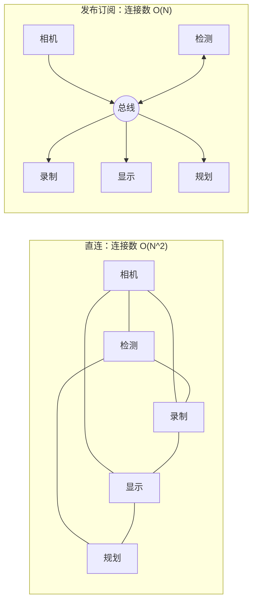
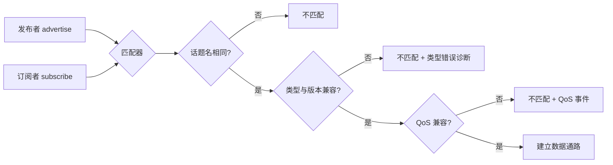
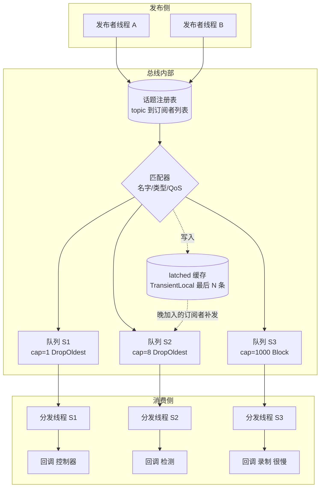
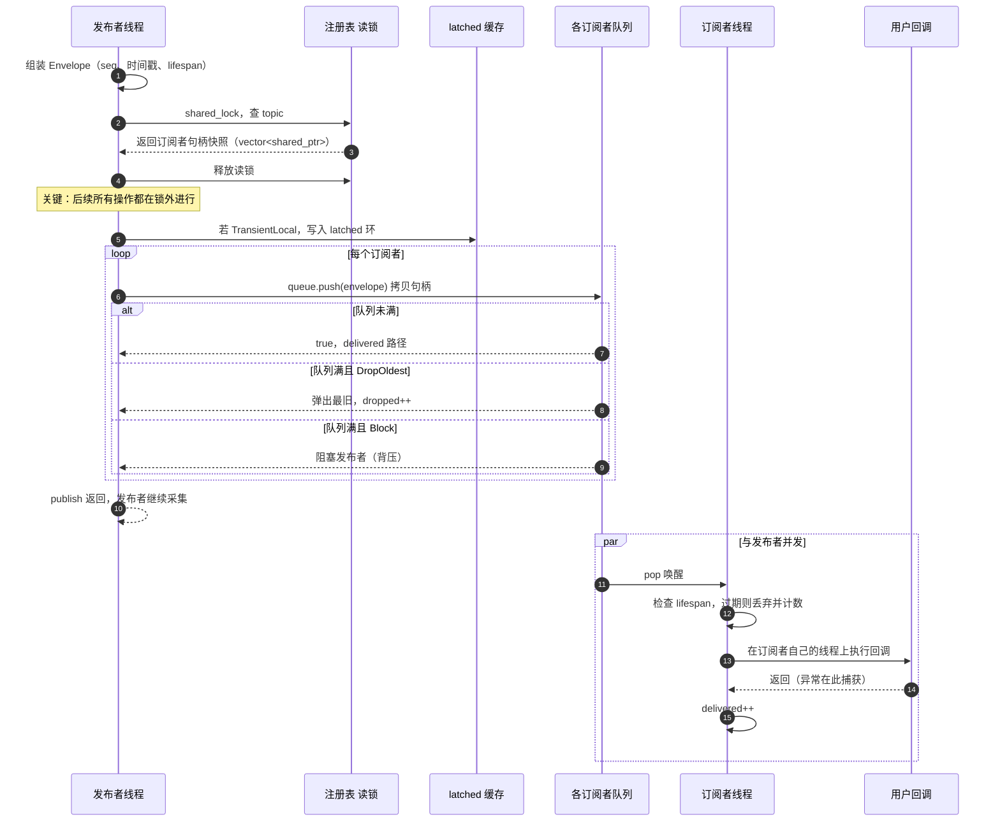
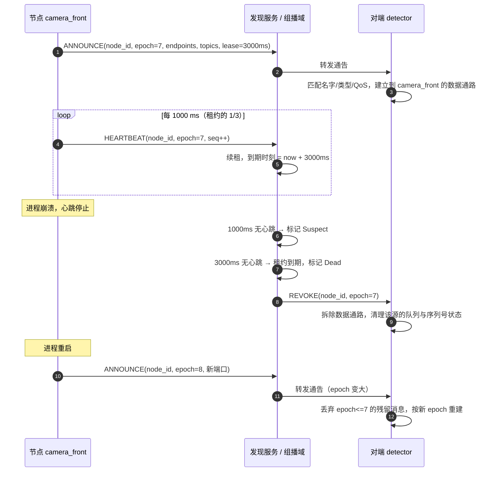
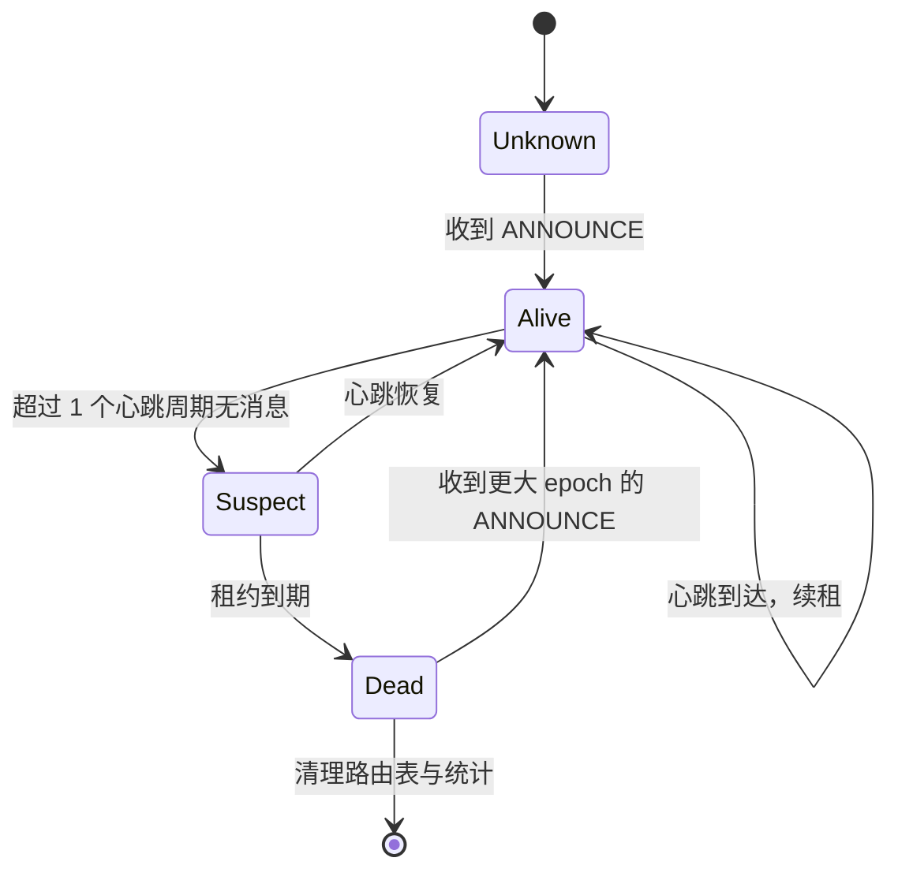
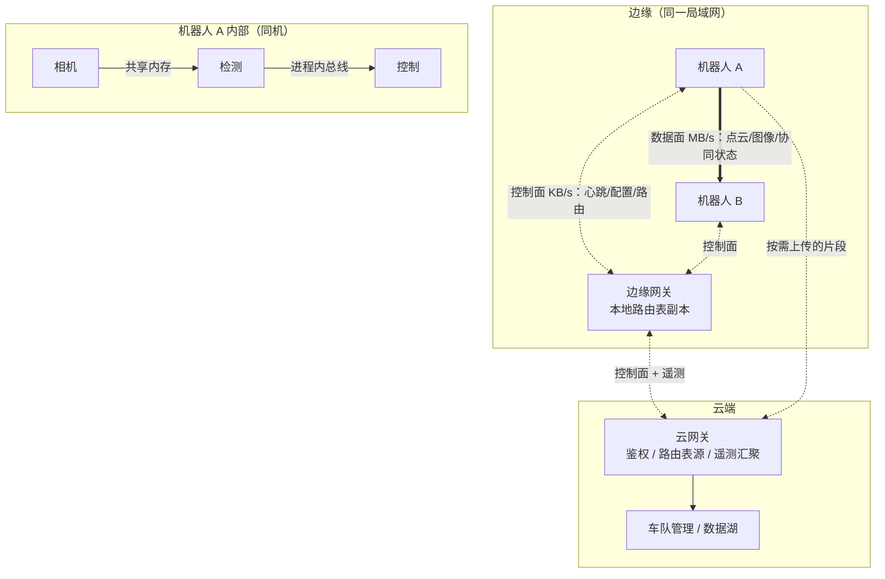
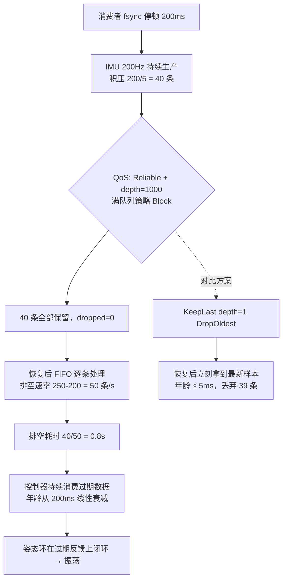

# 第 4 章：发布订阅、QoS、发现与路由

## 4.1 本章目标与前置知识

### 学完本章你能

- 用数学推导说明**为什么点对点直连在节点变多时会崩溃**，以及发布订阅解决了什么、代价是什么。
- 画出一个消息总线的内部结构：话题注册表、匹配器、**每订阅者独立队列**、分发线程。
- 亲手实现一个进程内消息总线，支持 QoS、慢消费者隔离、统计和优雅停止。
- 逐条解释 **QoS 六要素**（可靠性、历史、深度、时限、持久性、生命周期），并读懂**兼容矩阵**。
- 设计一张**带租约的服务发现表**，处理重复通告、身份冲突、启动风暴和网络分区。
- 判断什么时候该直连、什么时候该走网关，并给路由表加上版本和 TTL。
- 诊断"偶尔收不到消息""延迟突然飙高"这两类中间件里最常见的问题。

### 前置知识

- 第 1 章：话题、服务、动作的语义差异；数据平面与控制平面。
- 第 2 章：互斥量、条件变量、`std::jthread` 与 `stop_token`、**`BoundedQueue`**（本章会直接复用）。
- 第 3 章：消息头字段（序列号、时间戳、生命期）与 `shared_ptr` 句柄传递。

{: .note }
> 本章是全书的核心。前三章是地基和材料，从这里开始才真正在造中间件。如果第 2 章的 `BoundedQueue` 你还没亲手写过，先回去补上——本章的实现代码会直接把它当成零件用。

## 4.2 为什么需要发布订阅

### 直连的连接数会爆炸

先做一次纯数学的推导。假设系统里有 $N$ 个节点，任意两个节点之间都可能需要交换数据。那么需要维护的连接数是从 $N$ 个节点中取 2 个的组合数：

$$C(N, 2) = \binom{N}{2} = \frac{N(N-1)}{2}$$

代入具体数字看增长有多快：

| 节点数 $N$ | 连接数 $\frac{N(N-1)}{2}$ | 新增第 $N+1$ 个节点要新建的连接 |
| --- | --- | --- |
| 10 | 45 | 10 |
| 50 | 1225 | 50 |
| 100 | 4950 | 100 |

连接数是 $O(N^2)$。一台车上跑 50 个节点很常见（十几个传感器驱动、感知、定位、规划、控制、诊断、录制、上传……），1225 条连接意味着 1225 份重连逻辑、1225 个可能卡住的 `send`、1225 个需要监控的健康状态。

引入一个中心化的**总线（bus）**后，每个节点只需要一条到总线的连接：$L_{\text{bus}} = N$。从 $O(N^2)$ 降到 $O(N)$，$N=100$ 时 4950 条变成 100 条。



{: .note }
> 严格说，$N(N-1)/2$ 是**无向全连接**的上界。真实系统不会所有节点两两互通，但"图像要给检测、录制、显示、遥测四个消费者"这类扇出（fan-out）非常普遍，连接数的**增长趋势**依然是超线性的。

### 更致命的问题：发布者被迫知道所有订阅者

连接数只是表面。真正的麻烦是**耦合**。看这段直连代码：

```cpp
// 错误：发布者维护订阅者名单
class CameraNode {
    std::vector<Connection> subscribers_;   // 谁要图像，写死在这里
public:
    void init() {
        subscribers_.push_back(connect("192.168.1.10", 9001));  // 检测节点
        subscribers_.push_back(connect("192.168.1.11", 9002));  // 录制节点
    }
    void on_frame(const Image& img) {
        auto buf = serialize(img);                    // 序列化一次
        for (auto& c : subscribers_)
            c.send_blocking(buf);                     // 逐个同步发送
    }
};
```

这段代码有五处耦合，每一处都会在工程中变成事故：

| 耦合类型 | 具体表现 | 后果 |
| --- | --- | --- |
| **配置耦合** | IP 和端口写死 | 换台机器要改代码重编译 |
| **数量耦合** | 新增一个消费者要改发布者 | 加个"图像质量监控"节点要动相机驱动 |
| **启动顺序耦合** | `connect` 在对端没起来时失败 | 必须规定启动顺序，重启一个节点要重启一串 |
| **速率耦合** | `send_blocking` 被慢消费者阻塞 | 录制节点写盘慢 → 相机采集卡住 → 检测也拿不到图 |
| **故障耦合** | 一个订阅者崩溃，`send` 返回 `EPIPE` | 发布者要为每个对端写重连和退避逻辑 |

最后两条最致命：**速率耦合和故障耦合会让一个非关键节点（录制）拖垮关键节点（控制）**。这正是第 1 章那个"画龙"案例的另一种版本。

发布订阅把这五处耦合全部切断：发布者只面向一个**话题名**发送，不知道也不关心有几个订阅者、它们在哪、跑得快不快。

{: .important }
> **发布订阅的本质不是"省连接"，而是"把扇出、缓冲、失败处理从业务代码里挪走"。** 省连接只是副产品。判断一个 pub-sub 实现好不好，就看它有没有真正切断速率耦合和故障耦合——如果发布者仍然会被慢订阅者阻塞，那它只是把直连代码换了个包装。

## 4.3 核心概念与术语

| 中文 | 英文 | 含义 |
| --- | --- | --- |
| 话题 | Topic | 具名的数据流通道，如 `/imu/data`。发布者和订阅者靠名字相遇 |
| 发布者 | Publisher | 往某话题写数据的一端，持有该话题的 QoS 承诺 |
| 订阅者 | Subscriber | 从某话题读数据的一端，声明自己需要的 QoS |
| 匹配 | Matching | 中间件判断"某发布者和某订阅者能否连通"的过程 |
| 队列 | Queue | 发布与消费之间的缓冲区，吸收速率差 |
| 服务质量 | QoS | 关于可靠性、缓存深度、时效的**行为契约** |
| 发现 | Discovery | 节点互相找到对方、交换能力信息的机制 |
| 路由 | Routing | 决定消息经过哪些跳、走哪条链路到达订阅者 |
| 背压 | Backpressure | 下游处理不过来时，反向限制上游速率 |

### 匹配（Matching）不只是名字相同

初学者容易以为"话题名一样就能收到"。实际上匹配至少要过三关：



三关中最容易踩坑的是第三关：**QoS 不兼容时，很多框架会静默地不建立连接**。表现就是"程序不报错，就是收不到消息"。4.6 节会给出完整的兼容规则，4.9 节会讲怎么让它可诊断。

### 背压（Backpressure）与丢弃是一对反义词

当生产速率 $\lambda$ 持续大于消费速率 $\mu$ 时，只有两种出路：

- **背压**：让生产者慢下来（阻塞 `publish`、返回失败、降频）。保住数据完整性，代价是**把延迟传导给上游**。
- **丢弃**：留下最新的、丢掉旧的（或拒绝新的）。保住上游实时性，代价是**数据不完整**。

不存在第三条路。"用无界队列"只是把选择推迟到内存耗尽的那一刻，而且到那时你会同时失去两者（第 1 章 1.6 节）。

{: .important }
> **选背压还是选丢弃，取决于数据是"状态"还是"增量"。** 状态类数据（位姿、图像、电量）只有最新值有意义，旧值天然可丢；增量类数据（IMU 用于预积分、里程计增量、事件日志、任务指令）丢一条就无法重建结果，必须背压或批量打包。这个判断贯穿本章，4.10 节的案例就是把增量当状态处理引发的。

## 4.4 原理深入：一个消息总线的内部结构

### 整体结构



五个部件各司其职：

1. **话题注册表（topic registry）**：一张 `topic → 订阅者列表` 的哈希表。读远多于写（每条消息读一次，只有订阅/退订时写），所以用**读写锁**（`std::shared_mutex`）。
2. **匹配器（matcher）**：在 `subscribe` 时执行一次，检查名字、类型、QoS 兼容性。**匹配是订阅期的一次性开销，不能放在每条消息的路径上。**
3. **每订阅者独立队列**：本章最重要的设计。
4. **每订阅者独立分发线程**：把用户回调从发布者线程上摘出去。
5. **latched 缓存**：为 `TransientLocal` 持久性保存最后 N 条，供晚加入的订阅者补发。

### 为什么"每订阅者独立队列"是慢消费者隔离的关键

设想相反的做法——所有订阅者共用一个队列、一个分发线程。它的问题叫**队头阻塞（head-of-line blocking）**：分发线程必须先把队头这条消息交给所有订阅者，才能处理下一条。录制回调耗时 50 ms，控制器就只能等 50 ms。控制器的队列深度、丢弃策略、优先级全都失效了——它被绑在了最慢的那个订阅者身上。

独立队列后：

- 每个订阅者有自己的**容量**（控制器 1，录制 256）。
- 每个订阅者有自己的**满队列策略**（控制器丢最旧，录制阻塞）。
- 一个订阅者的队列积压，**不影响其他订阅者的入队**（入队只是 `push`，微秒级）。
- 每个订阅者有自己的 `dropped()` 和 `high_water()`，故障可以精确定位到"哪一路慢了"。

内存代价：消息本身用 `shared_ptr<const T>` 共享，队列里存的是**句柄**不是数据。$M$ 个订阅者只增加 $M$ 个指针加引用计数，不是 $M$ 份图像拷贝。这是第 3 章零拷贝句柄在本章的直接应用。

### publish 的完整流程



请注意第 4 步和第 6 步之间的那条注释：**取到订阅者快照后立刻释放注册表锁**。原因在第 2 章 2.4 节讲过——持锁期间绝不调用未知代码。这里"未知代码"包括 `queue.push`（`Block` 策略下会阻塞）和用户回调。

## 4.5 工程实现：亲手实现一个进程内消息总线

下面这份实现直接复用第 2 章的 `BoundedQueue`，用 C++20 编译（`-std=c++20 -pthread`）。

### 4.5.1 QoS 与信封定义

```cpp
#include <algorithm>
#include <atomic>
#include <chrono>
#include <cstdint>
#include <deque>
#include <functional>
#include <iostream>
#include <memory>
#include <mutex>
#include <shared_mutex>
#include <string>
#include <thread>
#include <typeindex>
#include <unordered_map>
#include <vector>
// 复用第 2 章：template <typename T> class BoundedQueue;

inline uint64_t now_ns() {
    return (uint64_t)std::chrono::duration_cast<std::chrono::nanoseconds>(
        std::chrono::steady_clock::now().time_since_epoch()).count();
}

enum class Reliability { BestEffort, Reliable };
enum class Durability  { Volatile, TransientLocal };
enum class History     { KeepLast, KeepAll };

struct QoS {
    Reliability reliability = Reliability::BestEffort;
    Durability  durability  = Durability::Volatile;
    History     history     = History::KeepLast;
    size_t      depth       = 10;                    // KeepLast 时的队列容量
    std::chrono::milliseconds deadline{0};           // 0 = 不检查两条消息的最大间隔
    std::chrono::milliseconds lifespan{0};           // 0 = 消息永不过期
};

// 信封：消息句柄 + 分发所需的全部元数据（第 3 章消息头的运行时形态）
struct Envelope {
    std::string                 topic;
    std::type_index             type{typeid(void)};
    std::shared_ptr<const void> payload;             // 所有订阅者共享同一份数据
    uint64_t seq             = 0;                    // 同一发布者内递增，用于检测丢失
    uint64_t source_time_ns  = 0;                    // 数据采集时刻
    uint64_t publish_time_ns = 0;                    // 进入总线时刻
    uint32_t lifespan_ms     = 0;                    // 出队时超过它就作废
};
```

**为什么 `payload` 用 `shared_ptr<const void>` 而不是模板？**
总线内部必须能装下任意类型的消息，否则每种类型都要一份总线实例。用类型擦除 + `std::type_index` 记录真实类型，订阅端再 `static_pointer_cast` 回去。`const` 保证多个订阅者并发读同一份数据是安全的——**只要没有人写，多线程读就没有数据竞争**（第 2 章 2.2 节）。

**为什么 `lifespan` 和 `deadline` 是两个字段？**
它们经常被混为一谈，但语义完全不同：`lifespan` 是**这条消息**的保质期（超过就该丢），`deadline` 是**这个话题**的更新周期承诺（超过就说明发布者掉线或变慢）。前者在出队时检查，后者在长时间没收到消息时触发。

### 4.5.2 QoS 到队列参数的翻译

```cpp
// 进程内总线里没有"网络重传"，所谓可靠性落实为"是否允许静默丢弃"
inline BoundedQueue<Envelope>::FullPolicy policy_of(const QoS& q) {
    return q.reliability == Reliability::Reliable
         ? BoundedQueue<Envelope>::FullPolicy::Block       // 可靠 = 对发布者背压
         : BoundedQueue<Envelope>::FullPolicy::DropOldest; // 尽力 = 保最新
}

// KeepAll 在本实现里仍然有上限：真正的无界队列在任何情况下都不可接受
inline size_t depth_of(const QoS& q) {
    return q.history == History::KeepAll
         ? std::max<size_t>(q.depth, 4096)
         : std::max<size_t>(q.depth, 1);
}
```

{: .warning }
> **`KeepAll` 是个危险的名字。** 它字面意思是"全部保留"，但没有任何实现能真的保留全部——内存是有限的。DDS 规范里 `KEEP_ALL` 受 `RESOURCE_LIMITS` 约束，ROS 2 里受底层 RMW 的资源上限约束。把它理解成"深度很大的 KeepLast"，并且**必须知道那个上限是多少、超过后会发生什么**。

### 4.5.3 总线主体

```cpp
class MessageBus {
public:
    using Callback = std::function<void(const Envelope&)>;

    struct StatsSnapshot {
        std::string topic;
        uint64_t sub_id = 0;
        uint64_t delivered = 0, dropped_queue = 0, dropped_expired = 0, deadline_missed = 0;
        size_t   queue_size = 0, high_water = 0;
    };

    // ---------- 发布者句柄：持有话题、QoS 和自己的序列号 ----------
    class Publisher {
    public:
        template <typename T>
        size_t publish(std::shared_ptr<const T> msg, uint64_t source_time_ns = 0) {
            Envelope env;
            env.topic           = topic_;
            env.type            = std::type_index(typeid(T));
            env.payload         = std::move(msg);
            env.seq             = seq_.fetch_add(1, std::memory_order_relaxed);
            env.publish_time_ns = now_ns();
            env.source_time_ns  = source_time_ns ? source_time_ns : env.publish_time_ns;
            env.lifespan_ms     = (uint32_t)qos_.lifespan.count();
            return bus_->deliver(env);          // 返回成功入队的订阅者数
        }
    private:
        friend class MessageBus;
        Publisher(MessageBus* b, std::string t, QoS q)
            : bus_(b), topic_(std::move(t)), qos_(q) {}
        MessageBus* bus_;
        std::string topic_;
        QoS         qos_;
        std::atomic<uint64_t> seq_{0};
    };

    // ---------- 订阅句柄：RAII，析构即退订 ----------
    class Subscription {
    public:
        ~Subscription() { if (bus_) bus_->unsubscribe(id_); }
        Subscription(const Subscription&) = delete;
        Subscription& operator=(const Subscription&) = delete;
    private:
        friend class MessageBus;
        Subscription(MessageBus* b, uint64_t id) : bus_(b), id_(id) {}
        MessageBus* bus_;
        uint64_t    id_;
    };

    ~MessageBus() { shutdown(); }

    std::shared_ptr<Publisher> advertise(const std::string& topic, const QoS& qos) {
        std::unique_lock<std::shared_mutex> lk(reg_mu_);
        auto& e = table_[topic];
        e.offered = qos;
        e.advertised = true;
        return std::shared_ptr<Publisher>(new Publisher(this, topic, qos));
    }

    std::unique_ptr<Subscription>
    subscribe(const std::string& topic, const QoS& qos, Callback cb) {
        auto sub = std::make_shared<Subscriber>(
            next_id_.fetch_add(1), topic, qos, std::move(cb));

        // 线程先起来：避免"注册后消息已到但线程还没跑"的窗口
        sub->worker = std::jthread(
            [this, sub](std::stop_token st) { run_subscriber(sub, st); });

        {
            std::unique_lock<std::shared_mutex> lk(reg_mu_);
            auto& e = table_[topic];
            if (e.advertised && !qos_compatible(e.offered, qos))
                report_incompatible(topic, e.offered, qos);   // 必须有输出，不能静默
            e.subs.push_back(sub);
        }

        // 晚加入的订阅者补发历史消息（TransientLocal）
        if (qos.durability == Durability::TransientLocal) {
            std::deque<Envelope> replay;
            { std::lock_guard<std::mutex> lk(latch_mu_);
              auto it = latched_.find(topic);
              if (it != latched_.end()) replay = it->second; }
            for (auto& env : replay) sub->queue.push(env);
        }
        return std::unique_ptr<Subscription>(new Subscription(this, sub->id));
    }

    std::vector<StatsSnapshot> stats() const {
        std::vector<StatsSnapshot> out;
        std::shared_lock<std::shared_mutex> lk(reg_mu_);
        for (auto& [topic, e] : table_)
            for (auto& s : e.subs)
                out.push_back({topic, s->id, s->delivered.load(), s->dropped_queue.load(),
                    s->dropped_expired.load(), s->deadline_missed.load(),
                    s->queue.size(), s->queue.high_water()});
        return out;
    }

    void shutdown() {
        std::vector<std::shared_ptr<Subscriber>> all;
        { std::unique_lock<std::shared_mutex> lk(reg_mu_);
          for (auto& [t, e] : table_) for (auto& s : e.subs) all.push_back(s);
          table_.clear(); }
        for (auto& s : all) s->queue.stop();             // 先唤醒所有阻塞点
        for (auto& s : all) { s->worker.request_stop();
                              if (s->worker.joinable()) s->worker.join(); }
    }

private:
    struct Subscriber {
        Subscriber(uint64_t i, std::string t, QoS q, Callback c)
            : id(i), topic(std::move(t)), qos(q), cb(std::move(c)),
              queue(depth_of(q), policy_of(q)) {}
        uint64_t id; std::string topic; QoS qos; Callback cb;
        BoundedQueue<Envelope> queue;                    // 每订阅者独立队列
        std::atomic<uint64_t> delivered{0}, dropped_queue{0},
                              dropped_expired{0}, deadline_missed{0};
        std::jthread worker;                             // 声明在最后，最先析构
    };

    struct TopicEntry {
        QoS offered; bool advertised = false;
        std::vector<std::shared_ptr<Subscriber>> subs;
    };

    size_t deliver(const Envelope& env) {
        std::vector<std::shared_ptr<Subscriber>> snapshot;
        bool   latch = false;
        size_t latch_depth = 0;
        {
            std::shared_lock<std::shared_mutex> lk(reg_mu_);   // 读锁：发布者可并发
            auto it = table_.find(env.topic);
            if (it == table_.end()) return 0;
            snapshot    = it->second.subs;                     // 只拷贝句柄
            latch       = (it->second.offered.durability == Durability::TransientLocal);
            latch_depth = it->second.offered.depth;
        }   // ★ 锁在这里释放，后面所有可能阻塞的操作都在锁外

        if (latch) {
            std::lock_guard<std::mutex> lk(latch_mu_);
            auto& dq = latched_[env.topic];
            dq.push_back(env);
            while (dq.size() > latch_depth) dq.pop_front();
        }

        size_t n = 0;
        for (auto& sub : snapshot) {
            if (sub->queue.push(env)) ++n;
            else sub->dropped_queue.fetch_add(1, std::memory_order_relaxed);
        }
        return n;
    }

    void run_subscriber(std::shared_ptr<Subscriber> sub, std::stop_token st) {
        uint64_t last_ns = 0;
        const uint64_t dl_ns = (uint64_t)sub->qos.deadline.count() * 1'000'000ull;
        while (!st.stop_requested()) {
            auto env = sub->queue.pop(std::chrono::milliseconds(50));
            if (!env) {                                    // 超时：也是检查 deadline 的时机
                if (dl_ns && last_ns && now_ns() - last_ns > dl_ns) {
                    sub->deadline_missed.fetch_add(1, std::memory_order_relaxed);
                    last_ns = now_ns();                    // 避免同一次掉线被重复计数
                }
                continue;
            }
            if (env->lifespan_ms &&
                now_ns() - env->publish_time_ns > (uint64_t)env->lifespan_ms * 1'000'000ull) {
                sub->dropped_expired.fetch_add(1, std::memory_order_relaxed);
                continue;                                  // 过期消息处理了反而有害
            }
            if (dl_ns && last_ns && env->publish_time_ns - last_ns > dl_ns)
                sub->deadline_missed.fetch_add(1, std::memory_order_relaxed);
            last_ns = env->publish_time_ns;
            try {
                sub->cb(*env);                             // 在订阅者自己的线程上执行
            } catch (const std::exception& e) {
                std::cerr << "[bus] callback threw on " << sub->topic
                          << ": " << e.what() << "\n";     // 不能让异常杀死分发线程
            }
            sub->delivered.fetch_add(1, std::memory_order_relaxed);
        }
    }

    void unsubscribe(uint64_t id) {
        std::shared_ptr<Subscriber> victim;
        {
            std::unique_lock<std::shared_mutex> lk(reg_mu_);
            for (auto& [topic, e] : table_) {
                auto it = std::find_if(e.subs.begin(), e.subs.end(),
                                       [&](auto& s) { return s->id == id; });
                if (it != e.subs.end()) { victim = *it; e.subs.erase(it); break; }
            }
        }
        if (!victim) return;
        victim->queue.stop();                 // 唤醒 pop，同时释放被 Block 卡住的发布者
        victim->worker.request_stop();
        if (victim->worker.joinable()) victim->worker.join();  // 返回后保证回调不再被调用
    }

    static bool qos_compatible(const QoS& offered, const QoS& requested) {
        // 总规则：订阅者"要求"的强度不能超过发布者"提供"的强度
        if (requested.reliability == Reliability::Reliable &&
            offered.reliability   == Reliability::BestEffort) return false;
        if (requested.durability == Durability::TransientLocal &&
            offered.durability   == Durability::Volatile)      return false;
        if (requested.deadline.count() > 0 &&
            (offered.deadline.count() == 0 || offered.deadline > requested.deadline))
            return false;
        return true;
    }

    static void report_incompatible(const std::string& topic, const QoS& o, const QoS& r) {
        std::cerr << "[bus][QOS-INCOMPATIBLE] topic=" << topic
                  << " reliability " << (int)o.reliability << "->" << (int)r.reliability
                  << " durability "  << (int)o.durability  << "->" << (int)r.durability
                  << " deadline " << o.deadline.count() << "ms->"
                  << r.deadline.count() << "ms\n";
    }

    mutable std::shared_mutex reg_mu_;
    std::unordered_map<std::string, TopicEntry> table_;
    std::mutex latch_mu_;
    std::unordered_map<std::string, std::deque<Envelope>> latched_;
    std::atomic<uint64_t> next_id_{1};
};
```

### 4.5.4 逐段讲解

**为什么发布者绝对不能同步调用订阅者回调？**

这是全章最重要的设计决策，有五条独立理由，任何一条都足以否决同步调用：

1. **速率耦合回归**。同步调用等于把 4.2 节切断的耦合又接了回去。一个 50 ms 的写盘回调会让 200 Hz 的发布者变成 20 Hz。
2. **重入死锁**。回调里如果又调用 `publish`（非常常见：收到图像后发布检测结果），就会重新进入总线。若总线在持锁状态下调用回调，这就是**同一线程重复加锁**——`std::shared_mutex` 不可重入，直接死锁。
3. **QoS 失效**。同步调用下，每订阅者的队列深度、丢弃策略、优先级都无从谈起，因为根本没有队列。
4. **异常传播**。订阅者回调抛异常会沿调用栈冲进发布者。相机驱动没有理由因为检测算法的一个 `bad_alloc` 而崩溃。
5. **实时性隔离**。控制回调可能需要跑在实时优先级、绑定专用核上（第 2 章 2.7 节）。同步调用会让它继承发布者线程的属性。

**为什么用读写锁，锁在哪里释放？**
`deliver` 是热路径（每条消息走一次），`subscribe`/`unsubscribe` 是冷路径（通常只在启动退出时发生），读写锁让多个发布者线程并发查表。注意标记 `★` 的那一行：快照拷贝完立刻出作用域释放锁，之后的 `push` 即使阻塞也不会卡住别的发布者。

**`queue.push(env)` 拷贝了什么？**
只拷一个 `Envelope`：一个 `std::string`（topic 名）、一个 `shared_ptr`（原子引用计数加一）、几个整数。**消息体一份都没拷**。若 topic 字符串拷贝在微秒级路径上成为热点，可换成预分配的整数 ID，这属于第 6 章的优化范畴。

**为什么 `worker` 声明在 `Subscriber` 的最后？**
第 2 章 2.7 节的规则：析构按声明逆序进行。`worker` 最后声明 → 最先析构 → `jthread` 析构自动 `request_stop()` 并 `join()` → 线程停止后才轮到 `queue` 和 `cb` 析构。反过来会让线程访问已销毁的队列。

**`unsubscribe` 里为什么先 `queue.stop()`，又为什么必须 `join()`？**
`request_stop()` 只是设置标志，线程若阻塞在 `pop` 里要等最多 50 ms 才看到；更糟的是若有发布者正卡在 `Block` 策略的 `push` 上，不调用 `stop()` 就永远醒不过来——`queue.stop()` 会同时唤醒 `not_empty_` 和 `not_full_`。而 `join()` 是"回调不会再被调用"的唯一保证：没有它，析构返回后回调可能仍在执行，若回调捕获了 `[this]` 就是**释放后使用（use-after-free）**。

{: .warning }
> **诚实地说明边界**：独立队列隔离了 `DropOldest` 订阅者，但一个 `Reliable`（即 `Block`）订阅者卡住时，会阻塞**发布者线程**，进而拖慢该发布者的所有其他订阅者。要真正隔离，需要三选一：(a) 不给可能卡住的消费者配 `Reliable`；(b) 给 `push` 加超时，超时后计入 `dropped` 并告警；(c) 在发布者和总线之间再加一级线程，让采集线程永不阻塞。生产系统通常同时用 (b) 和 (c)。

### 4.5.5 使用示例

```cpp
struct ImuSample { double ax, ay, az, gx, gy, gz; };

int main() {
    MessageBus bus;
    QoS imu_qos;                                     // 发布者提供的承诺
    imu_qos.reliability = Reliability::BestEffort;
    imu_qos.history = History::KeepLast;  imu_qos.depth = 1;
    imu_qos.deadline = std::chrono::milliseconds(10);
    imu_qos.lifespan = std::chrono::milliseconds(20);
    auto pub = bus.advertise("/imu/data", imu_qos);

    QoS fast = imu_qos; fast.depth = 1;              // 快消费者：只要最新值
    auto s1 = bus.subscribe("/imu/data", fast, [](const Envelope& e) {
        auto imu = std::static_pointer_cast<const ImuSample>(e.payload);
        (void)imu;                                   // 控制器：微秒级处理
    });

    QoS slow = imu_qos; slow.depth = 8;              // 慢消费者：用来验证隔离
    auto s2 = bus.subscribe("/imu/data", slow, [](const Envelope&) {
        std::this_thread::sleep_for(std::chrono::milliseconds(50));
    });

    for (int i = 0; i < 2000; ++i) {                 // 200 Hz 跑 10 秒
        pub->publish(std::make_shared<const ImuSample>(ImuSample{0,0,9.8,0,0,0}));
        std::this_thread::sleep_for(std::chrono::milliseconds(5));
    }
    for (auto& s : bus.stats())
        std::cout << s.topic << " sub=" << s.sub_id << " delivered=" << s.delivered
                  << " dropped_queue=" << s.dropped_queue
                  << " dropped_expired=" << s.dropped_expired
                  << " deadline_missed=" << s.deadline_missed
                  << " high_water=" << s.high_water << "\n";
}
```

预期输出：`sub=1`（快消费者）的 `delivered` 接近 2000、`high_water` 为 1；`sub=2`（慢消费者）的 `delivered` 约 200、`dropped_queue` 约 1800、`high_water` 达到 8。**关键是 sub=1 的数字不受 sub=2 影响**——这就是隔离生效的证据。

## 4.6 QoS 深入

### 六个要素逐个说清

| 要素 | 英文 | 回答的问题 | 典型取值 |
| --- | --- | --- | --- |
| 可靠性 | Reliability | 丢了要不要补？ | `BestEffort` / `Reliable` |
| 历史 | History | 缓存策略是保最新还是保全部？ | `KeepLast` / `KeepAll` |
| 深度 | Depth | 缓存几条？ | 1、8、256、1000 |
| 时限 | Deadline | 两条消息最多间隔多久？ | 10 ms、100 ms |
| 持久性 | Durability | 晚加入的订阅者能拿到旧消息吗？ | `Volatile` / `TransientLocal` |
| 生命周期 | Lifespan | 一条消息多久后作废？ | 20 ms、300 ms |

**可靠性（Reliability）**。`BestEffort` 发出去就不管；`Reliable` 意味着中间件会用确认和重传保证送达。在网络上它对应 ACK/NACK 机制，在进程内它退化为"不静默丢弃、必要时背压"。

**历史与深度（History / Depth）**。这两个总是成对出现。`KeepLast(depth=N)` 是环形缓冲：只保留最近 N 条；`KeepAll` 试图保留全部，实际受资源上限约束。**深度不是拍脑袋定的**，它应该等于"允许消费者停顿多久"除以"生产周期"：

$$\text{depth} \approx \frac{T_{\text{允许停顿}}}{T_{\text{生产周期}}}$$

对 200 Hz 的 IMU（周期 5 ms），若只允许 10 ms 抖动，depth 应为 2 而不是 1000。

**时限（Deadline）**。发布者承诺"我至少每 T 毫秒发一条"，订阅者要求"我需要至少每 T′ 毫秒收到一条"。超时未收到会触发 `deadline_missed` 事件。它是**检测发布者掉线或变慢的最直接手段**，比心跳更贴近数据本身。

**持久性（Durability）**。`Volatile` 只发给当前已连接的订阅者；`TransientLocal` 由发布者缓存最后 depth 条，新订阅者一连上就补发。地图、静态标定参数、机器人配置必须用它——否则晚启动的节点会永远等不到那条只发了一次的消息。

**生命周期（Lifespan）**。消息的保质期。超期的消息在出队时直接丢弃，不交给回调。对控制指令尤其重要：一条 300 ms 前的转向指令现在执行，比不执行更危险。

### 不同数据用什么 QoS

| 数据 | 频率 | 语义 | Reliability | History/Depth | Deadline | Durability | Lifespan |
| --- | --- | --- | --- | --- | --- | --- | --- |
| IMU 原始样本 | 200 Hz | 增量（预积分用） | BestEffort | KeepLast / 4 | 10 ms | Volatile | 20 ms |
| 位姿 / 状态估计 | 100 Hz | 状态 | BestEffort | KeepLast / 1 | 20 ms | Volatile | 50 ms |
| 图像 | 30 Hz | 状态 | BestEffort | KeepLast / 2 | 100 ms | Volatile | 100 ms |
| 周期控制指令 | 100 Hz | 状态 | BestEffort | KeepLast / 1 | 20 ms | Volatile | 30 ms |
| 一次性指令（启动建图） | 事件 | 增量 | Reliable | KeepLast / 10 | 无 | Volatile | 无 |
| 检测结果 | 30 Hz | 状态 | Reliable | KeepLast / 8 | 100 ms | Volatile | 300 ms |
| 诊断日志 | 1–10 Hz | 增量 | Reliable | KeepAll / 1000 | 无 | Volatile | 无 |
| 地图 / 标定参数 | 事件 | 状态 | Reliable | KeepLast / 1 | 无 | **TransientLocal** | 无 |

{: .important }
> **注意"周期控制指令"用 BestEffort 而不是 Reliable**，这和很多人的直觉相反。理由：周期性指令是**状态**，下一个周期（10 ms 后）就会有新值覆盖。用 Reliable 意味着丢失时要重传一条已经过期的指令，重传本身还会挤占带宽、打乱顺序。正确做法是 BestEffort + 序号检测 + 消费者侧的"超时降级"逻辑。而**一次性**指令（"开始建图"这种，丢了就没有下一次）才需要 Reliable，甚至应该用服务调用（第 1 章）拿到确认。

### QoS 兼容矩阵

匹配的总规则一句话：**订阅者"要求"（requested）的强度不能超过发布者"提供"（offered）的强度**。这在 DDS 里叫 RxO（Requested x Offered）规则。

可靠性：

| 发布者提供 ↓ / 订阅者要求 → | BestEffort | Reliable |
| --- | --- | --- |
| **BestEffort** | ✅ 兼容 | ❌ 不兼容，不建立连接 |
| **Reliable** | ✅ 兼容（按尽力交付） | ✅ 兼容 |

持久性：

| 发布者提供 ↓ / 订阅者要求 → | Volatile | TransientLocal |
| --- | --- | --- |
| **Volatile** | ✅ 兼容 | ❌ 不兼容 |
| **TransientLocal** | ✅ 兼容（不补发） | ✅ 兼容（补发历史） |

时限：兼容条件是 $T_{\text{offered}} \le T_{\text{requested}}$。发布者承诺"每 10 ms 一条"，订阅者要求"至少每 20 ms 一条"→ 兼容；反过来（承诺 100 ms，要求 20 ms）→ 不兼容。

{: .warning }
> **不兼容的默认表现是"什么都不发生"**：不报错、不抛异常、不建立连接，订阅者的回调永远不被调用。这是 ROS 2/DDS 新手最常见的一整天调试。务必像 4.5.3 的 `report_incompatible` 那样，在匹配失败时**打印双方的完整 QoS**，并暴露 `requested_incompatible_qos` 事件计数。

### Reliable 不等于永不丢失

这是本节最需要记住的一句话。`Reliable` 的保证边界是"**在连接存续期间、资源未耗尽、消息未过期的前提下，尽力重传直到送达**"。以下五种情况它一条都保不住：

| 失效场景 | 原因 |
| --- | --- |
| `lifespan` 到期 | 消息在重传成功前就作废了，中间件主动丢弃 |
| 队列/资源上限触顶 | `KeepAll` 也有 `RESOURCE_LIMITS`，满了照样丢或阻塞 |
| 订阅者进程崩溃 | 已送达但未处理的数据随进程一起消失 |
| 发布者进程崩溃 | 发送缓冲区里等待重传的数据消失 |
| `Volatile` + 订阅者晚启动 | 消息发出时没人在，谁也不会补发 |

真正的端到端不丢，需要**应用层确认 + 持久化**（写盘再确认），那已经是第 8 章消息落盘的范畴了。中间件的 Reliable 只覆盖"链路层"。

## 4.7 服务发现

### 为什么固定 IP 和端口不够

新手方案是把地址写进配置文件。它在下面五种情况下全部失效：

| 场景 | 固定 IP 为什么失效 |
| --- | --- |
| **动态启动** | 端口由系统分配（`bind` 到 0），启动前不知道号码 |
| **容器迁移 / 弹性扩缩** | 云边端场景下 Pod 重建，IP 直接变了 |
| **进程重启** | IP 端口没变，但**这是一个新实例**，序列号从 0 重开，旧连接的状态全部失效 |
| **能力变化** | 节点升级后多发了一个话题、消息版本从 v1 变 v2，配置文件不知道 |
| **多副本 / 主备** | 同一能力有两个提供者，需要运行时选一个，还要在故障时切换 |

第三条最隐蔽：**IP 不变不代表实例不变**。这就是第 1 章提到的**代际（epoch）**存在的理由——每次启动生成一个单调递增（或随机唯一）的编号，接收方靠它区分"重启前"和"重启后"。

### 发现信息应该包含什么

```cpp
struct NodeAnnouncement {
    std::string node_id;          // 稳定身份，如 "camera_front"
    uint64_t    epoch;            // 本次启动的代际，重启后必须变大
    std::string host;  uint32_t pid;
    std::string control_endpoint; // 如 "unix:///run/bus.sock"，控制面
    std::string data_endpoint;    // 如 "tcp://10.0.0.7:41235" 或 "shm://cam_ring"
    struct TopicDecl {
        std::string topic;
        std::string type_name;    // "sensor_msgs/Image"
        uint32_t    type_hash;    // schema 哈希，第 3 章
        uint16_t    type_version;
        QoS         qos;          // offered 或 requested
    };
    std::vector<TopicDecl> publishes, subscribes;
    uint8_t     health;           // 0=init 1=ready 2=degraded 3=stopping
    uint32_t    lease_ms;         // 租约时长：多久不续期就判定失效
    uint64_t    announce_seq;     // 通告序列号，用于去重和乱序丢弃
};
```

每个字段都有明确用途：没有 `epoch` 无法识别重启；没有 `type_hash` 和 `type_version` 无法在匹配时做兼容检查（第 3 章）；没有 `qos` 无法执行 4.6 的兼容矩阵；没有 `lease_ms` 就是下一节要讲的僵尸节点；没有 `announce_seq` 无法处理重复和乱序通告。

### 注册、续租与撤销



对应的状态机：



**为什么要有 `Suspect` 这个中间状态？** 直接从 `Alive` 跳到 `Dead` 会让一次 200 ms 的网络抖动造成整条链路拆除重建，代价远大于抖动本身。`Suspect` 状态下保留连接、停止发新数据、开始主动探测，给网络一个恢复的机会。

### 租约参数怎么定

设心跳周期 $T_h$，租约时长 $T_l = k \cdot T_h$（通常 $k = 3$）。最坏故障检测时间：

$$T_{\text{detect}}^{\max} = T_l + T_h = (k+1) \cdot T_h$$

$T_h = 1$ s、$k = 3$ 时，最坏 4 秒发现节点死亡。想更快就要减小 $T_h$，但代价是：

- **误判增多**：网络抖动或 GC 停顿超过 $T_l$ 就被误判死亡，触发不必要的拆除重建。
- **流量增大**。$N$ 个节点若两两互发心跳，每条 200 字节：

$$B_{\text{mesh}} = N(N-1) \times 200 \times \frac{1}{T_h}$$

$N=100$、$T_h=1$ s 时是 $100 \times 99 \times 200 = 1.98$ MB/s。改为向集中式发现服务单点上报：

$$B_{\text{central}} = N \times 200 \times \frac{1}{T_h} = 20\ \text{KB/s}$$

差 99 倍。**这就是大规模系统普遍引入发现服务器（如 Fast DDS Discovery Server、Zenoh router）而非纯组播互发的原因。**

### 四个必须处理的发现问题

**重复通告**。组播下同一条通告可能被收到多次（多网卡、重传、路由回环）。用 `(node_id, epoch, announce_seq)` 三元组去重，且只接受 `announce_seq` 大于已记录值的通告——小于的直接丢弃，这样也顺带处理了乱序。

**身份冲突**。两个进程用了同一个 `node_id`（配置复制粘贴、容器模板没改）。规则：`epoch` 大者胜出，同时**必须打警告日志并暴露 `identity_conflict` 指标**。静默处理会让"消息时有时无"变成永久悬案。

**启动风暴（thundering herd）**。系统上电时 100 个节点同时广播通告，瞬时流量尖峰，还可能因为丢包触发重传，形成正反馈。三条缓解措施：(1) 通告发送加**随机抖动（jitter）**，比如 `sleep(rand(0, 500ms))`；(2) 重试用**指数退避**；(3) 稳定后改发**增量通告**（只发变化），而不是每次全量。

**网络分区**。链路断开后，分区两侧各自看到对方租约到期，都认为对方死了。发布订阅场景下这通常可接受（数据本来也过不去），但如果发现表还承担"选主"职责（第 9 章），双方都可能自认为主，造成**脑裂**。缓解手段是租约 + `epoch` + 多数派仲裁——完整讨论留到第 9 章。

{: .note }
> 发现属于**控制平面**（第 1 章）。它的流量必须与图像点云这类数据平面隔离，否则最需要它工作的时候——链路拥塞、节点异常——恰恰是它最可能失效的时候。

## 4.8 消息路由与网关

### 直连 vs 代理转发

| 维度 | 直连（peer-to-peer） | 代理转发（broker / router） |
| --- | --- | --- |
| 端到端延迟 | 1 跳，最低 | 2 跳，多一次收发和排队 |
| 扇出成本 | 发布者发 $M$ 份，占本机上行带宽 | 发布者发 1 份，代理复制 |
| 跨网段 / NAT | 需要打洞或路由可达 | 代理天然是汇聚点 |
| 故障域 | 分散，一个连接坏不影响别人 | 集中，代理挂了全断（需要主备） |
| 可观测性 | 分散，需要每端埋点 | 集中，天然的抓包和统计点 |
| 访问控制 | 每端各自实现 | 代理集中鉴权和限流 |
| 扩展性上限 | 连接数 $O(N^2)$ | 连接数 $O(N)$，但代理成瓶颈 |

扇出带宽的量化对比。一路 1080p 图像压缩后 20 Mbps，有 5 个跨机订阅者：

- 直连：发布者上行 $20 \times 5 = 100$ Mbps。
- 经代理：发布者上行 20 Mbps，代理下行 100 Mbps。

如果发布者在一台上行只有 100 Mbps 的边缘设备上，直连方案直接打满；代理方案把压力转移到网络条件更好的机器。**扇出大、上行受限时选代理；扇出小、延迟敏感时选直连。**

### 云边端：控制面走网关，数据面边缘直连



分层原则：

- **端内（同机）**：进程内用消息总线，跨进程用共享内存 + `eventfd`（第 2 章 2.8 节）。绝不绕网关。
- **边内（同局域网）**：机器人之间的高频数据（协同状态、共享地图）走**直连**。走网关会白白多一跳，还让网关成为带宽瓶颈。
- **边到云**：只走**控制面**（心跳、配置、路由表、告警）和**降采样遥测**。原始数据按需上传（第 8 章）。

{: .important }
> **"控制面走网关、数据面边缘直连"的深层理由是故障域隔离。** 云链路断开时，机器人之间必须还能继续协同——如果协同数据也经过云网关，一次公网抖动就会让整个车队瘫痪。反过来，控制面走网关是为了集中鉴权、审计和策略下发，这些操作量小但必须可控。

### 路由表必须有版本和 TTL

```cpp
struct RouteEntry {
    std::string topic;
    std::string next_hop;        // "direct://10.0.0.7:41235" 或 "gateway://edge-gw-1"
    uint32_t    cost;            // 用于多路径选择：跳数或估计延迟
    uint64_t    version;         // 单调递增，用于拒绝旧版本
    uint64_t    expire_at_ns;    // TTL：到期未刷新则失效
    uint16_t    type_version;    // 与第 3 章的 schema 版本对应
};

// 更新规则：只接受版本更高的条目
bool RoutingTable::update(const RouteEntry& e) {
    auto& cur = table_[e.topic];
    if (e.version <= cur.version) return false;   // 旧通告乱序到达，丢弃
    cur = e;
    return true;
}
```

**为什么必须有 `version`？** 路由更新在网络上可能乱序到达。没有版本号，一条延迟的旧通告会覆盖新配置，表现为"改了配置偶尔不生效"，且极难复现。

**为什么必须有 TTL（`expire_at_ns`）？** 与租约同理：发布路由的一方崩溃后，没有 TTL 的条目会永远留在表里，消息持续发往一个不存在的地址，表现为"静默丢失"。TTL 让路由表**自动收敛**——不刷新就消失。

## 4.9 常见错误与陷阱

### 陷阱一：发布者持锁调用订阅者回调

```cpp
// 错误：整个分发过程都在锁里
void Bus::publish(const std::string& topic, Envelope e) {
    std::lock_guard<std::mutex> lk(mu_);          // ← 一直持有到函数结束
    for (auto& cb : table_[topic]) cb(e);         // 用户回调在锁内执行
}

// 订阅者回调里再发布另一个话题 —— 非常普遍的写法
bus.subscribe("/image", qos, [&](const Envelope& e) {
    bus.publish("/objects", detect(e));           // 重新进入 publish → 同一线程重复加锁
});
```

`std::mutex` 不可重入，第二次 `lock` 直接死锁；换成 `std::shared_mutex` 的读锁同样是未定义行为。即使不重入，也会因为回调耗时而串行化所有发布者。

```cpp
// 正确：锁内只取快照，锁外入队；回调由订阅者自己的线程执行
size_t Bus::deliver(const Envelope& env) {
    std::vector<std::shared_ptr<Subscriber>> snapshot;
    { std::shared_lock<std::shared_mutex> lk(reg_mu_);
      auto it = table_.find(env.topic);
      if (it == table_.end()) return 0;
      snapshot = it->second.subs; }                // 锁在这里就释放
    size_t n = 0;
    for (auto& s : snapshot) if (s->queue.push(env)) ++n;   // 锁外，不执行回调
    return n;
}
```

### 陷阱二：所有订阅者共用一个队列

```cpp
// 错误：一个队列 + 一个分发线程服务所有订阅者
BoundedQueue<Envelope> shared_q_{256, FullPolicy::DropOldest};
void dispatch_loop() {
    while (auto e = shared_q_.pop(50ms))
        for (auto& s : subs_of(e->topic)) s->cb(*e);   // 最慢的那个决定所有人的节奏
}
```

队头阻塞：录制订阅者写盘 50 ms，控制订阅者就得等 50 ms；而且丢弃发生在共享队列上，**丢的是所有订阅者的消息**，你甚至无法回答"到底是哪一路慢了"。

```cpp
// 正确：每订阅者独立队列 + 独立线程 + 独立统计
struct Subscriber {
    BoundedQueue<Envelope> queue;      // 容量和策略各自独立
    std::jthread           worker;
    std::atomic<uint64_t>  delivered{0}, dropped_queue{0};
};
```

### 陷阱三：为了"不丢消息"改用无界队列

```cpp
// 错误：以为无界就不会丢
std::deque<Envelope> q_;
void push(Envelope e) { std::lock_guard lk(mu_); q_.push_back(std::move(e)); }
```

第 1 章已经讲过结论，这里补充**为什么在 pub-sub 里尤其糟糕**：队列积压时，订阅者处理的全是过期数据，而它每处理一条就更落后一点——延迟单调增长，永不恢复。同时内存持续增长直到 OOM，此时**所有**数据一起丢失。

```cpp
// 正确：有界 + 明确策略 + 丢弃计数 + 水位监控
BoundedQueue<Envelope> q_{depth_of(qos), policy_of(qos)};
if (!q_.push(env)) dropped_queue_.fetch_add(1, std::memory_order_relaxed);
// 上线前必须回答：depth 依据是什么？丢弃率的告警阈值是多少？
```

### 陷阱四：QoS 不匹配却没有任何诊断输出

```cpp
// 错误：不兼容就静默返回，订阅者永远收不到消息且不知道为什么
void subscribe(const std::string& t, const QoS& req, Callback cb) {
    if (!qos_compatible(offered_[t], req)) return;    // 什么都不说
    table_[t].push_back(...);
}
```

这是排查成本最高的一类问题：程序不崩、不报错、日志干净，就是回调不触发。工程师会先怀疑话题名拼错、再怀疑网络、再怀疑序列化，最后才想到 QoS。

```cpp
// 正确：打印双方完整 QoS + 暴露事件计数，让问题一眼可见
if (!qos_compatible(offered, req)) {
    std::cerr << "[bus][QOS-INCOMPATIBLE] topic=" << t
              << " reliability offered=" << (int)offered.reliability
              << " requested=" << (int)req.reliability
              << " durability offered=" << (int)offered.durability
              << " requested=" << (int)req.durability << "\n";
    metrics_.requested_incompatible_qos.fetch_add(1);
    // 仍然建立订阅关系但标记为 unmatched，便于运行时用 `bus_info` 工具查询
}
```

### 陷阱五：发现表没有租约，僵尸节点永久存在

```cpp
// 错误：注册就永久保留
std::unordered_map<std::string, NodeAnnouncement> nodes_;
void on_announce(const NodeAnnouncement& a) { nodes_[a.node_id] = a; }   // 只增不减
```

节点崩溃后条目还在，发布者继续往一个死掉的端点发消息（TCP 会卡在重传超时，UDP 直接进黑洞），路由表越来越大，`bus_info` 显示的拓扑与现实完全不符。更糟的是：如果这个僵尸条目参与了"谁是主节点"的判断，故障切换根本不会触发。

```cpp
// 正确：租约 + 定期清理 + epoch 处理重启
struct NodeRecord { NodeAnnouncement info; uint64_t expire_at_ns; };
std::unordered_map<std::string, NodeRecord> nodes_;

void on_announce(const NodeAnnouncement& a) {
    auto it = nodes_.find(a.node_id);
    if (it != nodes_.end() && a.epoch < it->second.info.epoch) return;   // 旧代际，丢弃
    if (it != nodes_.end() && a.epoch > it->second.info.epoch)
        purge_state_of(a.node_id);                    // 重启：清掉旧序列号和连接
    nodes_[a.node_id] = {a, now_ns() + (uint64_t)a.lease_ms * 1'000'000ull};
}

void reap_expired() {                                  // 由定时器周期调用
    uint64_t t = now_ns();
    for (auto it = nodes_.begin(); it != nodes_.end(); ) {
        if (it->second.expire_at_ns < t) { revoke_routes(it->first); it = nodes_.erase(it); }
        else ++it;
    }
}
```

### 陷阱六：订阅句柄销毁后回调仍在执行

```cpp
// 错误：Detector 析构了，分发线程还在调用捕获了 this 的回调
class Detector {
    MessageBus& bus_;
public:
    Detector(MessageBus& b) : bus_(b) {
        bus_.subscribe("/image", qos, [this](const Envelope& e) { this->run(e); });
    }   // 返回值被丢弃！订阅永远不会被取消
    ~Detector() { /* 什么都没做 */ }                   // this 已销毁，回调仍在跑 → UAF
};

// 正确：持有订阅句柄，析构时 unsubscribe 并 join 分发线程
class Detector {
    MessageBus& bus_;
    std::unique_ptr<MessageBus::Subscription> sub_;    // 声明在被捕获成员之后
public:
    Detector(MessageBus& b) : bus_(b) {
        sub_ = bus_.subscribe("/image", qos, [this](const Envelope& e) { this->run(e); });
    }
    // sub_ 析构 → unsubscribe → queue.stop() + join()，返回后回调保证不再被调用
};
```

{: .warning }
> **这是中间件里最难查的一类崩溃**：现象是退出时偶发段错误，堆栈指向已释放内存，ASan 报 heap-use-after-free 但复现率不到 10%。根本原因永远是"退订没有 join 分发线程"或"根本没退订"。让 `subscribe` 返回 `[[nodiscard]]` 的 RAII 句柄，可以在编译期就挡住第一种写法。

## 4.10 真实案例：IMU 被可靠队列拖出的延迟

### 现象

某轮式机器人在平地直行时姿态控制正常，但每隔十几秒会出现一次持续约 1 秒的"抖动"：轮速指令高频振荡，车身左右微摆。控制器 CPU 占用只有 20%，日志无异常，重启后依旧。

### 排查

1. 在控制器入口打点，记录"收到位姿的时刻"与"位姿里的 `source_time_ns`"之差，即**数据年龄**。发现正常时 5 ms，抖动期间冲到 **200 ms 以上**，并在约 800 ms 内线性回落。
2. 数据年龄线性回落是个强信号：**这不是网络抖动，是队列在排空**。网络抖动的年龄曲线是尖峰，排空是斜坡。
3. 打印总线统计：IMU 订阅者的 `high_water` 达到 **40**，`dropped_queue` 为 **0**。
4. 查 QoS 配置：`/imu/data` 的订阅者配了 `Reliable` + `KeepAll`，实现里 depth 被放大到 1000，满队列策略是 `Block`。
5. `perf` 抓抖动时刻，看到状态估计线程有一次约 200 ms 的停顿，来自一次同步的日志 `fsync`。

### 根因与数字

IMU 频率 200 Hz，周期 $T = 5$ ms。消费者停顿 $T_{\text{stall}} = 200$ ms，期间积压：

$$B = \frac{T_{\text{stall}}}{T} = \frac{200\ \text{ms}}{5\ \text{ms}} = 40\ \text{条}$$

因为 depth=1000 且策略是 `Block`，40 条**全部被保留**，一条没丢。恢复后消费者按 FIFO 逐条处理：生产速率 $\lambda = 200$ /s，消费速率 $\mu = 250$ /s（每条约 4 ms），净排空速率：

$$\mu - \lambda = 250 - 200 = 50\ \text{条/s}$$

排空 40 条需要：

$$T_{\text{drain}} = \frac{B}{\mu - \lambda} = \frac{40}{50} = 0.8\ \text{s}$$

在这 800 ms 里，控制器拿到的每一条数据都是**过期的**——刚恢复时队头数据年龄 200 ms，之后线性衰减到 0。控制延迟从 5 ms 飙到 200 ms+，姿态环在过期反馈上做闭环，必然振荡。



{: .important }
> **关键洞察：`dropped_queue = 0` 在这里不是好消息，而是故障本身。** 团队最初把"零丢弃"当成 QoS 配置正确的证据，恰恰因此没有怀疑到队列上。**队列的价值是吸收抖动，不是补偿产能不足**——当消费者长期或长时间跟不上时，深队列只会把"丢数据"换成"用过期数据"，而后者对闭环控制更危险。

### 方案与取舍

问题的深层原因是把**状态**和**增量**混为一谈：控制器只需要**最新姿态**（状态语义），但 IMU 预积分需要**连续样本**（增量语义）。同一个话题被两种语义的消费者共享，配了一套 QoS。

| 措施 | 内容 | 代价 |
| --- | --- | --- |
| 1. 拆分话题 | `/imu/data`（原始，给预积分）与 `/state/pose`（融合后状态，给控制器）分离 | 多一个话题和一次发布 |
| 2. 控制器侧改 QoS | `/state/pose` 用 BestEffort + KeepLast/1 + DropOldest + lifespan=50 ms | 丢弃中间样本，但控制器本来只要最新值 |
| 3. 预积分侧改批量 | IMU 发布端把 10 个样本打成一帧，20 Hz 发布；订阅深度 8 | 引入最多 50 ms 的成批延迟，但预积分本来就是批处理 |
| 4. 消费者侧加超时降级 | 位姿超过 50 ms 未更新则降速并告警 | 保守，可能误触发 |
| 5. 修根因 | 状态估计线程的 `fsync` 改为异步写盘线程 | 极端情况下崩溃可能丢最后几条日志 |

措施 3 值得多说一句：**增量数据不能靠丢弃解决积压，但可以靠批量**。40 条单独入队要 40 次 `pop` + 40 次回调调度；打包成 4 帧后只有 4 次，排空速度提升近一个数量级，同时一条样本都不丢。这是"既要不丢又要快"的正确解法。

### 验证

- 注入 200 ms 消费者停顿，控制周期 p99 从 **212 ms 降到 6 ms**，抖动消失。
- 位姿订阅者 `high_water` 稳定在 1，`dropped_queue` 约 40/次停顿（符合预期，且**丢弃可见**）。
- IMU 预积分路径的**序列号缺口计数为 0**，确认批量方案没有丢样本。
- 连续跑 4 小时，`deadline_missed` 计数为 3（对应 3 次真实的调度抖动），全部有告警日志可追溯。

## 4.11 动手实验与验收

### 实验一：实现进程内消息总线（120 分钟）

1. 基于第 2 章的 `BoundedQueue`，实现 4.5 节的 `MessageBus`，包含 `advertise` / `subscribe` / `Publisher::publish` / `stats` / `shutdown`。
2. 写一个测试：1 个发布者、3 个订阅者（depth 分别为 1、8、256），发 10000 条，验证 `delivered + dropped_queue + queue.size()` 等于 10000。
3. 用 `-fsanitize=thread` 编译运行，确认无数据竞争告警。
4. 在订阅回调里再 `publish` 另一个话题，验证**不会死锁**（这是陷阱一的回归测试）。

### 实验二：制造慢消费者，验证隔离（45 分钟）

1. 一个 200 Hz 发布者，两个订阅者：A 回调空转（快），B 回调 `sleep_for(50ms)`（慢）。
2. 跑 10 秒，打印两者的 `delivered` / `dropped_queue` / `high_water`。
3. **必须观察到**：A 的 `delivered` ≈ 2000 且 `dropped_queue` ≈ 0，B 的 `dropped_queue` ≈ 1800。
4. 把 B 的 QoS 改成 `Reliable`（策略变 `Block`），重跑，观察 A 的 `delivered` 会怎样。**解释你看到的现象**，并写出三种修复方案（提示：4.5.4 节末尾的警告框）。

### 实验三：租约式发现表与发布者重启（60 分钟）

1. 实现 4.9 陷阱五中的 `NodeRecord` 表：`on_announce` + `reap_expired`，心跳周期 1 s，租约 3 s。
2. 起一个"发布者"线程周期发送 `ANNOUNCE`，一个"发现服务"线程每 500 ms 执行 `reap_expired`。
3. `kill` 掉发布者，验证**约 3–4 秒后**条目被清除并触发 `revoke_routes`。
4. 用**更大的 epoch** 重启发布者，验证：旧 epoch 的残留消息被丢弃，新连接正常建立。
5. 用**相同的 epoch** 重启，观察会发生什么，并说明为什么 epoch 必须单调递增。

### 实验四：QoS 对照实验与延迟直方图（60 分钟）

1. 复现 4.10 的场景：200 Hz 发布者，消费者每 10 秒人为停顿 200 ms。
2. 配置 A：`Reliable` + depth=1000；配置 B：`BestEffort` + depth=1 + `lifespan=20ms`。
3. 记录每条消息的**数据年龄**（回调时刻减 `source_time_ns`），输出 p50 / p95 / p99。
4. 用文本直方图或导出 CSV 画图，验证配置 A 的 p99 显著更高，且恢复过程是斜坡而非尖峰。

### 验收标准

- [ ] 总线在 TSan 下无告警；回调内再次 `publish` 不死锁。
- [ ] 能证明**慢订阅者不影响快订阅者**（用 `delivered` 数字，不是"感觉正常"）。
- [ ] 能解释 `Reliable`（Block）订阅者为什么会破坏隔离，并给出至少两种修复方案。
- [ ] QoS 不兼容时**有明确日志输出**，能一眼看出是哪两项冲突。
- [ ] 发现表能在 4 秒内清除死亡节点，能正确处理更大 epoch 的重启。
- [ ] 能画出 `high_water` 随时间的曲线，并解释每个尖峰对应什么事件。
- [ ] 能用数据说明"深队列在什么情况下反而有害"。

## 4.12 本章小结与自查清单

### 核心结论

1. 直连的连接数是 $O(N^2)$，但发布订阅的真正价值是**切断配置、数量、启动顺序、速率和故障五重耦合**。
2. 匹配要过**名字、类型版本、QoS** 三关；QoS 不兼容的默认表现是"静默不连接"，必须主动打印诊断。
3. **每订阅者独立队列 + 独立分发线程**是慢消费者隔离的基础；共享队列会导致队头阻塞。
4. **发布者绝不能同步调用订阅者回调**，五条独立理由：速率耦合、重入死锁、QoS 失效、异常传播、实时性隔离。
5. QoS 六要素中，`Reliability` 决定满队列策略，`Depth` 应由"允许停顿时间 ÷ 生产周期"推算，`Lifespan` 保护实时路径不吃过期数据。
6. **`Reliable` 不等于永不丢失**：`lifespan` 到期、资源上限、进程崩溃、`Volatile` 晚订阅，都会突破它。
7. **状态类数据丢旧的、增量类数据批量打包**，这是选背压还是选丢弃的判据。
8. 发现必须带 **epoch 和租约**：epoch 识别重启，租约清除僵尸；路由表必须带 **version 和 TTL**。
9. 云边端的分层是**控制面走网关、数据面边缘直连**，核心目的是故障域隔离。

### 自查清单

- [ ] 我能推导 $N(N-1)/2$ 并说出直连的五种耦合。
- [ ] 我能画出消息总线的内部结构，并解释每个部件的职责。
- [ ] 我能说出发布者同步调用回调的三个以上具体后果。
- [ ] 我能背出可靠性和持久性的兼容矩阵，并说明"不兼容"时系统的表现。
- [ ] 我能为 IMU、图像、控制指令、地图各配一套 QoS 并解释每一项。
- [ ] 我能列举 `Reliable` 失效的四种场景。
- [ ] 我能解释为什么发现必须有租约，以及租约时长如何影响检测时间和流量。
- [ ] 我能判断一个场景该用直连还是代理，并用带宽数字支撑。
- [ ] 我能解释"`dropped=0` 有时是故障信号"这句话。

## 4.13 面试问题与参考答案

**问：发布者和订阅者的 QoS 不匹配会发生什么？怎么排查？**

答：多数框架（DDS、ROS 2）的行为是**不建立连接且不报错**，订阅回调永远不触发，日志干净，所以最容易被误判成"网络问题"或"话题名拼错"。规则是 RxO：订阅者要求的强度不能超过发布者提供的，比如发布者 BestEffort 而订阅者要 Reliable 就不兼容。排查手段是先用 `ros2 topic info -v` 这类工具打印双方完整 QoS 逐项比对，再检查框架暴露的 `requested_incompatible_qos` 事件计数。自己实现中间件时，匹配失败必须打印双方 QoS 并暴露指标，否则排查成本会高一个数量级。

**问：下游处理不过来，你选背压还是丢消息？**

答：先看数据语义。**状态类**数据（位姿、图像、电量）只有最新值有意义，应该丢最旧，因为过期状态处理了反而有害。**增量类**数据（IMU 预积分样本、事件日志、任务指令）丢一条就无法重建结果，应该背压或批量打包。其次看上游能否被阻塞：传感器驱动线程被阻塞会导致采集丢帧甚至硬件缓冲区溢出，这种情况下即使是增量数据也不能直接 Block，而要用"有界队列 + 超时 + 明确降级"。无论选哪个，丢弃必须计数、水位必须可观测，否则问题不可见。

**问：服务发现为什么不能只靠固定 IP 配置？**

答：至少五个原因。端口常由系统动态分配，启动前不知道；容器或云边端环境里 IP 会随迁移变化；进程重启后 IP 端口可能不变，但**实例变了**——序列号重置、旧连接状态失效，固定配置无法表达这个差异，所以需要 epoch；节点升级后发布的话题、消息版本会变，静态配置无法感知；主备或多副本需要运行时选择和故障切换。所以发现必须传递身份、代际、端点、能力（话题/类型/版本/QoS）和健康租约，并支持动态增删。

**问：一个慢订阅者怎样才不会拖垮整个系统？**

答：核心是**每订阅者独立队列 + 独立分发线程**，发布者只做入队不执行回调。这样慢订阅者积压只影响自己的队列，其他订阅者照常收。此外要给它单独的容量和满队列策略（通常 DropOldest），丢弃计数和水位单独暴露，便于定位是哪一路慢。要注意一个边界：如果这个慢订阅者配了 Reliable（满时阻塞发布者），隔离就会被破坏——修复方式是给 push 加超时、把它降级为 BestEffort，或在采集线程和总线之间再加一级缓冲。

**问：可靠 QoS 是不是总比尽力而为好？**

答：不是。第一，Reliable 的重传会占用带宽和 CPU，在拥塞时可能加剧拥塞。第二，对周期性状态数据，重传送到的是**已经过期的值**，下一周期就有新数据了，重传毫无价值还打乱时序。第三，Reliable 通常配深队列，深队列在消费者停顿后会让消费者持续处理过期数据，延迟恢复很慢——这正是把 200 ms 停顿放大成 800 ms 抖动的机制。第四，Reliable 也不保证不丢：lifespan 到期、资源上限、进程崩溃、Volatile 下晚订阅，都会丢。正确做法是按数据语义选择，并用实测的延迟分位数验证。

**问：发布订阅相比直连有什么代价？**

答：三类代价。**延迟**：至少多一次入队出队和一次线程唤醒，走 broker 还要多一跳；直连的极限延迟一定更低。**资源**：每订阅者一个队列和一个线程，订阅者多时线程和内存开销显著，需要改用线程池分组。**复杂度与可预测性**：多了匹配、发现、QoS 协商这些环节，失败模式变多（QoS 不兼容、发现不同步、路由过期），排查需要专门的观测工具。所以极致延迟的场景（同机高频控制环）常常仍用共享内存直连，而把发布订阅用在需要解耦、扇出和动态拓扑的地方。

**问：怎么实现"晚加入的订阅者也能收到最后一条消息"？**

答：这就是持久性 QoS 里的 `TransientLocal`（ROS 2 里也叫 latched）。发布者按 depth 缓存最近 N 条，新订阅者匹配成功时立即补发。实现要点：缓存放在发布侧或总线侧，补发要在订阅者线程启动之后、正常数据到达之前入队，保证顺序；缓存要有上限，大消息（地图）要考虑内存；补发的消息 `publish_time_ns` 是旧的，如果配了 lifespan 会被判过期丢掉，所以静态数据不应设 lifespan。适用对象是**状态类且低频**的数据：地图、标定参数、机器人描述。高频流数据用它没有意义还很费内存。

**问：重传会不会破坏消息顺序？**

答：会，取决于实现。如果发送方在收到 NACK 后把重传的旧消息插到当前发送流里，接收方就会看到"新的先到、旧的后到"。多数协议（RTPS、TCP）用序列号加接收缓冲来恢复顺序：接收方缓存乱序到达的消息，等缺口补齐后按序交付。代价是**队头阻塞**——一条丢失的消息会阻塞它之后所有已到达的消息，直到重传成功或放弃。这对实时数据是致命的，所以传感器流通常用 BestEffort，宁可丢也不等；需要顺序的场景则要在应用层用序列号检测缺口，并明确"等多久放弃"。

## 4.14 延伸阅读

- **OMG DDS 规范 v1.4，第 2.2.3 节 "Supported QoS"**：QoS 策略的权威定义，以及 RxO（Requested/Offered）兼容规则的原始表述。本章 4.6 的兼容矩阵即源于此。
- **OMG DDSI-RTPS 规范**：发现协议 SPDP（参与者发现）与 SEDP（端点发现）的报文格式和状态机，是理解"发现到底交换了什么"的最佳材料。
- **ROS 2 设计文档 "About Quality of Service Settings"（design.ros2.org）**：把 DDS QoS 映射到 ROS 2 API 的取舍说明，包含常用 QoS Profile（sensor data、services、parameters）的设计理由。
- **eProsima Fast DDS 文档中的 Discovery Server 章节**：为什么大规模系统要用集中式发现替代组播，以及流量对比数据，对应本章 4.7 的带宽计算。
- **Zenoh 文档的 Routing 与 Scouting 部分**：一种把 pub-sub、查询和存储统一在同一套路由抽象里的设计，适合与本章 4.8 的网关模型对照阅读。
- **《Designing Data-Intensive Applications》第 11 章 "Stream Processing"**：消息代理与日志两种模型的对比，帮助理解"丢弃 vs 持久化"这条分界线在通用系统里是怎么划的。

下一章将把本章的自制总线与工业界的真实实现对照：ROS 2 的分层架构、DDS 的 QoS 落地方式、executor 的调度陷阱，以及 Zenoh、ZeroMQ、Cyber RT、DORA 各自的定位与边界。
