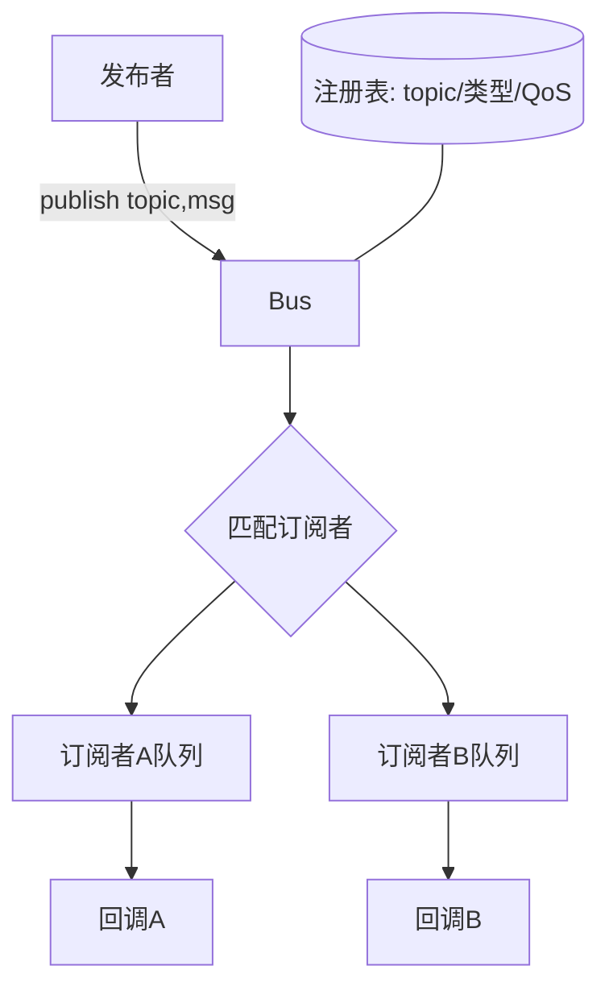
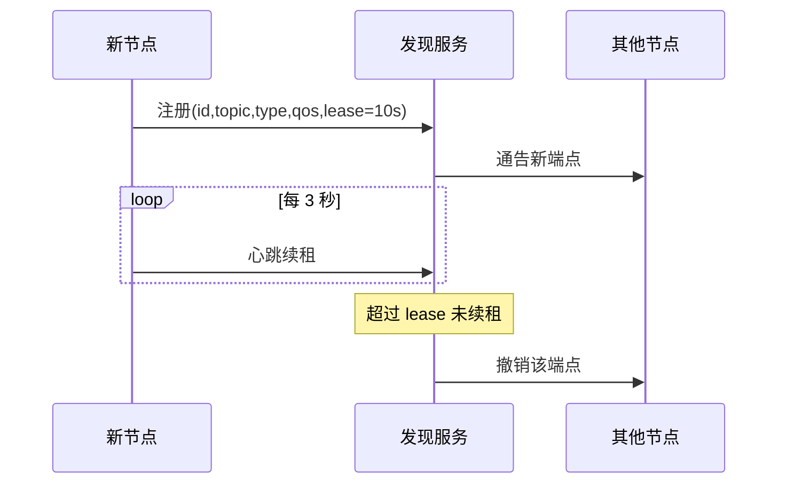
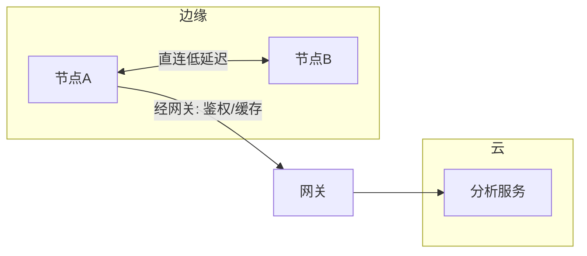

# 第 4 章：发布订阅、QoS、发现与路由

## 本章目标

掌握中间件最核心的控制逻辑，并**亲手实现一个进程内消息总线**：发布者和订阅者如何匹配、消息如何进队列、QoS 如何决定行为、节点如何发现彼此、慢消费者和跨域路由如何处理。

## 4.1 总线内部结构



发布流程：校验类型/权限 → 找到匹配订阅者 → 按各自 QoS 入队或丢弃 → 异步回调 → 更新指标。**关键：每个订阅者独立队列，一个慢订阅者不能阻塞发布者和其他订阅者。**

## 4.2 一个可运行的进程内总线

```cpp
#include <functional>
#include <memory>
#include <string>
#include <unordered_map>
#include <vector>
#include <thread>
#include <shared_mutex>

struct QoS {
    enum class Reliability { BestEffort, Reliable };
    Reliability reliability = Reliability::BestEffort;
    size_t depth = 16;                 // history 深度
    uint32_t deadline_ms = 0;          // 0 表示不检查
};

template <typename Msg>
class Bus {
public:
    using Callback = std::function<void(const Msg&)>;

    struct Subscription {
        BoundedQueue<Msg> queue;
        Callback cb;
        std::jthread worker;
        QoS qos;
        std::atomic<uint64_t> delivered{0}, dropped{0};

        Subscription(QoS q, Callback c)
            : queue(q.depth, q.reliability == QoS::Reliability::Reliable
                                 ? BoundedQueue<Msg>::FullPolicy::Block
                                 : BoundedQueue<Msg>::FullPolicy::DropOldest),
              cb(std::move(c)), qos(q) {
            worker = std::jthread([this](std::stop_token st) {
                while (!st.stop_requested()) {
                    auto m = queue.pop(std::chrono::milliseconds(100));
                    if (m) { cb(*m); delivered.fetch_add(1); }
                }
            });
        }
    };

    void subscribe(const std::string& topic, QoS qos, Callback cb) {
        std::unique_lock lk(mu_);
        subs_[topic].push_back(std::make_shared<Subscription>(qos, std::move(cb)));
    }

    void publish(const std::string& topic, const Msg& msg) {
        std::shared_lock lk(mu_);
        auto it = subs_.find(topic);
        if (it == subs_.end()) return;
        for (auto& s : it->second) {
            if (!s->queue.push(msg)) s->dropped.fetch_add(1);  // 被丢弃
        }
    }

private:
    std::shared_mutex mu_;
    std::unordered_map<std::string, std::vector<std::shared_ptr<Subscription>>> subs_;
};
```

{: .note }
> 真实中间件的 `publish` 会传句柄而非 `const Msg&` 拷贝（见第 3 章），这里为清晰用拷贝。Reliable 用 `Block` 实现背压，BestEffort 用 `DropOldest` 实现"丢旧保新"。

## 4.3 QoS 是行为契约

QoS 至少包括：可靠性、history、深度、deadline、寿命、持久性、顺序、优先级。**`reliable` 不是"永不丢失"**——它通常意味着传输层确认和重传，但仍受 deadline、队列容量、进程崩溃和磁盘能力限制。

| 数据 | 推荐 QoS | 理由 |
| --- | --- | --- |
| IMU 200Hz | BestEffort + depth=1 | 只要最新值，旧样本无意义 |
| 控制命令 | Reliable + deadline + 序列号 | 不能丢、要顺序、要过期检查 |
| 检测结果 | Reliable + 小 depth | 可有限重试，但不能堆积旧结果 |
| 诊断日志 | BestEffort + 批量 | 低优先级，可延迟 |

### QoS 兼容矩阵

发布者和订阅者 QoS 不匹配时可能**无法建立连接**或**行为不符预期**：

| 发布者 \ 订阅者 | Reliable | BestEffort |
| --- | --- | --- |
| Reliable | ✅ 兼容 | ✅ 兼容(降级为尽力) |
| BestEffort | ❌ 不兼容 | ✅ 兼容 |

{: .important }
> 规则：订阅者要求的可靠性 ≤ 发布者提供的可靠性才兼容。把 QoS 纳入**启动检查**，不匹配时明确报错，而不是让系统表现为"偶尔收不到消息"。

## 4.4 服务发现

发现信息应包含：node ID、topic/service、类型、版本、端点、QoS、能力、健康状态和**租约**。



固定 IP 只能解决静态寻址，不能表达动态启动、迁移、重启和能力变化。发现协议要处理：重复通告、过期消息、身份冲突、网络分区、启动风暴和安全认证。

## 4.5 路由与网关



直连延迟低但跨网域管理难；代理路由便于策略、鉴权和缓存，但增加跳数和瓶颈。云边端通常让**控制面走网关，大数据流边缘直连**。路由表要有版本和 TTL，避免旧拓扑长期生效。

## 4.6 真实案例：IMU 被可靠队列拖出延迟

IMU 200Hz，控制器只需最新样本。团队图省事给 IMU 配了 `Reliable + depth=1000`。消费者偶发停顿 200ms 后，队列里积压了约 40 个**已过期**样本，控制器逐条处理这些旧数据，控制延迟从 5ms 飙到 200ms+。

**根因**：把"最新状态"当成"必须逐条处理的事件"，用了错误的 QoS。

**修复**：IMU 改 `BestEffort + depth=1`（或 KeepLast(1)），停顿后直接拿最新值；同时把 deadline 设为 10ms，过期样本入队即丢。

**验证**：注入消费者停顿，观察控制延迟 p99 是否回到 ~5ms、IMU dropped 计数是否符合预期。

## 4.7 动手实验与验收

**实验**：
1. 用上面的 `Bus` 实现 IMU/图像/控制三个 topic，分别配不同 QoS。
2. 让图像订阅者 `sleep` 制造慢消费者，验证 IMU 和控制不受影响。
3. 实现一个最小发现表：注册 + 心跳续租 + 超时撤销；模拟发布者重启。
4. 打印每个订阅者的 delivered/dropped 和队列水位。

**验收标准**：一个慢订阅者不阻塞其他订阅者；QoS 不匹配有明确诊断；租约过期后不再投递；指标能显示水位、丢弃、延迟。

## 4.8 面试问题与参考答案

**问：QoS 不匹配时会发生什么？**

答：取决于框架兼容规则，可能无法匹配，也可能建立连接但行为不符预期。工程上要在启动/匹配阶段检查兼容矩阵并输出原因（reliability/history/类型不兼容），不能让业务只看到"偶尔收不到消息"。

**问：背压还是丢消息，怎么选？**

答：按数据语义。任务结果、配置、安全事件通常需要背压或可靠持久化；高频传感器、视频通常丢旧保新。无限队列不是背压方案，它把瞬时拥塞变成内存增长和延迟爆炸。选择的依据是"这条消息丢了业务能否接受"。

**问：服务发现为什么不能只靠固定 IP 和端口？**

答：节点可能动态启动、迁移、重启、跨网域；固定地址无法表达能力、版本、健康和拓扑变化。发现服务应提供身份、端点、类型/版本、能力和租约，并处理过期、冲突和网络分区。

**问：一个慢订阅者如何避免拖垮整个系统？**

答：每订阅者独立有界队列 + 独立处理线程；发布者只入队不同步等待回调；队列满按 QoS 丢弃或背压（仅对该订阅者）；对关键路径做资源隔离（独立线程池/优先级）。核心是"故障隔离"——慢的那个自己承担后果。

**问：可靠 QoS 一定比 BestEffort 好吗？**

答：不是。可靠传输在传感器场景可能让旧数据排队重传，反而恶化控制延迟；它还消耗更多内存和带宽。控制命令需要可靠但要配 deadline，高频传感器往往 BestEffort + 丢旧更合适。"可靠"是有代价的选择，不是默认最优。
