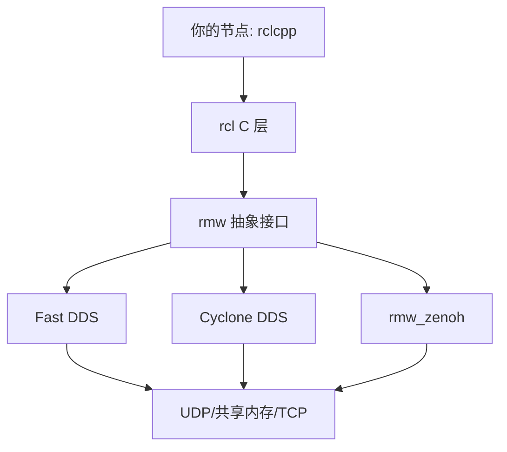
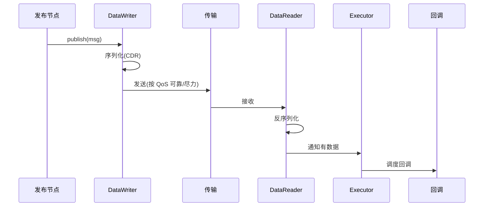
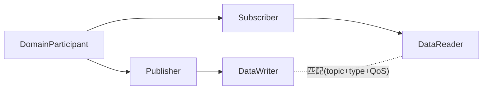
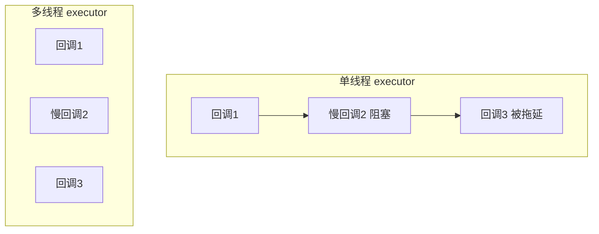

# 第 5 章：ROS 2、DDS 与框架选型

## 本章目标

以 ROS 2 + DDS 为主线理解机器人通信框架，同时知道 Zenoh、ZeroMQ、Cyber RT、DORA 各自解决什么问题。目标是能画出消息路径、解释 executor 陷阱、并基于语义而非吞吐数字做技术选型。

## 5.1 ROS 2 的分层



ROS 2 通过 **RMW** 抽象层连接不同的 DDS 实现。换 RMW 不改业务代码，但**默认值、发现方式、共享内存行为都可能变**，必须实测。

## 5.2 一条 ROS 2 消息的路径



性能问题可能出在任一环节：序列化耗时、发现未匹配、executor 排队、回调阻塞。

## 5.3 DDS 需要掌握的概念

- **DomainParticipant**：一个通信域的入口，同 domain ID 才能互通。
- **Publisher/Subscriber**、**DataWriter/DataReader**：读写端点。
- **Topic + Type**：话题名 + IDL 定义的类型。
- **Discovery**：默认基于多播的 SPDP/SEDP，自动发现端点。
- **QoS policies**：Reliability、Durability、History、Deadline、Liveliness、Ownership 等。



### 关键 QoS 举例

| Policy | 取值 | 影响 |
| --- | --- | --- |
| Reliability | RELIABLE / BEST_EFFORT | 是否确认重传 |
| Durability | VOLATILE / TRANSIENT_LOCAL | 晚加入的订阅者能否收到历史 |
| History | KEEP_LAST(n) / KEEP_ALL | 缓存策略 |
| Deadline | 周期 | 超期触发回调，用于活性检测 |
| Liveliness | AUTOMATIC / MANUAL | 如何判定端点存活 |

{: .warning }
> 不要假设不同 RMW 的默认 QoS、发现机制、共享内存行为一致。部署时**固定实现、版本、配置并实测**。比如某些配置下大消息跨进程仍会走 UDP 分片而非共享内存。

## 5.4 Executor：最常见的性能陷阱

```cpp
// 单线程 executor：所有回调串行，一个慢回调阻塞全部
rclcpp::executors::SingleThreadedExecutor exec;
exec.add_node(node);
exec.spin();

// 多线程 executor + 回调组：并发执行，但要处理数据竞争
auto cb_group = node->create_callback_group(
    rclcpp::CallbackGroupType::MutuallyExclusive);
rclcpp::executors::MultiThreadedExecutor mexec;
```



{: .important }
> 高优先级控制回调应与大图像处理**隔离到不同 callback group / executor**，回调内避免阻塞 I/O。单线程 executor 简单但易被慢回调阻塞；多线程要用 `MutuallyExclusive` 组保护共享状态、防优先级反转。

## 5.5 框架对比

| 框架 | 定位 | 强项 | 边界/代价 |
| --- | --- | --- | --- |
| ROS 2 / DDS | 完整机器人通信栈 | 类型/发现/QoS/工具成熟 | 配置复杂，默认性能需调优 |
| Zenoh | 分层路由/边云协同 | 弱网、路由、存储、资源表达 | 需学习其路由/存储语义 |
| ZeroMQ | 轻量消息库 | 灵活模式、极简、快 | 发现/schema/QoS 需自研 |
| Cyber RT | 自动驾驶数据流 | 调度、共享内存、record | 生态偏 Apollo，学习曲线陡 |
| DORA | 数据流/计算图 | 声明式 dataflow、Rust 生态 | 相对新，生态成长中 |

## 5.6 真实案例：ROS 2 不自动等于零拷贝

团队以为"用了 ROS 2 就零拷贝"，跨进程传 4MB 图像时 CPU 却很高。抓包发现走的是 UDP loopback + CDR 序列化，每帧完整拷贝多次。

**根因**：intra-process 零拷贝只在**同进程组件**间生效；跨进程需要特定 RMW + 共享内存插件 + 兼容的 QoS，且消息类型要满足 loan 条件。

**修复**：把关联组件用 component container 装进同进程启用 intra-process comm；或配置 DDS 共享内存传输（如 Fast DDS 的 SHM）；用 `ros2 topic hz/bw` 和 perf 验证。

**验证**：对比开启前后单帧 CPU、拷贝次数和 p99。

## 5.7 动手实验与验收

**实验**：
1. 用 ROS 2 建 IMU/图像/控制三个 topic，加一个 service 和一个 action。
2. 分别用 SingleThreaded 和 MultiThreaded executor，在图像回调里 `sleep(50ms)`，观察控制回调延迟。
3. 换一种 RMW（如 Cyclone ↔ Fast DDS），对比 `ros2 topic hz`、p99、CPU。
4. 故意让发布者 Reliable、订阅者也 Reliable 但 depth 不同，观察行为。

**验收标准**：能画出消息路径；能复现并解释 executor 阻塞；能说明该 RMW 的默认行为和仍需自研的部分。

## 5.8 面试问题与参考答案

**问：DDS 和 ZeroMQ 的根本区别是什么？**

答：DDS 是面向数据分发的完整通信模型，内置类型、发现、QoS 和发布订阅语义；ZeroMQ 是灵活的消息传输库，提供 REQ/REP、PUB/SUB 等模式，但发现、schema、QoS、治理多由应用自行实现。选择取决于系统需要的语义完整度和生态，不是比吞吐。

**问：ROS 2 的 executor 可能带来什么问题？**

答：回调调度顺序、线程数、callback group 的互斥关系会影响延迟和并发安全。单线程 executor 易被慢回调阻塞；多线程需防数据竞争和优先级反转。高实时路径应隔离回调、限制单次回调工作量、测量调度延迟。

**问：如何降低 ROS 2 的通信延迟？**

答：先分段测量，再逐项检查：executor 类型与线程数、回调阻塞、QoS（history/depth）、序列化开销、进程边界、是否启用 intra-process 或共享内存、队列深度、CPU 调度亲和性。优化后同时比较 p99、CPU、内存和丢帧，不能只看平均值。

**问：你会怎么给一个新项目选通信框架？**

答：先明确约束——数据类型/频率/大小、实时性、部署规模、跨语言、弱网、团队经验、生态依赖。机器人生态完整用 ROS 2/DDS；边云弱网重路由看 Zenoh；轻量内部服务可 ZeroMQ 自研治理；自动驾驶数据流可参考 Cyber RT。给出 2-3 个候选，用一个原型压测关键指标后决策，而不是凭品牌。
