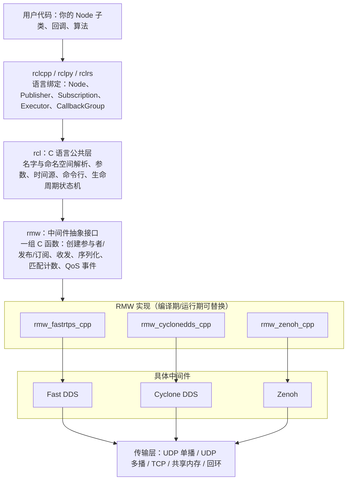
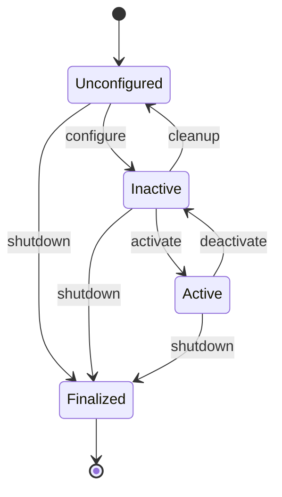
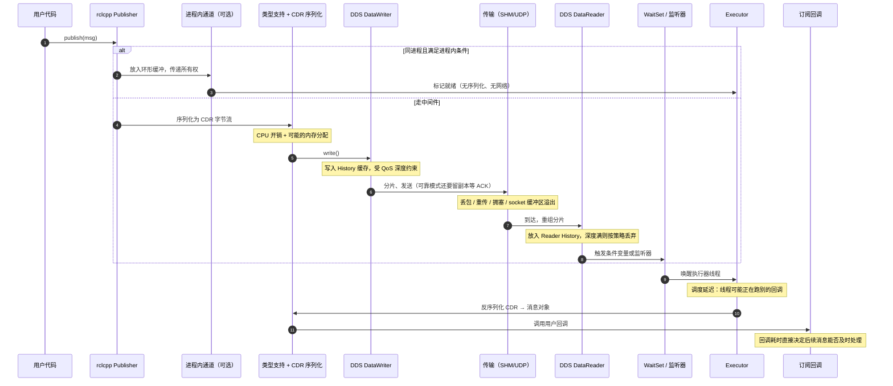
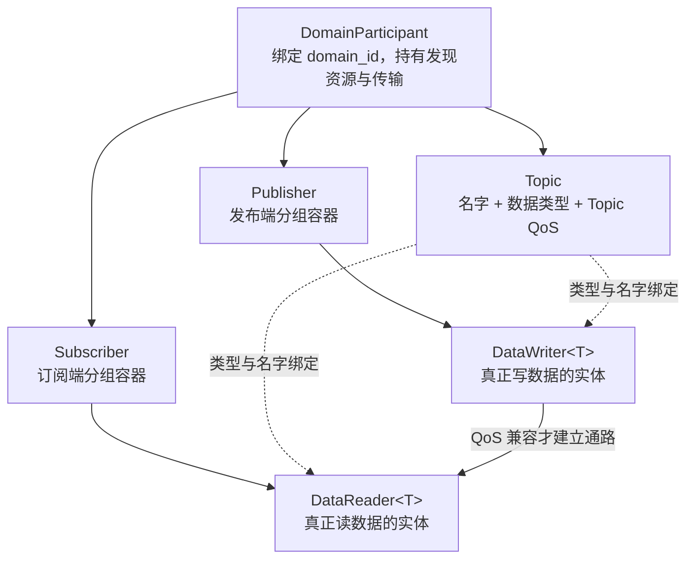
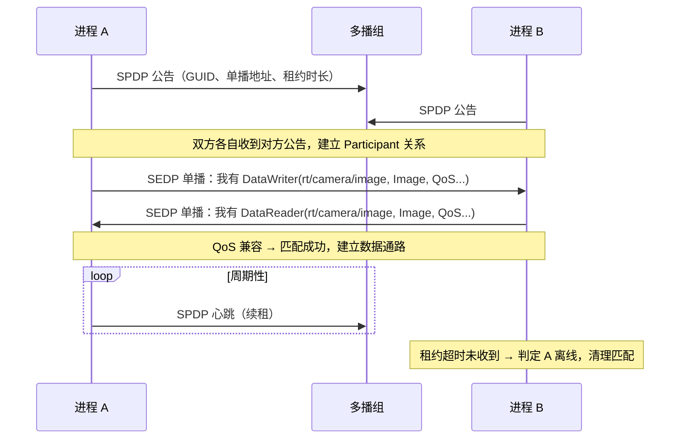
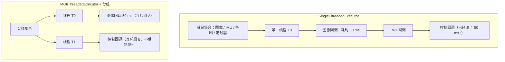

# 第 5 章：ROS 2、DDS 与框架选型

## 5.1 本章目标与前置知识

### 学完本章你能

- 说清楚 **ROS 2** 的四层结构（`rclcpp` → `rcl` → `rmw` → DDS），以及"换一层实现"会影响什么、不会影响什么。
- 独立画出一条 ROS 2 消息从 `publish()` 到订阅回调的完整路径，并指出每个环节的性能风险点。
- 解释 **DDS** 的实体模型和发现机制，读懂主要 **QoS** 策略的含义与副作用。
- 诊断 **executor（执行器）** 引起的调度阻塞——这是 ROS 2 项目里最高频的性能问题。
- 用 `rclcpp` 写出带 QoS 配置的发布者、订阅者、服务和动作，并知道 **component（组件）** 与 **进程内通信（intra-process communication）** 的适用边界。
- 基于语义、生态、实时性和运维成本，在 ROS 2/DDS、Zenoh、ZeroMQ、Cyber RT、DORA 之间做出可辩护的选型。

### 前置知识

- 第 1 章的通信语义（话题、服务、动作）和数据平面/控制平面划分。
- 第 2 章的线程模型、有界队列、条件变量。**5.7 节的 executor 分析完全建立在第 2 章的线程池概念上。**
- 第 4 章亲手实现的进程内消息总线。本章会不断把 ROS 2 的做法和你自己的实现做对照。

{: .important }
> **本章的事实性声明必须标注版本。** ROS 2 每个发行版（Foxy / Humble / Iron / Jazzy / Kilted / Rolling…）以及每个 RMW 实现（Fast DDS / Cyclone DDS / Connext / Zenoh）的**默认 QoS、是否启用共享内存、进程内通信的生效条件**都可能不同，而且历史上确实变过。本章所有"默认值""是否零拷贝"类结论都请当作**待验证假设**：在你的目标版本上跑一遍 5.12 节的实验，用 `ros2 topic hz/bw`、`perf` 和抓包确认，再写进设计文档。

## 5.2 为什么要学现成框架

### 前四章你已经造了一个"总线"

到第 4 章为止，你已经用 C++ 实现了：有界队列、线程池、共享内存环、epoll 事件循环、消息分帧、进程内发布订阅、租约式发现、简单 QoS。这套东西能跑，而且你完全理解它。

那为什么工业界还要用 ROS 2？因为一个能上产品的通信中间件，**通信只是其中一小部分**。

### 生产系统还缺什么

| 缺口 | 具体要求 | 自己做要付出什么 |
| --- | --- | --- |
| 跨语言类型生成 | 一份 IDL 生成 C++/Python/Rust 结构体，字段增删有兼容规则 | 写 IDL 解析器 + 三套代码生成后端 + 版本兼容测试矩阵 |
| 自动发现 | 节点上线自动被发现，掉线自动清理，跨机器可用 | 多播/单播发现协议、去重、租约、NAT 与多网卡处理 |
| 成熟 QoS | 可靠传输、历史缓存、时限、活跃度检测，且**双方策略不匹配时能诊断** | 实现 RTPS 级别的重传与心跳，写兼容矩阵与事件回调 |
| 录制回放 | 全量录包、按话题过滤、时间轴回放、与仿真时钟对齐 | 文件格式、索引、压缩、崩溃恢复（第 8 章的全部内容） |
| 可视化 | 3D 点云/TF 树/图像/曲线的实时查看与离线分析 | 一整个桌面应用团队 |
| 生态 | 现成的驱动、SLAM、导航、标定、诊断工具 | 每一个都要自己写或移植 |

### 粗略成本估算

按一个熟练 C++ 工程师 1 人月 ≈ 20 个有效工作日估算（这些数字是**量级参考**，不是承诺）：

$$
\begin{array}{lcl}
\text{IDL + 多语言代码生成} & \approx & 6\text{–}10\ \text{人月}\\
\text{发现协议（含多网卡、跨网段、掉线清理）} & \approx & 4\text{–}8\ \text{人月}\\
\text{可靠传输与 QoS（重传、心跳、匹配诊断）} & \approx & 8\text{–}15\ \text{人月}\\
\text{录制回放（格式 + 索引 + 恢复 + 工具）} & \approx & 6\text{–}10\ \text{人月}\\
\text{可视化工具} & \approx & 12\text{+}\ \text{人月}\\
\hline
\text{合计（不含维护、文档、生态适配）} & \approx & 36\text{–}55\ \text{人月}
\end{array}
$$

而且这只是**第一版能跑**的成本。真正的成本在后面：五年内的多平台适配、内核版本变化、安全漏洞修复、新人上手成本。

{: .note }
> **但"用现成框架"不等于"不需要懂原理"。** 恰恰相反：ROS 2 把复杂度封装起来了，一旦出问题（收不到消息、延迟抖动、CPU 打满），不懂原理的人只能靠换配置碰运气。前四章的知识正是为了让你能打开这个黑盒。

### 什么时候仍然要自研

- **超严格实时**：需要确定性调度、有界内存、可通过功能安全认证的路径。此时通常在 DDS 之下自建精简 RTPS 子集，或用 Cyber RT/自研总线。
- **极端受限硬件**：MCU 级设备跑不动完整 DDS（可考虑 micro-ROS + Micro XRCE-DDS）。
- **通信模式极简**：只有 2 个进程、1 条数据流，引入 ROS 2 是负债不是资产。

## 5.3 ROS 2 的分层架构

### 分层图



### 逐层职责

| 层 | 语言 | 负责什么 | 不负责什么 |
| --- | --- | --- | --- |
| `rclcpp` | C++ | 面向对象 API、executor 调度、回调组、进程内通信、智能指针生命周期 | 网络、序列化格式 |
| `rcl` | C | 跨语言共享逻辑：名字重映射、参数存储、`/clock` 时间源、生命周期状态机 | 线程调度（那是各语言绑定的事） |
| `rmw` | C | **抽象接口**：把"发布一条消息"翻译成中间件无关的调用；暴露 QoS 结构体和匹配事件 | 具体协议实现 |
| RMW 实现 | C++ | 把 `rmw` 调用映射到具体中间件 API，做 ROS 话题名到 DDS 话题名的转换、QoS 转换 | 业务语义 |
| DDS / Zenoh | C++/Rust | 发现、可靠性、历史缓存、传输选择、序列化 | ROS 概念（节点、动作） |

### 换 RMW：不改代码，但行为会变

选择 RMW 通常靠环境变量（安装了对应包的前提下）：

```bash
export RMW_IMPLEMENTATION=rmw_cyclonedds_cpp
ros2 run my_pkg my_node
```

{: .warning }
> **"不改业务代码"不等于"行为相同"。** 换 RMW 之后，下面这些都可能变化，必须重新实测：
> - 是否默认启用同机共享内存传输，以及触发条件；
> - 发现协议细节（是否依赖多播、单播发现服务器怎么配）；
> - 大消息的分片策略、socket 缓冲区默认值，进而影响丢包率；
> - QoS 边角语义（例如 `KEEP_ALL` 的资源上限、`Deadline` 判定精度）；
> - 内存分配行为与 p99 延迟。
>
> 换 RMW 是**一次架构变更**，要走完整回归测试，不是改个环境变量就完事。

{: .tip }
> `rmw` 这一层的存在本身就是一个很好的中间件设计范例：它把"可替换的部分"和"稳定的部分"用一个窄接口切开。你在第 4 章设计自己的总线时，也应该有类似的传输抽象层。

## 5.4 核心概念与术语

下面每个术语第一次出现都给出中英文和一句话定义，然后说明"为什么需要它"。

### 节点（Node）

ROS 2 里的**节点**是一个有名字、有命名空间、拥有若干发布者/订阅者/服务/参数的逻辑单元。

关键点：**节点不等于进程**。一个进程可以承载多个节点（这正是 component 的基础）。节点名在同一域内应唯一，重名不会直接报错但会造成工具混乱。

### 话题（Topic）

具名的、类型化的数据流。ROS 2 的话题名会被 RMW 转换成 DDS 话题名（历史上常见的做法是加 `rt/` 前缀，例如 `/camera/image` → `rt/camera/image`，具体前缀规则由 RMW 实现决定）。这解释了一个现象：**用原生 DDS 工具抓包时看到的话题名和 ROS 里的不一样。**

### 服务（Service）

一对一请求响应。ROS 2 的服务底层通常由两个 DDS 话题实现（请求话题 + 响应话题），用请求 ID 做配对。

{: .warning }
> 服务调用**没有内置超时**语义上的强保证：如果服务端不存在，客户端的 future 可能永远不完成。生产代码必须自己加超时并处理"服务端未就绪"。此外，**在回调里同步等待另一个服务的响应，是 ROS 2 最经典的死锁**（5.10 节详述）。

### 动作（Action）

长任务抽象，由 3 个服务（发送目标、取消目标、查询结果）+ 2 个话题（反馈、状态）组合而成。这个组合关系很重要：它意味着**动作继承了服务的全部陷阱**，包括回调内等待导致的死锁。

### 参数（Parameter）

节点的键值配置，类型化（bool/int/double/string/数组）。底层由若干服务 + 一个 `/parameter_events` 话题实现。参数**属于控制平面**：量小、要求可达、不适合高频更新。

{: .warning }
> 不要用参数做高频数据传递。每次 `set_parameter` 都是一次服务调用加一次事件广播，用它以 100 Hz 传状态会显著浪费 CPU 并污染日志。

### 生命周期节点（Lifecycle Node / Managed Node）

带显式状态机的节点，让外部编排器能控制"何时开始产生数据"。



为什么需要它？普通节点一构造就开始发数据，启动顺序不可控，容易出现"控制器还没准备好就收到轨迹"。生命周期节点让你能**先把所有节点配置好，再统一激活**。在 `Inactive` 状态下发布者存在但不发布数据（`on_activate` 之后才发），订阅者可选择忽略。

### 组件（Component）

编译成共享库的节点类，可以在运行期被加载进一个**容器进程（component container）**。同一容器内的多个组件是同进程的，因而**有机会**使用进程内通信。

### 执行器（Executor）与回调组（Callback Group）

- **Executor**：负责"哪个回调在哪个线程上、什么时候执行"。它反复检查所有订阅、定时器、服务、动作是否就绪，然后调用对应回调。
- **Callback Group**：把回调分组，用于控制并发规则。分两种：**互斥组（MutuallyExclusive）**——组内任意时刻最多一个回调在执行；**可重入组（Reentrant）**——组内回调可并发执行。

这两个概念是 5.7 节的主角，也是 ROS 2 性能问题的第一大来源。

### RMW（ROS Middleware Interface）

ROS 2 定义的中间件抽象接口。它的价值是让 ROS 2 不被绑死在某一个 DDS 厂商上，也让 Zenoh 这类非 DDS 中间件可以接入。

### DDS（Data Distribution Service）

OMG 组织制定的**以数据为中心的发布订阅**标准。它规定了实体模型、QoS 策略和线路协议（RTPS，Real-Time Publish-Subscribe）。ROS 2 最初选择 DDS，正是因为发现、QoS、类型系统这些都已经标准化了。

## 5.5 一条 ROS 2 消息的完整路径

### 时序图



### 每一环的性能风险

| 环节 | 主要开销 | 典型故障 | 观测手段 |
| --- | --- | --- | --- |
| 序列化 CDR | 与消息大小成正比；变长字段要动态分配 | 大图像每帧几毫秒 CPU | `perf record` 看 `serialize` 符号占比 |
| Writer History | 内存占用 = 深度 × 消息大小 | `KEEP_ALL` + 慢订阅者 → 内存暴涨 | 进程 RSS 曲线 |
| 分片与发送 | UDP 分片、系统调用次数 | 大消息丢一片就整条丢 | `netstat -su` 看 UDP 错误计数 |
| socket 缓冲区 | 内核 `rmem/wmem` 上限 | 突发流量溢出，静默丢包 | `ss -uam`、`sysctl net.core.rmem_max` |
| Reader History | 深度满时丢弃 | 消费慢 → 丢新或丢旧 | RMW 的 QoS 事件回调、`ros2 topic hz` |
| Executor 调度 | **排队等线程** | 慢回调阻塞其他回调 | 回调耗时直方图（5.7 节） |
| 反序列化 | 与序列化同量级 | 类型不一致导致解析异常 | 类型哈希不匹配日志 |
| 用户回调 | 业务决定 | 阻塞 I/O 拖垮整条链路 | 分段打点 |

{: .important }
> 对照第 1 章的"消息旅程"表：ROS 2 并没有消灭任何一个阶段，它只是**替你实现了这些阶段**。所有第 1、2 章讲的失败模式在 ROS 2 里一个都不少，只是位置换了名字。

## 5.6 DDS 深入

### 实体模型



对应关系：一个 ROS 2 **进程**通常对应一个（或少数几个）DomainParticipant；一个 ROS 2 **发布者**对应一个 DataWriter；**订阅者**对应一个 DataReader。

{: .note }
> **为什么 DomainParticipant 很"贵"？** 它要维护发现状态、多播 socket、若干内建端点和线程。每个节点都建一个 Participant 时，20 个节点就是 20 份发现开销，发现流量按 $O(n^2)$ 增长。这就是为什么大型系统倾向于用 component 把多个节点塞进一个进程——不仅省内存，更省发现开销。

### 发现机制：SPDP 与 SEDP

RTPS 规定了两阶段发现：

1. **SPDP（Simple Participant Discovery Protocol，简单参与者发现）**：每个 Participant 周期性地向一个约定的**多播地址**广播自己的存在（含 GUID、支持的传输、单播地址列表）。这一步回答"网络上有哪些进程"。
2. **SEDP（Simple Endpoint Discovery Protocol，简单端点发现）**：两个 Participant 互相认识后，通过**可靠单播**交换各自的 DataWriter/DataReader 信息（话题名、类型名、类型哈希、QoS）。这一步回答"谁发什么、谁收什么"。

匹配成功后才建立数据通路。



{: .warning }
> **多播依赖是最常见的"跨机器发现不了"根因。** 很多企业交换机默认关闭或限制多播；Docker 默认 bridge 网络不转发多播；多网卡机器可能从错的网卡发出多播；WiFi 上多播常被降速或丢弃。症状是**同机好用、跨机完全看不到对方**。
>
> 缓解手段（可用性取决于 RMW 与版本）：配置 Fast DDS 的 **Discovery Server**（改为单播、由一个已知地址的服务器中转发现信息）、Cyclone DDS 的 `Peers` 单播列表、或改用 `rmw_zenoh` 走路由器模式。**上生产前一定要在真实网络拓扑上验证发现。**

### 关键 QoS 策略

| QoS 策略 | 可选值 | 含义 | 影响与代价 |
| --- | --- | --- | --- |
| **Reliability**（可靠性） | `RELIABLE` / `BEST_EFFORT` | 是否重传丢失的数据 | `RELIABLE` 需要发送端保留副本、收 ACK、发心跳；慢订阅者会让发送端 history 堆积甚至阻塞写入。高频大数据常用 `BEST_EFFORT` |
| **Durability**（持久性） | `VOLATILE` / `TRANSIENT_LOCAL`（ROS 2 常用这两个；DDS 还有 `TRANSIENT`/`PERSISTENT`） | 晚加入的订阅者能否收到历史数据 | `TRANSIENT_LOCAL` 让发布端保留最近 N 条给新订阅者，适合地图、静态 TF、配置这类"锁存"数据；代价是常驻内存 |
| **History + Depth**（历史与深度） | `KEEP_LAST(n)` / `KEEP_ALL` | 缓存策略 | `KEEP_LAST(n)` 是有界的，超出丢最旧；`KEEP_ALL` 受资源限制约束，配可靠 + 慢消费者 = 内存风险 |
| **Deadline**（时限） | 周期时长 | 承诺/要求"两条消息间隔不超过 T" | 违反时触发 `deadline_missed` 事件，可用于**主动检测传感器掉线**；注意它检测的是**到达间隔**，不是端到端延迟 |
| **Liveliness**（活跃度） | `AUTOMATIC` / `MANUAL_BY_TOPIC` + 租约时长 | 判定发布者"是否还活着" | `AUTOMATIC` 由中间件自动续租（进程活着就算活）；`MANUAL_BY_TOPIC` 要求应用显式 `assert_liveliness()`，能检测"进程还在但线程卡死" |
| **Lifespan**（有效期） | 时长 | 消息超过此时长后从 history 移除 | 避免向新订阅者投递过期数据；不保证已投递的消息被撤回 |
| **Ownership**（所有权） | `SHARED` / `EXCLUSIVE` + 强度值 | 同一话题多个发布者时，是否只有强度最高的那个生效 | 用于主备冗余传感器自动切换。**注意：标准 ROS 2 QoS 结构体通常不暴露 Ownership，需要通过 RMW 的原生 XML 配置设置，具体支持情况取决于 RMW 与版本** |

### 请求-提供兼容性（RxO）

订阅者"请求（Requested）"的 QoS 必须能被发布者"提供（Offered）"的 QoS 满足，否则**不匹配，数据一条都不会到**。

| 发布者提供 | 订阅者请求 | 是否匹配 |
| --- | --- | --- |
| `RELIABLE` | `RELIABLE` | 匹配 |
| `RELIABLE` | `BEST_EFFORT` | 匹配（提供的更强） |
| `BEST_EFFORT` | `RELIABLE` | **不匹配** |
| `TRANSIENT_LOCAL` | `VOLATILE` | 匹配 |
| `VOLATILE` | `TRANSIENT_LOCAL` | **不匹配** |
| `Deadline = 50ms` | `Deadline = 100ms` | 匹配（提供得更频繁） |
| `Deadline = 100ms` | `Deadline = 50ms` | **不匹配** |

{: .warning }
> **QoS 不匹配最坏的地方是它很安静。** 节点都在跑，`ros2 node list` 正常，`ros2 topic list` 能看到话题，就是回调不触发。排查第一步永远是 `ros2 topic info /xxx --verbose` 对比两端 QoS。代码里也应该注册 `incompatible_qos` 事件回调，把它变成显式告警。

{: .important }
> **默认 QoS 值取决于 ROS 2 版本和 RMW 实现。** 常见的经验是：普通话题默认偏向可靠 + `KEEP_LAST` 较小深度，传感器数据推荐用 `rclcpp::SensorDataQoS()`（尽力而为）。但**不要把任何默认值当作跨版本承诺**——写代码时**显式指定 QoS**，并在目标环境用 `ros2 topic info --verbose` 核对实际生效值。

## 5.7 Executor 与回调调度

这一节是本章的重点。ROS 2 项目里"延迟莫名其妙变大"的问题，**大约一半出在这里**。

### Executor 在做什么

Executor 是一个循环：收集所有实体（订阅、定时器、服务、动作、guard condition）→ 等待任一就绪 → 取出就绪的回调 → 执行。它本质上就是第 2 章讲的"事件循环 + 线程池"，只是把回调注册这件事自动化了。

### 单线程执行器：一个线程串行跑所有回调



**关键结论**：`SingleThreadedExecutor` 下，任何一个慢回调都会让**同一执行器上所有其他回调**排队等待。你 10 ms 周期的控制定时器，会因为一次 50 ms 的图像处理而漏拍。

而且这个延迟不是"平均慢一点"，是**尾延迟灾难**：p50 可能只有 1 ms，p99 却是 50 ms+。只看平均值完全发现不了。

### 多线程执行器：并发了，但引入共享状态问题

`MultiThreadedExecutor` 用 N 个线程取回调。这解决了阻塞问题，但立刻带来第 2 章讲过的所有并发问题：**两个回调可能同时读写同一个成员变量**。

回调组就是用来控制这件事的：

| 回调组类型 | 语义 | 适用 |
| --- | --- | --- |
| **MutuallyExclusive（互斥）** | 同组内任意时刻只有一个回调在执行 | 需要访问共享状态、又不想自己加锁的回调放在同一组 |
| **Reentrant（可重入）** | 同组回调可并发执行，**同一个回调的多次调用也可能并发** | 无状态、纯计算或线程安全的回调；服务端需要并发处理多请求时 |

{: .important }
> **默认行为要记住**：节点默认有一个互斥回调组，未显式指定组的回调**全部落进这一个组**。所以哪怕你用了 `MultiThreadedExecutor`，如果没有分组，回调仍然是串行的——很多人"换了多线程还是慢"就是这个原因。
>
> （默认组的具体类型和版本相关，请用实验 5.12-2 实测确认。）

### 隔离高优先级控制回调的三种做法

1. **同执行器 + 不同互斥组**（最简单）：控制回调单独一组，图像回调另一组，多线程执行器保证它们能并发。缺点：线程数不够时仍可能排队。
2. **不同执行器 + 不同线程**（推荐用于实时控制）：给控制节点单独建一个 `SingleThreadedExecutor`，跑在专用线程上，甚至绑核并设实时调度策略。
3. **不同进程**：最强隔离，代价是失去进程内通信。

第 2 种的代码：

```cpp
// 把控制链路和感知链路放进两个执行器、两个线程
auto control_node = std::make_shared<ControlNode>();
auto perception_node = std::make_shared<PerceptionNode>();

rclcpp::executors::SingleThreadedExecutor control_exec;   // 控制专用，低延迟
control_exec.add_node(control_node);

rclcpp::executors::MultiThreadedExecutor perception_exec(
    rclcpp::ExecutorOptions(), 4);                        // 感知用 4 线程
perception_exec.add_node(perception_node);

std::thread control_thread([&] {
    // 可选：绑核 + 提升调度优先级（需要相应权限，且要评估对系统的影响）
    // cpu_set_t set; CPU_ZERO(&set); CPU_SET(2, &set);
    // pthread_setaffinity_np(pthread_self(), sizeof(set), &set);
    control_exec.spin();
});
perception_exec.spin();      // 主线程跑感知
control_exec.cancel();
control_thread.join();
```

{: .warning }
> 提升线程优先级到实时策略（`SCHED_FIFO`）时必须小心：一个死循环的实时线程会把整个 CPU 核饿死，连 SSH 都登不上。务必配合看门狗、`cpu.rt_runtime_us` 限额和充分的压力测试。

## 5.8 工程实现

下面的代码基于 `rclcpp`。目标是展示**结构**而不是背 API，请以你所用发行版的官方文档为准。

### 发布者节点（显式 QoS + 组件化 + 进程内友好）

```cpp
// camera_node.cpp
#include <chrono>
#include <memory>
#include <rclcpp/rclcpp.hpp>
#include <rclcpp_components/register_node_macro.hpp>
#include <sensor_msgs/msg/image.hpp>

using namespace std::chrono_literals;

namespace demo {

class CameraNode : public rclcpp::Node {
public:
  // 必须接受 NodeOptions，否则无法作为 component 被容器加载
  explicit CameraNode(const rclcpp::NodeOptions & options)
  : Node("camera", options)
  {
    // 显式声明 QoS：不要依赖默认值（默认值随版本变化）
    rclcpp::QoS qos(rclcpp::KeepLast(2));   // 深度 2，图像只关心最新
    qos.best_effort();                       // 允许丢，不重传
    qos.durability_volatile();               // 晚来的订阅者不补历史
    qos.deadline(50ms);                      // 承诺间隔不超过 50 ms

    // 注册 QoS 事件：把"静默不匹配"变成显式日志
    rclcpp::PublisherOptions pub_opts;
    pub_opts.event_callbacks.incompatible_qos_callback =
      [this](rclcpp::QOSOfferedIncompatibleQoSInfo & info) {
        RCLCPP_ERROR(get_logger(),
          "QoS 不兼容，累计 %d 次，策略 id=%d", info.total_count, info.last_policy_kind);
      };

    pub_ = create_publisher<sensor_msgs::msg::Image>("image", qos, pub_opts);
    timer_ = create_wall_timer(33ms, [this] { tick(); });
  }

private:
  void tick()
  {
    // 关键：用 unique_ptr 发布。所有权可以被"移交"，
    // 这是进程内通信免拷贝的前提；shared_ptr 版本在多订阅者时只能共享只读副本。
    auto msg = std::make_unique<sensor_msgs::msg::Image>();
    msg->header.stamp = now();          // 采集时刻（这里用节点时钟近似）
    msg->header.frame_id = "cam_front";
    msg->height = 720; msg->width = 1280;
    msg->encoding = "rgb8";
    msg->step = msg->width * 3;
    msg->data.resize(static_cast<size_t>(msg->step) * msg->height);
    // ... 真实场景这里从驱动填充，最好直接写进已分配好的缓冲，避免额外拷贝

    pub_->publish(std::move(msg));      // 移交所有权
  }

  rclcpp::Publisher<sensor_msgs::msg::Image>::SharedPtr pub_;
  rclcpp::TimerBase::SharedPtr timer_;
};

}  // namespace demo

// 注册为 component，可被 component_container 动态加载
RCLCPP_COMPONENTS_REGISTER_NODE(demo::CameraNode)
```

**逐段说明**

- **构造函数接受 `NodeOptions`**：这是组件化的硬性要求，容器通过它注入 `use_intra_process_comms`、参数覆盖、重映射。
- **显式 QoS**：`KeepLast(2)` + `best_effort` 对应第 1 章表格里图像那一行。深度设大了只会堆积过期帧。
- **`deadline(50ms)`**：给下游一个"我承诺至少 20 Hz"的契约；订阅者请求更严的 deadline 会直接不匹配，这是**有意的早失败**。
- **`incompatible_qos_callback`**：把不匹配变成可见错误。**这行代码能省下未来的一整天排查时间。**
- **`publish(std::move(unique_ptr))`**：进程内通信要免拷贝，必须交出所有权。用 `publish(const Msg&)` 或 `shared_ptr` 时，语义上不能独占，中间件只能保守地复制。

### 订阅者节点（回调组隔离）

```cpp
// fusion_node.cpp
#include <rclcpp/rclcpp.hpp>
#include <sensor_msgs/msg/image.hpp>
#include <sensor_msgs/msg/imu.hpp>

namespace demo {

class FusionNode : public rclcpp::Node {
public:
  explicit FusionNode(const rclcpp::NodeOptions & options)
  : Node("fusion", options)
  {
    // 两个互斥组：慢的图像回调不会阻塞快的 IMU 回调
    cb_image_ = create_callback_group(rclcpp::CallbackGroupType::MutuallyExclusive);
    cb_imu_   = create_callback_group(rclcpp::CallbackGroupType::MutuallyExclusive);

    rclcpp::SubscriptionOptions img_opts;
    img_opts.callback_group = cb_image_;
    // 订阅端 QoS 必须与发布端兼容，这里保持一致
    sub_img_ = create_subscription<sensor_msgs::msg::Image>(
      "image", rclcpp::SensorDataQoS().keep_last(2),
      [this](sensor_msgs::msg::Image::UniquePtr msg) { on_image(std::move(msg)); },
      img_opts);

    rclcpp::SubscriptionOptions imu_opts;
    imu_opts.callback_group = cb_imu_;
    sub_imu_ = create_subscription<sensor_msgs::msg::Imu>(
      "imu", rclcpp::SensorDataQoS().keep_last(1),
      [this](sensor_msgs::msg::Imu::ConstSharedPtr msg) { on_imu(msg); },
      imu_opts);
  }

private:
  // UniquePtr 回调签名是进程内零拷贝路径的关键：
  // 同进程 + 单订阅者时，中间件可以直接把发布者的对象所有权交给你。
  void on_image(sensor_msgs::msg::Image::UniquePtr msg)
  {
    // 注意：这里只做计算，不做阻塞 I/O（不写盘、不 HTTP、不等锁）
    (void)msg;
  }

  void on_imu(sensor_msgs::msg::Imu::ConstSharedPtr msg) { (void)msg; }

  rclcpp::CallbackGroup::SharedPtr cb_image_, cb_imu_;
  rclcpp::Subscription<sensor_msgs::msg::Image>::SharedPtr sub_img_;
  rclcpp::Subscription<sensor_msgs::msg::Imu>::SharedPtr sub_imu_;
};

}  // namespace demo
```

### 服务端与客户端（含超时）

```cpp
#include <std_srvs/srv/set_bool.hpp>

// 服务端：放进可重入组，允许并发处理多个请求
srv_cb_ = create_callback_group(rclcpp::CallbackGroupType::Reentrant);
srv_ = create_service<std_srvs::srv::SetBool>(
  "enable_camera",
  [this](const std::shared_ptr<std_srvs::srv::SetBool::Request> req,
         std::shared_ptr<std_srvs::srv::SetBool::Response> res) {
    enabled_.store(req->data);          // 用原子变量，因为可能并发进入
    res->success = true;
    res->message = req->data ? "enabled" : "disabled";
  },
  rclcpp::ServicesQoS(), srv_cb_);

// 客户端：异步 + 显式超时，绝不在回调里同步等待
auto client = create_client<std_srvs::srv::SetBool>("enable_camera");
if (!client->wait_for_service(std::chrono::seconds(2))) {
  RCLCPP_ERROR(get_logger(), "服务端未就绪，放弃调用");
  return;
}
auto req = std::make_shared<std_srvs::srv::SetBool::Request>();
req->data = true;
client->async_send_request(req,
  [this](rclcpp::Client<std_srvs::srv::SetBool>::SharedFuture fut) {
    RCLCPP_INFO(get_logger(), "结果: %s", fut.get()->message.c_str());
  });   // 结果在回调里处理，主循环不阻塞
```

### 动作服务端（骨架）

```cpp
#include <rclcpp_action/rclcpp_action.hpp>
#include <example_interfaces/action/fibonacci.hpp>

using Fib = example_interfaces::action::Fibonacci;
using GoalHandle = rclcpp_action::ServerGoalHandle<Fib>;

action_server_ = rclcpp_action::create_server<Fib>(
  this, "compute",
  // 1) 是否接受目标（要快，不能阻塞）
  [](const rclcpp_action::GoalUUID &, std::shared_ptr<const Fib::Goal> goal) {
    return goal->order <= 100 ? rclcpp_action::GoalResponse::ACCEPT_AND_EXECUTE
                              : rclcpp_action::GoalResponse::REJECT;
  },
  // 2) 是否接受取消
  [](const std::shared_ptr<GoalHandle>) { return rclcpp_action::CancelResponse::ACCEPT; },
  // 3) 目标被接受后调用：必须立刻返回，长任务另起线程
  [this](const std::shared_ptr<GoalHandle> gh) {
    std::thread{[this, gh] { execute(gh); }}.detach();   // 生产环境改用线程池
  });

void execute(const std::shared_ptr<GoalHandle> & gh) {
  auto fb = std::make_shared<Fib::Feedback>();
  auto result = std::make_shared<Fib::Result>();
  fb->sequence = {0, 1};
  for (int i = 1; i < gh->get_goal()->order; ++i) {
    if (gh->is_canceling()) {                   // 每一步都要检查取消
      result->sequence = fb->sequence;
      gh->canceled(result);
      return;
    }
    fb->sequence.push_back(fb->sequence[i] + fb->sequence[i - 1]);
    gh->publish_feedback(fb);                   // 进度反馈
    std::this_thread::sleep_for(std::chrono::milliseconds(50));
  }
  result->sequence = fb->sequence;
  gh->succeed(result);
}
```

{: .warning }
> **`handle_accepted` 里绝不能做长任务。** 它运行在 executor 线程上，一旦阻塞，整个执行器（或该回调组）就停摆。示例里用 `detach` 是为了简短，生产代码应该提交到自己管理的线程池，并保证节点析构时能安全停止（第 2 章的协作式停止）。

### 组件与进程内通信

把多个组件装进同一容器，才有机会启用进程内通信：

```bash
# 启动一个多线程容器
ros2 run rclcpp_components component_container_mt &

# 装载组件，并开启进程内通信
ros2 component load /ComponentManager my_pkg demo::CameraNode \
  -e use_intra_process_comms:=true
ros2 component load /ComponentManager my_pkg demo::FusionNode \
  -e use_intra_process_comms:=true

ros2 component list
```

用 launch 文件更常见（Python launch 里用 `ComposableNodeContainer` + `extra_arguments=[{'use_intra_process_comms': True}]`）。

{: .important }
> **进程内通信的边界（务必在你的版本上实测）：**
> - 只在**同一进程**内的发布者与订阅者之间生效，跨进程完全不适用；
> - 双方都必须启用 `use_intra_process_comms`；
> - 历史上对 QoS 有限制（例如要求 `KEEP_LAST`，对 `TRANSIENT_LOCAL` 支持随版本变化）；
> - 真正"不拷贝"通常要求**发布者用 `unique_ptr` 发布**且**订阅者用 `UniquePtr` 回调**；多个订阅者时一般退化为共享只读或每个订阅者一份拷贝；
> - 同一话题若同时存在进程内和进程外订阅者，进程外那条路径**仍然要序列化并走中间件**。

### 跨进程零拷贝：贷出消息（Loaned Message）

```cpp
// 需要：RMW 支持（如 Fast DDS Data Sharing、iceoryx 类共享内存），
// 且消息类型为定长 POD（无变长 string / 无边界 sequence）。
// 支持情况强依赖版本与配置，必须实测。
auto loaned = pub_->borrow_loaned_message();   // 直接拿到共享内存里的槽位
loaned.get().x = 1.0;                          // 原地写，不经过中间缓冲
pub_->publish(std::move(loaned));
```

`sensor_msgs/Image` 因为 `data` 是变长 `sequence<uint8>`，**通常不满足**贷出消息的定长要求。这就是 5.11 节案例的核心。

## 5.9 框架对比与选型

### 横向对比

| 框架 | 定位 | 强项 | 代价与边界 | 适用场景 |
| --- | --- | --- | --- | --- |
| **ROS 2 + DDS** | 完整机器人框架 + 标准化中间件 | 语义最完整（话题/服务/动作/参数/生命周期）；生态最大（导航、SLAM、驱动、可视化、录包）；QoS 标准化 | 概念多、调优面广；发现依赖多播时跨网段麻烦；DomainParticipant 开销；实时性需精细配置 | 通用机器人、需要复用大量现成组件、团队规模较大 |
| **Zenoh**（可作为 `rmw_zenoh` 或独立使用） | 统一 pub/sub + 查询 + 存储的数据面 | 弱网与广域网表现好；路由器模式免多播；有查询（query）语义；支持云边端串联 | 生态与工具链不如 ROS 2 成熟；语义与 DDS 有差异，迁移要重新验证 QoS 行为 | 车云协同、跨广域网、多机器人接入云端 |
| **ZeroMQ** | 轻量消息库（不是完整中间件） | 极简、依赖少、可控性强；多种 socket 模式（PUB/SUB、REQ/REP、ROUTER/DEALER）；跨语言 | **无发现、无类型系统、无 QoS、无录制**，这些全要自己造；PUB/SUB 慢订阅者语义要自己处理 | 内部模块通信、自研中间件的传输层、工具链和测试桩 |
| **Cyber RT**（Apollo） | 面向自动驾驶的高性能运行时 | 协程调度 + 任务亲和；同机共享内存路径成熟；DAG 编排是一等公民 | 与 Apollo 生态耦合较深；社区与文档相对小；跨机能力不是重点 | 自动驾驶域控制器、单机重算力多模块编排 |
| **DORA** | 面向机器人/AI 的数据流运行时（Rust） | 以数据流图为核心，节点可多语言；启动快、开销小；适合快速迭代 | 项目较新、接口演进快；生态与生产验证案例相对少 | 研究原型、AI 感知流水线、需要多语言混编 |

### 选型的决策维度清单

不要只比吞吐数字。按下面这些维度逐项打分，并写清楚**你的场景权重**：

1. **语义完整度**：只需要 pub/sub，还是必须有服务、动作、参数、生命周期？缺的部分你要自己补多少？
2. **生态与工具**：有没有现成驱动、可视化、录制回放、诊断工具？没有的话工具链成本要计入。
3. **发现机制**：目标网络允许多播吗？跨网段/跨云怎么办？有没有单播发现或路由器模式？
4. **实时性**：能否做到有界延迟？调度是否可控（绑核、优先级、无锁路径）？内存是否可预分配？
5. **跨语言**：需要 Python/Rust/Java 吗？类型定义是否统一生成？
6. **共享内存与零拷贝**：同机大数据（图像/点云）有没有真正的免拷贝路径？触发条件是什么？消息类型受什么限制？
7. **弱网表现**：丢包 5%、RTT 200 ms、频繁断连时会怎样？是否有断线重连和状态恢复？
8. **运维与可观测**：能否在线查看话题、频率、带宽、QoS、匹配关系？出问题能不能定位？
9. **团队经验与招聘**：团队会用吗？换人后接得住吗？
10. **许可与合规**：许可证是否可接受？是否需要通过功能安全或供应链审计？

{: .warning }
> **"某框架吞吐比另一个高 30%"几乎不能作为选型依据。** 基准测试的消息大小、QoS、线程数、网络环境、是否同机、是否开共享内存，任何一项不同结论就可能反转。真正决定项目成败的通常是发现机制能不能在你的网络里跑通、工具链能不能支撑排障、团队能不能维护。

{: .tip }
> 实用做法：用**你自己的真实数据流**（真实消息大小、频率、话题数、节点数）写一个 200 行的压测程序，在两三个候选框架上各跑一遍，同时记录 p50/p99 延迟、CPU、内存、丢包率，以及"搭起来花了多久""出问题多久定位到"。后两项主观指标往往比前面的数字更重要。

## 5.10 常见错误与陷阱

### 陷阱一：以为"用了 ROS 2 就自动零拷贝"

这是最贵的误解，5.11 节完整展开。要点：零拷贝需要同时满足**同进程 + 进程内通信开启 + `unique_ptr` 发布**（进程内路径），或者**特定 RMW + 共享内存配置 + 定长 POD 消息类型**（跨进程贷出消息路径）。默认配置下跨进程传 `sensor_msgs/Image` 通常会**序列化 + 走网络栈**。

### 陷阱二：在回调里做阻塞 I/O

```cpp
// 错误：回调里写盘 / 请求 HTTP / 等锁
void on_image(sensor_msgs::msg::Image::ConstSharedPtr msg) {
  cv::imwrite("/data/frame.png", to_cv(msg));   // 可能耗时数百毫秒
}

// 正确：回调只入队，落盘交给独立线程（第 2 章的有界队列 + 线程池）
void on_image(sensor_msgs::msg::Image::UniquePtr msg) {
  if (!queue_.push(std::move(msg))) metrics_.dropped++;   // 丢弃要计数
}
```

回调运行在 executor 线程上。阻塞它等于阻塞该回调组（甚至整个执行器）里的所有回调。

### 陷阱三：单线程执行器下所有回调共用一个线程

```cpp
// 错误：默认单线程，控制定时器会被图像回调挤掉
rclcpp::spin(node);                       // 等价于 SingleThreadedExecutor

// 正确：多线程 + 显式回调组（回调组见 5.8 节代码）
rclcpp::executors::MultiThreadedExecutor exec(rclcpp::ExecutorOptions(), 4);
exec.add_node(node);
exec.spin();
```

{: .warning }
> 换成 `MultiThreadedExecutor` 但**不分回调组**，回调仍然是串行的（都在默认互斥组里）。这个坑非常常见：改完发现"性能没变化"，于是错误地得出"多线程没用"的结论。

### 陷阱四：QoS 不匹配导致收不到消息却无告警

```bash
# 排查第一步：对比两端 QoS
ros2 topic info /camera/image --verbose
# 关注 Reliability / Durability / Deadline / Liveliness 是否满足 RxO 规则
```

代码层面务必注册 `incompatible_qos` 事件（5.8 节示例），把静默失败变成日志。

### 陷阱五：跨 domain ID 无法通信

`ROS_DOMAIN_ID` 决定 DDS domain，不同 domain 的参与者**完全隔离**（底层反映为不同的端口计算结果）。

```bash
# 终端 A
export ROS_DOMAIN_ID=7
ros2 run demo_nodes_cpp talker
# 终端 B —— 忘了设置，默认是 0，永远收不到
ros2 run demo_nodes_cpp listener      # 无输出
```

排查：`echo $ROS_DOMAIN_ID` 在**每一台机器、每一个终端、每一个 systemd 服务、每一个容器**里都要确认。systemd 和容器不继承你的 shell 环境，这是最常见的漏网之鱼。

### 陷阱六：多播被交换机屏蔽导致发现失败

症状：同机通信正常，跨机 `ros2 node list` 看不到对方。

排查步骤：

```bash
# 1) 确认接口和多播能力
ip -d link show                     # 看 MULTICAST 标志
# 2) 直接测多播连通性（ROS 2 自带工具，具体命名以发行版为准）
ros2 multicast receive              # 机器 A
ros2 multicast send                 # 机器 B
# 3) 抓包确认 SPDP 是否真的发出去/收得到
sudo tcpdump -i eth0 -n 'udp and (portrange 7400-7500)'
```

如果多播不通，方案是：改用单播发现（Fast DDS Discovery Server 或 Cyclone DDS 的 `Peers` 列表）、改用 `rmw_zenoh` 的路由器模式，或者说服网络团队开放多播。**多网卡机器还要显式指定使用哪张网卡**，否则可能从错误的接口发出。

### 陷阱七：在回调里同步等待另一个服务/动作的结果

```cpp
// 错误：死锁高发
void on_trigger(...) {
  auto fut = client_->async_send_request(req);
  rclcpp::spin_until_future_complete(node_, fut);  // 当前线程已在跑回调，无法再 spin
}
```

单线程执行器下这会**直接死锁**；多线程下如果回调在同一互斥组也会死锁。正确做法是用 `async_send_request` 的回调形式，或把发起方与响应处理放进不同的可重入/独立回调组，并加超时。

## 5.11 真实案例：ROS 2 不自动等于零拷贝

### 背景与现象

某室内巡检机器人，一台工控机上跑：相机驱动进程（发布 `sensor_msgs/Image`，1920×1080 RGB8，约 6.2 MB/帧，20 Hz）、检测进程、录制进程。团队从旧框架迁移到 ROS 2 时的假设是："都在一台机器上，ROS 2 会走共享内存，零拷贝。"

上线后：

- 整机 CPU 长期 75% 以上，其中相机进程占了近 1.5 个核，而它"只是把图像发出去"。
- 检测进程的端到端延迟 p99 达到 180 ms，设计目标是 60 ms。
- 偶发大量丢帧，`dmesg` 里能看到 UDP 接收缓冲相关的丢弃迹象。

### 排查过程

```bash
# 1) 确认实际频率和带宽 —— 数据量和理论值对得上，说明没走"共享大对象"的路径
ros2 topic hz /camera/image           # 约 20 Hz
ros2 topic bw /camera/image           # 约 124 MB/s

# 2) 看进程 CPU 分布，确认热点在哪个线程
pidstat -t -p $(pgrep -f camera_node) 1

# 3) 火焰图定位函数级热点
perf record -F 499 -g -p $(pgrep -f camera_node) -- sleep 20
perf script | stackcollapse-perf.pl | flamegraph.pl > cam.svg
# 结果：栈顶大量落在 CDR 序列化、memcpy 和 sendmsg

# 4) 抓包确认真的走了网络栈
sudo tcpdump -i lo -n 'udp' -c 200    # loopback 上有大量 UDP 分片

# 5) 核对内核 UDP 缓冲与丢弃计数
netstat -su | grep -i 'receive errors\|RcvbufErrors'
```

结论很明确：**数据在走 UDP loopback，而且经过了完整的 CDR 序列化。**

### 根因


三个假设同时不成立：

1. **进程内通信不跨进程。** `use_intra_process_comms` 只在**同一进程内的节点之间**生效。相机和检测是两个独立进程，这条路径根本没被启用。
2. **共享内存传输不是默认必开、也不是无条件生效。** 是否启用同机共享内存取决于 RMW 实现、版本和配置文件；即使启用，很多实现的"共享内存传输"仍然要**序列化后**把字节放进共享段，减少的是内核拷贝，而不是序列化开销。
3. **`sensor_msgs/Image` 不满足贷出消息的条件。** 它的 `data` 字段是变长序列，长度在运行期才确定，无法映射到固定大小的共享内存槽位。真正的"零拷贝贷出"通常要求定长 POD 类型。

$$
\text{每秒额外内存带宽} \approx 6.2\ \text{MB} \times 20\ \text{Hz} \times 5\ \text{次拷贝} = 620\ \text{MB/s}
$$

这就是那 1.5 个核的去向。

### 方案与取舍

团队评估了四个方案：

| 方案 | 做法 | 收益 | 代价 |
| --- | --- | --- | --- |
| A. 合并进程 | 相机与检测改成 component 放进同一容器，开 `use_intra_process_comms`，用 `unique_ptr` 发布/`UniquePtr` 回调 | 消除全部序列化与网络拷贝 | 失去进程级故障隔离；检测崩溃会带走相机；录制进程仍走网络 |
| B. 定长消息 + 贷出 | 自定义定长 POD 消息（固定分辨率），配置 RMW 共享内存，用 `borrow_loaned_message` | 跨进程也能免拷贝 | 消息不再是标准 `sensor_msgs/Image`，生态工具（rviz、rosbag 可视化）不能直接用；分辨率写死 |
| C. 自管共享内存 | ROS 2 只传"共享内存句柄 + 元数据"（几十字节），图像数据放自管理的共享内存池 | 跨进程免拷贝，保留进程隔离，消息很小 | 要自己实现引用计数、崩溃回收、生命周期（第 2、3 章的内容）；工具链要适配 |
| D. 压缩 | 发布 `CompressedImage`（JPEG/H.264） | 带宽降一个数量级 | 增加编解码 CPU 与延迟；有损；不适合需要原始像素的算法 |

**最终选择 A + C 组合**：

- 相机与检测合并进同一容器（方案 A），因为它们本来就是强耦合的实时链路，且检测崩溃时机器人无论如何都要降级停车，隔离价值不大。
- 录制进程跨进程，采用方案 C：相机额外发布一个小消息 `ImageRef{shm_id, offset, size, width, height, stamp, seq}`，录制端按需映射读取。
- 保留一路低分辨率 `CompressedImage`（方案 D）供远程监控和 rviz 使用，代价可控。

**明确写进设计文档的取舍**：进程合并牺牲了故障隔离，因此补了三条约束——检测代码禁止使用可能崩溃的第三方库直接跑在容器内、容器进程加看门狗、检测回调加耗时上限告警。

### 验证

| 指标 | 优化前 | 优化后 | 测量方法 |
| --- | --- | --- | --- |
| 相机进程 CPU | ~150% | ~35% | `pidstat -p <pid> 1`，取 5 分钟均值 |
| 端到端延迟 p99 | 180 ms | 41 ms | 消息头 `send_time_ns` 与回调入口时间戳之差，直方图统计 |
| loopback UDP 流量 | ~124 MB/s | < 1 MB/s | `sar -n DEV 1` 观察 `lo` |
| 丢帧率 | 峰值 12% | < 0.5% | 序列号缺口统计（第 1 章消息头） |
| 火焰图中序列化占比 | 约 28% | < 2% | `perf` 前后对比 |

{: .important }
> **这个案例的通用教训**：任何关于"零拷贝""共享内存""自动优化"的说法，都要问三个问题——**在什么部署形态下（同进程/同机/跨机）？对什么消息类型？需要哪些配置？** 然后用带宽和 CPU 数据去验证，而不是相信文档标题。

## 5.12 动手实验与验收

### 实验一：搭一个最小 ROS 2 系统（60 分钟）

1. 创建一个包，实现三个话题：`/camera/image`（模拟 1280×720 RGB，20 Hz，`SensorDataQoS`）、`/imu`（200 Hz，深度 1）、`/cmd`（100 Hz，可靠，深度 1）。
2. 增加一个服务 `/enable_camera`（`std_srvs/SetBool`）和一个动作 `/compute`（`example_interfaces/Fibonacci`）。
3. 用命令行验证：

```bash
ros2 node list
ros2 topic list -t
ros2 topic hz /imu
ros2 topic bw /camera/image
ros2 topic info /camera/image --verbose
ros2 service call /enable_camera std_srvs/srv/SetBool "{data: true}"
ros2 action send_goal /compute example_interfaces/action/Fibonacci "{order: 10}" --feedback
```

**要回答的问题**：`ros2 topic bw` 的实测值和你手算的理论码率差多少？差在哪（消息头、对齐、统计口径）？

### 实验二：两种 Executor 的尾延迟对比（90 分钟）

1. 写一个节点：图像回调里 `std::this_thread::sleep_for(50ms)` 模拟慢处理；同时有一个 10 ms 周期的"控制"定时器，记录**每次触发的实际间隔**。
2. 分别在三种配置下跑 60 秒，统计控制定时器间隔的 p50/p99/最大值：
   - A：`rclcpp::spin(node)`（单线程）
   - B：`MultiThreadedExecutor(4)`，**不分回调组**
   - C：`MultiThreadedExecutor(4)`，图像与控制分属两个互斥组
3. 填表对比。

| 配置 | p50 | p99 | max | 解释 |
| --- | --- | --- | --- | --- |
| A 单线程 | | | | |
| B 多线程不分组 | | | | |
| C 多线程分组 | | | | |

**预期观察**：A 和 B 的 p99 都会显著超过 10 ms（B 因为默认互斥组仍是串行），只有 C 明显改善。**如果你的实测结果不同，请记录你的发行版和 RMW 版本——这正是本章反复强调"必须实测"的原因。**

### 实验三：更换 RMW 对比（60 分钟）

```bash
for rmw in rmw_fastrtps_cpp rmw_cyclonedds_cpp; do
  echo "=== $rmw ==="
  RMW_IMPLEMENTATION=$rmw ros2 launch my_pkg bench.launch.py &
  sleep 60
  # 采集：p99 延迟、CPU、RSS、lo 网卡流量
  pkill -f bench.launch.py
done
```

记录每种 RMW 下的：端到端 p99 延迟、发布进程 CPU、RSS、`lo` 流量、启动到首条消息到达的时间。**并写下一句结论：在你的场景里，差异是否大到值得换？**

### 实验四：故意制造 QoS 不匹配（30 分钟）

1. 发布者用 `BEST_EFFORT`，订阅者用 `RELIABLE`，运行并确认**收不到任何消息**。
2. 用 `ros2 topic info --verbose` 找出不匹配的策略。
3. 注册 `incompatible_qos` 事件回调，确认能打出日志。
4. 再试 `Durability`（`VOLATILE` 发布 vs `TRANSIENT_LOCAL` 订阅）和 `Deadline`（发布 100 ms vs 订阅 50 ms）两组不匹配。

### 验收标准

- [ ] 我能默画出 ROS 2 的四层结构，并说出每层的职责边界。
- [ ] 实验二的三组数据都测出来了，且能解释 B 为什么没改善。
- [ ] 我能用 `ros2 topic info --verbose` 在 2 分钟内定位一个 QoS 不匹配问题。
- [ ] 我能说出在**我的**版本和 RMW 上，进程内通信生效的确切条件（实测得出，不是背文档）。
- [ ] 我能用 `perf` 火焰图证明序列化是否为热点。
- [ ] 我为项目写了一页选型文档，包含 5.9 节的 10 个维度和各自权重。

## 5.13 本章小结与自查清单

### 核心结论

1. ROS 2 的价值不只是通信，更是**类型生成、发现、QoS、工具链和生态**的总和；自研这些的量级是数十人月。
2. 四层结构 `rclcpp → rcl → rmw → DDS` 中，`rmw` 是可替换点。**换 RMW 不改业务代码，但行为一定会变，必须重测。**
3. DDS 的发现分 SPDP（找进程）和 SEDP（找端点），**默认依赖多播**，这是跨机部署最常见的失败点。
4. QoS 遵循 **RxO 兼容规则**，不匹配时**静默不投递**——必须主动检查并注册事件回调。
5. **Executor 是最大的性能陷阱**：单线程串行；多线程但不分回调组仍然串行；隔离实时链路要靠独立回调组或独立执行器。
6. **零拷贝有严格前提**：进程内路径要求同进程 + 开启选项 + `unique_ptr`；跨进程贷出消息要求特定 RMW + 共享内存配置 + 定长 POD 类型。
7. 选型要看**十个维度**，不是看吞吐排行榜。发现机制、工具链和团队能力往往比性能数字更决定成败。

### 自查清单

- [ ] 我能解释 `rmw` 存在的意义，以及它为什么是一个"窄接口"。
- [ ] 我能说出 SPDP 和 SEDP 各自解决什么问题，以及多播失效时怎么办。
- [ ] 我能列出至少 5 个 QoS 策略并说明各自的代价。
- [ ] 我能判断一组发布/订阅 QoS 是否兼容。
- [ ] 我能说清互斥回调组和可重入回调组的区别，以及各自的适用场景。
- [ ] 我知道为什么"换了多线程执行器却没变快"。
- [ ] 我能说出至少三种在 ROS 2 里降低大数据延迟的手段及其代价。
- [ ] 我能不带品牌偏见地给一个新项目做选型并说明理由。

## 5.14 面试问题与参考答案

**问：DDS 和 ZeroMQ 的根本区别是什么？**

答：抽象层次不同。ZeroMQ 是一个消息传输库，提供 socket 模式和排队，但没有发现、没有类型系统、没有 QoS 契约，谁连谁要自己配置。DDS 是以数据为中心的中间件标准，把话题、数据类型、QoS 契约和自动发现都标准化了：参与者上线会自动被发现，发布订阅双方的 QoS 要通过兼容性检查才匹配，还内建可靠传输、历史缓存和活跃度检测。代价是 DDS 概念多、资源占用大、调优面广。选择标准是：需要多节点自动组网和标准化 QoS 就用 DDS；只有少数固定端点、想要极致可控和最小依赖，ZeroMQ 更合适。

**问：ROS 2 的 executor 可能带来什么问题？**

答：最核心的问题是回调之间的相互阻塞。`SingleThreadedExecutor` 用一个线程串行执行所有回调，一次 50 ms 的图像处理会让 10 ms 周期的控制定时器漏拍，表现为 p50 正常但 p99 灾难性变大。换成 `MultiThreadedExecutor` 也不一定有效：节点默认的回调组是互斥的，没显式分组的回调仍然串行。正确做法是把不同时效性要求的回调分到不同的互斥回调组，或者干脆给实时链路单独一个执行器和线程，必要时绑核。另外回调里做阻塞 I/O、或在回调里同步等待服务响应，都会直接把执行器卡死甚至死锁。

**问：如何降低 ROS 2 的通信延迟？**

答：分层处理。先测量分解延迟：序列化、传输、调度、回调各占多少，别猜。然后按性价比排序：一是调度层面，把慢回调隔离到独立回调组或执行器，减少排队；二是拓扑层面，把强耦合节点做成 component 放进同一容器并启用进程内通信，消除序列化和网络栈；三是数据层面，减小消息（压缩、降分辨率）或改传共享内存句柄，把大块数据挪出中间件；四是 QoS 层面，高频传感器改用尽力而为加浅队列，避免重传和历史堆积；五是系统层面，调大 socket 缓冲、绑核、必要时用实时调度。每一步都要用 p99 和 CPU 数据验证，避免优化了不是瓶颈的地方。

**问：给一个新项目选通信框架，你会怎么做？**

答：先明确约束再看框架。我会列清楚：部署形态（同机/多机/云边）、数据特征（最大消息、频率、总带宽）、时延要求（p99 目标）、网络环境（能否多播、是否跨网段）、语言需求、团队经验、许可要求。然后按语义完整度、生态工具、发现机制、实时性、跨语言、共享内存、弱网表现、可观测性、团队能力、合规十个维度打分。最关键的一步是用真实数据流写一个小压测，在两三个候选上各跑一遍，记录 p50/p99、CPU、内存，以及搭建和排障花了多久。我不会只看第三方基准的吞吐数字，因为消息大小、QoS 和网络任一变化都可能让结论反转。

**问：什么是 RMW，为什么需要它？**

答：RMW 是 ROS 2 定义的中间件抽象接口，用一组 C 函数描述"创建参与者、创建发布订阅、收发消息、查询匹配、报告 QoS 事件"这些能力，具体协议由 RMW 实现去完成。需要它有三个原因：一是避免绑死单一 DDS 厂商，用户可以按许可证、性能、实时性需求切换 Fast DDS、Cyclone DDS 或 Connext；二是让非 DDS 中间件（如 Zenoh）也能接入 ROS 2 生态；三是让 `rcl` 和语言绑定层能保持稳定，中间件演进不影响上层。代价是接口必须取各家能力的交集，一些厂商特性只能通过原生 XML 配置暴露，且换 RMW 后默认行为会变，必须重新验证。

**问：DDS 的 Durability 有什么用？**

答：Durability 决定"晚加入的订阅者能否收到之前发布的数据"。`VOLATILE` 表示只投递订阅之后产生的数据，适合传感器流这类只关心最新值的场景。`TRANSIENT_LOCAL` 表示发布端为新订阅者保留最近 N 条历史，适合地图、静态坐标变换、机器人描述、配置这类"发布一次、后来者都需要"的锁存型数据——没有它，晚启动的节点就得等下一次发布，或者要求发布方周期性重发，浪费带宽。代价是发布端要常驻内存保存历史，深度设大了内存会涨。另外它属于 RxO 规则约束项：发布端 `VOLATILE` 而订阅端要求 `TRANSIENT_LOCAL` 会直接不匹配。

**问：为什么 ROS 2 选择 DDS 而不是自研？**

答：ROS 1 的自研方案有明确痛点：依赖中心化的 master，master 挂了整个系统的发现就失效；没有标准 QoS，可靠性和实时性难以表达；跨语言类型系统和线路协议是自定义的，缺少工业验证。DDS 是 OMG 标准，已经在国防、航空、工业控制里用了多年，提供去中心化发现、丰富 QoS、标准 IDL 类型系统和公开的 RTPS 线路协议，还有多个成熟实现可选。选它相当于复用了数十人年的工程投入和行业验证。代价是引入了较重的概念模型和资源开销，调优面变大，跨网段发现依赖多播成为新的运维难题——所以 ROS 2 又加了 `rmw` 这一层，保留了将来换用其他中间件的余地。

**问：intra-process communication 的边界在哪？**

答：它只在**同一进程内**的发布者和订阅者之间生效，且双方都必须启用 `use_intra_process_comms`，因此前提是把节点做成 component 装进同一个容器。真正做到不拷贝还有额外要求：发布端要用 `unique_ptr` 发布以移交所有权，订阅端要用 `UniquePtr` 回调；多个订阅者时通常退化成共享只读或每个订阅者一份拷贝。QoS 上历史版本要求 `KEEP_LAST`，对 `TRANSIENT_LOCAL` 的支持随版本变化。还有一个容易忽略的点：同一话题如果同时存在进程外订阅者，那条路径仍然要完整序列化并走中间件，所以进程内通信不会消除跨进程的开销。具体条件强依赖 ROS 2 版本，必须在目标环境实测确认。

## 5.15 延伸阅读

- **ROS 2 设计文档（design.ros2.org）**：其中 *ROS on DDS*、*About Quality of Service Settings*、*Intra-process Communications*、*Node Lifecycle* 几篇是本章的一手依据，解释了为什么这样设计而不只是怎么用。
- **ROS 2 官方文档（docs.ros.org）**：*Concepts*、*Executors*、*Composition*、*Understanding QoS* 等页面，注意选择与你使用的发行版一致的版本分支。
- **OMG DDS 规范与 DDSI-RTPS 规范（omg.org）**：DDS 定义实体模型和 QoS 语义，RTPS 定义线路协议、发现（SPDP/SEDP）与可靠性机制。想彻底理解匹配和重传行为，读 RTPS 那一份。
- **Fast DDS 文档（fast-dds.docs.eprosima.com）**：重点看传输配置、Data Sharing、Discovery Server 和 XML profile，这是排查同机零拷贝与跨网段发现问题的必备资料。
- **Cyclone DDS 文档与配置手册（cyclonedds.io）**：其 XML 配置里的 `Peers`、缓冲区和线程参数，对跨网段部署和延迟调优很有用。
- **Zenoh 文档（zenoh.io）与 `rmw_zenoh` 仓库**：了解路由器模式、免多播发现和查询语义，以及作为 ROS 2 RMW 时的行为差异。
- **论文《Exploring the Performance of ROS2》（Maruyama 等，EMSOFT 2016）**：早期但经典的 ROS 2 与 DDS 性能分析，方法论比具体数字更有价值。
- **论文《Response-Time Analysis of ROS 2 Processing Chains》（Casini 等，ECRTS 2019）**：从实时系统角度分析 executor 调度，是理解 5.7 节问题的理论基础。

下一章从"感觉快"走向"证明快"：延迟分解、分位数统计、火焰图工作流和容量估算。
