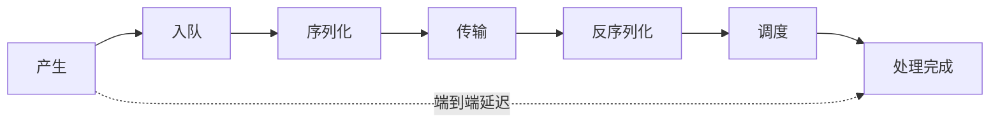
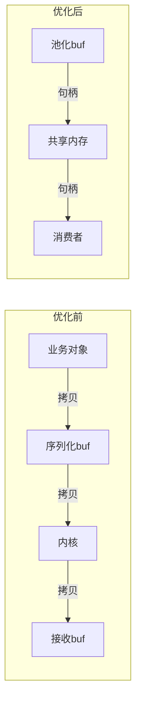

# 第 6 章：高性能通信与性能工程

## 本章目标

能围绕延迟、吞吐、抖动、CPU、内存、带宽和磁盘 I/O **建立基线、定位瓶颈、用可重复实验验证优化**。学完能独立写压测程序、读火焰图、解释 p99 尾延迟。

## 6.1 先定义指标



- **端到端延迟**：产生到消费完成。
- **分段延迟**：排队、编码、传输、解码、调度、处理各一段。
- **吞吐**：消息/秒、字节/秒。
- **抖动**：p95、p99、max、deadline miss。
- **资源**：CPU、RSS、分配次数、内存带宽、网络带宽、IOPS。

{: .important }
> **均值会骗人**。平均 4ms、p99 180ms 的系统对控制器是灾难。必须看分位数，尤其 p99/p999 和 max。

## 6.2 为什么必须看分位数

假设 100 条消息里 99 条 3ms、1 条 300ms：

$$\text{均值} = \frac{99 \times 3 + 300}{100} = 5.97\,\text{ms}$$

均值只有 6ms 看起来很好，但每 100 条就有 1 条 300ms。若控制周期是 10ms，这条就 miss 了 deadline。**尾延迟决定系统能不能用**。

## 6.3 用直方图测延迟

```cpp
#include <vector>
#include <algorithm>
#include <cstdint>
#include <cmath>

class LatencyHistogram {
public:
    void record(uint64_t ns) { samples_.push_back(ns); }

    void report() {
        if (samples_.empty()) return;
        std::sort(samples_.begin(), samples_.end());
        auto pct = [&](double p) {
            size_t idx = std::min(samples_.size() - 1,
                (size_t)std::llround(p / 100.0 * (samples_.size() - 1)));
            return samples_[idx];
        };
        printf("count=%zu p50=%.3fms p95=%.3fms p99=%.3fms max=%.3fms\n",
               samples_.size(), pct(50)/1e6, pct(95)/1e6, pct(99)/1e6,
               samples_.back()/1e6);
    }
private:
    std::vector<uint64_t> samples_;
};

// 使用：在每条消息处理完成时记录 (now - send_time_ns)
```

{: .note }
> 生产环境用固定桶的直方图（如 HdrHistogram）避免存全部样本、避免排序开销，并能在线聚合。这里为教学用简单版本。

## 6.4 减少拷贝：从多次到一次



手段：`move` 语义、buffer pool（第 3 章）、预分配、批量消息、共享内存、DDS loaned message。代价是生命周期和回收复杂度上升。**改善缓存局部性**：结构体热冷字段分离、避免不必要的指针跳转、注意 false sharing（用 `alignas(64)` 隔离高频写的原子变量）。

## 6.5 批量与系统调用

高频小消息的瓶颈常是**系统调用次数**，不是带宽。用 `sendmmsg`/`recvmmsg` 或应用层聚合：

```cpp
// 应用层聚合：攒够一批或超时再发，减少 send 次数
struct Batcher {
    std::vector<char> buf;
    size_t count = 0;
    void add(const char* frame, size_t len) {
        uint32_t n = htonl((uint32_t)len);
        buf.insert(buf.end(), (char*)&n, (char*)&n + 4);
        buf.insert(buf.end(), frame, frame + len);
        if (++count >= 32 || buf.size() >= 64 * 1024) flush();
    }
    void flush() { /* 一次 send(buf) */ buf.clear(); count = 0; }
};
```

{: .warning }
> 批量降低 CPU 和系统调用，但**增加延迟**（要等攒批）。控制路径不能批；日志、录制、上传适合批。这是吞吐与延迟的经典权衡。

## 6.6 Linux 性能工具工作流


| 工具 | 用途 |
| --- | --- |
| `perf top` / `perf record` + 火焰图 | CPU 热点、锁、调度 |
| `pidstat -t -p PID 1` | 每线程 CPU |
| `iostat -x 1` | 磁盘利用率、await |
| `ss -tin` | TCP 状态、重传、rtt |
| `strace -c -p PID` | 系统调用统计和阻塞点 |
| `perf sched` / bpftrace | 调度延迟、唤醒延迟 |
| ASan/TSan | 内存、并发缺陷 |

## 6.7 带宽与容量估算

一路 1024×768 深度点云，每点 16 字节，10Hz：

$$1024 \times 768 \times 16 \times 10 \approx 125.8\,\text{MB/s}$$

3 路相机（各 186MB/s，见第 1 章）+ 2 路点云：

$$3 \times 186 + 2 \times 126 = 810\,\text{MB/s} \approx 6.5\,\text{Gbps}$$

**结论**：远超千兆网，必须压缩或同机共享内存 + 万兆内联。估算时还要加协议头、重传、峰值突发余量（通常留 30%）。

## 6.8 真实案例：平均 4ms，p99 180ms

某链路平均 4ms，p99 却 180ms。团队一开始盲目优化序列化，无效。

**根因**：分段 trace 后发现绝大多数时间耗在**队列等待**——消费者偶发写盘阻塞，导致上游队列积压。序列化只占 0.2ms。

**修复**：隔离写盘线程、写盘用批量 + 独立队列、对高频流设 `DropOldest`。序列化根本不是瓶颈。

**验证**：修复后 p99 从 180ms 降到 8ms，均值几乎不变——证明"优化均值"和"优化尾延迟"是两回事。

## 6.9 动手实验与验收

**实验**：写一个压测程序，一个发布者 + 多个订阅者：
1. 对比"拷贝分发 vs 句柄分发"的 CPU 和 p99。
2. 对比 depth=1 / 16 / 1000 的延迟和内存。
3. 制造一个慢消费者，测其他消费者是否受影响。
4. 用 `perf record` 抓火焰图，找出 top3 热点。

**验收标准**：每个结论都有测试条件和数据；能指出吞吐提升是否牺牲了尾延迟或内存；能解释某方案适合图像但不适合控制。

## 6.10 面试问题与参考答案

**问：如何优化一条高频链路？**

答：先建立分段和端到端基线，用 tracing 确认瓶颈在拷贝、编码、锁、排队、网络还是磁盘；按收益优先优化（减少拷贝、批量 I/O、隔离慢消费者、调队列和亲和性）；每次只改一个主要变量，同时观察 p99、CPU、内存、带宽、丢帧，防止把成本转移到别处。没有测量就不能声称优化有效。

**问：为什么不能只看平均延迟？**

答：均值被大量快样本稀释，掩盖尾部。控制、实时系统的可用性由 p99/p999 和 max 决定——一次 200ms 尾延迟就可能 miss 控制 deadline。要按分位数评估，并分析尾延迟的来源（GC/分配、锁、调度、磁盘抖动、CPU 降频）。

**问：零拷贝有什么代价？**

答：减少 CPU 和内存带宽，但要求 buffer 生命周期、并发读写、跨进程崩溃回收、权限、对齐、版本兼容都更严格。它不会自动解决调度、排队和网络瓶颈。零拷贝是手段不是目标，要以端到端数据为准。

**问：批量处理为什么可能有害？**

答：批量减少系统调用和 CPU，但引入等待攒批的延迟。对控制这类低延迟路径，批量会直接增加 deadline miss；对日志、录制、上传这类吞吐优先路径才合适。要按路径的延迟敏感度分别决策。

**问：怎么估算一个机器人的通信带宽需求？**

答：逐路算 `单条大小 × 频率 × 路数`，加协议头、重传和压缩后的实际码率，再分别算平均和峰值突发，留 30% 余量。用结果决定传输方式（同机共享内存 / 万兆 / 压缩）。第 1、6 章有具体算例。
