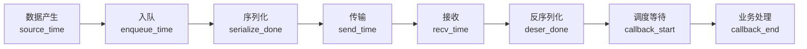
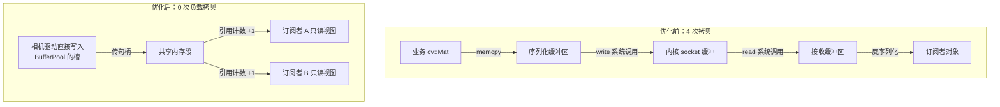
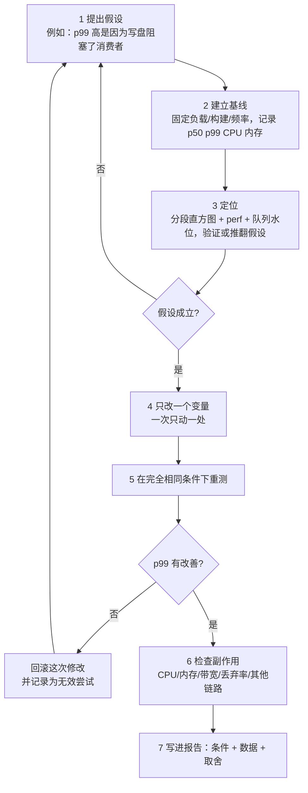
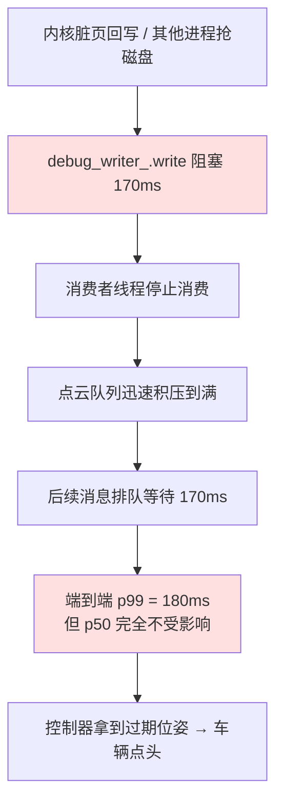

# 第 6 章：高性能通信与性能工程

## 6.1 本章目标与前置知识

### 学完本章你能

- 说清楚**延迟、吞吐、抖动、分位数、尾延迟**分别是什么，以及它们为什么不能互相替代。
- 用具体数字解释**为什么平均值会骗人**，以及尾延迟在多级链路上如何被放大。
- 把一条端到端链路**拆成可测量的阶段**，并知道每个阶段用什么工具观测。
- 实现一个可用于生产的 **`LatencyHistogram`**，以及一个**可重复的压测框架**。
- 用带宽和内存带宽算出**拷贝的真实成本**，并判断哪些拷贝值得消除。
- 说清楚**批量处理的收益与代价**，知道哪些路径绝对不能批。
- 解释**缓存行、伪共享、AoS/SoA** 对高频小消息的影响，并写出修正代码。
- 走通一套 **Linux 性能工具工作流**：从假设到基线、定位、单变量修改、重测、检查副作用。
- 在写代码之前用**容量估算**否决不可行的方案。

### 前置知识

- 第 2 章的线程、锁、`BoundedQueue`（本章会用到它的 `high_water()` 和 `dropped()`）。
- 第 3 章的 `BufferPool` 与引用计数句柄 `BufferHandle`（本章会用它做零拷贝对比实验）。
- 会用 `g++`/`clang++` 编译，会看 `top`。

{: .note }
> **本章不假设你做过性能优化。** 我们从"怎么测"开始讲，而不是从"用什么技巧"开始。原因很简单：**在没有测量的情况下做优化，等于随机修改代码。** 本章出现的所有延迟数值都是**数量级参考**，取决于硬件、内核版本、编译选项和系统负载，**必须在你的目标平台上实测**。

## 6.2 为什么"感觉快"不可信

### 一个真实到令人尴尬的场景

你写完了图像分发模块，在开发机上跑了一下，打印出来是这样：

```cpp
auto t0 = std::chrono::steady_clock::now();
publish(image);
auto t1 = std::chrono::steady_clock::now();
std::cout << "耗时 "
          << std::chrono::duration_cast<std::chrono::microseconds>(t1 - t0).count()
          << " us\n";        // 输出：耗时 180 us
```

180 微秒，非常快。你在周会上说"分发路径开销可以忽略"。

两周后车辆路测，控制器报告"位姿更新偶尔卡顿 200 毫秒"。你回到开发机上再测，还是 180 微秒。你开始怀疑是别人的模块有问题。

### 这段测量到底错在哪

这一次测量至少有六个问题，每一个都足以让结论作废：

| 问题 | 具体表现 | 后果 |
| --- | --- | --- |
| **只测了一次** | 第一次调用包含缺页中断、动态库延迟绑定、分支预测器和缓存都是冷的 | 结果可能偏大也可能偏小，反正不代表稳态 |
| **只看了一个值** | 没有分布，不知道最坏情况 | 完全看不到那个 200 ms 的尾巴 |
| **没有负载** | 开发机上只有你一个进程，CPU 空闲、缓存全归你 | 车上有 20 个进程抢 CPU 和内存带宽 |
| **测的不是端到端** | `publish` 返回只代表"塞进队列了"，不代表订阅者处理完了 | 把最贵的排队和处理段完全排除在外 | 
| **编译选项不同** | 开发机顺手用了 `-O0` 或带着 `-fsanitize=address` | 与线上 `-O2` 构建可能差 2–20 倍 |
| **硬件与频率不同** | 开发机是桌面 CPU 且开着睿频，车上是低功耗 SoC 且会热降频 | 绝对数值没有可比性 |

{: .warning }
> **"我在我机器上测过了"不是一个性能结论**，它只是一个逸事。一个可以被别人复现、可以被 CI 定期跑、写明了测试条件的数字，才是性能结论。

### 性能结论的最低要求

一条能写进文档的性能结论，必须同时说明：

```text
【指标】  端到端延迟（publish 调用起，到订阅者回调返回止）
【分布】  p50 = 210 us, p95 = 380 us, p99 = 1.2 ms, max = 4.1 ms
【负载】  6 路 1080p@30，CPU 平均占用 62%
【条件】  x86_64 8 核 @ 固定 2.4 GHz（关闭 turbo），Ubuntu 22.04 内核 5.15
【构建】  g++ 11, -O2 -DNDEBUG, 无 sanitizer
【样本】  3 轮 × 20 万条，轮间 p99 差异 < 6%
```

{: .important }
> 把这段模板抄进你的项目 README。**当性能数字没有附带条件时，它是不可信的**；当它附带了条件时，别人才能复现、才能在换硬件后重新验证。

## 6.3 核心指标与术语

### 延迟（Latency）

**延迟**是一次操作从开始到结束经过的时间。关键在于必须明确**起点和终点**：

- `publish()` 调用进入到返回 → 这是**发布开销**，通常只有几微秒到几十微秒。
- 传感器采集时刻到订阅者回调返回 → 这是**端到端延迟**，才是业务真正关心的。

两者可能差 100 倍。工程上争论"延迟是多少"时，八成是双方在说不同的起点。

### 吞吐（Throughput）

**吞吐**是单位时间处理的量，可以按条数（msg/s）或按字节（MB/s）计。

{: .important }
> **延迟和吞吐经常互相矛盾。** 批量聚合能显著提高吞吐（更少的系统调用、更好的缓存局部性），但会增加单条消息的延迟（要等凑够一批）。**任何声称"同时把两者都大幅改善"的方案都值得追问代价在哪。**

### 抖动（Jitter）

**抖动**是延迟的波动幅度。控制系统对抖动往往比对绝对延迟更敏感：

- 稳定 20 ms 延迟的位姿，控制器可以用前馈补偿掉。
- 在 5 ms 和 200 ms 之间随机跳变的位姿，无法补偿，只能保守降速。

常用度量是 $p99 - p50$，或者相邻两次到达时间差的标准差。

### 分位数（Percentile）

**分位数**回答"有百分之多少的请求比这个值快"：

- **p50（中位数）**：一半的请求比它快。代表"典型情况"。
- **p95**：95% 的请求比它快，即最慢的 5% 落在它之外。
- **p99**：只有 1% 的请求比它慢。
- **p999**（读作 p99.9）：只有 0.1% 的请求比它慢。

以 100 Hz 的控制环为例，每秒 100 次调度。p99 意味着**平均每秒就有 1 次**落在这个值之外——这不是罕见事件，是每秒都会发生的事件。

### 尾延迟（Tail Latency）

**尾延迟**指分布右端那一小撮最慢的请求（通常说 p99 及以上）。它的成因和均值完全不同：

| 均值由什么决定 | 尾延迟由什么决定 |
| --- | --- |
| 算法复杂度、拷贝量、序列化开销 | 排队等待、GC/内存分配抖动、锁竞争 |
| CPU 指令数 | 缺页中断、页回收、写盘阻塞 |
| 消息大小 | 调度延迟、被高优先级任务抢占 |
| | 网络重传、TCP 超时重传（可达数百毫秒） |

{: .warning }
> **这张表是本章最重要的一张表。** 它解释了为什么"优化序列化"经常对 p99 毫无帮助——因为尾延迟根本不是序列化造成的。

### deadline miss（超期）

**deadline** 是一条消息"必须在此之前被处理完"的时限；**deadline miss** 指超过了这个时限。

比起延迟数值，业务更关心的往往是超期率：

$$\text{miss\_rate} = \frac{\text{超过 deadline 的消息数}}{\text{消息总数}}$$

这是唯一能直接翻译成安全论证的性能指标：不是"延迟 8 ms"，而是"10 ms 周期的控制指令，一小时内超期 0 次"。

### 队列水位与饱和度

- **队列水位（queue depth / occupancy）**：队列里当前积压的消息数。第 2 章的 `high_water()` 记录的是历史峰值。
- **饱和度（saturation）**：资源被"排队等待"的程度。CPU 的饱和度看运行队列长度，磁盘看 `await`，队列看水位与容量之比。

{: .tip }
> **利用率（utilization）高不等于有问题，饱和度高才是问题。** CPU 跑到 95% 但没人排队，说明用满了资源，很健康；CPU 只有 40% 但队列一直在涨，说明有阻塞点（比如某个线程在等锁或等 I/O），这才要立刻查。第 6.13 节的案例正是后者。

## 6.4 为什么必须看分位数

### 一个能算清楚的例子

假设 100 条消息中，99 条耗时 3 ms，1 条因为消费者偶发卡顿耗时 300 ms。平均延迟是：

$$\bar{t} = \frac{99 \times 3 + 1 \times 300}{100} = \frac{297 + 300}{100} = 5.97\ \text{ms}$$

5.97 ms，看起来非常好。如果只上报这个数字，评审会直接通过。

但把分位数算出来：

$$p_{50} = 3\ \text{ms},\quad p_{95} = 3\ \text{ms},\quad p_{99} = 3\ \text{ms},\quad p_{99.9} = 300\ \text{ms},\quad \max = 300\ \text{ms}$$

对一个 100 Hz（周期 10 ms）的控制环来说，那条 300 ms 的消息意味着**连续 30 个控制周期拿不到新数据**。如果消息以 100 Hz 到达，这种情况**每秒发生一次**。

{: .important }
> **平均值把一次严重故障摊薄成了一个好看的数字。** 均值适合做容量规划（算总资源消耗），**完全不适合做实时性论证**。实时性论证只能用分位数、最大值和超期率。

### 尾延迟在多级链路上会被放大

真实链路不是一跳。假设一条链路有 5 个阶段（采集 → 分发 → 传输 → 反序列化 → 处理），每个阶段独立地有 1% 的概率进入自己的"慢路径"（即命中 p99）。那么**至少有一个阶段变慢**的概率是：

$$P(\text{至少一个阶段慢}) = 1 - (1 - 0.01)^5 = 1 - 0.99^5 \approx 1 - 0.9510 = 4.9\%$$

也就是说，每个环节都做到了 p99，**端到端的"慢"概率却接近 5%**——端到端的 p95 就已经落在慢路径上了。

阶段更多时更糟：

| 串联阶段数 $n$ | $1-0.99^n$ | 含义 |
| --- | --- | --- |
| 1 | 1.0% | 单点 p99 |
| 3 | 3.0% | 端到端接近 p97 才达标 |
| 5 | 4.9% | 端到端 p95 已在慢路径 |
| 10 | 9.6% | 每 10 条就有约 1 条慢 |
| 20 | 18.2% | 系统"经常卡"，用户能直接感知 |

{: .warning }
> **推论一：微服务化 / 节点拆分是有尾延迟代价的。** 每多拆一跳，就多一次排队、一次序列化、一次调度。拆分带来隔离性，但也稀释了实时性。
>
> **推论二：优化尾延迟要从"最容易变慢的那一段"下手，而不是从"平均最慢的那一段"下手。** 这两者常常不是同一段。

### 独立性假设的破坏会让情况更糟

上面的计算假设各阶段独立。现实中它们往往**正相关**：CPU 一忙，所有阶段一起变慢；内存带宽一满，序列化和拷贝一起变慢。相关性会让"同时变慢"的概率高于独立假设的估计，尾部更胖。

## 6.5 延迟分解：把端到端拆成分段

### 只测端到端等于没测

只知道"端到端 180 ms"无法指导任何行动。必须**分段打点**，把总延迟拆成可归因的部分。



第 3 章的 `MessageHeader` 里已经有 `source_time_ns` 和 `send_time_ns`，正是为这一步准备的。接收端再补上 `recv_time` 和 `callback_start/end`，就能算出全部分段。

### 各阶段的典型量级、失败模式与观测手段

| 阶段 | 典型量级（数量级参考，必须实测） | 主要失败模式 | 观测手段 |
| --- | --- | --- | --- |
| 产生 → 入队 | < 1 μs | 队列满导致丢弃或阻塞 | `BoundedQueue::high_water()` / `dropped()` |
| 入队 → 出队（排队） | **0 到无上界** | 消费者慢、线程被抢占 | 队列水位时序图、分段直方图 |
| 序列化 | 小消息 < 5 μs；6 MB 图像 1–10 ms | 内存分配抖动、大对象拷贝 | 分段计时、`perf record` |
| 传输（同机共享内存） | 1–5 μs | 环满、对端崩溃 | 环形缓冲区读写序号差 |
| 传输（跨机千兆） | 0.1–1 ms | 丢包、重传、拥塞 | `ss -tin` 看 `retrans`、`rtt` |
| 接收缓存 | 取决于消费速度 | 内核 socket 缓冲区积压 | `ss -tm` 看 `Recv-Q` |
| 反序列化 | 与序列化同量级 | 版本不兼容、校验失败 | 解析失败计数 |
| 调度等待 | 1 μs 到几十 ms | 线程忙于别的回调、优先级反转 | 调度延迟直方图、`perf sched` |
| 业务处理 | 业务决定 | 慢回调阻塞后续消息 | 回调耗时直方图（按 topic 分） |

{: .tip }
> **经验法则：先看排队段和调度段。** 在中间件里，超过 80% 的"p99 异常"都落在这两段，而不是落在序列化或传输上。原因见 6.3 节的尾延迟成因表——排队和调度是唯一能把延迟放大两三个数量级的环节。

### 打点的正确姿势

```cpp
// 消息随身携带分段时间戳；只在开启 trace 采样时填写，避免常态开销
struct Timeline {
    uint64_t t_source = 0;      // 传感器采集时刻
    uint64_t t_enqueue = 0;     // 进入发送队列
    uint64_t t_serialized = 0;  // 序列化完成
    uint64_t t_send = 0;        // 交给传输层
    uint64_t t_recv = 0;        // 接收线程读到
    uint64_t t_cb_begin = 0;    // 回调开始执行
    uint64_t t_cb_end = 0;      // 回调返回
};

inline uint64_t now_ns() {
    return static_cast<uint64_t>(
        std::chrono::duration_cast<std::chrono::nanoseconds>(
            std::chrono::steady_clock::now().time_since_epoch()).count());
}
```

三条注意事项：

1. **测时间间隔一定用 `steady_clock`**，不能用 `system_clock`。后者会被 NTP 调整，可能出现负的时间差。
2. **跨机器时不要直接相减**。两台机器的时钟即使做了 PTP 同步也有偏差，跨机分段要么只测单机内部，要么用往返时间除以二做估计（并注明这是估计）。
3. **采样，不要全量。** 常态下按 `sequence % 1000 == 0` 采样打点，故障排查时临时调高采样率。全量打点本身就会改变被测系统的行为。

## 6.6 工程实现：测量工具

### 第一版：保存全部样本的直方图

先写一个最直白的版本，用于离线分析和单元测试。

```cpp
#include <algorithm>
#include <cmath>
#include <cstdint>
#include <cstdio>
#include <vector>

class LatencyHistogram {
public:
    explicit LatencyHistogram(size_t reserve = 1u << 16) { samples_.reserve(reserve); }

    void record(uint64_t ns) {
        samples_.push_back(ns);
        sum_ += ns;
        if (ns > max_) max_ = ns;
        sorted_ = false;                       // 新样本进来，排序结果失效
    }

    size_t count() const { return samples_.size(); }
    uint64_t max() const { return max_; }
    double mean() const {
        return samples_.empty() ? 0.0
                                : static_cast<double>(sum_) / static_cast<double>(samples_.size());
    }

    // p 取 0..100，例如 percentile(99) 就是 p99
    uint64_t percentile(double p) {
        if (samples_.empty()) return 0;
        if (!sorted_) { std::sort(samples_.begin(), samples_.end()); sorted_ = true; }
        // 最近秩法：向上取整，保证 percentile(100) 落在最大值上
        auto n = static_cast<double>(samples_.size());
        size_t rank = static_cast<size_t>(std::ceil(p / 100.0 * n));
        if (rank == 0) rank = 1;
        if (rank > samples_.size()) rank = samples_.size();
        return samples_[rank - 1];
    }

    void report(const char* name) {
        std::printf("%-16s n=%zu mean=%.1fus p50=%.1f p95=%.1f p99=%.1f p99.9=%.1f max=%.1f\n",
                    name, count(), mean() / 1e3, percentile(50) / 1e3, percentile(95) / 1e3,
                    percentile(99) / 1e3, percentile(99.9) / 1e3, max() / 1e3);
    }

private:
    std::vector<uint64_t> samples_;
    uint64_t sum_ = 0;
    uint64_t max_ = 0;
    bool sorted_ = false;
};
```

**逐段说明**：

- **`sorted_` 标志**：`percentile` 需要有序数组。每次调用都排序太浪费，所以缓存排序状态，`record` 时置脏。
- **为什么用"最近秩法"取整**：不同工具对分位数的定义略有差异（有的做线性插值）。中间件场景样本量大（十万级），差异可以忽略，但**必须在文档里写明用的是哪种定义**，否则两个团队的 p99 无法对比。
- **为什么不返回平均值就完事**：见 6.4 节。

{: .warning }
> **这一版不能用在生产热路径上。** 每条消息 `push_back` 一个 8 字节样本，1000 Hz 跑一小时就是 360 万个样本、约 28 MB，而且 `push_back` 可能触发扩容和拷贝——**测量工具本身成了延迟尖峰的来源**。

### 第二版：固定桶直方图（生产可用）

生产环境需要：**固定内存、`record` 为 O(1) 且无分配、可以长期运行**。做法是对数分桶——低值精细、高值粗糙，因为你不需要知道某个尖峰是 137.2 ms 还是 141.6 ms，只需要知道它是"一百多毫秒"。

```cpp
#include <array>
#include <bit>
#include <cmath>
#include <cstdint>

// 对数分桶直方图：内存固定 8 KB，record 无锁无分配，相对误差 <= 1/16
class FixedHistogram {
public:
    static constexpr int    kSubBits  = 4;                 // 每个量级切 16 个子桶
    static constexpr int    kSubCount = 1 << kSubBits;      // 16
    static constexpr size_t kBuckets  = 1024;               // 足够覆盖全部 64 位取值

    void record(uint64_t ns) {
        ++count_;
        sum_ += ns;
        if (ns > max_) max_ = ns;
        ++buckets_[index_of(ns)];
    }

    uint64_t percentile(double p) const {
        if (count_ == 0) return 0;
        auto target = static_cast<uint64_t>(std::ceil(p / 100.0 * static_cast<double>(count_)));
        if (target == 0) target = 1;
        uint64_t seen = 0;
        for (size_t i = 0; i < kBuckets; ++i) {
            seen += buckets_[i];
            if (seen >= target) return upper_bound_of(i);   // 返回桶上界，保守估计
        }
        return max_;
    }

    uint64_t count() const { return count_; }
    uint64_t max() const { return max_; }
    double mean() const { return count_ ? static_cast<double>(sum_) / count_ : 0.0; }

    // 周期性上报后清零，得到"每个统计窗口"的分布而不是开机以来的累计分布
    void reset() { buckets_.fill(0); count_ = sum_ = max_ = 0; }

private:
    static size_t index_of(uint64_t v) {
        if (v < static_cast<uint64_t>(kSubCount)) return static_cast<size_t>(v);  // 低值线性分桶
        int e = 63 - std::countl_zero(v);                    // 最高有效位的位置
        auto sub = static_cast<size_t>((v >> (e - kSubBits)) & (kSubCount - 1));
        size_t idx = static_cast<size_t>(e - kSubBits + 1) * kSubCount + sub;
        return idx < kBuckets ? idx : kBuckets - 1;
    }

    static uint64_t upper_bound_of(size_t i) {
        if (i < static_cast<size_t>(kSubCount)) return i;
        int e = static_cast<int>(i / kSubCount) + kSubBits - 1;
        auto sub = static_cast<uint64_t>(i % kSubCount);
        uint64_t width = 1ull << (e - kSubBits);
        return ((static_cast<uint64_t>(kSubCount) + sub) << (e - kSubBits)) + width - 1;
    }

    std::array<uint64_t, kBuckets> buckets_{};
    uint64_t count_ = 0, sum_ = 0, max_ = 0;
};
```

**关键设计点**：

| 决策 | 理由 |
| --- | --- |
| 对数分桶 | 覆盖纳秒到分钟量级（跨 9 个数量级），内存仍只有 `1024 × 8 = 8` KB |
| 每量级 16 个子桶 | 最大相对误差 $1/16 = 6.25\%$，对性能分析足够；要更准就加大 `kSubBits`（代价是内存翻倍） |
| `record` 无分配无排序 | 可以直接放在热路径上，开销约等于一次数组自增 |
| `percentile` 返回桶上界 | 宁可报告得**偏保守**，也不要低估尾延迟 |
| 提供 `reset()` | 长期累计的直方图会被开机初期的抖动污染；生产上应按 10 秒或 60 秒窗口滚动上报 |

{: .note }
> 这就是 **HdrHistogram**（High Dynamic Range Histogram）的核心思想。生产项目可以直接用成熟实现，但你必须理解它为什么这样设计——否则会误用（比如忘记 `reset` 而把三天前的一次尖峰一直挂在 p99 上）。

### 第三版：可重复的压测框架

有了直方图，还需要一个把"预热、多轮、固定速率、报告"固化下来的框架。

```cpp
#include <algorithm>
#include <chrono>
#include <cstdint>
#include <cstdio>
#include <functional>
#include <string>
#include <thread>
#include <vector>

struct BenchConfig {
    std::string name = "bench";
    size_t   payload_bytes = 1024;   // 固定消息大小，保证轮间可比
    uint32_t rate_hz       = 1000;   // 固定发送频率；0 表示尽力而为（测吞吐上限用）
    int      warmup_iters  = 20000;  // 预热次数，不计入统计
    int      measure_iters = 200000; // 正式测量次数
    int      rounds        = 3;      // 重复轮数，用于判断结果是否稳定
};

struct BenchResult {
    uint64_t p50 = 0, p95 = 0, p99 = 0, p999 = 0, max_ns = 0;
    double   mean_ns = 0;
    double   throughput = 0;         // 条/秒
};

// op 表示"发一条消息并等它被真正处理完"的完整闭环，而不只是 publish 返回
BenchResult run_round(const BenchConfig& cfg,
                      const std::function<void(const char*, size_t)>& op) {
    using clock = std::chrono::steady_clock;
    std::vector<char> payload(cfg.payload_bytes, 0x5A);

    // 预热：让缺页中断、动态库绑定、CPU 缓存和分支预测器进入稳态
    for (int i = 0; i < cfg.warmup_iters; ++i) op(payload.data(), payload.size());

    FixedHistogram hist;
    const auto period = cfg.rate_hz
        ? std::chrono::nanoseconds(1'000'000'000ull / cfg.rate_hz)
        : std::chrono::nanoseconds(0);

    const auto t0 = clock::now();
    for (int i = 0; i < cfg.measure_iters; ++i) {
        // 计划时刻由 t0 递推得到，而不是"上次结束 + period"，避免误差累积漂移
        const auto scheduled = t0 + period * i;
        if (period.count() > 0) std::this_thread::sleep_until(scheduled);
        const auto actual = clock::now();

        op(payload.data(), payload.size());

        const auto done = clock::now();
        // 定频模式下起点取"计划时刻"：系统卡住导致本次晚发时，这段等待也必须算进延迟
        const auto origin = (period.count() > 0) ? scheduled : actual;
        hist.record(static_cast<uint64_t>(
            std::chrono::duration_cast<std::chrono::nanoseconds>(done - origin).count()));
    }
    const double elapsed = std::chrono::duration<double>(clock::now() - t0).count();

    BenchResult r;
    r.p50 = hist.percentile(50);
    r.p95 = hist.percentile(95);
    r.p99 = hist.percentile(99);
    r.p999 = hist.percentile(99.9);
    r.max_ns = hist.max();
    r.mean_ns = hist.mean();
    r.throughput = cfg.measure_iters / elapsed;
    return r;
}

void run_bench(const BenchConfig& cfg,
               const std::function<void(const char*, size_t)>& op) {
    std::printf("== %s (payload=%zuB rate=%uHz) ==\n",
                cfg.name.c_str(), cfg.payload_bytes, cfg.rate_hz);
    uint64_t p99_min = UINT64_MAX, p99_max = 0;
    for (int r = 0; r < cfg.rounds; ++r) {
        BenchResult res = run_round(cfg, op);
        p99_min = std::min(p99_min, res.p99);
        p99_max = std::max(p99_max, res.p99);
        std::printf("  round%d mean=%.1fus p50=%.1f p95=%.1f p99=%.1f p99.9=%.1f max=%.1f thr=%.0f/s\n",
                    r, res.mean_ns / 1e3, res.p50 / 1e3, res.p95 / 1e3,
                    res.p99 / 1e3, res.p999 / 1e3, res.max_ns / 1e3, res.throughput);
    }
    // 轮间波动过大说明环境不稳定，此时任何优化结论都不可信
    double spread = p99_min ? double(p99_max - p99_min) / double(p99_min) : 0.0;
    std::printf("  p99 轮间波动 %.1f%% %s\n", spread * 100,
                spread > 0.10 ? "→ 环境不稳定，结果不可用" : "→ 可用");
}
```

编译方式（**必须记录进报告**）：

```bash
g++ -std=c++20 -O2 -DNDEBUG -fno-omit-frame-pointer bench.cpp -o bench -lpthread
```

`-fno-omit-frame-pointer` 会带来约 1% 的开销，但能让 `perf` 抓到完整调用栈，非常划算。

{: .important }
> **协调遗漏（Coordinated Omission）** 是压测里最经典的陷阱。如果系统卡住 200 ms，朴素的压测循环会"少发"这段时间的请求，然后只记录恢复后那些很快的请求——**卡顿期间本该发生的慢请求被静默地跳过了**，测出来的 p99 好得离谱。修正办法就是上面代码里的做法：延迟的起点用**计划发送时刻**而不是实际发送时刻。第一次看到自己的 p99 从 2 ms 变成 180 ms 时不要慌，那才是用户真正体验到的延迟。

## 6.7 减少拷贝：先算清楚它值多少钱

### 一次内存拷贝到底有多贵

拷贝的成本可以直接用内存带宽估算。设内存带宽为 $B$，拷贝 $S$ 字节的耗时约为：

$$t_{\text{copy}} \approx \frac{S}{B}$$

取一帧 1080p RGB 图像 $S = 1920 \times 1080 \times 3 = 6\,220\,800 \approx 6.2$ MB，实测可用内存带宽 $B \approx 10$ GB/s：

$$t_{\text{copy}} \approx \frac{6.2 \times 10^6}{10 \times 10^9}\ \text{s} \approx 0.62\ \text{ms}$$

单次 0.62 ms 看着还行。但一条典型的"没优化过"的分发路径上，同一帧要被拷贝 4 次（业务对象 → 序列化缓冲 → 内核 socket 缓冲 → 接收端缓冲 → 反序列化后的业务对象）。在 30 FPS 下：

$$0.62\ \text{ms} \times 4 \times 30 = 74.4\ \text{ms/s}$$

也就是**每秒 74.4 毫秒纯粹花在搬字节上，相当于持续占用 7.4% 的一个 CPU 核**，而且消耗的是最稀缺的共享资源——内存带宽。3 路相机就是 22%，再加上点云，光拷贝就能吃掉一个核。

{: .warning }
> **内存带宽是全机共享的。** 你多用 1 GB/s，别人就少 1 GB/s。这就是为什么"我的模块 CPU 只占 8%"和"整机变慢了"可以同时成立——`top` 不显示内存带宽。

### 优化前后的拷贝链路



右边的关键是：**多个订阅者共享同一份数据，分发时只做原子引用计数加一**，而不是每人一份拷贝。这正是第 3 章 `BufferHandle` 的用途。

### 五种减少拷贝的手段与它们的代价

| 手段 | 省掉什么 | 代价 |
| --- | --- | --- |
| `std::move` / 移动语义 | 进程内的一次深拷贝 | 需要注意移动后的源对象状态；容易被隐式拷贝悄悄绕过 |
| 预分配 + 对象复用（`BufferPool`） | 每帧的 `malloc`/`free` 与缺页中断 | 池耗尽时要有降级策略；内存常驻占用变高 |
| 引用计数句柄分发 | 一份数据发给 N 个订阅者的 N-1 次拷贝 | 数据变成共享只读；生命周期由最慢的订阅者决定 |
| 共享内存（跨进程） | 用户态与内核态之间的 2 次拷贝 | 崩溃恢复复杂、需要进程间同步、不能存指针（见第 2 章） |
| loaned message（借出式 API） | 业务对象到传输缓冲的拷贝 | API 侵入性强：必须先借后写，不能先构造再发布 |

`loaned message` 的形态大致是这样：

```cpp
// 传统：先构造，再发布 → publish 内部必然拷贝一次
Image img = camera.capture();
pub.publish(img);

// 借出式：先向中间件借一块最终缓冲，直接写进去 → 发布时零拷贝
auto loaned = pub.borrow<Image>();          // 返回指向共享内存槽的句柄
camera.capture_into(loaned->data());        // 驱动直接写进最终位置
pub.publish(std::move(loaned));             // 只交出所有权，不搬字节
```

{: .important }
> **零拷贝的真正代价不是性能，是生命周期复杂度。** 数据不再属于某一个人，而是被多方共享；某个订阅者卡住不释放句柄，池就会耗尽，进而让**发布者**开始丢帧——故障从慢的那一方传染给了快的那一方。所以零拷贝必须配套：池水位监控、句柄持有超时告警、池耗尽时的降级路径（第 3 章的 `exhausted_` 计数就是为此）。

{: .tip }
> **不要无差别地消除所有拷贝。** 一条 64 字节的控制指令拷贝一次只要几纳秒，为它引入共享内存和引用计数是纯亏损。**只对大块数据做零拷贝**，判据是：单条大小 × 频率 × 拷贝次数 是否达到几十 MB/s 量级。

## 6.8 批量与系统调用

### 系统调用的固定开销

一次系统调用需要从用户态陷入内核态、保存和恢复寄存器、可能刷新部分 CPU 状态。典型固定开销约 **0.1–1 μs**（开启 Spectre/Meltdown 缓解措施后偏向上限；具体数值取决于 CPU 和内核版本，**必须实测**）。

对大消息，这个开销可以忽略：一次 `write` 发 6 MB，0.5 μs 的固定开销相对于 600 μs 的传输时间不值一提。

但对**高频小消息**，占比就非常可观。以 200 Hz 的 IMU（64 字节）为例，如果每条消息一次 `write`：

$$200 \times 0.5\ \mu s = 100\ \mu s/s$$

单路看着还好。但一个真实系统可能有 30 个高频 topic、每个 topic 有 3 个订阅者，就是 $200 \times 30 \times 3 = 18\,000$ 次/秒：

$$18\,000 \times 0.5\ \mu s = 9\ \text{ms/s}$$

接近 1% 的核，且这部分开销**完全不产生任何业务价值**。

### 批量聚合的实现

`writev` 可以把多个不连续的缓冲区在**一次系统调用**里发出，避免了"先拼接到一个大缓冲区（一次拷贝）再发送"。

```cpp
#include <sys/uio.h>
#include <arpa/inet.h>
#include <chrono>
#include <vector>

// 把多条小消息聚合成一次 writev；同时受"条数上限"和"延迟上限"两个约束
class BatchWriter {
public:
    BatchWriter(int fd, size_t max_msgs, std::chrono::microseconds max_delay)
        : fd_(fd), max_msgs_(max_msgs), max_delay_(max_delay) {
        // 必须预留容量：iov_ 里保存了指向 lens_ 元素的裸指针，vector 扩容会让它们全部失效
        lens_.reserve(max_msgs_);
        iov_.reserve(max_msgs_ * 2);
    }

    // 注意：data 指向的缓冲必须活到 flush() 之后（调用方通常用 BufferPool 的句柄保证）
    void append(const char* data, uint32_t len) {
        if (iov_.empty()) batch_start_ = std::chrono::steady_clock::now();
        lens_.push_back(htonl(len));                              // 4 字节长度前缀
        iov_.push_back(iovec{&lens_.back(), sizeof(uint32_t)});
        iov_.push_back(iovec{const_cast<char*>(data), len});
        if (lens_.size() >= max_msgs_) flush();                    // 条数触发
    }

    // 由事件循环空闲时或定时器调用，保证延迟有上界
    void tick() {
        if (iov_.empty()) return;
        if (std::chrono::steady_clock::now() - batch_start_ >= max_delay_) flush();  // 超时触发
    }

    void flush() {
        if (iov_.empty()) return;
        ssize_t n = ::writev(fd_, iov_.data(), static_cast<int>(iov_.size()));
        // 生产环境必须处理部分写：writev 可能只写了前面几个 iovec，
        // 需要按已写字节数裁剪 iov_ 并注册 EPOLLOUT 续写，而不是直接丢弃。
        if (n < 0) ++errors_;
        iov_.clear();
        lens_.clear();
        ++batches_;
    }

private:
    int fd_;
    size_t max_msgs_;
    std::chrono::microseconds max_delay_;
    std::chrono::steady_clock::time_point batch_start_{};
    std::vector<uint32_t> lens_;
    std::vector<iovec>    iov_;
    uint64_t batches_ = 0, errors_ = 0;
};
```

{: .warning }
> 三个必踩的坑：**（1）`iov_` 保存的是指针，`lens_` 扩容会让它们全部悬空**，所以构造时必须 `reserve` 并严格限制条数。**（2）`writev` 的 iovec 数量有上限**（Linux 上 `IOV_MAX` 通常是 1024），超过会返回 `EINVAL`。**（3）`writev` 和 `write` 一样可能部分写**，非阻塞 socket 上尤其常见，必须处理。

UDP 场景可以用 `sendmmsg` 一次发多个独立数据报，思路相同。

### 批量的收益与代价

| 维度 | 不批量 | 批量（N 条一发） |
| --- | --- | --- |
| 系统调用次数 | N 次 | 1 次 |
| CPU 开销 | 高（固定开销 × N） | 低 |
| 吞吐 | 低 | 高 |
| **单条最坏延迟** | 低 | **增加最多一个 `max_delay`** |
| 抖动 | 小 | 变大（同批内第一条等最久，最后一条几乎不等） |
| 故障时的损失粒度 | 1 条 | 最多 N 条（一批一起丢） |
| 实现复杂度 | 低 | 需要超时刷新、部分写处理、缓冲生命周期管理 |

{: .important }
> **批量的黄金规则：控制路径不能批，数据留存路径应该批。**
>
> - **不能批**：控制指令、急停、心跳、状态反馈。这些消息小、频率有限、对延迟极端敏感，批量带来的 CPU 节省远远抵不上增加的延迟风险。
> - **应该批**：日志、录制落盘、遥测上传、诊断数据。这些吞吐大、延迟不敏感，批量能把磁盘和网络效率提升数倍（第 8 章的 chunk 设计正是批量的产物）。
>
> **必须有超时刷新。** 只按"凑够 N 条"刷新的批量器，在流量突然变稀时会让最后几条消息永远卡在缓冲区里——这是一类非常隐蔽、只在低负载时出现的 bug。

## 6.9 缓存与内存布局

### 缓存行：性能的最小单位

CPU 访问内存不是按字节，而是按**缓存行（cache line）**，x86-64 上通常是 **64 字节**。你读 1 个字节，CPU 也会把包含它的整条 64 字节拉进缓存。

从 CPU 视角看，各级存储的访问代价大致是（数量级参考，随平台差异很大）：

| 层级 | 典型延迟 | 相对倍数 |
| --- | --- | --- |
| L1 缓存 | ~1 ns | 1× |
| L2 缓存 | ~4 ns | 4× |
| L3 缓存 | ~15 ns | 15× |
| 主存 | ~80 ns | 80× |

一次缓存未命中约等于 80 条 L1 命中的代价。对每秒处理几十万条消息的中间件，布局带来的差距是数倍而不是几个百分点。

### 伪共享（False Sharing）

两个变量在逻辑上毫无关系，但物理上落在同一条缓存行里。两个核心分别高频写它们时，缓存行的所有权会在核心之间来回弹跳（cache line ping-pong），性能可能下降数倍。

```cpp
// 错误：两个计数器挤在同一条缓存行里
struct Stats {
    std::atomic<uint64_t> published;   // 发布线程每条消息写一次
    std::atomic<uint64_t> dropped;     // 接收线程每次丢弃写一次
};                                     // 两个 8 字节字段，必然同缓存行

// 正确：各自独占一条缓存行
struct alignas(64) PaddedCounter {
    std::atomic<uint64_t> v{0};
    char pad[64 - sizeof(std::atomic<uint64_t>)]{};   // 填满整行，防止邻居挤进来
};

struct Stats {
    PaddedCounter published;
    PaddedCounter dropped;
};
static_assert(sizeof(PaddedCounter) == 64, "填充大小不对，检查平台");
```

C++17 起可以用标准提供的常量代替硬编码的 64：

```cpp
#include <new>
// 实现提供时用标准值，否则退回到 64（GCC 会对使用该常量的 ABI 发出警告，注意编译选项）
constexpr size_t kCacheLine = std::hardware_destructive_interference_size;
```

{: .tip }
> **伪共享只影响"多个核心高频写相邻变量"的场景。** 只读数据共享缓存行完全没问题，甚至更好（一次加载多个有用字段）。不要盲目给所有结构体加 `alignas(64)`，那会让内存占用暴涨、缓存命中率下降。

### AoS vs SoA

**AoS（Array of Structures，结构体数组）**是最自然的写法；**SoA（Structure of Arrays，数组结构体）**把同类字段连续存放。

```cpp
// AoS：每个点独立成结构体
struct PointAoS {
    float x, y, z;        // 12 字节
    float intensity;      //  4 字节
    uint32_t ring;        //  4 字节
    uint64_t t_ns;        //  8 字节（8 字节对齐 → 结构体被填充到 32 字节）
};
std::vector<PointAoS> cloud;      // sizeof(PointAoS) == 32

// SoA：同类字段连续
struct CloudSoA {
    std::vector<float> x, y, z;
    std::vector<float> intensity;
    std::vector<uint32_t> ring;
    std::vector<uint64_t> t_ns;
};
```

现在考虑一个只用坐标的操作（比如做体素降采样，只读 x/y/z）：

- **AoS**：一条 64 字节缓存行装 2 个点，其中有用的只有 $2 \times 12 = 24$ 字节。有效利用率 $24/64 = 37.5\%$。
- **SoA**：遍历 `x` 数组，一条缓存行装 16 个 float，**全部有用**，利用率 100%。而且访问模式是纯顺序的，硬件预取器能完美工作。

对 78 万点的点云，这个差距大约是 2.7 倍的内存读取量。

| 场景 | 推荐布局 | 理由 |
| --- | --- | --- |
| 每次都要访问一个元素的全部字段 | AoS | 一次加载就够，SoA 反而要读多条缓存行 |
| 批量只处理部分字段（滤波、降采样、投影） | SoA | 缓存利用率高，且易于 SIMD 向量化 |
| 需要按点为单位增删 | AoS | SoA 要同步维护多个数组，容易出错 |
| 需要序列化后跨进程传输 | 看第 3 章 | FlatBuffers 等格式对布局有自己的约束 |

### 热冷字段分离

同样的思路用在消息结构上：把**每条消息都要读的字段（热）**和**只在出错或调试时才读的字段（冷）**分开。

```cpp
// 改进前：热字段和冷字段混在一起，读一次 sequence 要把整个 128 字节拉进缓存
struct MsgMeta {
    uint64_t sequence;
    uint64_t t_source;
    char     source_node_name[64];   // 冷：只在日志里用
    char     trace_context[32];      // 冷：只在采样 trace 时用
    uint32_t deadline_ms;
};

// 改进后：热路径只碰前 24 字节，冷数据按需通过指针访问
struct MsgMetaHot {
    uint64_t sequence;
    uint64_t t_source;
    uint32_t deadline_ms;
    uint32_t cold_index;             // 指向冷数据表的下标，绝大多数时候用不到
};
```

{: .note }
> **这类优化只在高频小消息路径上有意义。** 200 Hz 的 IMU、1000 Hz 的内部事件、每条消息都要走的分发表查找，才值得为缓存布局操心。6 MB 的图像每秒 30 帧，瓶颈在带宽而不在缓存行，做这些是浪费时间。**永远先测，再改。**

## 6.10 Linux 性能工具工作流

### 工作流本身比工具重要



{: .important }
> **第 4 步"只改一个变量"是整个流程里最容易被违反、代价也最大的一条。** 一次改了队列深度、线程数和批量大小，结果 p99 降了一半——你永远不知道是哪个起了作用，甚至可能其中一个改善了 60%、另一个恶化了 10%。下次换个平台，你就只能全部重来。

### 工具速查表

| 工具 | 回答什么问题 | 典型用法 |
| --- | --- | --- |
| `perf top` | 现在 CPU 时间烧在哪个函数上 | 快速定位 on-CPU 热点 |
| `perf record` + 火焰图 | 完整调用栈层面的热点分布 | 找出"是谁调用了这个热函数" |
| `perf stat` | IPC、缓存未命中、上下文切换次数 | 判断是"指令多"还是"访存差" |
| `perf sched` / `bpftrace` | 线程为什么**不在** CPU 上（off-CPU） | 排查等锁、等 I/O 造成的尾延迟 |
| `pidstat -t 1` | 每个**线程**的 CPU 占用 | 判断哪个线程是瓶颈、哪个线程在空转 |
| `iostat -x 1` | 磁盘利用率、`await`、队列长度 | 确认写盘是否阻塞 |
| `ss -tin` | TCP 重传、RTT、拥塞窗口、`Recv-Q` | 确认是网络问题还是应用问题 |
| `strace -c -p PID` | 系统调用次数和累计耗时排名 | 发现"每条消息 5 次 syscall"这类问题 |
| `bpftrace` | 自定义的内核/用户态函数耗时直方图 | 低开销地量化任意函数的分布 |
| ASan / TSan | 内存越界、数据竞争 | **只用于正确性验证，绝不用于性能测量** |

### 从零到一张火焰图

```bash
# 步骤 0：先让环境可重复（需要 root；路径因发行版和机型而异）
sudo cpupower frequency-set -g performance          # 固定为性能调频策略
echo 0 | sudo tee /sys/devices/system/cpu/cpufreq/boost   # 关闭 turbo，避免频率漂移
# 允许非 root 采样（或全程用 sudo）
echo -1 | sudo tee /proc/sys/kernel/perf_event_paranoid

# 步骤 1：先看全局，别急着 record
pidstat -t 1 5                    # 哪个线程忙？忙的是不是你以为的那个？
iostat -x 1 5                     # 磁盘 %util 和 await 是否异常？
ss -tin | head -20                # 有没有 retrans？Recv-Q 是不是一直不为 0？

# 步骤 2：确认是 CPU 热点后，采样 30 秒
sudo perf record -F 999 -g --call-graph dwarf -p $(pgrep -f my_middleware) -- sleep 30

# 步骤 3：先看文本报告，很多时候到这里就够了
sudo perf report --stdio --sort=comm,dso,symbol | head -40

# 步骤 4：生成火焰图（需要 https://github.com/brendangregg/FlameGraph）
sudo perf script > out.perf
./FlameGraph/stackcollapse-perf.pl out.perf > out.folded
./FlameGraph/flamegraph.pl out.folded > flame.svg
# 用浏览器打开 flame.svg：横轴是样本占比（不是时间轴），越宽越值得优化；
# 纵轴是调用栈深度，点击任一格可以下钻。
```

**火焰图的正确读法**：找**最宽的那些平顶**（自身耗时高的叶子函数），而不是看最高的塔。塔高只说明调用层次深，不代表慢。

### on-CPU 之外：尾延迟通常藏在 off-CPU

`perf record` 采样的是"线程正在 CPU 上执行"的时间。但排队等待、等锁、等磁盘的时间线程根本不在 CPU 上，**火焰图上完全看不见**。而尾延迟的主要成因恰恰是这些。

```bash
# 用 bpftrace 量化某个函数的耗时分布（直方图在内核里聚合，开销远低于 strace）
sudo bpftrace -e '
uprobe:/opt/app/my_middleware:_ZN9Publisher7publishERK7Message { @s[tid] = nsecs; }
uretprobe:/opt/app/my_middleware:_ZN9Publisher7publishERK7Message /@s[tid]/ {
    @ns = hist(nsecs - @s[tid]); delete(@s[tid]);
}'
# 输出是一张 2 的幂次分桶的直方图，能一眼看出是否存在双峰分布。
# 双峰 = 存在两条不同的代码路径（比如"命中缓存"和"未命中要等锁"），
# 这是定位尾延迟最有价值的信号之一。

# 查看被内核记录的调度延迟（线程就绪但拿不到 CPU 的时间）
sudo perf sched record -- sleep 10 && sudo perf sched latency --sort max | head -20
```

{: .tip }
> **应用层的分段直方图（6.5 节）是最便宜也最有效的 off-CPU 观测手段。** 你不需要 bpftrace 才能发现"排队占了 170 ms"——只要在入队和出队各打一个时间戳就够了。系统级工具用来验证根因，应用级打点用来发现问题所在的段。

## 6.11 容量估算：在写代码之前否决方案

### 三条数据流的码率

**单路 1080p RGB，30 FPS：**

$$1920 \times 1080 \times 3 = 6\,220\,800\ \text{B} \approx 6.2\ \text{MB/帧}$$

$$6.2\ \text{MB} \times 30 = 186\ \text{MB/s} \approx 1.49\ \text{Gbps}$$

**单路深度点云，1024 × 768，每点 16 字节（x/y/z/intensity 各 4 字节），10 Hz：**

$$1024 \times 768 \times 16 = 12\,582\,912\ \text{B} \approx 12.58\ \text{MB/帧}$$

$$12.58\ \text{MB} \times 10 = 125.8\ \text{MB/s} \approx 1.01\ \text{Gbps}$$

**整机：3 路相机 + 2 路点云：**

$$3 \times 186 + 2 \times 125.8 = 558 + 251.6 = 809.6\ \text{MB/s}$$

$$809.6 \times 8 \approx 6.48\ \text{Gbps}$$

### 估算必须加的三项余量

原始码率只是下限，实际规划还要加上：

| 余量项 | 典型幅度 | 说明 |
| --- | --- | --- |
| 协议开销 | 3%–8% | 以太网帧头 + IP + TCP/UDP + 中间件消息头。1500 字节 MTU 下约 5% |
| 重传与纠错 | 1%–10% | 无线链路上可能远高于此；有线千兆通常 < 1% |
| 峰值突发余量 | **≥ 30%** | 多个传感器的帧恰好对齐时会出现瞬时峰值，链路必须扛得住 |

带 30% 突发余量后：

$$809.6 \times 1.3 \approx 1052\ \text{MB/s} \approx 8.4\ \text{Gbps}$$

### 结论

| 链路 | 理论上限 | 实际可用（约） | 能否承载 8.4 Gbps |
| --- | --- | --- | --- |
| 千兆以太网 | 1 Gbps | ~0.94 Gbps | **差 9 倍，完全不可行** |
| 2.5G 以太网 | 2.5 Gbps | ~2.3 Gbps | 不可行 |
| 万兆以太网 | 10 Gbps | ~9.4 Gbps（且 CPU 开销显著） | 勉强，几乎没有余量 |
| 同机共享内存 | 受内存带宽限制（数十 GB/s） | 数 GB/s 量级 | 可行 |

{: .important }
> **这段计算只花了五分钟，但它直接决定了系统架构：**
>
> 1. **原始图像绝不能跨机传输。** 必须压缩（H.264 可以把 186 MB/s 压到几 Mbps，代价是编解码延迟和有损）、降分辨率、降帧率，或者干脆不传。
> 2. **感知模块必须和传感器同机部署**，用共享内存 + 引用计数句柄（6.7 节）。
> 3. **跨机只传"结果"不传"原料"**：传检测框（几 KB）而不是图像，传位姿（128 B）而不是点云。
> 4. 如果必须跨机传原始数据（比如离线数据采集），那就要专门规划：独立的万兆链路、专用网卡队列，并且与控制平面**物理隔离**（第 1 章）。

{: .tip }
> **落盘也要同样算一遍。** 809.6 MB/s 持续写入，一次 2 小时的采集就是 $809.6 \times 3600 \times 2 \approx 5.8$ TB。即使磁盘写得下（NVMe 可以），存储成本和回传时间也会失控。这正是第 8 章要讨论压缩、抽帧和分级录制的原因。

## 6.12 常见错误与陷阱

### 陷阱一：用 sanitizer 构建测性能

```bash
# 错误：这个二进制的性能数据毫无意义
g++ -O1 -fsanitize=address,undefined bench.cpp -o bench
```

ASan 会给每次内存访问插桩、把内存布局完全改变（红区、影子内存），典型减速 2–5 倍，且**改变的是相对比例而不只是绝对值**——你会得出完全错误的热点排名。TSan 更夸张，可达 5–15 倍。

**正确做法**：正确性用 sanitizer 验证（第 2 章），性能用 `-O2 -DNDEBUG` 的干净构建测量。这是两次独立的运行。

### 陷阱二：只看平均值

见 6.4 节。**任何只有一个数字的性能报告都应该被打回。** 至少要有 p50 / p99 / max 三个数。

### 陷阱三：没有预热就测第一次

```cpp
// 错误：第一次调用包含了首次缺页、动态库延迟绑定、冷缓存、冷分支预测器
auto t0 = clock::now();
publish(msg);                 // 这一次可能比稳态慢 10 倍
auto t1 = clock::now();
```

**正确做法**：先跑几万次预热，再开始统计。反过来，如果你关心的**恰恰是**启动阶段的性能（比如上电后第一条控制指令），那就单独测冷启动，并在报告里明确标注"冷启动路径"。

### 陷阱四：一次改多个变量

同时改了队列深度、线程数、批量大小，p99 降了。你无法归因，也无法在换平台后重现。

**正确做法**：一次一个变量，每次都重测并记录。看起来慢，实际上比"改一堆然后回头逐个排除"快得多。

### 陷阱五：在有其他负载的机器上测

编译任务、浏览器、IDE 的索引进程、另一个人的测试，都会污染结果——**而且主要污染的是尾延迟**，正好是你最关心的部分。

**正确做法**：用专用测试机；用 `taskset`/`cgroup` 隔离；测试前用 `uptime` 确认负载接近 0；同一组对比实验必须在同一台机器的同一时段完成。

### 陷阱六：用 `-O0` 测

`-O0` 下没有内联、没有寄存器分配优化，`std::vector::operator[]` 会变成真正的函数调用。测出来的热点分布和 `-O2` 完全不同。

```bash
# 错误：debug 构建
g++ -O0 -g bench.cpp -o bench

# 正确：与线上一致的优化级别 + 可采样的调用栈
g++ -O2 -DNDEBUG -g -fno-omit-frame-pointer bench.cpp -o bench
```

{: .warning }
> 反过来也要小心：`-O2` 下编译器可能把你的整段基准代码**优化掉**（因为结果没被使用）。防止办法是把结果写进一个 `volatile` 变量，或者用 benchmark 框架提供的 `DoNotOptimize`。看到"某函数耗时 0.3 ns"时，先怀疑是不是被优化没了。

### 陷阱七：忘记固定 CPU 频率和关闭 turbo

现代 CPU 的频率会随温度、负载、功耗预算动态变化，范围可能是 1.2 GHz 到 4.5 GHz。同一段代码在不同时刻测，结果可以差 3 倍。长时间压测还会触发热降频，导致**后面的轮次系统性地比前面慢**。

```bash
sudo cpupower frequency-set -g performance
echo 0 | sudo tee /sys/devices/system/cpu/cpufreq/boost
cat /proc/cpuinfo | grep MHz          # 测试前后各看一次，确认没有漂移
```

嵌入式平台还要额外确认散热和功耗模式（很多 SoC 有 `nvpmodel`、`cpufreq` 之类的电源策略），并且**报告里必须写明用的是哪个模式**。

### 陷阱八：优化了不是瓶颈的部分

这是最浪费时间的一个。阿姆达尔定律给出了上限：如果某部分占总时间的比例是 $f$，把它加速 $s$ 倍，整体加速比为：

$$S = \frac{1}{(1 - f) + \dfrac{f}{s}}$$

序列化只占 5%（$f = 0.05$），你把它优化到**无限快**（$s \to \infty$）：

$$S_{\max} = \frac{1}{1 - 0.05} = 1.053$$

**上限只有 5.3%**。花两周把序列化改成 FlatBuffers，换来 5% 的改善——而真正的瓶颈还在那里纹丝不动。6.13 节就是这个错误的真实版本。

## 6.13 真实案例：平均 4 ms，p99 却 180 ms

### 现象

某车载感知链路上线后，控制团队反馈"位姿偶尔跳变，车辆有轻微点头"。感知团队查了自己的监控面板：**端到端平均延迟 4.1 ms，完全达标**，于是认为不是自己的问题。

争执了一周后，双方决定一起上分位数监控。结果是：

$$p_{50} = 3.8\ \text{ms},\quad p_{95} = 5.2\ \text{ms},\quad p_{99} = 180\ \text{ms},\quad \max = 2.3\ \text{s}$$

平均值 4.1 ms 完全没错，但它把每 100 条里那 1 条 180 ms 摊薄了。30 Hz 的感知输出，意味着**大约每 3 秒就有一次 180 ms 的空窗**——正好对得上"偶尔点头"。

### 第一轮排查（走了弯路）

团队的第一反应是"序列化太慢"。理由是消息里有点云，看起来最重。于是投入两周：

1. 把 Protobuf 换成 FlatBuffers。
2. 给点云字段加了字段级压缩。

**结果：p99 从 180 ms 变成 178 ms。** 几乎没有变化。

事后用分段打点一测才知道：**序列化只占 0.2 ms**，占端到端均值的 5%。按阿姆达尔定律，就算做到零耗时，整体上限也只有 5%。这两周从一开始就注定失败。

{: .warning }
> **"看起来最重的那部分"往往不是瓶颈。** 直觉在性能工程里的准确率极低。这也是为什么本章把"怎么测"放在"怎么优化"前面。

### 第二轮排查（分段 trace）

按 6.5 节的方法在每个阶段打点，采样 1/100，跑了 10 分钟。把慢样本（> 50 ms）单独拉出来看分段构成：

| 阶段 | p50 | 慢样本（p99）的分段耗时 |
| --- | --- | --- |
| 采集 → 入队 | 0.05 ms | 0.05 ms |
| **入队 → 出队（排队等待）** | **0.3 ms** | **171 ms** |
| 序列化 | 0.2 ms | 0.2 ms |
| 传输（共享内存） | 0.1 ms | 0.1 ms |
| 反序列化 | 0.2 ms | 0.2 ms |
| 回调处理 | 2.9 ms | 3.1 ms |

结论一眼可见：**慢的那部分 95% 的时间都花在队列里等待**，其他阶段在慢样本里几乎没有变化。

再看队列指标：`high_water()` 峰值 = 容量上限，`dropped()` 为 0（当时用的是 `Block` 策略）。说明消费者周期性地完全停止消费。

### 根因

用 `pidstat -t 1` 观察，在延迟尖峰期间，消费者线程 CPU 接近 0——**它不是在忙，是在阻塞**。`iostat -x 1` 同时显示磁盘 `await` 飙到数百毫秒。

顺着看代码，消费者回调里除了处理点云，还顺手做了一件事：把每一帧的调试快照写进磁盘。

```cpp
// 问题代码（简化）
void on_pointcloud(const CloudHandle& cloud) {
    auto result = process(cloud);          // 2.9 ms，正常
    publish(result);
    debug_writer_.write(cloud);            // 同步写盘，平时 0.1 ms
                                           // 但页缓存回写时会阻塞数百毫秒
}
```

平时页缓存吸收了写入，看不出问题。当内核触发脏页回写、或者日志轮转、或者另一个进程也在写盘时，这一行会阻塞 100–2000 ms。**消费者一停，队列立刻积压，后面所有消息的排队时间全部被拉长。**



注意这条链路的关键特征：**均值几乎不受影响**（因为只有 1% 的消息撞上回写窗口），但尾延迟被放大了两个数量级。这正是 6.3 节那张"尾延迟成因表"里"写盘阻塞"这一行的教科书案例。

### 方案与取舍

| 措施 | 收益 | 代价 |
| --- | --- | --- |
| **把写盘移到独立线程 + 独立有界队列** | 消费者不再被 I/O 阻塞 | 多一个线程；写盘队列满时要有策略 |
| **写盘队列用批量 I/O**（6.8 节，攒 64 帧或 200 ms 刷一次） | 磁盘吞吐提升约 4 倍，`await` 显著下降 | 崩溃时最多丢一批（对调试快照可接受） |
| **点云队列改为 `DropOldest`**（第 2 章） | 消费者暂时落后时丢旧帧而不是让全链路排队 | 丢帧，但丢的本来就是过期数据 |
| **调试快照改为按需开启 + 抽样 1/10** | 常态下磁盘压力降低一个数量级 | 排查问题时数据密度下降 |
| **加监控：队列水位、`dropped()`、写盘队列深度** | 下次同类问题几分钟就能定位 | 少量额外指标开销 |

{: .important }
> **注意这里的取舍本质：用"可控的、可计数的丢弃"换掉"不可控的、全链路的延迟传染"。** 这是中间件设计里反复出现的同一个模式（第 1 章的画龙案例、第 2 章的全局锁案例，本质完全相同）。

### 验证

改完之后，在**完全相同的负载和构建条件**下重测：

| 指标 | 优化前 | 优化后 | 说明 |
| --- | --- | --- | --- |
| mean | 4.1 ms | 3.9 ms | **几乎没变**——这正是关键证据 |
| p50 | 3.8 ms | 3.8 ms | 无变化 |
| p95 | 5.2 ms | 4.6 ms | 略有改善 |
| **p99** | **180 ms** | **8 ms** | **降低 22 倍** |
| max | 2.3 s | 41 ms | 降低 56 倍 |
| 丢帧率 | 0% | 0.7% | 新增，但可计数、可解释 |
| 消费者线程 CPU | 34% | 36% | 略增（多了句柄管理） |
| 写盘线程 CPU | — | 5% | 新增开销 |
| 磁盘 `await` p99 | 480 ms | 22 ms | 批量 I/O 的直接效果 |

同时做了故障注入验证：人为让磁盘停顿 3 秒，点云链路 p99 保持在 12 ms 以内，丢帧率短暂升到 9% 后自动恢复。

{: .important }
> **本案例最重要的一条结论：`mean` 几乎没变，而 `p99` 降低了 22 倍。这直接证明了"优化均值"和"优化尾延迟"是两件不同的事。** 如果团队继续盯着那个好看的 4.1 ms，这个问题永远不会被发现，更不会被解决。

## 6.14 动手实验与验收

### 实验一：实现 `LatencyHistogram` 并压测（120 分钟）

1. 实现 6.6 节的两个版本，写单元测试验证：
   - 100 个样本 `1..100`，`percentile(50)` 应为 50，`percentile(99)` 应为 99，`percentile(100)` 应为 100。
   - `FixedHistogram` 与 `LatencyHistogram` 在 10 万个随机样本上的 p99 相对误差 **< 6.25%**（对数分桶的理论上界）。
2. 构造 6.4 节的场景：99 个 3 ms 样本 + 1 个 300 ms 样本，验证 `mean ≈ 5.97 ms` 而 `p99.9 = 300 ms`。
3. 用 `run_bench` 压测第 4 章的 `Publisher::publish`，记录三轮 p99 的波动。
4. **故意破坏可重复性**：另开一个终端跑 `stress-ng --cpu 8` 或一次全量编译，重测并对比 p99 的变化幅度。

### 实验二：拷贝分发 vs 句柄分发（120 分钟）

1. 实现两条路径：A 每个订阅者拷贝一份 6.2 MB 图像；B 用第 3 章的 `BufferHandle` 只做引用计数。
2. 订阅者数量取 1 / 2 / 4 / 8，各测 p50、p99、CPU 占用、进程 RSS。
3. 用公式 $t_{copy} \approx S/B$ 预测 A 路径的 CPU 开销，与实测对比，解释差异来源。
4. 记录 B 路径的池水位；**故意让一个订阅者持有句柄 5 秒不释放**，观察池耗尽后发布者的行为。

**预期**：A 路径的 CPU 随订阅者数量近似线性增长，B 路径几乎不变；但 B 路径在句柄泄漏时会让发布者开始丢帧——这就是零拷贝的代价。

### 实验三：队列深度对延迟和内存的影响（90 分钟）

1. 用第 2 章的 `BoundedQueue`，深度分别取 1、16、1000，策略统一为 `DropOldest`。
2. 让消费者比生产者慢 20%，各跑 60 秒，记录：p50、p99、max、`high_water()`、`dropped()`、进程 RSS。
3. 画出"深度 → p99"和"深度 → 内存"两条曲线。

**预期**：深度从 1 增到 16，丢弃率显著下降而延迟增加不多；深度增到 1000 后丢弃率几乎不再改善，但 p99 和内存急剧上升——**这就是"无界队列把丢消息换成了延迟无限增长"的实测版本**。

### 实验四：慢消费者隔离（90 分钟）

1. 三个订阅者共享一个发布者：控制（100 Hz、`DropOldest`、深度 1）、感知（30 Hz、深度 4）、录制（`Block`、深度 256）。
2. 在录制订阅者里注入 `sleep(500ms)` 的周期性阻塞。
3. 分别测试"共用线程池"和"每路独立线程 + 独立队列"两种配置下，**控制链路**的 p99。

**预期**：共用配置下控制 p99 被拖到数百毫秒；隔离配置下控制 p99 基本不受影响，只有录制链路自己受损。

### 实验五：用 perf 找出 top 3 热点（90 分钟）

1. 按 6.10 节的步骤生成火焰图。
2. 写出 top 3 热点函数、各自的样本占比。
3. 对每个热点，用阿姆达尔公式估算"把它优化掉 50%"的整体收益上限。
4. **只对收益上限最高的那一个**动手，重测并验证预测是否准确。

### 验收标准

- [ ] 我的每一条性能结论都写明了：指标定义、分布（不只是均值）、负载、硬件、构建选项、样本量。
- [ ] `FixedHistogram` 在热路径上 `record` 不做任何内存分配，且内存占用固定。
- [ ] 压测框架有预热、多轮，并在轮间波动 > 10% 时明确报告"结果不可用"。
- [ ] 压测的延迟起点用的是**计划发送时刻**，我能解释协调遗漏为什么会低估 p99。
- [ ] 我能画出实验二中拷贝路径与句柄路径的差异图，并说出后者的代价。
- [ ] 我能用队列水位和 `dropped()` 解释实验三里 p99 上升的原因。
- [ ] 我能读懂火焰图，说出"最宽的平顶"和"最高的塔"哪个更值得优化，为什么。
- [ ] 每次优化我都只改了一个变量，并记录了无效的尝试（而不是只记录成功的）。
- [ ] 我检查了副作用：CPU、内存、带宽、丢弃率、其他链路的延迟都没有恶化。

## 6.15 本章小结与自查清单

### 核心结论

1. **没有测量条件的性能数字是逸事，不是结论。** 必须记录指标定义、分布、负载、硬件、构建选项、样本量。
2. **均值适合容量规划，分位数才能做实时性论证。** 99 条 3 ms + 1 条 300 ms 的均值是漂亮的 5.97 ms，却每 100 条就 miss 一次 10 ms 周期。
3. **尾延迟在多级链路上会被放大**：5 个阶段各自 p99 达标，端到端的慢概率就接近 5%。
4. **尾延迟和均值的成因完全不同**：均值由算法和拷贝决定，尾延迟由排队、阻塞、调度、重传决定。所以**优化均值的手段对 p99 常常无效**。
5. **必须分段测量。** 只测端到端无法指导任何行动；80% 的 p99 问题落在排队段和调度段。
6. **拷贝成本可以用带宽算清楚**：6.2 MB 图像在 10 GB/s 下约 0.62 ms，30 FPS 拷 4 次就是 74.4 ms/s。零拷贝的代价是生命周期复杂度，只对大块数据做。
7. **批量提高吞吐、增加延迟**：控制路径不能批，录制/日志/上传应该批，且必须有超时刷新。
8. **高频小消息要关心缓存**：伪共享用 `alignas(64)` 解决，批量字段访问用 SoA，热冷字段分离。
9. **容量估算五分钟就能否决一个架构**：3 相机 + 2 点云 ≈ 810 MB/s ≈ 6.5 Gbps，加 30% 余量后千兆网差 9 倍，必须压缩或同机共享内存。
10. **性能工作流的纪律比工具更重要**：假设 → 基线 → 定位 → **只改一个变量** → 同条件重测 → 检查副作用。

### 自查清单

- [ ] 我能准确说出 p50、p95、p99、p999 的含义，以及 p99 对 100 Hz 系统意味着什么。
- [ ] 我能算出 99 条 3 ms + 1 条 300 ms 的均值，并解释为什么它是误导性的。
- [ ] 我能算出 5 级串联下端到端命中慢路径的概率约为 4.9%。
- [ ] 我能列出端到端的 8 个阶段，并说出每个阶段用什么工具观测。
- [ ] 我能解释为什么生产直方图要用固定桶而不是保存全部样本。
- [ ] 我知道什么是协调遗漏，以及压测代码要怎么修正它。
- [ ] 我能用内存带宽算出一次图像拷贝的成本，并判断值不值得消除。
- [ ] 我能说出批量处理在什么场景下是有害的，以及为什么必须有超时刷新。
- [ ] 我能解释伪共享的成因，并写出 `alignas(64)` 的修正代码。
- [ ] 我能独立完成一次从火焰图到优化验证的完整循环。
- [ ] 我知道为什么不能用 ASan 构建测性能、为什么要固定 CPU 频率。
- [ ] 我能用阿姆达尔定律说明"优化占比 5% 的部分最多带来 5.3% 收益"。

## 6.16 面试问题与参考答案

**问：给你一条高频通信链路，你会怎么优化？**

答：先不优化，先建立可重复的测量。固定构建选项（`-O2`、无 sanitizer）、固定 CPU 频率、在有真实负载的目标平台上跑，输出 p50/p95/p99/max 和吞吐，而不是单个平均值。然后做分段打点，把端到端拆成入队、排队、序列化、传输、反序列化、调度、处理，找出真正占大头的那一段。有了归因才动手：如果是排队段，看队列深度、消费者速度和是否存在阻塞式 I/O；如果是拷贝，用 buffer pool 和引用计数句柄；如果是系统调用密集，考虑批量。每次只改一个变量，改完在完全相同的条件下重测，并检查 CPU、内存、带宽和其他链路有没有被拖累。

**问：为什么不能只看平均延迟？**

答：因为平均值会把罕见但严重的尖峰摊薄。举例：100 条消息里 99 条 3 ms、1 条 300 ms，均值是 5.97 ms，看起来很健康；但对 10 ms 周期的控制环来说，那条 300 ms 意味着连续 30 个周期没有新数据，而且在 100 Hz 下每秒都会发生一次。更关键的是，尾延迟和均值的成因根本不同——均值由算法和拷贝量决定，尾延迟由排队、锁竞争、写盘阻塞、调度和网络重传决定，所以优化均值的手段对 p99 常常完全无效。实时系统的正确指标是分位数、最大值和 deadline miss 率。

**问：零拷贝有什么代价？**

答：性能上确实省掉了内存带宽和 CPU，但代价在别的地方。第一是生命周期复杂度：数据从"某个人拥有"变成"多方共享只读"，必须用引用计数管理，谁忘记释放句柄，池就会耗尽。第二是故障传染方向变了：一个慢订阅者长期持有句柄，会导致**发布者**没有可用缓冲而开始丢帧——问题从慢的一方传给了快的一方。第三是 API 侵入性，loaned message 要求"先借后写"，业务代码不能再自由地构造对象。第四是共享内存本身带来的崩溃恢复、进程间同步和不能存指针等约束。所以只对大块数据做零拷贝，小消息做纯亏损，还必须配套池水位监控和降级路径。

**问：批量处理为什么可能有害？**

答：批量用延迟换吞吐。它把 N 次系统调用变成 1 次，显著降低 CPU 开销并提升磁盘和网络效率，但代价是单条消息最坏要多等一个批次窗口，而且同批内第一条等得最久、最后一条几乎不等，抖动明显变大。对控制指令、急停、心跳这类小而紧急的消息，节省的那点 CPU 完全抵不上增加的延迟风险。另外还有两个具体坑：只按"凑够 N 条"触发的批量器，在流量变稀时会让消息永远卡在缓冲里，所以必须有超时刷新；批量还让故障的损失粒度变大，一次失败可能丢掉整批。合适的场景是录制、日志、遥测上传这类吞吐大、延迟不敏感的路径。

**问：怎么估算一个系统的带宽需求？**

答：先按数据源逐条算原始码率。比如 1080p RGB 30 FPS 是 $1920 \times 1080 \times 3 \times 30 \approx 186$ MB/s；1024×768、每点 16 字节、10 Hz 的深度点云约 125.8 MB/s。3 路相机加 2 路点云合计约 810 MB/s，即 6.5 Gbps。然后加余量：协议头约 5%、重传按链路质量取 1%–10%、峰值突发至少 30%，得到约 1050 MB/s、8.4 Gbps。对照链路能力：千兆网实际可用约 0.94 Gbps，差了 9 倍，完全不可行；万兆网勉强但没余量。结论是原始数据不能跨机传，必须压缩、降采样，或者把感知模块与传感器同机部署走共享内存，跨机只传结果不传原料。落盘也要同样算一遍，810 MB/s 跑 2 小时就是 5.8 TB。

**问：如何保证性能测试可重复？**

答：控制所有会影响结果的变量并把它们写进报告。构建侧：固定 `-O2 -DNDEBUG`、绝不带 sanitizer、记录编译器版本。硬件侧：固定 CPU 频率调节器为 performance、关闭 turbo、必要时绑核并用 cgroup 隔离，测试前后各确认一次频率没有漂移。负载侧：用专用机器，测试前确认系统负载接近 0，同一组对比必须在同一台机器的同一时段完成。方法侧：充分预热去掉冷启动效应、跑多轮并检查轮间 p99 波动（超过 10% 就说明环境不稳定，结果不能用）、固定消息大小和发送频率、用计划时刻作为延迟起点以避免协调遗漏。最后所有结论都附上完整条件，让别人能复现。

**问：发现 p99 高但均值正常，你怎么排查？**

答：这个组合几乎必然指向"少数请求走了完全不同的慢路径"，而不是"整体变慢"，所以优化算法和序列化通常没用。我会先做分段打点，只把慢样本（比如超过 50 ms 的）单独拉出来看分段构成，通常会发现某一段在慢样本里被放大了两三个数量级，其余段几乎不变。经验上最常见的是排队段和调度段。确认是排队后，看队列水位和丢弃计数：水位打满说明消费者周期性停止消费。再用 `pidstat -t` 看那个消费者线程在尖峰期间的 CPU——如果接近 0，说明它是在阻塞而不是在忙，那就去找阻塞源：磁盘用 `iostat -x` 看 `await`，网络用 `ss -tin` 看重传，锁用 gdb 抓栈或 bpftrace 做 off-CPU 分析。注意火焰图只能看到 on-CPU 时间，阻塞在上面是完全看不见的，这是排查尾延迟时最容易犯的错。

**问：优化之后，如何确认没有把成本转移到别处？**

答：性能优化很多时候不是消除成本，而是搬运成本，所以必须做一轮完整的副作用检查。首先看资源：CPU（分线程看，不能只看进程总量）、内存 RSS 和峰值、内存带宽、磁盘 `await` 和利用率、网络带宽与重传率。其次看行为指标：丢弃计数、队列水位、超时次数、重连次数——比如把队列改成 `DropOldest` 后 p99 好看了，但如果丢弃率从 0 涨到 30%，那是把延迟问题变成了数据完整性问题，必须显式接受这个取舍。第三看其他链路：给控制线程绑核提高了它的确定性，但可能挤占了感知线程，所以要同时测所有关键链路的 p99，而不是只测被优化的那一条。最后做故障注入，验证在磁盘停顿、网络丢包、消费者变慢等异常下，新方案的退化行为仍然可控。

## 6.17 延伸阅读

- **Brendan Gregg, 《Systems Performance: Enterprise and the Cloud》（第 2 版）**：Linux 性能工程的权威参考，USE 方法（Utilization/Saturation/Errors）和各类工具的系统性讲解，本章 6.10 节的工作流即源于此。
- **Brendan Gregg 的火焰图页面（brendangregg.com/flamegraphs.html）与 FlameGraph 仓库**：火焰图的生成方法、正确读法，以及 off-CPU 火焰图——排查尾延迟时后者往往比 on-CPU 更有用。
- **Linux perf wiki（perfwiki.github.io）与 `man perf`**：`perf record`/`report`/`stat`/`sched` 的准确语义与采样原理，注意不同内核版本的差异。
- **HdrHistogram 项目与 Gil Tene 的演讲 "How NOT to Measure Latency"**：固定桶高动态范围直方图的设计，以及协调遗漏问题的完整论述。本章 6.6 节的 `FixedHistogram` 是其简化版。
- **Ulrich Drepper, "What Every Programmer Should Know About Memory"**：缓存层次、缓存行、伪共享、预取与 NUMA 的深入解释，对应本章 6.9 节。
- **Google Benchmark 文档**：预热、多轮、`DoNotOptimize`/`ClobberMemory` 的用法，以及如何避免编译器把基准代码优化掉。
- **《Designing Data-Intensive Applications》第 1 章的"描述性能"一节**：关于百分位、尾延迟放大和 SLO 定义的简洁论述，与本章 6.4 节互为补充。

下一章将把视角从"一条链路"扩展到"一整张计算图"：DAG 触发策略、多传感器时间同步，以及如何避免单个慢输入拖垮整张图。
