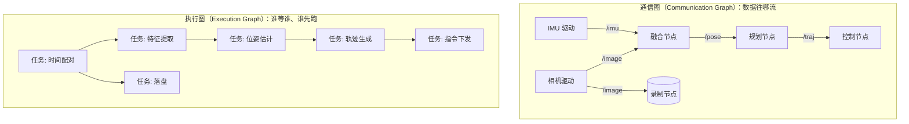
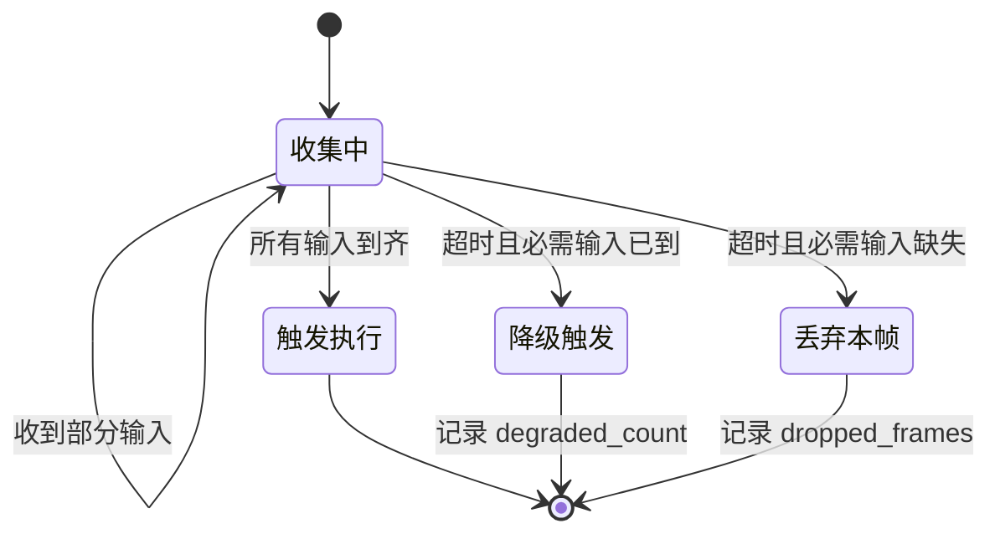
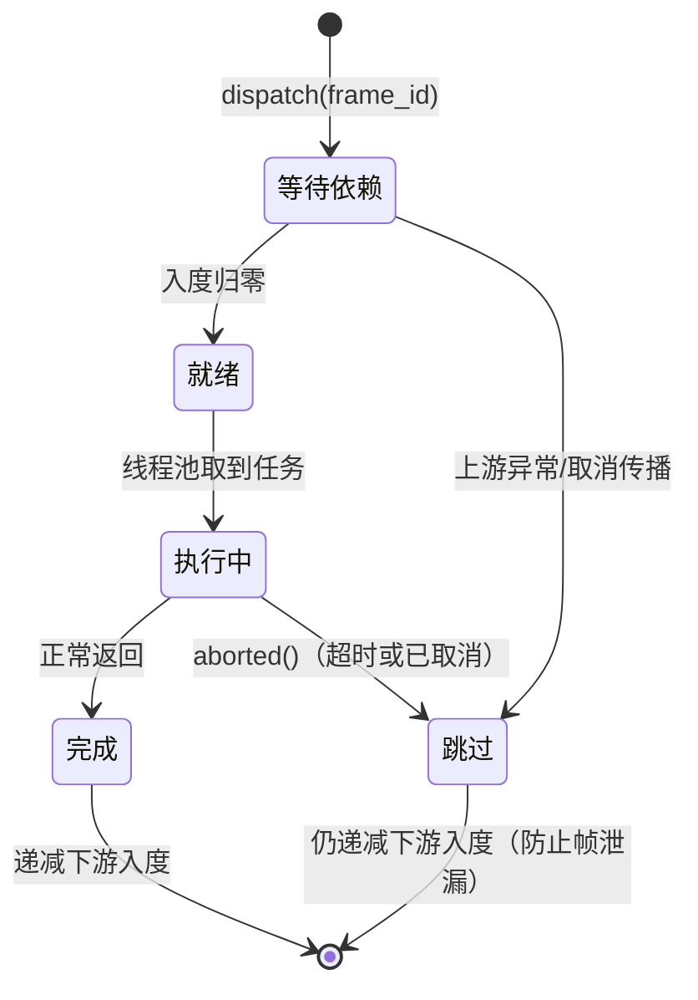
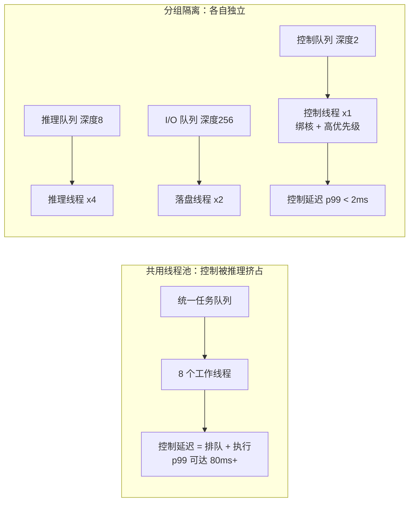
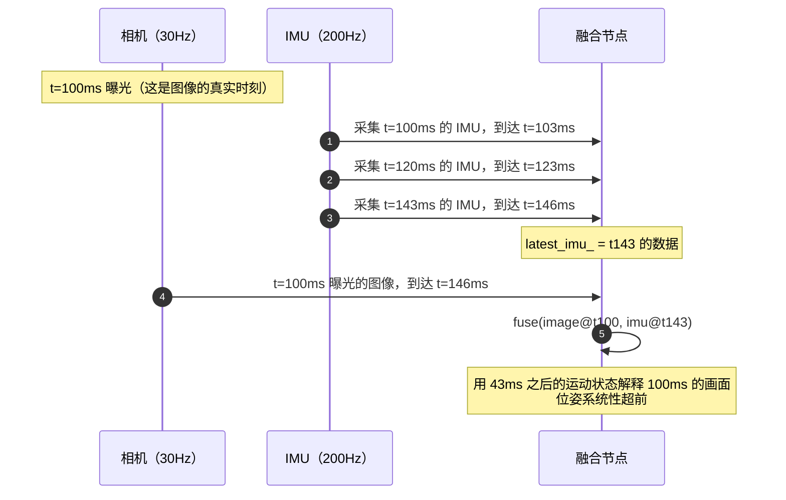

# 第 7 章：DAG、Taskflow 与时间同步

## 7.1 本章目标与前置知识

### 学完本章你能

- 说清楚**通信图**和**执行图**的区别，以及为什么中间件必须同时提供这两套抽象。
- 对比四种**依赖触发策略**，并为具体的传感器组合选对策略，说出它什么时候会失效。
- 区分**四种时钟**（墙上时钟、单调时钟、传感器硬件时间、仿真时间），知道每种该用在哪。
- 解释"到达时间 ≠ 采集时间"，并说出中间那段延迟由什么构成、为什么会抖动。
- 实现一个带队列上限和统计的**近似时间同步器**（ApproxTimeSync）。
- 用第 2 章的线程池实现一个支持 **deadline 和取消传播**的 DAG 执行器。
- 设计**线程池分组**，让图像推理不会抢占控制计算的算力。

### 前置知识

- 第 2 章：`BoundedQueue`、`ThreadPool`、互斥量与条件变量、数据竞争。本章的执行器直接复用第 2 章的 `ThreadPool`。
- 第 3 章：消息头里的 `source_time_ns`（采集时刻）与 `send_time_ns`（发送时刻）。本章会解释为什么这两个字段必须分开。
- 第 6 章：分位数（p50/p95/p99）的含义。本章的实验要统计配对时间差的分布。

{: .note }
> **本章会用到几个机器人领域的词，先在这里说清楚。**
> **IMU**（Inertial Measurement Unit，惯性测量单元）是一个测量加速度和角速度的小芯片，通常以 100–1000 Hz 输出，数据量极小。
> **位姿**（pose）指物体在空间中的位置和朝向，通常是 3 个位置分量加 3–4 个姿态分量。
> **传感器融合**（sensor fusion）指把多个传感器的数据合并成一个更准确的估计，比如用相机看到的画面纠正 IMU 的累计漂移，用 IMU 的高频数据补上相机两帧之间的运动。融合的前提是**知道每条数据分别对应哪个物理时刻**——这正是本章的主题。

## 7.2 为什么需要计算图

### 一个具体的困境

假设你要写一个融合节点，它订阅两个话题：

- `/camera/image`：30 Hz，也就是每 33.3 ms 一帧。
- `/imu/data`：200 Hz，也就是每 5 ms 一条。

融合算法需要**同一时刻**的图像和 IMU。最朴素的写法是这样：

```cpp
// 版本 0：谁来了就算一次
Image latest_image;
Imu   latest_imu;

void on_image(const Image& img) { latest_image = img; fuse(latest_image, latest_imu); }
void on_imu(const Imu& imu)     { latest_imu = imu;   fuse(latest_image, latest_imu); }
```

这段代码有三个层层递进的问题。

**问题一：算了很多次没意义的融合。** IMU 200 Hz、图像 30 Hz，每来一条 IMU 就融合一次，其中约 6 次用的是同一张图像。融合若要 8 ms，200 Hz 的调用需要 1.6 个 CPU 核，大部分浪费在重复计算上。

**问题二：配到的数据可能差很远。** 图像的处理链路（曝光 → 去马赛克 → 编码 → 传输 → 排队）可能耗时 30–80 ms 且**波动**；IMU 链路只有 2–3 ms。当一张 t=100 ms 曝光的图像在 t=150 ms 才到达时，`latest_imu` 里存的已经是 t=148 ms 采集的数据——你在用 48 ms 之后的姿态解释 48 ms 之前的画面。

**问题三：改成"等两个都来"又会永远等下去。**

```cpp
// 版本 1：等两个都到齐再算
void on_image(const Image& img) { latest_image = img; has_image = true; try_fuse(); }
void on_imu(const Imu& imu)     { latest_imu = imu;   has_imu = true;   try_fuse(); }
void try_fuse() {
    if (has_image && has_imu) { fuse(latest_image, latest_imu); has_image = has_imu = false; }
}
```

相机拔掉、驱动崩溃或网络断开时，`has_image` 永远是 false，融合再也不触发，下游控制器收不到位姿。而且它没有超时和告警——从外面看只是"没输出了"。

### 两个必须分别解决的问题

上面的困境可以拆成两个正交的问题：

| 问题 | 名称 | 要回答什么 |
| --- | --- | --- |
| 什么时候可以开始算？ | **依赖触发**（trigger） | 输入齐了吗？齐不了要等多久？等不到怎么办？ |
| 拿到的这几条数据是同一时刻的吗？ | **时间对齐**（time alignment） | 按哪个时间戳配对？允许多大误差？配不上怎么办？ |

{: .important }
> **这两个问题不能合并。** "数据到齐"是关于**控制流**的：图上的哪些节点已经产出、下游能否启动。"时间同步"是关于**数据语义**的：这几条数据是否描述同一个物理瞬间。三条 IMU 和一张图像可以"到齐"，但它们的采集时刻可能相差 60 ms，融合结果完全错误。**到齐 ≠ 对齐。**

中间件之所以要提供"计算图"这层抽象，就是因为这两个问题在每个融合节点里都会重复出现。如果每个业务节点自己写一遍触发逻辑和时间配对逻辑，结果必然是：有的节点忘了超时、有的节点用了接收时刻、有的节点队列无上限。把它们收敛成中间件的能力，才能保证一致性和可观测性。

## 7.3 核心概念与术语

### DAG（有向无环图）

**DAG**（Directed Acyclic Graph）是由**节点**和**有方向的边**组成、沿边走不可能回到起点的图。边 A → B 表示"B 依赖 A"。如果有环（A → B → C → A），三个节点互相等待，谁都启动不了。

机器人的处理流水线天然是 DAG：传感器驱动是没有输入的**源节点**，控制输出是没有下游的**汇节点**。

{: .note }
> **"无环"是硬性要求吗？** 在**一次执行**的范围内是的。很多系统有反馈回路（控制输出影响下一帧读数），处理方法是把反馈边"打断"——本帧读取的是**上一帧**的输出。这样每帧内部仍是 DAG，跨帧的循环由显式状态变量承载，而不是由图的边承载。

### 计算图与任务节点

**计算图**（computation graph）就是把处理流程表示成 DAG。图里的**任务节点**（task node）是一次**可调度的计算单元**：

| 属性 | 说明 |
| --- | --- |
| 输入端口 | 声明依赖哪些数据（话题或上游节点） |
| 计算函数 | 输入齐了之后要执行的代码 |
| 输出 | 产出的数据，成为下游节点的输入 |
| 资源组 | 应该在哪个线程池 / 哪些 CPU 核上执行 |
| 时限 | 最晚什么时候必须完成（deadline） |

**触发**（trigger）指"判断条件满足、把节点提交给执行器"这个动作，是 7.5 节的主题。

### Taskflow 与数据流

**Taskflow** 是一个 C++ 任务并行库，也泛指"用代码声明任务依赖、由运行时调度"这类模型：

```cpp
tf::Taskflow flow;
auto sync  = flow.emplace([&]{ do_sync();    }).name("sync");
auto infer = flow.emplace([&]{ do_infer();   }).name("infer");
auto ctrl  = flow.emplace([&]{ do_control(); }).name("control");
sync.precede(infer);          // sync 先于 infer
infer.precede(ctrl);
tf::Executor(4).run(flow).wait();
```

**数据流**（dataflow）是更强的说法：边上还**承载数据**，节点在所有输入端口都有数据时才被激活。ROS 2 的 `message_filters`、Apollo Cyber RT 的 `Component`、DORA 的算子模型都属于这一类。

{: .warning }
> **不要把 Taskflow 这类库直接当成机器人的调度器。** 通用任务库假设的是"批处理"：给一批任务，跑完，结束。机器人是**长期运行的流式系统**，需要"每来一帧数据触发一次全图"，还要处理输入缺失、超时、背压和取消。这些语义通用库通常不提供，需要在它之上再包一层——7.8 节就是在做这件事。

### 时间同步与时间戳

**时间同步**（time synchronization）在本章有两层含义：一是**同机多路数据对齐**，按采集时间戳把不同话题的数据配成组（7.7 节的算法问题）；二是**多机时钟对齐**，让两台机器的"12:00:00.000"指向同一物理瞬间（7.6 节的协议问题）。

**时间戳**（timestamp）只是一个数字，它的**语义**取决于谁、在哪个时刻、用哪个时钟打上去。同一条消息上的几个时间戳绝不能混用：

| 时间戳 | 含义 | 用途 |
| --- | --- | --- |
| `source_time_ns` | 传感器**采集**该数据的物理时刻 | 多传感器对齐、融合 |
| `send_time_ns` | 发布者调用 `publish` 的时刻 | 计算本机处理耗时 |
| `recv_time_ns` | 订阅端收到字节的时刻 | 计算传输 + 排队延迟 |
| `process_time_ns` | 回调开始执行的时刻 | 计算调度延迟 |

## 7.4 通信图 vs 执行图

一个常见的误解是"我画了数据流图，就等于设计好了调度"。这两张图描述的是不同的东西。



### 两张图的差异

| 维度 | 通信图 | 执行图 |
| --- | --- | --- |
| 顶点是什么 | 节点（进程/线程），长期存在 | 任务（一次计算），一帧一个实例 |
| 边是什么 | 话题、订阅关系 | 依赖关系（先后约束） |
| 关注点 | 谁能收到什么数据 | 什么时候能开始算、算多久 |
| 生命周期 | 系统启动时建立，很少变 | 每帧创建、执行、销毁 |
| 谁来画 | 系统架构师 | 调度器 / 执行器 |
| 典型故障 | 收不到消息、话题名写错 | 一个慢节点拖垮全图、永久等待 |

一个通信图可能对应多张执行图：同一份订阅关系下，你可以"每来一张图跑一次全图"，也可以"每 100 ms 定时跑一次，取当时最新的数据"——通信图完全相同，执行行为却大不一样。

### 中间件必须提供的五种能力

1. **触发**（trigger）：判断任务的输入条件是否满足，满足则提交。
2. **缓存**（buffer）：等待其他输入时暂存已到达的数据——而且必须**有上限**。
3. **匹配**（match）：按时间戳把多路数据配成组，配不上的要有明确处置。
4. **取消**（cancel）：一帧超时或上游失败时，通知尚未执行的下游不要再做无用功。
5. **错误传播**（error propagation）：任务抛异常或提交失败时，整帧状态要能收敛。

{: .important }
> **第 5 条最容易被忽略。** 如果一个节点抛了异常而执行器把异常吞掉，它的下游永远等不到输入，这一帧的状态记录会一直留在 map 里。跑几小时后内存里堆满永远不会完成的帧——这是非常隐蔽的内存泄漏。7.8 节会明确处理。

## 7.5 依赖触发策略

### 四种策略对比

| 策略 | 语义 | 适用场景 | 主要风险 |
| --- | --- | --- | --- |
| **全输入触发**<br>all-inputs | 所有输入端口都有新数据才触发 | 输入频率相近、缺一不可（双目相机左右图） | 任一路缺失即**永久阻塞**；快的那路会不断积压 |
| **近似时间同步**<br>approximate time | 按源时间戳在窗口 $W$ 内配对，配上才触发 | 多传感器融合（图像 + IMU + 雷达） | 窗口选错导致配对率低；配不上的数据被丢弃 |
| **最新值触发**<br>latest-value | 由某一路"主输入"驱动，其他路直接取当前最新值 | 高频控制回路、状态量（电池、模式） | **时间可能严重错配**（7.11 节的真实事故） |
| **超时降级**<br>timeout-fallback | 等到齐或等到超时；超时则用可得的部分输入降级执行 | 安全相关路径、必须持续输出的控制器 | 降级逻辑本身要被测试；容易变成"永远在降级"而无人察觉 |

### 全输入触发：什么时候会出问题



上图右侧两条边就是"全输入触发"缺少的部分。纯粹的全输入触发只有"收集中 → 触发执行"这一条路径，一旦某路输入停了，状态机就卡在"收集中"，而且：

- 已到达的另一路数据会持续入队，**如果队列无上限就会 OOM**。
- 从外部看不出区别：CPU 是 0，日志是空的，就像系统在"安静地运行"。

所以**全输入触发必须配超时**，否则不能用在生产系统里。

### 近似时间同步：窗口怎么定

设两路数据的周期分别是 $T_1$ 和 $T_2$（$T_1 > T_2$，即第二路更快），时间戳抖动的标准差是 $\sigma$。以慢的那路为基准去找最近的快路数据，最近邻的时间差在理想情况下服从 $|\Delta t| \sim U(0, T_2/2)$，期望值为 $T_2/4$。因此窗口至少要满足：

$$W \ge \frac{T_2}{2} + 3\sigma$$

代入图像 30 Hz、IMU 200 Hz 的例子：$T_2 = 5$ ms，若时间戳抖动 $\sigma = 0.5$ ms，则

$$W \ge \frac{5}{2} + 3 \times 0.5 = 4\ \text{ms}$$

工程上通常再留一倍余量，取 $W = 10$ ms。

{: .warning }
> **窗口不是越大越好。** 窗口开到 100 ms，配对率会接近 100%，但你会把相差 90 ms 的数据当成"同一时刻"来融合。以 1.5 m/s 的速度算，90 ms 意味着 13.5 cm 的位置误差——比传感器本身的噪声大一个数量级。**窗口的上界应该由"多大的时间误差在你的精度预算内可以忽略"决定，而不是由"我想要更高的配对率"决定。**

### 最新值触发：最快也最危险

最新值触发的代码只有两行，也因此被大量滥用：

```cpp
// 这段代码在 90% 的时间里看起来是对的
void on_image(const Image& img) { fuse(img, latest_imu_); }
```

它成立的前提是：**辅助输入的时间分辨率远高于你能容忍的误差，且它的链路延迟远小于主输入的链路延迟且稳定**。IMU 5 ms 一条，看起来满足第一条；但第二条通常不成立——图像链路有 30–80 ms 的抖动，IMU 只有 2–3 ms。所以"最新的 IMU"实际上比"这张图像对应的 IMU"新了几十毫秒。7.11 节就是这个错误造成的真实事故。

{: .tip }
> **什么时候最新值触发是安全的？** 当辅助输入是**缓慢变化的状态量**时，例如"当前驾驶模式""电池电量""标定参数"。这些量在几百毫秒内不会变，用最新值不引入误差。判断标准是：$\text{辅助输入的变化率} \times \text{时间错配量} \ll \text{精度预算}$。

### 超时降级：把"没数据"变成一等公民

```cpp
// 超时降级的骨架：必需输入 vs 可选输入
struct TriggerSpec {
    std::vector<std::string> required;   // 缺了就不能执行
    std::vector<std::string> optional;   // 缺了可以降级执行
    std::chrono::milliseconds timeout;   // 等待上限
};

// 触发时把"哪些输入缺失"作为参数传给业务，而不是假装它们存在
void on_trigger(const Inputs& in, const std::set<std::string>& missing) {
    if (missing.count("lidar")) {
        metrics_.degraded_lidar++;      // 降级要计数，否则长期降级无人发现
        estimate_with_camera_only(in);
    } else {
        estimate_full(in);
    }
}
```

关键设计点：**把"缺失"显式地传给业务代码**，而不是塞一个默认值进去。塞默认值（比如全零的点云）会让业务算出一个看似合理但完全错误的结果，且无法从输出上区分。

## 7.6 时间系统深入

这一节是全章最重要的部分。多传感器系统里绝大多数"玄学问题"，最后都能追溯到时钟用错了。

### 四种时钟

| 时钟 | Linux 标识 | 特点 | 会不会跳变 | 该用来做什么 |
| --- | --- | --- | --- | --- |
| **墙上时钟**（wall clock） | `CLOCK_REALTIME` | 从 1970-01-01 起的秒数，人类可读 | **会**。NTP 校正、手动改时间、闰秒都可能让它前跳或**后退** | 日志显示、文件名、跨机器的绝对时间对照 |
| **单调时钟**（monotonic clock） | `CLOCK_MONOTONIC` | 从系统启动起单调递增 | **不会后退**（但 NTP 会微调它的频率） | 测量时间间隔、超时、deadline、性能统计 |
| **传感器硬件时间** | 设备自带（PTP/PPS/驱动打戳） | 由传感器或采集卡在**采集瞬间**打上 | 取决于设备，通常有自己的时基 | 多传感器对齐的**唯一正确依据** |
| **仿真时间**（simulated time） | 由仿真器发布的 `/clock` 话题 | 可以暂停、加速、单步 | 由仿真器决定 | 确定性回放、单步调试、加速测试 |

补充两个偶尔有用的：`CLOCK_MONOTONIC_RAW` 不受 NTP 频率调整（skew）影响，但两台机器之间会缓慢漂移；`CLOCK_BOOTTIME` 与 `CLOCK_MONOTONIC` 类似但**包含系统休眠时间**，移动机器人会休眠时要用它。

### 铁律

{: .important }
> **四条不可违背的规则：**
> 1. **测量时间间隔、超时、deadline → 用单调时钟。** 永远不用墙上时钟做减法。
> 2. **多传感器对齐 → 用源时间戳（采集时刻）。** 永远不用接收时刻。
> 3. **给人看的显示、日志、文件名 → 用墙上时钟。** 它是唯一人类可读的。
> 4. **确定性回放 → 用仿真时钟。** 代码里不能出现任何直接读系统时钟的地方，必须走统一的时钟抽象。

第 4 条的推论很重要：**如果希望中间件支持回放，业务代码里就不能出现 `clock_gettime` 或 `steady_clock::now()`**，必须统一走中间件提供的 `node->now()`。否则回放时业务用的是真实时间、数据用的是录制时间，两者对不上。

### C++ 代码：各种时钟怎么读

```cpp
#include <ctime>
#include <cstdint>

// clock_gettime 是 Linux 上读各种时钟的统一入口
inline int64_t read_clock_ns(clockid_t clk) {
    timespec ts{};
    if (::clock_gettime(clk, &ts) != 0) return 0;      // 生产环境应记录 errno
    return static_cast<int64_t>(ts.tv_sec) * 1'000'000'000LL + ts.tv_nsec;
}

inline int64_t wall_ns()     { return read_clock_ns(CLOCK_REALTIME);      }  // 会跳变
inline int64_t mono_ns()     { return read_clock_ns(CLOCK_MONOTONIC);     }  // 不后退
inline int64_t mono_raw_ns() { return read_clock_ns(CLOCK_MONOTONIC_RAW); }  // 不受 NTP 调频
inline int64_t boot_ns()     { return read_clock_ns(CLOCK_BOOTTIME);      }  // 含休眠时间

void demo() {
    int64_t w0 = wall_ns(), m0 = mono_ns();
    do_some_work();
    // 若期间 NTP 把系统时间往回调了 200 ms，wall 的差值会是负数，mono 不会
    int64_t wall_elapsed = wall_ns() - w0;
    int64_t mono_elapsed = mono_ns() - m0;             // 永远非负
    (void)wall_elapsed; (void)mono_elapsed;
}
```

C++ 标准库的对应关系（glibc 上）：

| C++ 类型 | 对应的 clockid | 能不能用来测间隔 |
| --- | --- | --- |
| `std::chrono::system_clock` | `CLOCK_REALTIME` | **不能**，会跳变 |
| `std::chrono::steady_clock` | `CLOCK_MONOTONIC` | 能，这是正确选择 |
| `std::chrono::high_resolution_clock` | 实现定义（可能是上面任一个） | **不确定，不要用** |

{: .warning }
> **`high_resolution_clock` 是一个陷阱。** 标准没有规定它是否单调，libstdc++ 上它是 `system_clock` 的别名，也就是**会跳变**。名字听起来最"高级"，实际上最不该用。测量耗时一律用 `steady_clock`。

### 到达时间 ≠ 采集时间

这是本章最需要建立的直觉。一条数据从物理世界到你的回调函数，中间经过一长串环节，每一环都有延迟，而且**每一环的延迟都在波动**。

```mermaid
gantt
    title 同一物理时刻采集的数据，到达融合节点的时间差异很大（横轴单位：毫秒）
    dateFormat x
    axisFormat %L
    section 图像 30Hz
    传感器曝光      :img1, 0, 10
    驱动与去马赛克   :img2, 10, 25
    编码与传输      :img3, 25, 33
    订阅端排队      :img4, 33, 47
    section IMU 200Hz
    采样   :imu1, 0, 1
    驱动   :imu2, 1, 2
    传输   :imu3, 2, 3
```



两路数据描述的都是 $t = 0$ 这个物理瞬间，但 IMU 在 $t = 3$ ms 到达，图像在 $t = 47$ ms 才到达。如果你用"到达顺序"来配对，就会把 $t = 47$ ms 附近采集的 IMU 配给 $t = 0$ 曝光的图像——**系统性地错了 47 ms**。

延迟的构成与抖动来源：

| 环节 | 典型量级 | 抖动来源 |
| --- | --- | --- |
| 曝光时长 | 1–30 ms | 自动曝光会随光照变化（暗处曝光更久） |
| 驱动与格式转换 | 5–20 ms | ISP 负载、内存带宽竞争 |
| 序列化与传输 | 1–10 ms | 网络拥塞、重传 |
| 订阅端排队 | 0–∞ | **消费者慢时无上界**，这是最大的抖动源 |
| 回调调度 | 0.05–20 ms | 线程池忙、被高优先级任务抢占 |

{: .note }
> **曝光时刻该取哪个点？** 相机曝光是一段时间而不是一个瞬间。惯例是取**曝光中点**（曝光开始时刻 + 曝光时长 / 2），因为运动模糊的"平均位置"对应中点。如果曝光时长会随光照变化（自动曝光），那么用曝光开始时刻会引入随光照变化的系统偏差。这个细节在暗光场景下会造成几毫秒到几十毫秒的误差。

### 跨机器时钟同步

单机内部所有传感器共享同一个 `CLOCK_REALTIME`，问题相对简单。跨机器时，两边的时间戳能不能直接比较，取决于用了什么同步协议：

| 协议 | 典型精度 | 原理 | 适用 |
| --- | --- | --- | --- |
| **NTP** | 局域网 1–10 ms | 用户态软件时间戳 + 统计滤波 | 日志对齐、非实时业务 |
| **PTP / IEEE 1588** | 亚微秒到几微秒 | **网卡硬件打时间戳**，交换机需支持透明时钟 | 多相机/多雷达硬件同步 |
| **gPTP（802.1AS）** | 亚微秒 | PTP 的车载/音视频 profile | 车载 TSN 网络 |
| **PPS / 硬件触发** | 纳秒级 | 一根物理线同时触发所有传感器采集 | 高精度多传感器标定 |

NTP 和 PTP 的精度差三个数量级，根本原因是**打时间戳的位置**：NTP 在用户态打戳，中间隔着协议栈、调度和中断延迟；PTP 在网卡硬件上打戳，绕过了所有软件抖动。

```cpp
// 启用网卡硬件时间戳（PTP 场景下获取精确的收发时刻）
#include <linux/net_tstamp.h>
#include <sys/socket.h>

int enable_hw_timestamping(int sock) {
    int flags = SOF_TIMESTAMPING_RX_HARDWARE | SOF_TIMESTAMPING_TX_HARDWARE
              | SOF_TIMESTAMPING_RAW_HARDWARE;
    return ::setsockopt(sock, SOL_SOCKET, SO_TIMESTAMPING, &flags, sizeof(flags));
}
// 时间戳通过 recvmsg 的辅助数据（SCM_TIMESTAMPING）返回，需网卡和驱动支持
```

### 为什么跨机因果顺序不能只靠时间戳

即使用 PTP 把两台机器对到 1 μs，**也不能仅凭时间戳判断因果顺序**：同步精度不是零（相差 0.5 μs 时无法确定谁在前）；时钟会被校正而拉快拉慢，同一台机器上先后产生的时间戳可能倒序；最根本的是，"B 是因为收到 A 才产生的"是一个事实，而时间戳只是一个测量结果——测量有误差，事实没有。

正确做法是**用序列号或逻辑版本承载因果，用时间戳承载物理语义**：

```cpp
// 消息头里两套东西各司其职（第 3 章的 MessageHeader 已包含这些字段）
struct Causality {
    uint32_t source_id;      // 谁发的
    uint32_t epoch;          // 该发送者的第几代（重启后递增），见第 9 章
    uint64_t sequence;       // 同一 (source_id, epoch) 内单调递增
};
// 判断"是否是同一来源的更新版本"：比较 (epoch, sequence)，绝不比较时间戳
inline bool is_newer(const Causality& a, const Causality& b) {
    return a.epoch != b.epoch ? a.epoch > b.epoch : a.sequence > b.sequence;
}
```

{: .important }
> **一句话总结：时间戳回答"这是什么时候发生的物理事件"，序列号回答"这是第几个版本"。** 用时间戳去做去重和覆盖判断，会在时钟跳变或多机部署时产生新数据被旧数据覆盖的严重故障。

## 7.7 工程实现：近似时间同步算法

### 需求

实现一个两路输入的同步器：按**源时间戳**配对，时间差在窗口 $W$ 内视为同一时刻；无法配对的旧消息**主动丢弃并计数**；每路队列**必须有上限**；支持乱序到达；统计配对率与时间差；用户回调在**锁外**执行（第 2 章的教训）。

### 完整实现

```cpp
#pragma once
#include <algorithm>
#include <cstddef>
#include <cstdint>
#include <deque>
#include <functional>
#include <mutex>
#include <utility>
#include <vector>

inline int64_t abs64(int64_t v) { return v < 0 ? -v : v; }

// 两路近似时间同步器：按源时间戳在 window_ns 内配对
template <typename A, typename B>
class ApproxTimeSync {
public:
    struct Stats {
        uint64_t paired      = 0;   // 成功配对次数
        uint64_t dropped_a   = 0;   // A 路：时间上不可能再配对而被丢弃
        uint64_t dropped_b   = 0;
        uint64_t overflow_a  = 0;   // A 路：队列满而丢弃最旧
        uint64_t overflow_b  = 0;
        uint64_t reordered   = 0;   // 检测到乱序插入的次数
        int64_t  sum_abs_dt  = 0;   // 配对时间差绝对值累加（算平均用）
        int64_t  max_abs_dt  = 0;   // 最坏情况的配对时间差
    };
    using PairCallback = std::function<void(const A&, const B&, int64_t dt_ns)>;

    ApproxTimeSync(int64_t window_ns, std::size_t max_queue, PairCallback cb)
        : window_ns_(window_ns), max_queue_(max_queue), cb_(std::move(cb)) {}

    void push_a(int64_t stamp_ns, A msg) {
        std::vector<Pair> ready;
        {
            std::lock_guard<std::mutex> lk(mu_);
            insert_sorted(qa_, stamp_ns, std::move(msg), st_.overflow_a);
            drain(ready);
        }
        emit(ready);                       // 锁外回调
    }

    void push_b(int64_t stamp_ns, B msg) {
        std::vector<Pair> ready;
        {
            std::lock_guard<std::mutex> lk(mu_);
            insert_sorted(qb_, stamp_ns, std::move(msg), st_.overflow_b);
            drain(ready);
        }
        emit(ready);
    }

    Stats stats() const { std::lock_guard<std::mutex> lk(mu_); return st_; }

private:
    template <typename T> struct Item { int64_t t; T v; };
    struct Pair { A a; B b; int64_t dt; };

    // 插入并保持按时间戳升序；同时执行队列上限保护
    template <typename T>
    void insert_sorted(std::deque<Item<T>>& q, int64_t t, T v, uint64_t& overflow) {
        if (q.empty() || t >= q.back().t) {
            q.push_back(Item<T>{t, std::move(v)});          // 常见情况：O(1) 尾插
        } else {
            ++st_.reordered;
            auto it = std::upper_bound(q.begin(), q.end(), t,
                [](int64_t lhs, const Item<T>& item) { return lhs < item.t; });
            q.insert(it, Item<T>{t, std::move(v)});         // 乱序：插到正确位置
        }
        while (q.size() > max_queue_) { q.pop_front(); ++overflow; }  // 上限保护
    }

    // 贪心头部匹配：反复检查两队头部
    void drain(std::vector<Pair>& out) {
        while (!qa_.empty() && !qb_.empty()) {
            const int64_t dt = qa_.front().t - qb_.front().t;
            if (abs64(dt) <= window_ns_) {
                out.push_back(Pair{std::move(qa_.front().v),
                                   std::move(qb_.front().v), dt});
                qa_.pop_front();
                qb_.pop_front();
                ++st_.paired;
                const int64_t ad = abs64(dt);
                st_.sum_abs_dt += ad;
                st_.max_abs_dt = std::max(st_.max_abs_dt, ad);
            } else if (dt < 0) {
                // A 的头部太旧：后续 B 的时间戳只会更大，它永远配不上
                qa_.pop_front();
                ++st_.dropped_a;
            } else {
                qb_.pop_front();
                ++st_.dropped_b;
            }
        }
    }

    void emit(std::vector<Pair>& ready) {
        for (auto& p : ready) cb_(p.a, p.b, p.dt);
    }

    mutable std::mutex mu_;
    std::deque<Item<A>> qa_;
    std::deque<Item<B>> qb_;
    const int64_t window_ns_;
    const std::size_t max_queue_;
    PairCallback cb_;
    Stats st_{};
};
```

### 逐段讲解

**为什么 `drain` 里"太旧就丢"是安全的？**
队列按时间戳升序排列。如果 `qa_.front().t < qb_.front().t - W`，B 队列里后面所有元素的时间戳都 $\ge$ `qb_.front().t`，与 A 头部的差只会更大。所以 A 的头部**永远不可能**配上任何 B，直接丢弃是正确的。这一步是算法保持 $O(1)$ 摊还复杂度的关键。

**为什么必须有 `max_queue_`？**
假设 IMU 正常、相机断了。没有上限时 IMU 队列会以 200 条/秒增长；如果队列里放的是图像，几秒就 OOM。有了上限，最坏内存占用是 `max_queue_ × (sizeof(A) + sizeof(B))`，可以在设计时算清楚。建议取值是"最大可容忍延迟 / 采样周期"，例如容忍 100 ms、IMU 5 ms 一条，则取 20。

**为什么把 `overflow` 和 `dropped` 分开统计？**
两者指向不同的问题：

| 计数器 | 含义 | 说明什么 |
| --- | --- | --- |
| `dropped_a/b` 增长 | 有数据在时间上找不到对应 | 两路频率不匹配（正常）或某一路时间戳有偏移（异常） |
| `overflow_a/b` 增长 | 队列被撑满 | **另一路断了或严重滞后**，这是故障信号 |

合并成一个"丢弃数"会让你在排查时无法区分"正常的频率差"和"传感器掉线"。

**为什么回调要在锁外执行？**
回调是业务代码，可能做任何事——发布新消息（进入中间件再加锁）、写日志、甚至反过来调用 `push_a`。在锁内调用会导致死锁或递归加锁。这是第 2 章 2.4 节的直接应用。

**贪心匹配是最优的吗？不是。**
考虑窗口 $W = 10$ ms，A 队列头部时间戳 100，B 队列有 95 和 101。贪心算法会把 A(100) 和 B(95) 配对（差 5 ms），但 B(101) 只差 1 ms，是更好的选择。ROS 的 `message_filters::ApproximateTime` 策略用了更复杂的"pivot（枢轴）"算法：先选出一个候选集，验证不存在更优解后才发布，代价是**引入额外延迟**（必须多等一会儿才能确认没有更好的匹配）。

{: .tip }
> **这是一个典型的"延迟 vs 精度"权衡。** 贪心算法零额外延迟但可能配得不够准；最优算法更准但要多等一个周期。控制回路上应该选贪心（延迟敏感），离线标定应该选最优（精度敏感）。**先问清楚这条链路的性质，再选算法。**

### 扩展：N 路同步怎么做

两路扩展到 N 路，"同一时刻"的定义本身就变模糊了，有两种语义：

| 语义 | 定义 | 实现 | 复杂度 |
| --- | --- | --- | --- |
| **锚点式**（anchor） | 选定一路为主（通常是频率最低、最重要的那路），其他路各自找离主路最近的一条 | 主路每来一条，其余 N−1 路各做一次二分查找 | $O(N \log k)$，$k$ 为单路队列长度 |
| **全互斥式**（all-pairs） | 要求任意两路的时间差都 $\le W$ | 需要在候选集上搜索 | ROS 的 pivot 算法降到多项式，但常数很大 |

区别在于误差累积：锚点式保证每路与主路的差 $\le W$，但两条非主路之间最坏可达 $2W$；全互斥式保证任意两路都 $\le W$，但配对率更低、延迟更高。

```cpp
#include <deque>
#include <iterator>

template <typename T> struct Stamped { int64_t t; T v; };

// 锚点式 N 路同步的核心：主路驱动，其余路各自二分查找最近邻
template <typename T>
const Stamped<T>* find_nearest(const std::deque<Stamped<T>>& q, int64_t t, int64_t window) {
    if (q.empty()) return nullptr;
    auto it = std::lower_bound(q.begin(), q.end(), t,
        [](const Stamped<T>& item, int64_t rhs) { return item.t < rhs; });
    const Stamped<T>* best = nullptr;
    if (it != q.end() && abs64(it->t - t) <= window) best = &*it;
    if (it != q.begin()) {                                  // 前一个可能更近
        auto prev = std::prev(it);
        if (abs64(prev->t - t) <= window &&
            (!best || abs64(prev->t - t) < abs64(best->t - t))) best = &*prev;
    }
    return best;                                            // nullptr 表示这一路配不上
}
```

{: .warning }
> **N 路同步的配对率会随 N 快速下降。** 若每路独立配上的概率是 $p$，N 路全配上的概率约为 $p^{N-1}$。$p = 0.95$、$N = 5$ 时，全配上的概率只有 $0.81$——将近 20% 的帧被丢弃。所以路数多时应该改用"锚点式 + 可选输入"：必需的几路严格同步，可选的几路缺失就降级。

## 7.8 工程实现：DAG 执行器

### 设计目标

在第 2 章的 `ThreadPool` 之上实现一个执行器：静态声明的 DAG；**按帧触发**（每来一组同步好的数据跑一次全图，用 `frame_id` 区分）；**deadline**（整帧有时间预算，超时节点跳过）；**取消传播**；**错误传播**（节点抛异常时状态机仍能收敛）；**在途帧数上限**；**资源组**（不同节点提交到不同线程池，7.9 节展开）。

### 帧的生命周期



{: .important }
> **注意"跳过"也要走完整的收尾流程。** 一个被取消的节点如果直接 `return` 而不递减下游的入度计数，那么下游永远不会被触发，本帧的记录永远不会从 `frames_` 里删除。跑几小时后 `frames_` 会有几十万条记录——这是 7.4 节提到的"僵尸帧"泄漏。

### 完整实现

```cpp
#pragma once
#include <atomic>
#include <chrono>
#include <cstdint>
#include <functional>
#include <memory>
#include <mutex>
#include <string>
#include <unordered_map>
#include <vector>
// 依赖第 2 章的 ThreadPool

class DagExecutor {
public:
    // 每帧共享的执行上下文，按值传给每个任务
    struct Context {
        uint64_t frame_id = 0;
        std::chrono::steady_clock::time_point deadline{};   // 单调时钟！不用墙上时钟
        std::shared_ptr<std::atomic<bool>> cancel_flag;

        bool expired() const { return std::chrono::steady_clock::now() > deadline; }
        bool aborted() const {
            return cancel_flag->load(std::memory_order_relaxed) || expired();
        }
    };
    using NodeFn = std::function<void(const Context&)>;

    // groups：资源组，每个组一个线程池；max_inflight：同时在跑的帧数上限
    DagExecutor(std::vector<ThreadPool*> groups, std::size_t max_inflight)
        : groups_(std::move(groups)), max_inflight_(max_inflight) {}

    // ---- 建图阶段（必须在 dispatch 之前完成，运行期不可修改）----
    std::size_t add_node(std::string name, NodeFn fn, std::size_t group = 0) {
        nodes_.push_back(Node{std::move(name), std::move(fn), group, {}, 0});
        return nodes_.size() - 1;
    }
    void add_edge(std::size_t from, std::size_t to) {
        nodes_[from].succ.push_back(to);
        ++nodes_[to].in_degree;
    }

    // ---- 运行阶段 ----
    // 触发一帧；返回 false 表示在途帧已达上限（背压信号）
    bool dispatch(uint64_t frame_id, std::chrono::milliseconds budget) {
        std::vector<std::size_t> roots;
        Context ctx;
        {
            std::lock_guard<std::mutex> lk(mu_);
            if (frames_.size() >= max_inflight_) { ++overload_dropped_; return false; }

            Frame f;
            f.remaining.reserve(nodes_.size());
            for (const auto& n : nodes_) f.remaining.push_back(n.in_degree);
            f.pending = nodes_.size();
            f.ctx.frame_id   = frame_id;
            f.ctx.deadline   = std::chrono::steady_clock::now() + budget;
            f.ctx.cancel_flag = std::make_shared<std::atomic<bool>>(false);
            ctx = f.ctx;
            for (std::size_t i = 0; i < nodes_.size(); ++i)
                if (f.remaining[i] == 0) roots.push_back(i);   // 入度为 0 的是源节点
            frames_.emplace(frame_id, std::move(f));
        }
        for (auto i : roots) submit(i, ctx);        // 锁外提交：submit 可能阻塞
        return true;
    }

    // 外部取消：例如收到急停、或更新的一帧已经到来
    void cancel(uint64_t frame_id) {
        std::lock_guard<std::mutex> lk(mu_);
        auto it = frames_.find(frame_id);
        if (it != frames_.end())
            it->second.ctx.cancel_flag->store(true, std::memory_order_relaxed);
    }

    struct Stats { uint64_t completed, cancelled, failed, overload_dropped; };
    Stats stats() const {
        std::lock_guard<std::mutex> lk(mu_);
        return Stats{completed_, cancelled_, failed_, overload_dropped_};
    }

private:
    struct Node {
        std::string name;
        NodeFn fn;
        std::size_t group = 0;
        std::vector<std::size_t> succ;      // 下游节点下标
        std::size_t in_degree = 0;          // 上游数量
    };
    struct Frame {
        std::vector<std::size_t> remaining; // 每个节点还差几个上游
        std::size_t pending = 0;            // 本帧还有几个节点没收尾
        Context ctx;
    };

    void submit(std::size_t idx, Context ctx) {
        ThreadPool* pool = groups_[nodes_[idx].group];
        const bool ok = pool->submit([this, idx, ctx] {
            if (!ctx.aborted()) {                       // 超时或被取消则跳过计算
                try {
                    nodes_[idx].fn(ctx);
                } catch (...) {
                    fail(ctx.frame_id);                 // 异常 → 取消本帧其余部分
                }
            }
            on_done(idx, ctx);                          // 无论如何都要收尾
        });
        if (!ok) {                                      // 线程池队列满：视为失败
            fail(ctx.frame_id);
            on_done(idx, ctx);
        }
    }

    void on_done(std::size_t idx, const Context& ctx) {
        std::vector<std::size_t> ready;
        {
            std::lock_guard<std::mutex> lk(mu_);
            auto it = frames_.find(ctx.frame_id);
            if (it == frames_.end()) return;            // 已被清理，防御性判断
            Frame& f = it->second;
            for (auto s : nodes_[idx].succ)
                if (--f.remaining[s] == 0) ready.push_back(s);
            if (--f.pending == 0) {
                if (ctx.cancel_flag->load(std::memory_order_relaxed)) ++cancelled_;
                else ++completed_;
                frames_.erase(it);                      // 帧结束，释放状态
            }
        }
        for (auto s : ready) submit(s, ctx);            // 锁外提交
    }

    void fail(uint64_t frame_id) {
        std::lock_guard<std::mutex> lk(mu_);
        ++failed_;
        auto it = frames_.find(frame_id);
        if (it != frames_.end())
            it->second.ctx.cancel_flag->store(true, std::memory_order_relaxed);
    }

    mutable std::mutex mu_;
    std::vector<Node> nodes_;
    std::vector<ThreadPool*> groups_;
    std::unordered_map<uint64_t, Frame> frames_;
    const std::size_t max_inflight_;
    uint64_t completed_ = 0, cancelled_ = 0, failed_ = 0, overload_dropped_ = 0;
};
```

### 逐段讲解

**为什么 `Context` 按值拷贝？** 任务在线程池里异步执行，`dispatch` 的栈帧早就返回了。按值拷贝保证 `deadline` 和 `frame_id` 一直有效；`cancel_flag` 是 `shared_ptr`，多个任务共享同一个原子标志，任一个设置取消，其他立刻能看到。

**为什么 `submit` 一定要在锁外调用？** 第 2 章的 `ThreadPool` 用的是 `FullPolicy::Block`——队列满时会**阻塞**。如果持锁调用它，而工作线程正在 `on_done` 里等同一把锁，就会死锁。所以 `dispatch` 和 `on_done` 都是"锁内收集、锁外提交"。

**`--f.remaining[s]` 为什么不需要原子操作？** 因为它在 `mu_` 保护下。这里还要同时修改 `pending` 并可能 `erase` 整个 Frame，这几个操作必须是一个原子的整体，用原子变量反而无法保证。

**deadline 检查为什么只在任务开始时？** 执行器无法中断一个正在跑的函数，它能做的只有"在开始前判断还有没有必要跑"。单个节点耗时很长时，业务代码应该在内部**周期性检查** `ctx.aborted()`：

```cpp
// 长任务应该自己配合取消，执行器无法强行打断
exec.add_node("infer", [](const DagExecutor::Context& ctx) {
    for (int tile = 0; tile < 16; ++tile) {
        if (ctx.aborted()) return;          // 每处理一块检查一次
        run_inference_tile(tile);
    }
}, /*group=*/1);
```

**为什么 `max_inflight_` 是必须的？** 假设图的处理能力是 20 帧/秒而输入是 30 帧/秒，没有上限时 `frames_` 每秒净增 10 条，每条 Frame 还持有输入数据的引用——内存增长加延迟无限累积。**这是第 2 章"有界队列"思想在调度层的应用。**

### 组装一个三阶段流水线

```cpp
ThreadPool ctrl_pool(1, 8);        // 控制组：1 线程，浅队列
ThreadPool infer_pool(4, 8);       // 推理组：4 线程
DagExecutor exec({&ctrl_pool, &infer_pool}, /*max_inflight=*/3);

auto n_sync  = exec.add_node("sync",    [](auto& c){ do_sync(c);    }, 0);
auto n_infer = exec.add_node("infer",   [](auto& c){ do_infer(c);   }, 1);
auto n_ctrl  = exec.add_node("control", [](auto& c){ do_control(c); }, 0);
exec.add_edge(n_sync,  n_infer);
exec.add_edge(n_infer, n_ctrl);

uint64_t frame = 0;
// 每来一组同步好的数据就触发一帧，预算 50 ms
if (!exec.dispatch(frame++, std::chrono::milliseconds(50))) {
    metrics_.frame_overload++;      // 图跑不过来，主动丢帧并告警
}
```

## 7.9 线程池分组与资源隔离

### 为什么不能共用一个线程池

假设你只有一个 8 线程的池，同时跑图像推理（每次 80 ms）和控制计算（每次 0.5 ms，要求 100 Hz）。当 8 个推理任务同时占住所有线程时，控制任务在队列里等待，最坏要等 80 ms 才能开始——**控制周期从 10 ms 变成 90 ms**。



### 分组原则

| 组 | 线程数 | 队列深度 | 满队列策略 | 优先级 | 理由 |
| --- | --- | --- | --- | --- | --- |
| 控制 | 1，绑核 | 1–2 | 丢最旧 | 最高（可考虑 `SCHED_FIFO`） | 只要最新指令；深队列意味着执行过期指令 |
| 感知 / 推理 | ≈ 物理核数 − 2 | 4–8 | 丢最旧 | 普通 | CPU 密集，再多线程只增加切换开销 |
| I/O（录制、上传） | 2–4 | 128–512 | 阻塞 | 低（`nice +10`） | 大部分时间在等待，且数据不能丢 |
| 控制平面（心跳、发现） | 1 | 32 | 阻塞 | 较高 | 量小但不能丢，见第 1 章 |

分组的三个维度：**按延迟要求**（硬实时与尽力而为必须分开）、**按资源类型**（CPU 密集、I/O 密集、GPU 等待的最优线程数完全不同）、**按故障域**（可能崩溃或卡死的第三方算法不应与安全关键路径共用线程）。

```cpp
#include <pthread.h>
#include <sched.h>

// 把控制线程绑核并提升调度策略（需要 CAP_SYS_NICE 权限）
void configure_control_thread(pthread_t h, int core) {
    cpu_set_t set;
    CPU_ZERO(&set);
    CPU_SET(core, &set);
    pthread_setaffinity_np(h, sizeof(set), &set);       // 绑核：减少缓存失效与迁移

    sched_param sp{};
    sp.sched_priority = 50;                              // 1..99，不要设成 99
    pthread_setschedparam(h, SCHED_FIFO, &sp);           // 实时调度策略
}
```

{: .warning }
> **`SCHED_FIFO` 优先级设成 99 是危险的。** 实时线程会抢占内核的一些关键工作线程（如 RCU、软中断处理）。如果这个线程再意外死循环，整个系统会失去响应，连 SSH 都连不上。工程上通常用 40–60 的区间，并在测试环境验证系统仍可登录。

### 取消语义必须写清楚

取消不是"让任务消失"这么简单，必须回答三个问题：

| 问题 | 可选答案 | 本章实现的选择 |
| --- | --- | --- |
| 下游是否收到取消？ | (a) 收到并跳过 (b) 照常执行 | **(a)** — 共享 `cancel_flag`，下游 `aborted()` 返回 true 后跳过计算 |
| 部分结果是否可用？ | (a) 全部丢弃 (b) 已完成部分可用 | **(b)** — 已完成节点的输出保留，但标记该帧为 `cancelled`，下游不应把它当成完整结果发布 |
| 资源如何回收？ | (a) 立刻释放 (b) 等所有节点收尾 | **(b)** — 每个被跳过的节点仍走 `on_done`，`pending` 归零后统一 `erase(frame)` |

{: .important }
> **"取消后不发布"必须由业务节点自己保证。** 执行器只能提供 `aborted()` 这个信号，它无法阻止一个已经开始执行的节点在最后一行调用 `publisher.publish()`。所以约定是：**每个会产生外部副作用（发布消息、写文件、发指令）的节点，在副作用之前必须再检查一次 `ctx.aborted()`。**

## 7.10 常见错误与陷阱

### 陷阱一：用接收时刻当采集时刻

```cpp
// 错误：now() 是"我收到的时刻"，不是"数据产生的时刻"
void on_imu(const ImuMsg& m) {
    buffer_.push_back({std::chrono::steady_clock::now(), m});   // 引入 2–80ms 的可变偏差
}

// 正确：用消息头里的源时间戳
void on_imu(const ImuMsg& m) {
    buffer_.push_back({m.header.source_time_ns, m});            // 传感器采集瞬间打的戳
}
```

**为什么错**：接收时刻包含了驱动、传输、排队的可变延迟。用它做对齐，误差会随系统负载变化——低负载时测试正常，高负载时精度崩塌，这是最难复现的一类 bug。

### 陷阱二：时间同步队列无上限

```cpp
// 错误：一路断了，另一路无限堆积
std::deque<Imu> imu_buf_;
void on_imu(const Imu& m) { imu_buf_.push_back(m); try_match(); }   // 相机断了 → OOM

// 正确：有上限且区分统计
void on_imu(const Imu& m) {
    imu_buf_.push_back(m);
    while (imu_buf_.size() > kMaxQueue) { imu_buf_.pop_front(); ++stats_.overflow_imu; }
}
```

### 陷阱三：用墙上时钟测间隔

```cpp
// 错误：NTP 把时间往回调时，dt 会变成负数
auto t0 = std::chrono::system_clock::now();
do_work();
auto dt = std::chrono::system_clock::now() - t0;      // 可能是负数！
if (dt > timeout) { /* 永远进不来，因为负数小于任何正超时 */ }

// 正确：单调时钟
auto t0 = std::chrono::steady_clock::now();
do_work();
auto dt = std::chrono::steady_clock::now() - t0;      // 保证非负
```

**为什么危害大**：负的耗时会污染统计（平均值被拉低、p99 计算错乱），负的间隔还可能让"超时检测"永久失效，导致断线重连不触发。而且这类问题**只在 NTP 恰好校正的那一刻发生**，几天才一次，日志里看不出规律。

### 陷阱四：全输入触发没有超时

```cpp
// 错误：雷达掉线后，融合永远不再触发，且没有任何告警
void try_fuse() { if (has_cam_ && has_lidar_ && has_imu_) fuse(); }

// 正确：超时降级 + 计数
void try_fuse() {
    const auto now = std::chrono::steady_clock::now();
    if (has_cam_ && has_lidar_ && has_imu_) { fuse_full(); reset(); return; }
    if (now - frame_start_ > kTimeout) {
        if (has_cam_ && has_imu_) { ++stats_.degraded; fuse_without_lidar(); }
        else                      { ++stats_.dropped_frames; }
        reset();                                    // 关键：无论如何都要重置状态
    }
}
```

### 陷阱五：DAG 节点间共享可变状态

```cpp
// 错误：两个可能并行的节点写同一个全局变量 → 数据竞争（第 2 章 2.2）
Pose g_pose;                                        // 无保护的共享状态
exec.add_node("estimate", [](auto&){ g_pose = estimate(); });
exec.add_node("smooth",   [](auto&){ g_pose = smooth(g_pose); });   // 没有依赖边！

// 正确一：加依赖边，把并行变成串行（由图结构保证顺序）
auto a = exec.add_node("estimate", [](auto&){ ctx_store().pose = estimate(); });
auto b = exec.add_node("smooth",   [](auto&){ auto& p = ctx_store().pose; p = smooth(p); });
exec.add_edge(a, b);                                // b 依赖 a，不会并行

// 正确二：不共享，用值传递（每帧一份数据，天然无竞争）
struct FrameData { Pose pose; };                    // 每帧独立分配
```

**为什么错**：DAG 里**没有依赖边的两个节点可能并行执行**。这是图模型的语义，也是它能加速的原因。很多人画完图就默认"按我写的顺序执行"，实际上执行器会把无依赖的节点同时提交。TSan 能查出这类问题（第 2 章实验一）。

### 陷阱六：取消后不推进状态机，导致帧泄漏

```cpp
// 错误：被取消就直接返回，下游永远等不到，frames_ 里的记录永不删除
pool.submit([this, idx, ctx] {
    if (ctx.aborted()) return;                      // 泄漏！pending 没有递减
    nodes_[idx].fn(ctx);
    on_done(idx, ctx);
});

// 正确：跳过计算，但仍然收尾
pool.submit([this, idx, ctx] {
    if (!ctx.aborted()) { try { nodes_[idx].fn(ctx); } catch (...) { fail(ctx.frame_id); } }
    on_done(idx, ctx);                              // 无论走哪条路径都要执行
});
```

排查手段：把 `frames_.size()` 作为一个指标暴露出去。正常情况它应该在 0 到 `max_inflight_` 之间波动；如果它单调上升并停在上限不动，就是发生了帧泄漏（表现为 `dispatch` 一直返回 false）。

## 7.11 真实案例：图像和 IMU 错配导致轨迹超前

### 现象

某低速物流车在园区内行驶。定位轨迹与实际路径**形状一致**，但整条轨迹**沿运动方向平移了 7–10 cm**——定位比实际**超前**。转弯时朝向角有约 1.5° 的稳定偏差。关键线索：**偏差与车速正相关**——停车时偏差消失，1.5 m/s 时约 8 cm，3 m/s 时约 15 cm。

### 排查过程

1. **先怀疑标定**。重新做了相机-IMU 外参标定，偏差没变；而且标定误差不会随车速线性变化，排除。
2. **看是不是算法滞后**。滤波器的固有延迟会导致**滞后**而不是**超前**，方向不对。
3. **打点看链路延迟**。在融合节点里同时记录每条输入的 `source_time_ns` 和 `recv_time_ns`：

   | 输入 | 采集→到达延迟 p50 | p99 | 抖动 |
   | --- | --- | --- | --- |
   | IMU | 2.8 ms | 4.1 ms | 很小 |
   | 图像 | 46 ms | 92 ms | **很大** |

4. **看融合时实际用到的两条数据的时间差**。打印 `imu.source_time_ns - image.source_time_ns`，平均值是 **+48 ms**，且随图像处理耗时波动。至此根因清楚。

### 根因

融合节点用的是**最新值触发**：

```cpp
// 事故代码
Imu latest_imu_;
void on_imu(const Imu& m)      { latest_imu_ = m; }                  // 只存最新
void on_image(const Image& im) { fuse(im, latest_imu_); }            // 用最新的 IMU
```

图像链路 46 ms 延迟，IMU 只有 2.8 ms。当一张 $t = 100$ ms 曝光的图像在 $t = 146$ ms 到达时，`latest_imu_` 里存的是 $t \approx 143$ ms 采集的数据。融合算法把它当作"图像时刻的运动状态"，等于**把 43 ms 之后的运动量加到了 100 ms 的位姿上**。



误差量级验算：车速 $v = 1.5$ m/s、错配 $\Delta t = 48$ ms 时，$\Delta s = 1.5 \times 0.048 = 7.2$ cm；转弯角速度 $\omega = 0.5$ rad/s 时，$\Delta \theta = 0.5 \times 0.048 = 0.024$ rad $\approx 1.4^\circ$。与观测到的 7–10 cm 和 1.5° 完全吻合。**这是排查中最有说服力的一步：用错配时长和车速能算出观测到的偏差量。**

### 方案

```cpp
// 修复：改用源时间戳配对，窗口 10 ms
ApproxTimeSync<Image, Imu> sync(
    /*window_ns=*/10'000'000,       // ±10 ms，按 7.5 节的公式取值
    /*max_queue=*/64,               // 64 × 5ms = 320ms 的 IMU 缓冲
    [this](const Image& im, const Imu& imu, int64_t dt_ns) {
        trace_.record("sync_dt_ns", dt_ns);      // 把配对时间差作为指标暴露
        fuse(im, imu);
    });

void on_image(const Image& m) { sync.push_a(m.header.source_time_ns, m); }
void on_imu(const Imu& m)     { sync.push_b(m.header.source_time_ns, m); }
```

配套的三项措施：

1. **暴露 `sync_dt_ns` 直方图**。正常时 p99 应该 < 3 ms。这个指标一旦变大，就说明某路的时间戳出了问题。
2. **暴露 `dropped_a/b` 和 `overflow_a/b`**。`overflow` 增长意味着某路掉线。
3. **在图像消息里改用曝光中点作为 `source_time_ns`**。之前驱动用的是"图像传输完成时刻"，这本身就带了 15 ms 的偏差。

### 取舍

| 取舍点 | 代价 | 收益 |
| --- | --- | --- |
| 增加 IMU 缓冲 64 条 | 内存 +4 KB（可忽略） | 允许图像延迟到 320 ms 仍能配上 |
| 引入配对失败丢弃 | 约 0.3% 的图像帧配不上被丢弃 | 剩下的 99.7% 时间对齐误差 < 2.5 ms |
| 融合延迟增加约 1 帧 IMU | 端到端 +2.5 ms | 消除 48 ms 的系统性偏差 |
| 改用曝光中点时间戳 | 需要改驱动，要重新验证 | 消除额外 15 ms 的固定偏差 |

{: .note }
> **注意第三行：修复后端到端延迟其实增加了 2.5 ms。** 有人会问"这不是变慢了吗"。但 48 ms 的**系统性误差**和 2.5 ms 的**额外延迟**完全不是一个量级的问题——前者让定位不可用，后者在控制回路的容忍范围内。**先保证正确，再谈延迟。**

### 验证

- 静态测试：车静止，`sync_dt_ns` 的 p50 = 1.2 ms、p99 = 2.4 ms，符合理论值 $T_{imu}/4 = 1.25$ ms。
- 动态测试：以 1.5 m/s 沿标定过的直线行驶，与全站仪测量的真值对比，轨迹偏差从 7.8 cm 降到 1.1 cm。
- 变速测试：在 0.5 / 1.5 / 3.0 m/s 三种速度下，偏差不再随速度增长（修复前是线性增长）——这是根因被正确消除的最强证据。
- 故障注入：人为让图像链路延迟 200 ms，验证 `overflow_a` 增长、`dropped_a` 增长，且系统输出降级标志而不是给出错误位姿。

## 7.12 动手实验与验收

### 实验一：实现并测量 ApproxTimeSync（90 分钟）

1. 实现 7.7 节的 `ApproxTimeSync`。
2. 写一个模拟数据源：图像 30 Hz（周期 33.33 ms），IMU 200 Hz（周期 5 ms），两路时间戳都从 0 开始，各自加上 $\sigma = 0.5$ ms 的高斯抖动。
3. 跑 60 秒的模拟数据，统计：
   - 配对率 = `paired` / 图像总条数，期望 > 99%。
   - 平均配对时间差 = `sum_abs_dt / paired`，期望接近 $T_{imu}/4 = 1.25$ ms。
   - `max_abs_dt` 应该 < 窗口值。
4. 把窗口从 10 ms 依次改成 1 / 2 / 5 / 10 / 50 ms，画出"窗口 vs 配对率"和"窗口 vs 平均时间差"两条曲线，解释拐点在哪、为什么。

### 实验二：三阶段 DAG（90 分钟）

1. 用第 2 章的 `ThreadPool` 和 7.8 节的 `DagExecutor` 搭一条链：**同步 → 推理模拟（`sleep 40ms`）→ 控制输出**。
2. 以 30 Hz 调用 `dispatch`，观察 `max_inflight = 3` 时 `dispatch` 的失败率。
3. 把推理耗时改成 `sleep 60ms`（超过 33 ms 的输入周期），验证：
   - `dispatch` 开始返回 false，`overload_dropped` 增长。
   - `frames_.size()` 稳定在 3，**不会持续增长**。
4. 把 deadline 设成 50 ms，验证推理耗时 60 ms 时控制节点被跳过（`cancelled` 增长）而不是执行过期的控制。

### 实验三：四种触发策略的对照（120 分钟）

对同一组输入数据，分别实现四种触发策略，然后注入三类故障，填满下面这张表：

| 故障注入 | 全输入触发 | 近似时间同步 | 最新值触发 | 超时降级 |
| --- | --- | --- | --- | --- |
| 一路延迟 +100 ms | ? | ? | ? | ? |
| 一路完全缺失 10 秒 | ? | ? | ? | ? |
| 一路时间戳乱序 | ? | ? | ? | ? |

每格要填两项：**输出频率变成多少**、**输出的时间对齐误差是多少**。做完这个实验，你就能凭数据而不是感觉来选策略了。

### 实验四：验证队列上限生效（40 分钟）

1. 用 `ApproxTimeSync`，只推 A 路不推 B 路，持续 10 秒。
2. 用 `/proc/self/status` 的 `VmRSS` 或 `ps -o rss` 观察进程内存。
3. 验证：内存**不再增长**，`overflow_a` 线性增长，`paired` 保持 0。
4. 把 `max_queue` 改成 100000 再跑一遍，对比内存曲线，直观感受"无上限"的后果。

### 验收标准

- [ ] `ApproxTimeSync` 在 TSan 下无告警，且回调确实在锁外执行（可用日志或断点验证）。
- [ ] 能画出"窗口大小 vs 配对率 vs 平均时间差"的曲线，并解释为什么窗口不是越大越好。
- [ ] DAG 执行器在推理耗时超过输入周期时，`frames_` 大小有界、`dispatch` 正确返回 false。
- [ ] 能演示取消传播：取消一帧后，下游节点被跳过且该帧从 `frames_` 中被正确移除。
- [ ] 能说出四种触发策略在"一路缺失"时的行为差异，并有实验数据支撑。
- [ ] 能用一段代码演示墙上时钟测间隔出现负数（可用 `date -s` 手动改时间复现，注意在测试机上做）。

## 7.13 本章小结与自查清单

### 核心结论

1. **"数据到齐"和"时间对齐"是两个正交的问题**，前者关于控制流，后者关于数据语义，必须分别解决。
2. 四种触发策略各有适用面：**全输入触发必须配超时**，**最新值触发只适合缓慢变化的状态量**。
3. **测间隔用单调时钟，对齐用源时间戳，显示用墙上时钟，回放用仿真时钟**——这四条不能混。
4. **到达时间 ≠ 采集时间**，中间的延迟不仅大，而且会随负载波动，这是系统性误差的主要来源。
5. 近似时间同步的**队列必须有上限**，且要把"配不上而丢弃"和"队列满而丢弃"分开统计。
6. DAG 里**没有依赖边的节点会并行执行**，共享可变状态就是数据竞争。
7. 取消和异常都必须**推进状态机**，否则会产生永远不会完成的僵尸帧。
8. **线程池必须按延迟要求和资源类型分组**，否则一次长推理就能毁掉控制周期。
9. 跨机器时，**时间戳承载物理语义，序列号承载因果顺序**，两者不可互换。

### 自查清单

- [ ] 我能解释为什么"等所有输入到齐"在生产系统里是危险的。
- [ ] 我能根据两路数据的频率和抖动，算出时间同步窗口应该取多大。
- [ ] 我能说出 `system_clock`、`steady_clock`、`high_resolution_clock` 各自的问题。
- [ ] 我能列举图像链路延迟的至少四个组成部分，并说出哪个抖动最大。
- [ ] 我能解释为什么近似时间同步里"头部太旧就直接丢"是正确的。
- [ ] 我能说清楚 NTP 和 PTP 精度差三个数量级的根本原因。
- [ ] 我能设计一个取消传播机制，并回答"下游收到吗、部分结果可用吗、资源怎么回收"。
- [ ] 我知道 DAG 执行器为什么必须限制在途帧数。

## 7.14 面试问题与参考答案

**问：为什么"数据到齐"不等于"时间同步"？**

答：到齐是控制流概念，说的是每个输入端口都有数据了，可以开始计算；时间同步是数据语义概念，说的是这几条数据描述的是同一个物理瞬间。两者可以完全脱节：图像因为处理链路慢，到达时对应的是 50 ms 前的世界，而同时到达的 IMU 对应的是 3 ms 前的世界，它们"到齐"了但相差 47 ms。融合这样的数据会产生随速度线性增长的系统性误差。所以正确做法是按源时间戳配对，而不是按到达先后配对。

**问：DAG 执行时如何避免一个慢节点拖垮全图？**

答：四个层面。第一，**资源隔离**：慢节点放在独立线程池，不与实时路径共享线程。第二，**deadline 与取消**：整帧设时间预算，超时后下游节点跳过执行，避免继续投入算力去算已经过期的结果。第三，**在途帧数上限**：图跑不过来时 `dispatch` 直接返回失败并计数，而不是让待处理的帧无限累积。第四，**旁路设计**：把慢节点从关键路径上摘下来，例如控制器不直接等推理结果，而是用上一帧的结果加运动学外推。前三条是中间件提供的机制，第四条是系统设计的选择。

**问：近似时间同步的队列为什么必须有上限？**

答：因为两路输入的可用性是独立的。如果相机掉线而 IMU 正常，那么 IMU 队列会以 200 条/秒的速度增长，永远等不到可配对的图像。没有上限时这就是一个确定的内存泄漏，几分钟到几小时后 OOM。有上限后，最坏内存占用可以在设计阶段算出来（`max_queue × 单条大小 × 路数`）。更重要的是，队列溢出计数是一个**故障信号**——它增长就说明另一路出了问题，这比等到 OOM 才发现要早得多。上限的取值建议是"最大可容忍的等待时间 / 该路的采样周期"。

**问：机器人系统里该用哪种时钟？**

答：分四种用途。测量耗时、超时、deadline 一律用单调时钟（`CLOCK_MONOTONIC` / `std::chrono::steady_clock`），因为墙上时钟会被 NTP 校正而跳变甚至倒退，做减法可能得到负数，会让超时检测永久失效。多传感器对齐必须用数据自带的源时间戳，也就是传感器采集瞬间打的戳，绝不能用接收时刻。给人看的日志和文件名用墙上时钟，因为它是唯一人类可读的。需要确定性回放时用仿真时钟，这要求业务代码不能直接读系统时钟，必须统一走中间件的时钟抽象。另外要注意 `high_resolution_clock` 在 libstdc++ 上是 `system_clock` 的别名，会跳变，不要用它测耗时。

**问：跨机器如何做时间对齐？各自精度如何？**

答：三个层次。NTP 在用户态交换时间戳并做统计滤波，局域网内精度约 1–10 ms，适合日志对齐和非实时业务。PTP（IEEE 1588）由网卡硬件在收发瞬间打时间戳，绕过了协议栈和调度抖动，精度可到亚微秒，但需要网卡、驱动和交换机都支持。最高精度是 PPS 或硬件触发线，用一根物理线同时触发多个传感器采集，精度纳秒级，多用于多传感器标定。选型取决于精度预算：如果时间误差 $\Delta t$ 乘以目标运动速度已经超过精度要求，就必须往上一个层次走。

**问：即使用了 PTP 把时钟对到微秒，能不能只靠时间戳判断消息的因果顺序？**

答：不能。三个原因：同步精度不为零，相差 0.5 μs 时无法判断谁在前；时钟校正过程中可能被拉快或拉慢，同一台机器上先后产生的时间戳都可能倒序；最根本的是因果关系是事实，时间戳是测量结果，测量有误差而事实没有。正确做法是分工：时间戳只承载"这是什么时候发生的物理事件"，用于传感器对齐；因果顺序和版本新旧由 `(epoch, sequence)` 这样的逻辑版本承载，去重和状态覆盖判断只比较逻辑版本。用时间戳做覆盖判断，会在时钟跳变时出现新数据被旧数据覆盖的严重故障。

**问：如何设计任务的取消传播？**

答：先明确三个语义问题再写代码。第一，下游是否收到取消——我的做法是整帧共享一个原子取消标志，每个任务开始前检查，被取消则跳过计算。第二，部分结果是否可用——已完成节点的输出保留，但整帧被标记为 cancelled，下游不应把它当完整结果发布；产生外部副作用的节点在发布前必须再检查一次取消状态。第三，资源如何回收——关键是被跳过的节点**仍然要走完收尾流程**，递减下游的入度计数、递减本帧的待完成数，等归零后统一清理帧状态。如果被取消的节点直接 return，下游永远不会被触发，帧记录永远不会删除，就会出现僵尸帧泄漏。另外执行器无法打断已经开始跑的函数，长任务必须自己周期性检查取消标志。

**问：多传感器融合的时间窗口该怎么定？**

答：下界由采样周期决定。以较慢那路为基准找最近邻，时间差服从 $U(0, T_{fast}/2)$，再加上时间戳抖动，所以 $W \ge T_{fast}/2 + 3\sigma$。图像 30 Hz 配 IMU 200 Hz、抖动 0.5 ms 时，下界约 4 ms，工程上取 10 ms 留余量。上界由**精度预算**决定：窗口内的时间误差乘以运动速度就是位置误差，1.5 m/s 下 10 ms 对应 1.5 cm，如果精度要求是 5 cm 就可以接受，如果是 1 cm 就必须缩小窗口或提高传感器频率。绝不能为了提高配对率盲目放大窗口——那只是把丢弃变成了错误的配对，问题从"可见"变成"不可见"。定完之后要把实际配对时间差做成直方图持续监控。

## 7.15 延伸阅读

- **ROS 2 `message_filters` 的 `ApproximateTime` 策略**：官方文档和源码里详细描述了 pivot 算法如何在不牺牲最优性的前提下配对多路数据，以及它为此付出的延迟代价。对比本章的贪心算法，可以清楚看到"延迟 vs 精度"的权衡。
- **Taskflow 官方文档（taskflow.github.io）**：现代 C++ 任务并行库，重点看它的静态图、条件任务（conditional tasking）和子流（subflow）设计，理解通用任务库与流式机器人调度的差异。
- **IEEE 1588-2019 / PTP 与 Linux `linuxptp` 项目**：`ptp4l` 和 `phc2sys` 的文档解释了硬件时间戳、边界时钟与透明时钟，是理解微秒级同步的最好入口。
- **`man 2 clock_gettime` 与 `man 7 time`**：Linux 各种时钟的准确语义，特别注意 `CLOCK_MONOTONIC` 会被 NTP 调频而 `CLOCK_MONOTONIC_RAW` 不会。
- **Apollo Cyber RT 的调度器设计文档**：协程式调度、任务分组与优先级、以及它如何把 DAG 映射到处理器组，是工业级实现的参考。
- **Kernel 文档 `Documentation/networking/timestamping.rst`**：`SO_TIMESTAMPING` 的完整语义，讲清楚软件时间戳和硬件时间戳分别在哪一层打上、精度差异从何而来。

下一章将讨论怎么把这些对齐好的数据落到磁盘上——录制、索引、压缩和崩溃恢复。
