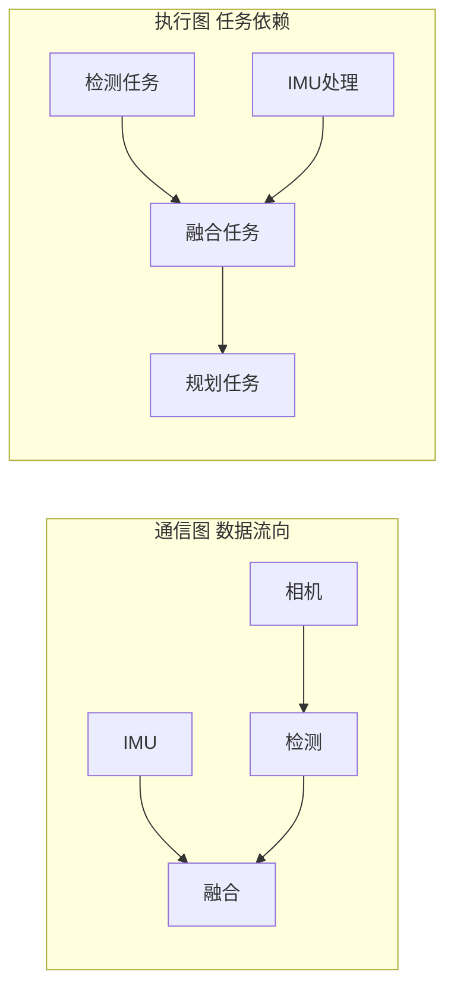
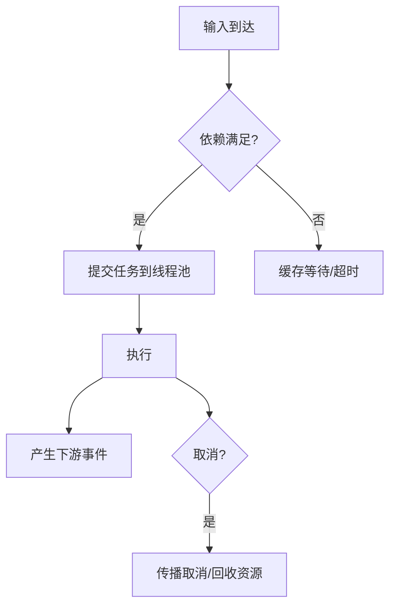

# 第 7 章：DAG、Taskflow 与时间同步

## 本章目标

理解通信如何驱动计算：消息到达触发任务、多输入对齐、任务完成产生下游事件。掌握近似时间同步算法和确定性执行，能把消息分发接入计算图而不被单个慢输入拖死。

## 7.1 通信图 vs 执行图



通信图描述数据流向，执行图描述任务依赖。中间件要提供**触发、缓存、匹配、取消和错误传播**，而不只是调用回调。

## 7.2 依赖触发策略

| 策略 | 语义 | 适用 | 风险 |
| --- | --- | --- | --- |
| 全输入触发 | 所有输入到齐才执行 | 强依赖 | 单慢输入阻塞全图 |
| 近似时间同步 | 时间窗口内匹配 | 多传感器融合 | 需处理时钟偏差 |
| 最新值触发 | 新输入即用各路最新 | 低延迟控制 | 可能混合不同时刻数据 |
| 超时降级 | 超 deadline 用部分输入 | 实时系统 | 结果精度下降 |

## 7.3 近似时间同步算法

多传感器融合的核心问题：图像和 IMU 的**采集时间**不同，网络到达顺序也不代表采集顺序。近似时间同步按源时间戳在窗口内配对：

```cpp
#include <deque>
#include <optional>
#include <cstdint>

// 把两路带时间戳的消息按最近邻配对，容忍 max_diff_ns 的偏差
template <typename A, typename B>
class ApproxTimeSync {
public:
    explicit ApproxTimeSync(uint64_t max_diff_ns) : max_diff_(max_diff_ns) {}

    void push_a(uint64_t t, A msg) { a_.push_back({t, std::move(msg)}); try_match(); }
    void push_b(uint64_t t, B msg) { b_.push_back({t, std::move(msg)}); try_match(); }

    std::function<void(const A&, const B&, uint64_t diff)> on_pair;

private:
    struct SA { uint64_t t; A msg; };
    struct SB { uint64_t t; B msg; };
    std::deque<SA> a_; std::deque<SB> b_;
    uint64_t max_diff_;

    void try_match() {
        while (!a_.empty() && !b_.empty()) {
            uint64_t ta = a_.front().t, tb = b_.front().t;
            uint64_t diff = ta > tb ? ta - tb : tb - ta;
            if (diff <= max_diff_) {
                if (on_pair) on_pair(a_.front().msg, b_.front().msg, diff);
                a_.pop_front(); b_.pop_front();
            } else if (ta < tb) {
                a_.pop_front();          // a 太旧，丢弃并计数
            } else {
                b_.pop_front();          // b 太旧，丢弃并计数
            }
        }
        // 防止无限增长：超过上限丢最旧
        while (a_.size() > 100) a_.pop_front();
        while (b_.size() > 100) b_.pop_front();
    }
};
```

{: .important }
> 关键点：无法配对的旧消息要**主动丢弃并计数**，队列要有上限。否则一路数据缺失会让另一路无限堆积。

## 7.4 Taskflow 与线程池



任务节点尽量无共享可变状态；线程池按 CPU、优先级、资源类型分组。图像推理和控制计算不应抢同一组关键线程。取消一个任务时要明确：下游是否收到取消、部分结果是否可用、资源如何回收。

## 7.5 时间系统

| 时钟 | 特性 | 用途 |
| --- | --- | --- |
| 墙上时钟 `CLOCK_REALTIME` | 可跳变(NTP 校时) | 显示、日志时间戳 |
| 单调时钟 `CLOCK_MONOTONIC` | 不回退 | 测量间隔、延迟 |
| 硬件/传感器时间 | 设备本地 | 传感器对齐 |
| 仿真时间 | 可控推进 | 确定性回放/测试 |

{: .warning }
> 测延迟用单调时钟，别用墙上时钟（NTP 校时可能让它跳变甚至倒退）。跨机器因果顺序不能只靠本地时间戳，要结合序列号、逻辑版本或明确的时钟同步误差（第 9 章）。

## 7.6 真实案例：图像和 IMU 错配

某融合节点直接取"到达顺序上最新的 IMU"配当前图像。图像处理耗时抖动时，配到的 IMU 可能比图像晚 50ms 采集，融合出的位姿系统性偏移，表现为"车辆轨迹总是超前"。

**根因**：用到达时间而非采集时间做匹配。

**修复**：改用 `ApproxTimeSync`，按 `source_time_ns` 在 10ms 窗口内配对；超窗口丢弃并计数；trace 里显示每次配对的时间差和丢弃率。

**验证**：注入图像处理抖动，观察配对时间差 p99 是否 < 窗口、位姿偏移是否消失。

## 7.7 动手实验与验收

**实验**：
1. 用 `ApproxTimeSync` 实现"图像 30Hz + IMU 200Hz"的配对，统计配对率和平均时间差。
2. 用 Taskflow 或自建线程池实现三阶段 DAG：同步 → 推理(模拟耗时) → 控制输出。
3. 注入输入延迟、缺失、乱序，分别验证全输入 / 近似时间 / 最新值 / 超时降级四种策略。

**验收标准**：任务不会因单个坏输入无限等待；取消和超时可传播；能报告每节点的排队时间、执行时间、输入年龄和 deadline miss。

## 7.8 面试问题与参考答案

**问：为什么"数据到齐"不等于"时间同步"？**

答：网络到达时间不等于采集时间。传输抖动、处理耗时、缓冲都会打乱顺序。必须用源时间戳（或硬件时间）在时间窗口内匹配，并处理时钟偏差、乱序、延迟和缺失。用到达时间会引入系统性的时间对齐误差。

**问：DAG 执行如何避免一个慢节点拖垮全图？**

答：为节点和边设独立队列、deadline、资源池和降级策略；慢节点不能无限占用上游缓存，超时就丢旧、跳过或用最近有效结果；关键路径与非关键路径隔离线程池。核心是"局部故障不扩散"。

**问：近似时间同步的队列为什么要有上限？**

答：如果一路传感器停止发送，另一路会在等待配对时无限堆积，最终 OOM。必须设队列上限，超限丢最旧并计数；同时无法配对的过旧消息要主动清理。这是"有界资源"原则在时间同步上的体现。

**问：机器人系统该用哪种时钟？**

答：测延迟和排序用单调时钟；传感器融合用采集时的硬件/源时间戳；显示和日志用墙上时钟；确定性回放测试用仿真时钟并控制推进。关键是不要混用，尤其不要用可跳变的墙上时钟测间隔。
