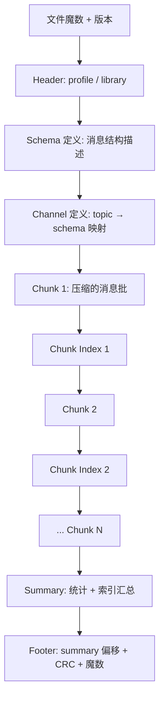
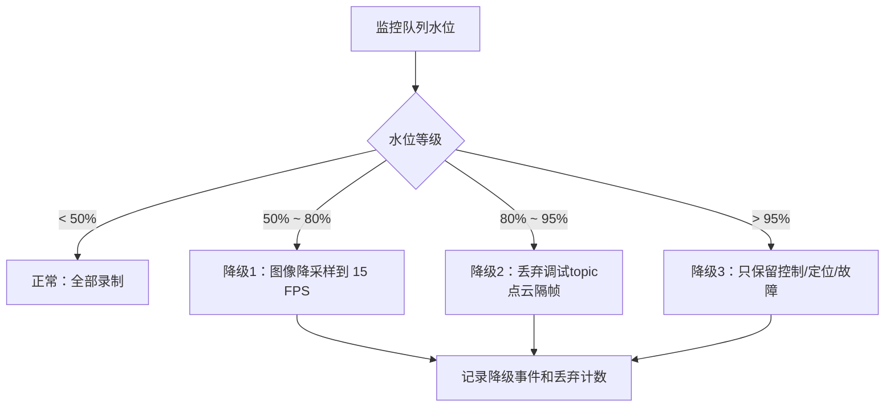
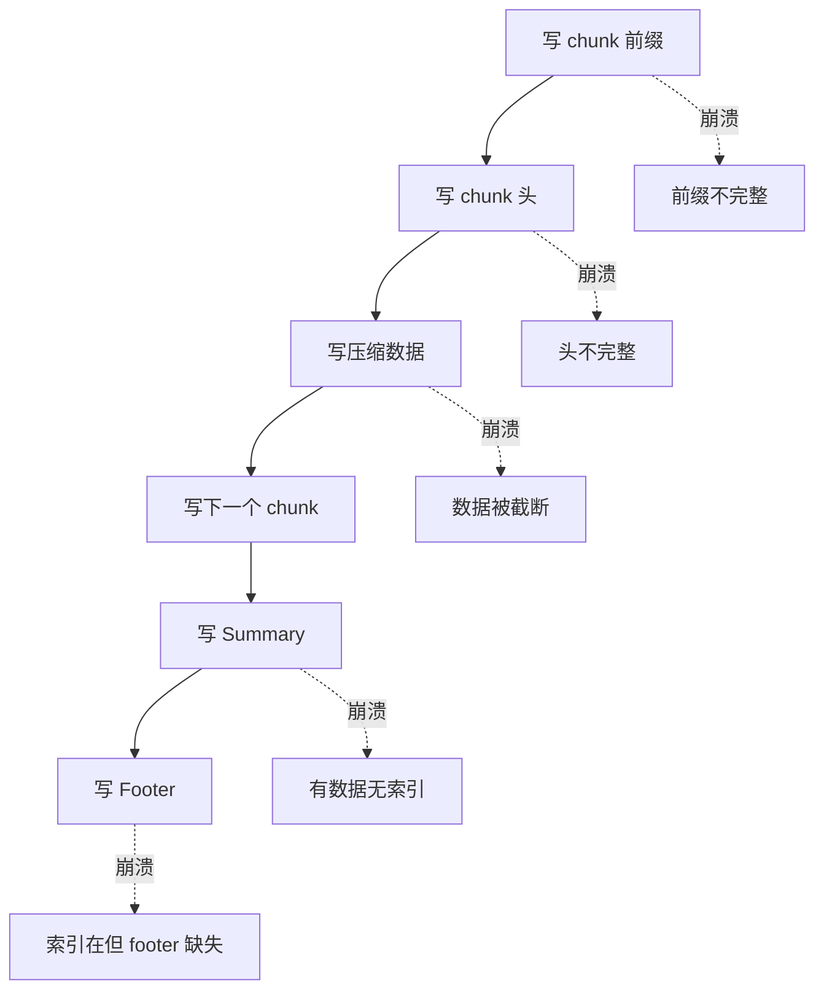
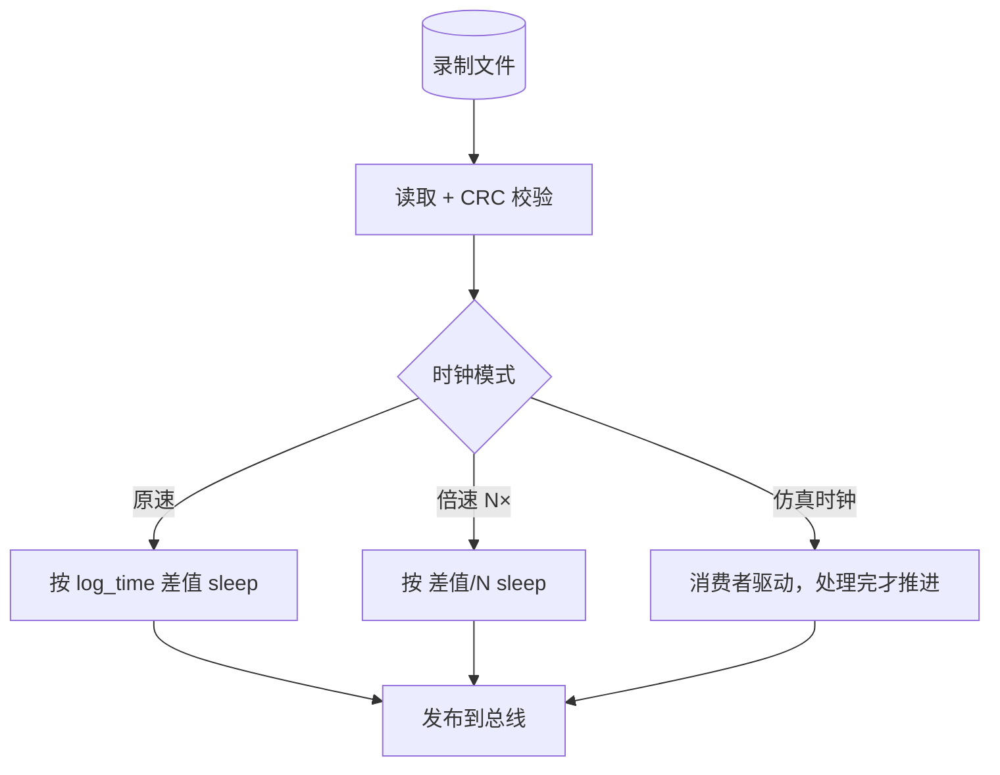
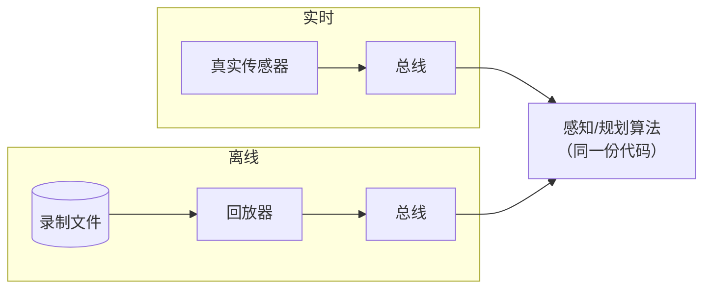
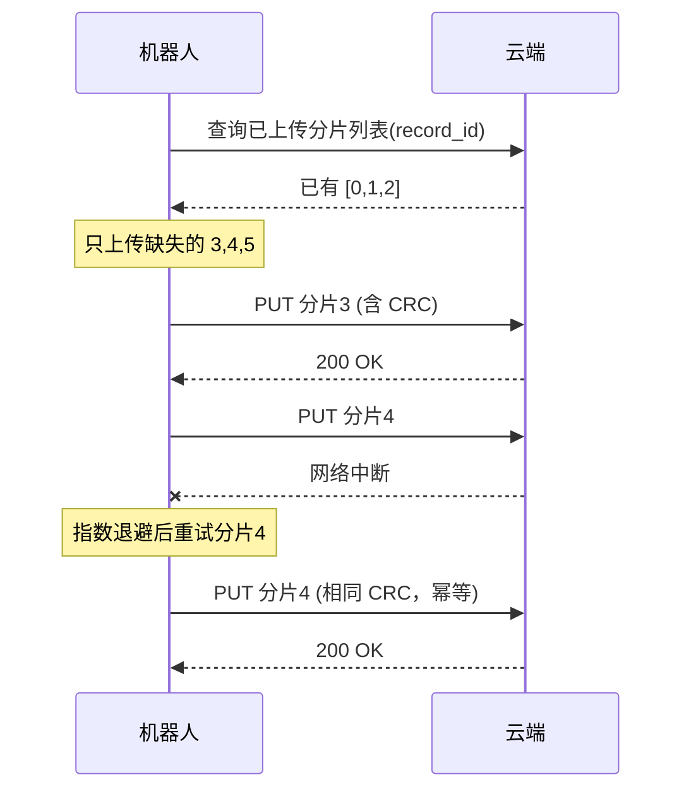

# 第 8 章：录制、存储、索引与回放

## 8.1 本章目标与前置知识

### 学完本章你能做到

- 说清楚机器人为什么必须录数据，以及录制链路和普通"写日志"的本质区别。
- 设计一个采集线程永不被磁盘阻塞的落盘链路，并解释每一级缓冲的容量依据。
- 实现一个带 chunk 聚合、CRC 校验、索引和提交标记的存储格式。
- 在进程被 `kill -9`、磁盘写满、断电的情况下，把文件恢复到"最后一个完整 chunk"。
- 实现支持倍速、时间段过滤、topic 过滤和确定性推进的回放器。
- 用数据回答"压缩该选哪个算法""chunk 该切多大"这类工程问题。

### 需要先掌握

| 前置知识 | 在哪一章 | 为什么需要 |
| --- | --- | --- |
| 有界队列与背压 | 第 2 章 2.6 | 落盘链路每一级都要有界 |
| 生产者消费者模型 | 第 2 章 2.4 | 采集线程与写盘线程解耦 |
| 消息头与序列化 | 第 3 章 | 存储格式要能自描述和跨版本 |
| QoS 与丢弃策略 | 第 4 章 | 缓冲满时按数据等级降级 |
| 单调时钟与源时间戳 | 第 7 章 7.6 | 回放要能重放时间语义 |

{: .note }
> 本章的代码可以独立编译运行，不依赖前面章节的完整总线。但设计思路是延续的：**所有缓冲有界、所有失败可观测、所有结论有数据**。

---

## 8.2 为什么需要数据落盘链路

### 8.2.1 机器人开发的真实困境

假设你在调试一台配送机器人。它在园区某个转角偶尔会急停，频率大约是每两小时一次。你能做什么？

- **加日志**：文本日志能告诉你"急停触发了"，但告诉不了你当时激光雷达看到了什么、融合出的障碍物位置是多少、控制指令序列是什么。
- **复现**：这个转角的光照、行人、地面反光每次都不同，你无法在实验室复现。
- **加断点**：机器人在跑，你不可能在真实道路上让它停在断点上。

唯一可行的办法是：**把当时所有传感器输入和中间结果都录下来，回到办公室反复回放**。

这就是机器人数据落盘链路的第一个价值：**把不可复现的现场变成可反复复现的数据**。

### 8.2.2 四类核心价值

| 价值 | 说明 | 对存储的要求 |
| --- | --- | --- |
| 事故分析 | 出问题后回溯当时的完整输入和状态 | 数据必须完整，崩溃时也不能全丢 |
| 回归测试 | 用真实数据跑新版本算法，对比结果 | 回放要确定性，同样输入得同样输出 |
| 训练数据 | 感知模型需要大量标注过的真实数据 | 要能按时间/topic 检索、批量导出 |
| 性能分析 | 离线分析延迟、丢帧、队列水位 | 要记录时间戳和元数据，不只是 payload |

### 8.2.3 为什么不能"直接写文件"

新手常见的第一版实现：

```cpp
// 反面教材：不要这样做
void on_image(const Image& img) {
    std::ofstream f("record.bin", std::ios::app);
    f.write(img.data(), img.size());   // 直接在回调里写盘
    f.flush();                          // 甚至还 flush
}
```

这段代码有五个致命问题：

1. **阻塞采集线程**。机械硬盘的一次寻道就是 5–10 ms，SSD 遇到 GC 也可能卡几十毫秒。回调阻塞意味着上游队列积压，最终丢帧。
2. **每帧一次系统调用**。30 FPS × 多路传感器，系统调用开销和小块 I/O 会吃掉大量 CPU。
3. **没有元数据**。回放时不知道这段字节是哪个 topic、什么时间、什么格式、什么版本。
4. **不能检索**。想看"第 37 分钟的图像"，只能从头读整个文件。
5. **崩溃即损坏**。进程被杀时可能停在半条消息中间，读取器无法判断哪里是有效边界。

{: .important }
> **落盘链路 ≠ 写文件**。它是一条完整的流水线：采集 → 有界缓冲 → 批量聚合 → 压缩 → 顺序写入 → 索引 → 提交，每一级都要处理背压和失败。

### 8.2.4 容量估算：先算清楚要存多少

设计前必须先算数据量。以一台典型的自动驾驶测试车为例：

| 数据源 | 单条大小 | 频率 | 码率 |
| --- | --- | --- | --- |
| 相机 ×4（1920×1080 JPEG，压缩后约 300 KB） | 300 KB | 30 Hz | $4 \times 300\text{KB} \times 30 \approx 36$ MB/s |
| 激光雷达 ×1（10 万点 × 16 字节） | 1.6 MB | 10 Hz | $1.6\text{MB} \times 10 = 16$ MB/s |
| 毫米波雷达 ×5 | 4 KB | 20 Hz | $5 \times 4\text{KB} \times 20 = 0.4$ MB/s |
| IMU | 64 B | 200 Hz | 约 12.8 KB/s |
| 定位/规划/控制中间结果 | 约 2 KB | 100 Hz | 约 0.2 MB/s |

总码率约：

$$36 + 16 + 0.4 + 0.013 + 0.2 \approx 52.6\ \text{MB/s}$$

一小时的数据量：

$$52.6 \times 3600 \approx 189\ \text{GB/h}$$

**这个数字带来三个直接约束**：

1. **磁盘带宽**：52.6 MB/s 对 NVMe SSD 不难，但对 SATA SSD（约 500 MB/s 顺序写）已占 10%，对机械硬盘（约 150 MB/s 顺序写）占 35%，且机械硬盘一旦有随机写就会崩。**必须顺序写**。
2. **存储容量**：一块 2 TB 盘只能录约 10.5 小时。需要分片、轮转和及时上传。
3. **上传带宽**：189 GB/h 用千兆网（约 125 MB/s 理论、实际约 100 MB/s）上传需要约 32 分钟，比录制时间短，勉强可行；但用 4G/5G 就完全不可能，必须筛选上传。

{: .warning }
> 不做容量估算就开始写代码，是这个领域最常见的错误。上面的算术只需要几分钟，却能决定架构：要不要压缩、要不要分片、能不能实时上传、缓冲要多大。

---

## 8.3 核心概念与术语

| 中文 | 英文 | 含义 |
| --- | --- | --- |
| 消息 | Message | 一条被记录的数据，含元数据和负载 |
| 通道 | Channel | 一路数据流，对应一个 topic + 一种 schema |
| 模式 | Schema | 描述消息结构的定义（如 protobuf descriptor） |
| 数据块 | Chunk | 多条消息聚合成的批，压缩和写入的单位 |
| 索引 | Index | 从时间/通道到 chunk 位置的映射，用于随机访问 |
| 页脚 | Footer | 文件末尾的元信息，记录索引位置和完整性标记 |
| 校验和 | CRC / Checksum | 用于检测数据是否损坏 |
| 提交标记 | Commit marker | 表明"到这里为止的数据已完整写入" |
| 预写日志 | WAL (Write-Ahead Log) | 先写日志再改数据，保证崩溃可恢复 |
| 分片 | Sharding / Splitting | 把长录制切成多个文件 |
| 回放 | Replay / Playback | 从文件重新产生消息流 |

### 8.3.1 MCAP 与 rosbag：两种主流格式

| 格式 | 来源 | 特点 |
| --- | --- | --- |
| **rosbag2** | ROS 2 官方 | 默认用 SQLite 或 MCAP 作为存储后端，与 ROS 生态深度集成 |
| **MCAP** | Foxglove 开源 | 自描述、schema 无关、支持任意序列化格式，可独立于 ROS 使用 |

两者的核心结构思想是一致的，本章按这个通用结构讲解：



{: .note }
> 记住这个结构的关键设计：**索引在数据之后**。因为写入时你不知道每个 chunk 会有多大、压缩后多长，只能先写数据、记住位置，最后统一写索引。这个顺序直接导致了 8.8 节要讨论的崩溃恢复问题。

---

## 8.4 落盘链路的分级设计

### 8.4.1 完整链路


### 8.4.2 每一级的职责与容量依据

| 级别 | 职责 | 容量如何定 | 满了怎么办 |
| --- | --- | --- | --- |
| 订阅回调 | 只做拷贝/引用计数，立即返回 | 无缓冲 | 不适用 |
| 有界队列 | 吸收瞬时突发 | 覆盖最坏磁盘停顿时长 | 按 topic 优先级丢弃 |
| 聚合缓冲 | 攒够一个 chunk | 目标 chunk 大小（如 4 MB） | 立即切 chunk |
| 写入缓冲 | 减少系统调用 | 与文件系统块大小对齐 | 阻塞（此处允许） |

**队列容量的算法**：假设要容忍磁盘停顿 $T_{stall}$ 秒，某 topic 码率 $R$ MB/s，则队列至少需要：

$$C \geq R \times T_{stall}$$

例如相机 36 MB/s，要容忍 2 秒停顿：

$$C \geq 36 \times 2 = 72\ \text{MB}$$

{: .warning }
> 容忍时间不能设得太大。72 MB 是可以接受的内存代价，但如果想容忍 60 秒停顿就需要 2.1 GB——这时应该做的不是加大缓冲，而是**接受丢帧并记录丢弃计数**。缓冲是用来吸收抖动的，不是用来掩盖持续的能力不足的。

### 8.4.3 分级丢弃策略

当队列压力上升时，不同数据的重要性不同：



{: .important }
> 降级必须**被记录**。回放时如果发现某段数据缺失，必须能从文件里知道"这是主动降级丢的"还是"数据损坏丢的"。前者是设计行为，后者是故障。把降级事件本身也写入文件，是一个容易被忽略但极其重要的细节。

---

## 8.5 存储格式设计

### 8.5.1 记录结构定义

```cpp
// record_format.hpp
#pragma once
#include <cstdint>
#include <vector>
#include <string>

namespace rec {

// 文件魔数：便于工具识别文件类型，也用于恢复时定位边界
constexpr uint8_t kMagic[8] = {0x89, 'R', 'E', 'C', 0x0D, 0x0A, 0x1A, 0x0A};
constexpr uint16_t kFormatVersion = 1;

// 记录类型：文件是一串 TLV(Type-Length-Value) 记录
enum class RecordType : uint8_t {
    Header      = 0x01,   // 文件头
    Schema      = 0x02,   // 消息结构定义
    Channel     = 0x03,   // topic -> schema 绑定
    Chunk       = 0x04,   // 压缩的消息批
    ChunkIndex  = 0x05,   // 单个 chunk 的索引项
    Statistics  = 0x06,   // 统计信息
    DropEvent   = 0x07,   // 降级/丢弃事件（可观测性）
    Summary     = 0x08,   // 索引汇总
    Footer      = 0x09,   // 文件尾
};

// 每条记录的通用前缀：类型 + 长度，保证未知类型也能跳过
struct RecordPrefix {
    uint8_t  type;        // RecordType
    uint8_t  reserved[3];
    uint64_t length;      // 后续 payload 字节数（不含本前缀）
} __attribute__((packed));

// 压缩算法标识
enum class Compression : uint8_t { None = 0, Lz4 = 1, Zstd = 2 };

// Chunk 头：描述一批消息
struct ChunkHeader {
    uint64_t start_time_ns;      // 批内最小消息时间
    uint64_t end_time_ns;        // 批内最大消息时间
    uint64_t uncompressed_size;  // 解压后字节数（用于预分配）
    uint32_t uncompressed_crc;   // 解压后数据的 CRC32
    uint32_t message_count;      // 消息条数
    uint8_t  compression;        // Compression
    uint8_t  reserved[7];
    // 后跟压缩后的数据
} __attribute__((packed));

// Chunk 内每条消息的头
struct MessageHeader {
    uint16_t channel_id;      // 哪个 topic
    uint16_t flags;           // 保留：是否关键帧等
    uint32_t payload_size;
    uint64_t log_time_ns;     // 录制器收到的时间（单调基准换算后）
    uint64_t publish_time_ns; // 消息自带的源时间戳
    uint64_t sequence;        // 同 channel 内序号，用于检测缺口
    // 后跟 payload_size 字节
} __attribute__((packed));

// 索引项：让"按时间找 chunk"成为 O(log n)
struct ChunkIndexEntry {
    uint64_t start_time_ns;
    uint64_t end_time_ns;
    uint64_t chunk_offset;     // chunk 记录在文件中的起始偏移
    uint64_t chunk_length;     // 含前缀的总长度
    uint32_t message_count;
    uint32_t reserved;
} __attribute__((packed));

// 文件尾：定长，便于从文件末尾反向定位
struct Footer {
    uint64_t summary_offset;   // Summary 记录的偏移；0 表示未写完
    uint32_t summary_crc;
    uint32_t flags;            // bit0: 正常关闭
    uint8_t  magic[8];         // 再写一次魔数，便于校验
} __attribute__((packed));

constexpr uint32_t kFlagCleanClose = 0x1;

} // namespace rec
```

### 8.5.2 为什么这样设计

| 设计 | 理由 |
| --- | --- |
| TLV 记录结构 | 未知类型可按 length 跳过，格式可向前演进 |
| 记录内嵌魔数 | 崩溃恢复时可以扫描定位记录边界 |
| chunk 携带时间范围 | 不解压就能判断"这个 chunk 是否在查询范围内" |
| CRC 覆盖解压后数据 | 同时检测压缩损坏和解压错误 |
| 序列号在消息头 | 回放时可检测录制期间是否丢消息 |
| footer 定长且在末尾 | 可以 `seek(-sizeof(Footer), SEEK_END)` 快速读取 |
| footer 有 clean flag | 区分"正常关闭"和"崩溃"，决定是否需要扫描恢复 |

{: .note }
> `log_time_ns` 和 `publish_time_ns` 必须都记录。前者是录制器视角的时间（用于按录制顺序回放），后者是数据产生时间（用于传感器对齐）。两者的差值本身就是有价值的诊断信息——它反映了从产生到落盘的端到端延迟。

---

## 8.6 工程实现：录制器

### 8.6.1 CRC32 与工具函数

```cpp
// crc32.hpp —— 标准 CRC-32（IEEE 802.3 多项式），查表实现
#pragma once
#include <cstdint>
#include <cstddef>
#include <array>

namespace rec {

inline const std::array<uint32_t, 256>& crc_table() {
    static const std::array<uint32_t, 256> table = [] {
        std::array<uint32_t, 256> t{};
        for (uint32_t i = 0; i < 256; ++i) {
            uint32_t c = i;
            for (int k = 0; k < 8; ++k)
                c = (c & 1) ? (0xEDB88320u ^ (c >> 1)) : (c >> 1);
            t[i] = c;
        }
        return t;
    }();
    return table;
}

inline uint32_t crc32(uint32_t seed, const void* data, size_t len) {
    const auto& t = crc_table();
    uint32_t c = seed ^ 0xFFFFFFFFu;
    const uint8_t* p = static_cast<const uint8_t*>(data);
    for (size_t i = 0; i < len; ++i)
        c = t[(c ^ p[i]) & 0xFF] ^ (c >> 8);
    return c ^ 0xFFFFFFFFu;
}

} // namespace rec
```

### 8.6.2 录制器主体

```cpp
// recorder.hpp
#pragma once
#include "record_format.hpp"
#include "crc32.hpp"
#include <atomic>
#include <chrono>
#include <condition_variable>
#include <cstdio>
#include <deque>
#include <mutex>
#include <thread>
#include <unordered_map>
#include <vector>

namespace rec {

struct RecorderConfig {
    size_t   chunk_target_bytes = 4 * 1024 * 1024;  // 攒够 4MB 切 chunk
    uint64_t chunk_max_span_ns  = 1'000'000'000ULL; // 或攒够 1 秒
    size_t   queue_capacity     = 4096;             // 待写消息条数上限
    size_t   queue_bytes_cap    = 256 * 1024 * 1024;// 待写字节上限
    Compression compression     = Compression::Lz4;
};

// 待写入的一条消息（已完成从业务对象到字节的转换）
struct PendingMessage {
    uint16_t channel_id;
    uint64_t log_time_ns;
    uint64_t publish_time_ns;
    uint64_t sequence;
    std::vector<uint8_t> payload;
};

class Recorder {
public:
    Recorder(const std::string& path, RecorderConfig cfg)
        : cfg_(cfg) {
        file_ = std::fopen(path.c_str(), "wb");
        if (!file_) throw std::runtime_error("open record file failed");
        // 加大 stdio 缓冲，减少小块写
        setvbuf(file_, nullptr, _IOFBF, 1 << 20);
        write_file_header();
        writer_ = std::thread([this] { writer_loop(); });
    }

    ~Recorder() { close(); }

    // 注册一个通道，返回 channel_id
    uint16_t add_channel(const std::string& topic,
                         const std::string& schema_name,
                         const std::string& schema_encoding,
                         const std::vector<uint8_t>& schema_data) {
        std::lock_guard lk(meta_mu_);
        uint16_t id = next_channel_id_++;
        write_schema_record(id, schema_name, schema_encoding, schema_data);
        write_channel_record(id, topic, schema_name);
        return id;
    }

    // 采集线程调用：只入队，绝不碰磁盘
    // 返回 false 表示被丢弃（队列满）
    bool write(uint16_t channel_id, uint64_t publish_time_ns,
               const void* data, size_t len, int priority = 0) {
        std::unique_lock lk(q_mu_);
        if (stopping_) return false;

        const bool over_count = queue_.size() >= cfg_.queue_capacity;
        const bool over_bytes = queue_bytes_ + len > cfg_.queue_bytes_cap;
        if (over_count || over_bytes) {
            // 分级丢弃：低优先级直接丢，高优先级挤掉一条低优先级
            if (priority <= 0) {
                dropped_.fetch_add(1, std::memory_order_relaxed);
                dropped_bytes_.fetch_add(len, std::memory_order_relaxed);
                return false;
            }
            if (!evict_one_low_priority()) {
                dropped_.fetch_add(1, std::memory_order_relaxed);
                return false;
            }
        }

        PendingMessage m;
        m.channel_id = channel_id;
        m.log_time_ns = now_ns();
        m.publish_time_ns = publish_time_ns;
        m.sequence = ++seq_[channel_id];
        m.payload.assign(static_cast<const uint8_t*>(data),
                         static_cast<const uint8_t*>(data) + len);
        queue_bytes_ += len;
        high_water_ = std::max(high_water_, queue_bytes_);
        queue_.push_back(std::move(m));
        cv_.notify_one();
        return true;
    }

    void close() {
        {
            std::lock_guard lk(q_mu_);
            if (stopping_) return;
            stopping_ = true;
        }
        cv_.notify_all();
        if (writer_.joinable()) writer_.join();
        finalize();          // 写 summary + footer
        if (file_) { std::fclose(file_); file_ = nullptr; }
    }

    // 可观测性指标
    uint64_t dropped() const { return dropped_.load(); }
    size_t   queue_high_water() const { return high_water_; }

private:
    static uint64_t now_ns() {
        return std::chrono::duration_cast<std::chrono::nanoseconds>(
            std::chrono::steady_clock::now().time_since_epoch()).count();
    }

    bool evict_one_low_priority() {
        // 简化实现：丢队首（最旧）的一条。生产实现应按 channel 优先级挑选。
        if (queue_.empty()) return false;
        queue_bytes_ -= queue_.front().payload.size();
        queue_.pop_front();
        dropped_.fetch_add(1, std::memory_order_relaxed);
        return true;
    }

    void writer_loop() {
        std::vector<uint8_t> chunk_buf;
        chunk_buf.reserve(cfg_.chunk_target_bytes + (1 << 20));
        uint64_t t0 = UINT64_MAX, t1 = 0;
        uint32_t count = 0;
        auto last_flush = std::chrono::steady_clock::now();

        for (;;) {
            std::deque<PendingMessage> batch;
            {
                std::unique_lock lk(q_mu_);
                cv_.wait_for(lk, std::chrono::milliseconds(100),
                             [&] { return stopping_ || !queue_.empty(); });
                if (queue_.empty() && stopping_) break;
                batch.swap(queue_);
                queue_bytes_ = 0;
            }

            for (auto& m : batch) {
                append_message(chunk_buf, m);
                t0 = std::min(t0, m.log_time_ns);
                t1 = std::max(t1, m.log_time_ns);
                ++count;
                if (chunk_buf.size() >= cfg_.chunk_target_bytes) {
                    flush_chunk(chunk_buf, t0, t1, count);
                    t0 = UINT64_MAX; t1 = 0; count = 0;
                    last_flush = std::chrono::steady_clock::now();
                }
            }

            // 时间触发：即使没攒够大小，也要定期落盘，缩短崩溃丢失窗口
            auto now = std::chrono::steady_clock::now();
            if (count > 0 && now - last_flush >
                std::chrono::nanoseconds(cfg_.chunk_max_span_ns)) {
                flush_chunk(chunk_buf, t0, t1, count);
                t0 = UINT64_MAX; t1 = 0; count = 0;
                last_flush = now;
            }
        }
        if (count > 0) flush_chunk(chunk_buf, t0, t1, count);
    }

    void append_message(std::vector<uint8_t>& buf, const PendingMessage& m) {
        MessageHeader h{};
        h.channel_id = m.channel_id;
        h.flags = 0;
        h.payload_size = static_cast<uint32_t>(m.payload.size());
        h.log_time_ns = m.log_time_ns;
        h.publish_time_ns = m.publish_time_ns;
        h.sequence = m.sequence;
        const uint8_t* hp = reinterpret_cast<const uint8_t*>(&h);
        buf.insert(buf.end(), hp, hp + sizeof(h));
        buf.insert(buf.end(), m.payload.begin(), m.payload.end());
    }

    void flush_chunk(std::vector<uint8_t>& raw,
                     uint64_t t0, uint64_t t1, uint32_t count) {
        if (raw.empty()) return;

        std::vector<uint8_t> body = compress(raw, cfg_.compression);

        ChunkHeader ch{};
        ch.start_time_ns = t0;
        ch.end_time_ns = t1;
        ch.uncompressed_size = raw.size();
        ch.uncompressed_crc = crc32(0, raw.data(), raw.size());
        ch.message_count = count;
        ch.compression = static_cast<uint8_t>(cfg_.compression);

        uint64_t offset = static_cast<uint64_t>(std::ftell(file_));
        uint64_t payload_len = sizeof(ch) + body.size();
        write_record(RecordType::Chunk, &ch, sizeof(ch),
                     body.data(), body.size());

        ChunkIndexEntry e{};
        e.start_time_ns = t0;
        e.end_time_ns = t1;
        e.chunk_offset = offset;
        e.chunk_length = sizeof(RecordPrefix) + payload_len;
        e.message_count = count;
        index_.push_back(e);

        raw.clear();
    }

    static std::vector<uint8_t> compress(const std::vector<uint8_t>& in,
                                         Compression c) {
        if (c == Compression::None) return in;
        // 实际工程接 LZ4_compress_default / ZSTD_compress。
        // 这里给出接口位置，保持示例可独立编译。
        return in;
    }

    void write_record(RecordType type, const void* head, size_t head_len,
                      const void* body = nullptr, size_t body_len = 0) {
        RecordPrefix p{};
        p.type = static_cast<uint8_t>(type);
        p.length = head_len + body_len;
        std::fwrite(&p, sizeof(p), 1, file_);
        if (head_len) std::fwrite(head, 1, head_len, file_);
        if (body_len) std::fwrite(body, 1, body_len, file_);
    }

    void write_file_header() {
        std::fwrite(kMagic, 1, sizeof(kMagic), file_);
        uint16_t v = kFormatVersion;
        write_record(RecordType::Header, &v, sizeof(v));
    }

    void write_schema_record(uint16_t id, const std::string& name,
                             const std::string& enc,
                             const std::vector<uint8_t>& data) {
        std::vector<uint8_t> buf;
        auto put = [&](const void* p, size_t n) {
            const uint8_t* b = static_cast<const uint8_t*>(p);
            buf.insert(buf.end(), b, b + n);
        };
        put(&id, sizeof(id));
        uint32_t n1 = name.size();  put(&n1, 4); put(name.data(), n1);
        uint32_t n2 = enc.size();   put(&n2, 4); put(enc.data(), n2);
        uint32_t n3 = data.size();  put(&n3, 4); put(data.data(), n3);
        write_record(RecordType::Schema, buf.data(), buf.size());
    }

    void write_channel_record(uint16_t id, const std::string& topic,
                              const std::string& schema_name) {
        std::vector<uint8_t> buf;
        auto put = [&](const void* p, size_t n) {
            const uint8_t* b = static_cast<const uint8_t*>(p);
            buf.insert(buf.end(), b, b + n);
        };
        put(&id, sizeof(id));
        uint32_t n1 = topic.size();       put(&n1, 4); put(topic.data(), n1);
        uint32_t n2 = schema_name.size(); put(&n2, 4); put(schema_name.data(), n2);
        write_record(RecordType::Channel, buf.data(), buf.size());
    }

    void finalize() {
        if (!file_) return;
        // 写降级统计，让回放端能区分"主动丢"和"损坏丢"
        uint64_t d = dropped_.load();
        write_record(RecordType::DropEvent, &d, sizeof(d));

        uint64_t summary_off = static_cast<uint64_t>(std::ftell(file_));
        write_record(RecordType::Summary, index_.data(),
                     index_.size() * sizeof(ChunkIndexEntry));

        Footer f{};
        f.summary_offset = summary_off;
        f.summary_crc = crc32(0, index_.data(),
                              index_.size() * sizeof(ChunkIndexEntry));
        f.flags = kFlagCleanClose;
        std::memcpy(f.magic, kMagic, sizeof(kMagic));
        std::fwrite(&f, sizeof(f), 1, file_);
        std::fflush(file_);
        // 关键数据可在此调用 fsync 强制落盘（代价是延迟）
    }

    RecorderConfig cfg_;
    FILE* file_ = nullptr;
    std::thread writer_;

    std::mutex q_mu_;
    std::condition_variable cv_;
    std::deque<PendingMessage> queue_;
    size_t queue_bytes_ = 0;
    size_t high_water_ = 0;
    bool stopping_ = false;

    std::mutex meta_mu_;
    uint16_t next_channel_id_ = 1;
    std::unordered_map<uint16_t, uint64_t> seq_;
    std::vector<ChunkIndexEntry> index_;

    std::atomic<uint64_t> dropped_{0};
    std::atomic<uint64_t> dropped_bytes_{0};
};

} // namespace rec
```

### 8.6.3 关键设计点逐条解释

**为什么 `write()` 里要拷贝 payload？**

因为采集线程调用完 `write()` 就会复用或释放它的缓冲区。如果只存指针，写盘线程读到的可能是已被覆盖的数据。生产实现应该用第 3 章的引用计数句柄避免这次拷贝——`write()` 接受一个 `BufferHandle`，队列里持有句柄，写盘线程用完再归还。

**为什么用 `batch.swap(queue_)` 而不是逐条 `pop`？**

一次加锁取走全部待写消息，把锁的持有时间从"每条一次"降到"每批一次"。采集线程的入队延迟因此大幅下降。这是生产者消费者模型里非常有效的优化。

**为什么 chunk 要同时有大小触发和时间触发？**

- 只有大小触发：低速数据可能几分钟都攒不满一个 chunk，崩溃时这段数据全丢。
- 只有时间触发：高速数据会产生很多小 chunk，压缩率下降、索引膨胀。

两者取"先到者触发"，兼顾崩溃丢失窗口和存储效率。

**为什么 `flush_chunk` 里先记 offset 再写？**

因为索引项需要记录 chunk 在文件中的起始位置，必须在写之前用 `ftell` 取当前偏移。写完之后取到的是结束位置。

---

## 8.7 压缩策略

### 8.7.1 算法对比

| 算法 | 压缩速度 | 解压速度 | 压缩率 | 适用 |
| --- | --- | --- | --- | --- |
| 不压缩 | — | — | 1.0× | 已压缩数据、CPU 极度紧张 |
| LZ4 | 约 500 MB/s | 约 2 GB/s | 约 2× | 实时录制默认选择 |
| Zstd (level 1) | 约 400 MB/s | 约 1 GB/s | 约 2.8× | 平衡型 |
| Zstd (level 9) | 约 50 MB/s | 约 1 GB/s | 约 3.5× | 离线归档 |

{: .warning }
> 这些数字是数量级参考，**必须在你自己的硬件和数据上实测**。压缩率高度依赖数据特性：点云可能压到 3×，而 JPEG 图像几乎压不动（约 1.02×），对它压缩纯属浪费 CPU。

### 8.7.2 按数据类型选择

```cpp
Compression choose_compression(const std::string& schema_name) {
    // 已经是压缩格式的，不要二次压缩
    if (schema_name == "sensor_msgs/CompressedImage" ||
        schema_name == "H264Frame" ||
        schema_name == "JpegImage") {
        return Compression::None;
    }
    // 点云、栅格地图等有大量冗余，压缩收益高
    if (schema_name == "sensor_msgs/PointCloud2" ||
        schema_name == "nav_msgs/OccupancyGrid") {
        return Compression::Zstd;
    }
    // 其余小消息用 LZ4，几乎不增加延迟
    return Compression::Lz4;
}
```

### 8.7.3 压缩带来的 CPU 预算

以 8.2.4 的 52.6 MB/s 为例，若全部用 LZ4（约 500 MB/s 单核）：

$$\frac{52.6}{500} \approx 0.105 = 10.5\%\ \text{单核}$$

可以接受。若改用 Zstd level 9（约 50 MB/s 单核）：

$$\frac{52.6}{50} \approx 1.05 = 105\%\ \text{单核}$$

需要一整个核，而且一旦数据突发就会成为瓶颈，导致队列积压。**这就是为什么实时录制几乎总是选 LZ4 或 Zstd 低档，高压缩率留给离线归档**。

---

## 8.8 崩溃恢复与数据完整性

### 8.8.1 崩溃会停在哪里



**最关键的洞察**：崩溃可能停在任何位置，包括一条记录的中间。而且由于 stdio 有用户态缓冲、内核有页缓存，"已经调用了 `fwrite`" 不代表数据已经在磁盘上。

### 8.8.2 恢复算法

```cpp
// recover.hpp
#pragma once
#include "record_format.hpp"
#include "crc32.hpp"
#include <cstdio>
#include <optional>
#include <vector>

namespace rec {

struct RecoveryResult {
    bool clean_close = false;          // footer 完好
    uint64_t valid_end_offset = 0;     // 最后一个完整记录的结束位置
    std::vector<ChunkIndexEntry> index;// 重建或读取到的索引
    uint32_t recovered_chunks = 0;
    uint32_t corrupted_chunks = 0;
};

class Recovery {
public:
    static RecoveryResult scan(const std::string& path) {
        RecoveryResult r;
        FILE* f = std::fopen(path.c_str(), "rb");
        if (!f) return r;

        // 快路径：先试着读 footer
        if (try_read_footer(f, r)) {
            std::fclose(f);
            return r;                   // 正常关闭，直接用已有索引
        }

        // 慢路径：从头扫描并重建索引
        std::fseek(f, 0, SEEK_SET);
        uint8_t magic[sizeof(kMagic)];
        if (std::fread(magic, 1, sizeof(magic), f) != sizeof(magic) ||
            std::memcmp(magic, kMagic, sizeof(kMagic)) != 0) {
            std::fclose(f);
            return r;                   // 连魔数都不对，不是本格式文件
        }
        r.valid_end_offset = sizeof(kMagic);

        for (;;) {
            long pos = std::ftell(f);
            RecordPrefix p{};
            if (std::fread(&p, sizeof(p), 1, f) != 1) break;   // 前缀不完整

            if (p.type == static_cast<uint8_t>(RecordType::Chunk)) {
                if (!verify_chunk(f, p.length, pos, r)) {
                    r.corrupted_chunks++;
                    break;              // 遇到损坏就停，之后的都不可信
                }
            } else {
                // 非 chunk 记录：只校验长度可读
                if (std::fseek(f, static_cast<long>(p.length), SEEK_CUR) != 0)
                    break;
                if (std::ftell(f) < 0) break;
            }
            r.valid_end_offset = static_cast<uint64_t>(std::ftell(f));
        }

        std::fclose(f);
        return r;
    }

    // 把损坏尾部截断，让文件恢复可用
    static bool truncate_to_valid(const std::string& path,
                                  const RecoveryResult& r) {
        if (r.valid_end_offset == 0) return false;
        return ::truncate(path.c_str(),
                          static_cast<off_t>(r.valid_end_offset)) == 0;
    }

private:
    static bool try_read_footer(FILE* f, RecoveryResult& r) {
        if (std::fseek(f, -static_cast<long>(sizeof(Footer)), SEEK_END) != 0)
            return false;
        Footer ft{};
        if (std::fread(&ft, sizeof(ft), 1, f) != 1) return false;
        if (std::memcmp(ft.magic, kMagic, sizeof(kMagic)) != 0) return false;
        if (!(ft.flags & kFlagCleanClose)) return false;
        if (ft.summary_offset == 0) return false;

        // 读 summary
        if (std::fseek(f, static_cast<long>(ft.summary_offset), SEEK_SET) != 0)
            return false;
        RecordPrefix p{};
        if (std::fread(&p, sizeof(p), 1, f) != 1) return false;
        if (p.type != static_cast<uint8_t>(RecordType::Summary)) return false;

        size_t n = p.length / sizeof(ChunkIndexEntry);
        r.index.resize(n);
        if (n && std::fread(r.index.data(), sizeof(ChunkIndexEntry), n, f) != n)
            return false;

        // 校验索引 CRC，防止索引本身损坏
        uint32_t crc = crc32(0, r.index.data(), n * sizeof(ChunkIndexEntry));
        if (crc != ft.summary_crc) { r.index.clear(); return false; }

        r.clean_close = true;
        r.recovered_chunks = static_cast<uint32_t>(n);
        return true;
    }

    static bool verify_chunk(FILE* f, uint64_t len, long record_pos,
                             RecoveryResult& r) {
        if (len < sizeof(ChunkHeader)) return false;
        ChunkHeader ch{};
        if (std::fread(&ch, sizeof(ch), 1, f) != 1) return false;

        size_t body_len = static_cast<size_t>(len - sizeof(ch));
        std::vector<uint8_t> body(body_len);
        if (body_len && std::fread(body.data(), 1, body_len, f) != body_len)
            return false;                  // 数据被截断

        std::vector<uint8_t> raw = decompress(body, ch);
        if (raw.size() != ch.uncompressed_size) return false;
        if (crc32(0, raw.data(), raw.size()) != ch.uncompressed_crc)
            return false;                  // CRC 不匹配，数据损坏

        ChunkIndexEntry e{};
        e.start_time_ns = ch.start_time_ns;
        e.end_time_ns = ch.end_time_ns;
        e.chunk_offset = static_cast<uint64_t>(record_pos);
        e.chunk_length = sizeof(RecordPrefix) + len;
        e.message_count = ch.message_count;
        r.index.push_back(e);
        r.recovered_chunks++;
        return true;
    }

    static std::vector<uint8_t> decompress(const std::vector<uint8_t>& in,
                                           const ChunkHeader&) {
        return in;   // 与 Recorder::compress 对应，接实际算法
    }
};

} // namespace rec
```

### 8.8.3 恢复策略的三条原则

{: .important }
> 1. **数据是事实，索引是加速结构**。索引丢失必须能扫描重建，否则一次崩溃就废掉整段数据。
> 2. **遇到第一个损坏就停止**。损坏点之后的字节可能是任何东西，继续解析可能读出看似合法实则错误的数据。
> 3. **恢复要有明确输出**。返回"恢复了 N 个 chunk、丢弃了 M 字节尾部"，而不是静默处理。运维需要知道损失了多少。

### 8.8.4 关于 fsync 的取舍

| 策略 | 崩溃丢失窗口 | 性能代价 |
| --- | --- | --- |
| 从不 fsync | 内核页缓存全部（可能几十 MB） | 无 |
| 每 chunk fsync | 一个 chunk | 每次 5–50 ms，严重影响吞吐 |
| 定期 fsync（如每 5 秒） | 5 秒数据 | 可接受 |
| 每条消息 fsync | 几乎为零 | 完全不可行 |

**注意区分两种崩溃**：

- **进程崩溃**（`kill -9`、段错误）：内核页缓存仍在，数据不会丢，`fsync` 帮不上忙。
- **系统崩溃**（断电、内核 panic）：页缓存丢失，只有 `fsync` 过的数据幸存。

机器人场景断电很常见（急停切断总电源），所以定期 `fsync` 是有必要的。

---

## 8.9 索引与随机访问

### 8.9.1 按时间查询

有了 `ChunkIndexEntry` 数组（按时间有序），查询"[t0, t1] 范围内的消息"就是一次二分：

```cpp
// 找出所有与 [t0, t1] 有交集的 chunk
std::vector<ChunkIndexEntry> find_chunks(
        const std::vector<ChunkIndexEntry>& index,
        uint64_t t0, uint64_t t1) {
    std::vector<ChunkIndexEntry> out;
    // chunk 按 start_time 有序；用 lower_bound 定位第一个可能相交的
    auto it = std::lower_bound(index.begin(), index.end(), t0,
        [](const ChunkIndexEntry& e, uint64_t v) { return e.end_time_ns < v; });
    for (; it != index.end() && it->start_time_ns <= t1; ++it)
        out.push_back(*it);
    return out;
}
```

**复杂度**：$O(\log n + k)$，$k$ 是命中的 chunk 数。对比不用索引的全文件扫描 $O(n)$：一个 189 GB 的录制，全扫需要读完整个文件（假设 500 MB/s，约 6.3 分钟），而用索引只读命中的几个 chunk（毫秒级）。

### 8.9.2 按 topic 过滤

只有时间索引还不够。想要"只回放 `/camera/front`"，需要额外的 channel 索引：

| 索引类型 | 结构 | 用途 |
| --- | --- | --- |
| 时间索引 | 有序数组，二分查找 | 时间段跳转 |
| 通道索引 | `channel_id → chunk 列表` | topic 过滤 |
| 消息索引（可选） | `(channel, time) → chunk 内偏移` | 精确定位单条消息 |

{: .note }
> 消息级索引会显著增大文件（每条消息一个索引项）。工程上常见的折中是：只建 chunk 级索引，读到 chunk 后在内存里线性扫描找目标消息。chunk 只有几 MB，内存扫描很快。

### 8.9.3 chunk 大小的权衡

| chunk 大小 | 压缩率 | 随机访问粒度 | 损坏损失 | 内存占用 |
| --- | --- | --- | --- | --- |
| 64 KB | 低 | 细 | 小 | 小 |
| 4 MB | 高 | 中 | 中 | 中 |
| 64 MB | 最高 | 粗 | 大 | 大 |

**为什么 4 MB 左右是常见选择**：

- 压缩率在 1 MB 之后收益递减（字典已经足够大）。
- 读一个 4 MB chunk 在 SSD 上约 8 ms，可接受。
- 损坏一个 chunk 损失约 4 MB，在 189 GB 里可忽略。
- 聚合缓冲 4 MB × 若干 topic，内存可控。

---

## 8.10 回放语义

### 8.10.1 三种时钟模式



| 模式 | 时间推进方式 | 适用场景 |
| --- | --- | --- |
| 原速 | 按真实时间 sleep | 可视化、演示、人工观察 |
| 倍速 | 按缩放后时间 sleep | 快速过一遍长录制 |
| 仿真时钟 | 消费者处理完才推进 | **确定性回归测试** |

{: .important }
> 只有仿真时钟能做确定性测试。原速和倍速下，如果算法处理慢了，消息会积压或被丢，每次运行结果都不同——这样的测试无法作为回归基准。

### 8.10.2 回放器实现

```cpp
// player.hpp
#pragma once
#include "record_format.hpp"
#include "recover.hpp"
#include <functional>
#include <thread>
#include <set>

namespace rec {

struct PlaybackOptions {
    double   rate = 1.0;              // 倍速；<=0 表示尽快
    bool     simulated_clock = false; // 仿真时钟：等待消费者
    uint64_t start_time_ns = 0;
    uint64_t end_time_ns = UINT64_MAX;
    std::set<uint16_t> channels;      // 空表示全部
};

class Player {
public:
    using Handler = std::function<void(const MessageHeader&,
                                       const uint8_t* payload)>;

    Player(const std::string& path, PlaybackOptions opt)
        : path_(path), opt_(opt) {
        recovery_ = Recovery::scan(path);
        if (!recovery_.clean_close) {
            // 上次崩溃了：用扫描重建的索引，并告知调用方
            fprintf(stderr,
                    "[player] unclean file: recovered %u chunks, %u corrupted\n",
                    recovery_.recovered_chunks, recovery_.corrupted_chunks);
        }
    }

    void play(Handler on_message) {
        FILE* f = std::fopen(path_.c_str(), "rb");
        if (!f) return;

        uint64_t prev_log_time = 0;
        auto wall_start = std::chrono::steady_clock::now();

        for (const auto& e : recovery_.index) {
            if (e.end_time_ns < opt_.start_time_ns) continue;   // 整块在范围前
            if (e.start_time_ns > opt_.end_time_ns) break;      // 整块在范围后

            auto raw = load_chunk(f, e);
            size_t off = 0;
            while (off + sizeof(MessageHeader) <= raw.size()) {
                MessageHeader h{};
                std::memcpy(&h, raw.data() + off, sizeof(h));
                off += sizeof(h);
                if (off + h.payload_size > raw.size()) break;   // 防越界
                const uint8_t* payload = raw.data() + off;
                off += h.payload_size;

                if (h.log_time_ns < opt_.start_time_ns) continue;
                if (h.log_time_ns > opt_.end_time_ns) { std::fclose(f); return; }
                if (!opt_.channels.empty() &&
                    !opt_.channels.count(h.channel_id)) continue;

                pace(h.log_time_ns, prev_log_time, wall_start);
                prev_log_time = h.log_time_ns;
                on_message(h, payload);        // 仿真时钟下这里是同步阻塞的
            }
        }
        std::fclose(f);
    }

private:
    void pace(uint64_t log_time, uint64_t prev,
              std::chrono::steady_clock::time_point) {
        if (opt_.simulated_clock) return;      // 消费者驱动，不 sleep
        if (opt_.rate <= 0) return;            // 尽快回放
        if (prev == 0) return;
        uint64_t delta = log_time > prev ? log_time - prev : 0;
        auto sleep_ns = static_cast<uint64_t>(delta / opt_.rate);
        if (sleep_ns > 0)
            std::this_thread::sleep_for(std::chrono::nanoseconds(sleep_ns));
    }

    std::vector<uint8_t> load_chunk(FILE* f, const ChunkIndexEntry& e) {
        std::fseek(f, static_cast<long>(e.chunk_offset), SEEK_SET);
        RecordPrefix p{};
        if (std::fread(&p, sizeof(p), 1, f) != 1) return {};
        ChunkHeader ch{};
        if (std::fread(&ch, sizeof(ch), 1, f) != 1) return {};
        size_t body_len = static_cast<size_t>(p.length - sizeof(ch));
        std::vector<uint8_t> body(body_len);
        if (body_len && std::fread(body.data(), 1, body_len, f) != body_len)
            return {};
        std::vector<uint8_t> raw = body;   // 接实际解压
        if (crc32(0, raw.data(), raw.size()) != ch.uncompressed_crc)
            return {};                     // 损坏的 chunk 跳过而不是崩溃
        return raw;
    }

    std::string path_;
    PlaybackOptions opt_;
    RecoveryResult recovery_;
};

} // namespace rec
```

### 8.10.3 回放与实时共用接口



{: .tip }
> 让算法节点通过同一套订阅接口取数据，它就不需要知道数据来自设备还是文件。好处：线上问题能离线复现、回归测试用真实数据、开发时不需要真实硬件。代价是必须把时间源也抽象出来——算法里不能直接调 `steady_clock::now()`，要用注入的时钟接口。

---

## 8.11 分片、轮转与上传

### 8.11.1 为什么要分片

| 问题 | 单一大文件 | 分片 |
| --- | --- | --- |
| 损坏影响 | 可能整个不可用 | 只影响一片 |
| 并行上传 | 只能串行 | 多片并行 |
| 磁盘轮转 | 无法删除部分 | 可删最旧片 |
| 断点续传 | 整文件重传 | 只重传失败片 |

常见分片策略：按大小（如每 1 GB）或按时间（如每 5 分钟），先到者触发。

### 8.11.2 上传的幂等与断点续传



{: .warning }
> 上传必须幂等。网络中断时机器人不知道服务端是否已收到，只能重传；如果服务端不做去重，同一分片会被存两份或拼接错误。用 `(record_id, shard_index, crc)` 作为幂等键。

---

## 8.12 常见错误与陷阱

### 陷阱 1：在订阅回调里直接写盘

```cpp
// 错误
void on_lidar(const PointCloud& pc) {
    file_.write(pc.data(), pc.size());   // 阻塞采集线程
}

// 正确
void on_lidar(const PointCloud& pc) {
    if (!recorder_.write(lidar_channel_, pc.stamp(), pc.data(), pc.size()))
        drop_counter_.fetch_add(1);      // 丢弃也要计数
}
```

### 陷阱 2：用无界队列"避免丢帧"

```cpp
// 错误：队列无上限
std::deque<Message> queue_;   // 磁盘慢 → 内存无限增长 → OOM

// 正确：有界 + 明确的丢弃策略 + 计数
if (queue_.size() >= capacity_) { dropped_++; return false; }
```

无界队列不是"不丢数据"，它只是把"丢一帧"变成"OOM 之后丢全部"。

### 陷阱 3：认为 `fwrite` 返回就等于数据安全

`fwrite` 只是写进了 stdio 的用户态缓冲；`fflush` 只是交给了内核页缓存；只有 `fsync` 才保证落到物理介质。三者之间任何一层在断电时都会丢数据。

### 陷阱 4：把索引当作唯一事实来源

```cpp
// 错误：footer 读不到就放弃
if (!read_footer()) throw std::runtime_error("corrupted file");

// 正确：回退到扫描重建
if (!read_footer()) index = scan_and_rebuild_index();
```

### 陷阱 5：对已压缩数据再压缩

对 JPEG 图像做 Zstd，通常压缩率只有 1.01–1.05×，却要消耗大量 CPU。要按 schema 类型选择压缩算法（见 8.7.2）。

### 陷阱 6：回放不校验 CRC

```cpp
// 错误：直接信任文件内容
auto raw = decompress(body);
parse_messages(raw);           // 损坏数据可能导致越界或死循环

// 正确
if (crc32(0, raw.data(), raw.size()) != ch.uncompressed_crc) {
    corrupted_chunks_++;
    return;                    // 跳过这个 chunk，继续下一个
}
```

### 陷阱 7：只记录 payload 不记录时间和序号

没有 `log_time` 就无法按时间检索和回放；没有 `sequence` 就无法知道录制期间是否丢过消息。回放时"数据看起来是连续的"可能只是因为你看不到缺口。

---

## 8.13 真实案例

### 案例 1：索引未完成导致两小时路测数据全废

**现象**：一次两小时的路测结束后，录制文件有 340 GB，但回放工具打开时报 "invalid file"，所有数据都读不出来。

**排查**：用 `hexdump` 检查文件末尾，发现没有 footer 魔数。进程日志显示录制器在关闭前被系统 OOM killer 杀死（因为同时运行的感知进程内存泄漏）。

**根因**：读取器的实现是"先读 footer → 拿到 summary 偏移 → 读索引 → 按索引读 chunk"。footer 缺失导致整条链路断在第一步，而实际上 340 GB 的 chunk 数据全都完好地躺在文件里。

**修复**：
1. 读取器增加降级路径：footer 缺失或 CRC 不匹配时，从头扫描 chunk、逐个校验 CRC、重建索引（即 8.8.2 的 `Recovery::scan`）。
2. 录制器每写 N 个 chunk 就写一次增量 summary，缩短"有数据无索引"的窗口。
3. 给录制进程设置 `oom_score_adj` 降低被杀优先级。

**取舍**：扫描恢复 340 GB 需要读完整个文件，约 11 分钟（500 MB/s）。这个代价只在崩溃后付出一次，远好于数据全废。

**验证**：写了一个测试脚本，在录制的三个阶段（chunk 中途、chunk 之间、footer 之前）分别 `kill -9`，断言每次都能恢复出全部完整 chunk，且恢复出的消息数量与录制端计数一致。

### 案例 2：磁盘抖动引发全局丢帧

**现象**：录制过程中，每隔几分钟所有 topic 同时丢帧 200–500 ms，包括码率很低的 IMU 和控制指令。

**排查**：`iostat -x 1` 显示磁盘 `await` 周期性冲高到 400 ms（SSD 的垃圾回收）。同时 `pidstat -t` 显示录制进程的接收线程在这些时刻 CPU 占用为 0——说明它在等待，而不是在忙。

**根因**：所有 topic 共用一把锁保护一个队列，写盘线程在 `fwrite` 期间持有该锁。磁盘卡顿时，接收线程无法入队，所有数据源一起被卡住。

**修复**：
1. 写盘线程用 `swap` 一次性取走队列内容，把锁的持有时间从"整个写盘过程"缩短到"一次指针交换"。
2. 按 topic 优先级分级：控制、定位、故障事件使用独立的高优先级队列，绝不因为图像积压而被丢。
3. 队列容量按 8.4.2 的公式设置，容忍 2 秒磁盘停顿。

**取舍**：分级队列增加了实现复杂度和少量内存，但换来"关键数据不因大数据流拥塞而丢失"。

**验证**：用 `dd` 在同一块盘上制造持续写入压力，注入人为的 2 秒 `fsync` 停顿，断言控制 topic 零丢弃、接收线程入队延迟 p99 < 1 ms。

### 案例 3：回放结果与线上不一致

**现象**：某个规划 bug 在车上稳定复现，但用录制数据回放时完全正常，无法调试。

**排查**：对比线上和回放的日志时间戳，发现回放时规划节点收到的消息顺序与线上不同——线上是"图像 → IMU → 图像"，回放变成"图像 → 图像 → IMU"。

**根因**：回放器按 chunk 顺序读取，而不同 topic 的消息分布在不同 chunk 中；回放时按 chunk 逐个吐出，破坏了原始的时间交错顺序。

**修复**：回放时对多个 chunk 做**按 `log_time_ns` 的归并**（k 路归并，用最小堆），保证全局按时间有序输出。

**取舍**：归并需要同时打开多个 chunk，内存占用上升；但这是保证回放语义正确的必要代价。

**验证**：录制一段包含三路不同频率数据的文件，回放时断言输出消息的 `log_time_ns` 单调不减，且与录制端记录的顺序完全一致。

---

## 8.14 动手实验与验收

### 实验 1：实现最小录制器

用 8.6 的代码为基础，录制三路模拟数据：
- IMU：200 Hz，64 字节
- 图像：30 Hz，300 KB
- 控制：100 Hz，128 字节

**验收**：
- 运行 60 秒，文件大小与理论值（约 550 MB）误差 < 5%。
- 录制期间用 `pidstat -t` 观察，采集线程 CPU 占用 < 5%，且无阻塞。
- 打印队列水位峰值和丢弃计数。

### 实验 2：崩溃恢复

在三个时机分别 `kill -9` 录制进程：
1. chunk 写入中途（可在 `flush_chunk` 里加人为延迟制造窗口）
2. 两个 chunk 之间
3. 写 summary 之后、footer 之前

**验收**：
- 每种情况下 `Recovery::scan` 都能返回大于 0 的 `recovered_chunks`。
- 恢复出的消息数量 ≤ 录制端计数，且所有恢复出的消息 CRC 校验通过。
- 明确报告"丢弃了多少字节尾部"。

### 实验 3：索引与随机访问

录制 10 分钟数据，然后：
- 查询第 5 分钟到第 6 分钟的所有消息。
- 只回放图像 topic。

**验收**：
- 带索引的查询耗时 < 100 ms；对比全文件扫描的耗时，给出加速比。
- topic 过滤后输出的消息数量与预期（30 Hz × 60 s = 1800）一致。

### 实验 4：压缩对比

对同一份数据分别用 None / LZ4 / Zstd-1 / Zstd-9：

**验收**：填写这张表并给出选型结论。

| 算法 | 文件大小 | 压缩率 | 录制 CPU 占用 | 写入带宽 | 回放解压耗时 |
| --- | --- | --- | --- | --- | --- |
| None | | 1.00× | | | |
| LZ4 | | | | | |
| Zstd-1 | | | | | |
| Zstd-9 | | | | | |

### 实验 5：回放确定性

用仿真时钟模式回放同一份文件三次，每次记录所有消息的 `(channel_id, sequence)` 序列。

**验收**：三次的序列完全一致（可用哈希对比）。如果不一致，说明回放器有非确定性（通常是多线程调度或时间依赖）。

---

## 8.15 本章小结与自查清单

### 核心结论

1. **落盘链路是流水线，不是写文件**。采集 → 有界缓冲 → 聚合 → 压缩 → 顺序写 → 索引，每一级都要有容量上限和明确的失败行为。
2. **采集线程永不碰磁盘**。它只做轻量封装和入队；队列满时按数据等级丢弃并计数。
3. **数据是事实，索引是加速结构**。索引必须能扫描重建，否则一次崩溃可能废掉全部数据。
4. **CRC + 提交标记是可靠落盘的最小协议**。没有它们就无法判断数据边界和完整性。
5. **压缩要按数据类型选**。已压缩数据不要二次压缩；实时录制用 LZ4 或 Zstd 低档。
6. **确定性回放需要仿真时钟**。按墙上时间回放无法作为回归测试基准。

### 自查清单

- [ ] 我能说出落盘链路的每一级，以及每一级队列容量的计算依据。
- [ ] 我能解释 `fwrite`、`fflush`、`fsync` 三者的区别，以及各自在什么崩溃下会丢数据。
- [ ] 我能写出从头扫描重建索引的恢复算法，并说明为什么遇到损坏要立即停止。
- [ ] 我能解释 chunk 大小在压缩率、随机访问、损坏损失、内存之间的权衡。
- [ ] 我能说出为什么 JPEG 图像不该再压缩，并能用数据支撑。
- [ ] 我能解释原速、倍速、仿真时钟三种回放模式各自的适用场景。
- [ ] 我能设计一个幂等的分片上传协议，并说明断点续传如何工作。
- [ ] 我能说出至少三种会导致"回放结果与线上不一致"的原因。

---

## 8.16 面试问题与参考答案

**问：如何设计一个高吞吐的机器人数据录制器？**

答：分五层来说。第一，采集层只做轻量封装并入有界队列，绝不在订阅回调里碰磁盘，因为磁盘一次停顿就是几十毫秒，会直接导致上游丢帧。第二，缓冲层按 topic 分级，容量按"码率 × 可容忍停顿时长"计算，满时按数据重要性丢弃并计数——控制和定位数据优先保留，图像可降采样。第三，聚合层攒 chunk，用大小和时间双阈值触发，兼顾压缩率和崩溃丢失窗口。第四，写入层顺序大块写，用 `swap` 一次取走整批以缩短锁持有时间。第五，索引异步在内存累积，定期写增量 summary。可观测性上要暴露队列水位、丢弃计数、写入带宽和 fsync 耗时。

**问：为什么索引不能是唯一的事实来源？**

答：因为索引通常在文件末尾、录制结束时才写完整，而崩溃可能发生在任何时刻。如果读取器只认索引，一次 OOM 或断电就会让已经完好写入的几百 GB 数据全部不可用。正确做法是：数据 chunk 自带长度和 CRC，读取器在索引缺失或损坏时能从头扫描、逐个校验、重建索引。索引只是把 $O(n)$ 的扫描优化成 $O(\log n)$ 的定位，它是加速结构而不是必需品。

**问：`fwrite` 之后数据就安全了吗？**

答：不安全，要分三层看。`fwrite` 只写进了 stdio 的用户态缓冲区，进程崩溃就丢；`fflush` 把数据交给内核页缓存，此时进程崩溃不会丢（`kill -9` 也不会），但系统断电会丢；只有 `fsync` 才保证数据落到物理介质。机器人场景急停会切断总电源，属于系统级掉电，所以关键数据需要定期 `fsync`。但 `fsync` 每次要 5–50 ms，不能每条消息都做，通常是每几秒或每 N 个 chunk 做一次，在丢失窗口和吞吐之间取平衡。

**问：chunk 应该切多大？**

答：这是四个因素的权衡。chunk 越大，压缩字典越充分、压缩率越高，索引项越少；但随机访问粒度越粗（想读一条消息也要读整个 chunk），单次损坏损失越大，聚合缓冲占的内存越多。实践中 1–8 MB 是常见区间，4 MB 是个不错的起点：压缩率在 1 MB 后收益已经递减，SSD 读 4 MB 约 8 ms 可以接受，损坏损失在几百 GB 的录制里可忽略。另外要配时间阈值，避免低速 topic 几分钟攒不满一个 chunk 导致崩溃时丢失过多。

**问：回放和线上运行为什么要共用同一套接口？**

答：这样算法节点不需要知道数据来自真实传感器还是文件，好处有三个：线上问题能用录制数据离线复现调试；回归测试可以用真实路测数据而不是人造数据；开发时不需要占用真实硬件。代价是必须把时间源也抽象出来注入——算法里不能直接调 `steady_clock::now()`，否则回放时算出的时间差是错的。另外 QoS 也要显式配置，回放器需要能控制时钟推进速度。

**问：怎样保证回放是确定性的？**

答：需要三个条件。第一，用仿真时钟而不是墙上时钟——消费者处理完一条才推进到下一条，这样算法处理慢了也不会丢消息或改变顺序。第二，多 chunk 之间要按 `log_time` 做归并输出，因为不同 topic 的消息分布在不同 chunk 里，按 chunk 顺序读会破坏原始的时间交错。第三，算法侧不能有依赖真实时间或线程调度顺序的逻辑。验证方法是回放三次，对比消息序列的哈希是否完全一致。

**问：数据上传如何做到幂等和断点续传？**

答：先把录制文件分片（按大小或时间），每片计算 CRC。上传前先向服务端查询该 `record_id` 已有哪些分片，只传缺失的。每次 PUT 携带 `(record_id, shard_index, crc)` 作为幂等键，服务端见到重复的直接返回成功。网络中断时客户端不知道服务端是否收到，只能重试，幂等键保证重复上传不会产生重复数据或错误拼接。上传全部完成后再做一次整体校验（比如比对分片数量和总 CRC）才标记为完成。

**问：录制时如何区分"主动丢弃"和"数据损坏"？**

答：把降级和丢弃事件本身也写进文件，作为一种记录类型。回放时如果发现某个 topic 在某段时间没有数据，可以查这些事件记录：如果有对应的降级事件，说明是设计行为（当时队列压力大主动丢的）；如果没有，那就是数据损坏或录制器 bug，需要排查。这个细节经常被忽略，但对事故分析很关键——你必须能回答"这段数据是没录还是丢了"。

---

## 8.17 延伸阅读

| 主题 | 建议材料 | 关注点 |
| --- | --- | --- |
| MCAP 格式 | MCAP 官方规范文档 | 记录类型、索引结构、CRC 覆盖范围 |
| rosbag2 | ROS 2 文档与源码 | 存储插件架构、与 MCAP 的集成方式 |
| 压缩算法 | LZ4 与 Zstd 官方基准 | 在你自己的数据上重测，不要直接引用 |
| 崩溃一致性 | 数据库 WAL 与 checkpoint 机制 | 提交协议的通用思想 |
| 文件系统 | `fsync` 语义、`O_DIRECT`、写屏障 | 不同文件系统的持久化保证差异 |
| 列式存储 | Parquet 格式 | 离线分析场景的存储优化思路 |

{: .note }
> 本章的实现刻意保持了可独立编译，压缩和解压留了接口位置。接入真实的 LZ4/Zstd 之后，务必用第 6 章的方法重新测量压缩率、CPU 和端到端延迟——不要直接采信本章表格里的数量级参考值。
