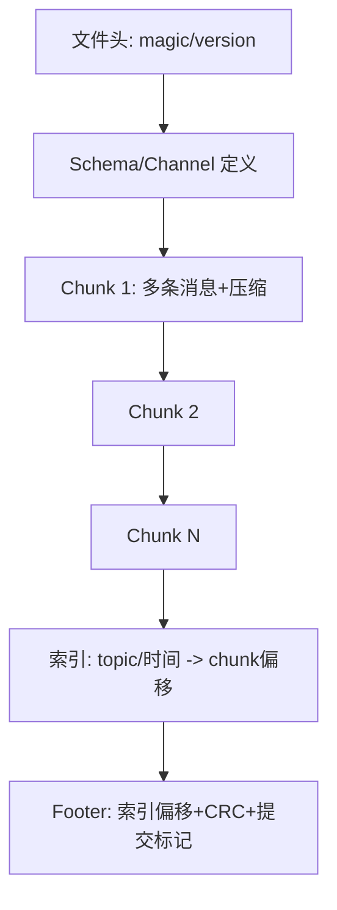
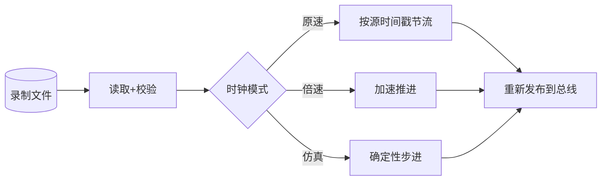

# 第 8 章：录制、存储、索引与回放

## 本章目标

设计从采集到离线分析的**数据闭环**：高频数据不阻塞业务、文件可检索可校验可恢复、回放能重现线上问题。掌握 MCAP/rosbag 的结构思想，实现 chunk + 索引 + CRC + 崩溃恢复。

## 8.1 数据链路分阶段


{: .important }
> 采集线程**绝不能等磁盘**。它只做轻量封装并入有界队列；专门的写盘线程批量聚合成大块顺序写。队列满按数据等级丢弃或降采样。

## 8.2 文件格式：header + chunk + index + footer

MCAP、rosbag2 等格式的共同思想：



- **Chunk**：一批消息聚合压缩，边界兼顾压缩收益、随机访问和损坏隔离。
- **Index**：按 topic/channel 和时间范围定位 chunk，支持快速检索。
- **Footer**：记录索引位置和**提交标记**，用于判断文件是否完整写完。

## 8.3 一个带 CRC 和恢复的 chunk 写入器

```cpp
#include <cstdio>
#include <cstdint>
#include <vector>
#include <zlib.h>   // crc32

struct ChunkHeader {
    uint32_t magic = 0x4D435A31;   // "MCZ1"
    uint32_t uncompressed_len;
    uint32_t compressed_len;
    uint64_t start_time_ns;
    uint64_t end_time_ns;
    uint32_t message_count;
    uint32_t crc32;                // 覆盖压缩后数据
};

class ChunkWriter {
public:
    explicit ChunkWriter(FILE* f) : f_(f) {}

    void write_chunk(const std::vector<uint8_t>& compressed,
                     uint32_t uncompressed_len, uint64_t t0, uint64_t t1,
                     uint32_t count) {
        ChunkHeader h;
        h.uncompressed_len = uncompressed_len;
        h.compressed_len = (uint32_t)compressed.size();
        h.start_time_ns = t0; h.end_time_ns = t1;
        h.message_count = count;
        h.crc32 = crc32(0, compressed.data(), compressed.size());
        fwrite(&h, sizeof(h), 1, f_);
        fwrite(compressed.data(), 1, compressed.size(), f_);
        // 记录索引项（内存），文件结束时统一写 footer
        index_.push_back({t0, t1, offset_});
        offset_ += sizeof(h) + compressed.size();
    }

    // 崩溃恢复：从头扫描，校验每个 chunk，保留完整的
    static uint64_t recover(FILE* f) {
        ChunkHeader h;
        uint64_t good_end = 0;
        while (fread(&h, sizeof(h), 1, f) == 1) {
            if (h.magic != 0x4D435A31) break;         // 非法头，尾部损坏
            std::vector<uint8_t> buf(h.compressed_len);
            if (fread(buf.data(), 1, h.compressed_len, f) != h.compressed_len)
                break;                                 // 半个 chunk
            if (crc32(0, buf.data(), buf.size()) != h.crc32)
                break;                                 // 数据损坏
            good_end = ftell(f);                       // 到这里都是好的
        }
        return good_end;   // 之后的字节应截断
    }

private:
    struct IndexEntry { uint64_t t0, t1, offset; };
    FILE* f_;
    std::vector<IndexEntry> index_;
    uint64_t offset_ = 0;
};
```

{: .warning }
> 顺序写可能在崩溃/断电时留下半个 chunk。恢复时**从头扫描 + 校验 CRC**，保留完整 chunk，截断损坏尾部，重建索引。索引是加速结构，**不是唯一事实来源**。

## 8.4 压缩策略

| 数据类型 | 建议 | 理由 |
| --- | --- | --- |
| 已编码图像(JPEG/H.264) | 不再压缩 | 已高熵，再压几乎无收益还耗 CPU |
| 点云 | LZ4/Zstd 低档 | 有冗余，重视随机访问和速度 |
| 结构化元数据/文本 | Zstd 中高档 | 冗余多，压缩率高 |
| 高频小消息 | 聚合后整块压 | 单条压缩开销占比太大 |

压缩要比较 CPU、延迟、压缩率、随机访问代价。LZ4 快、压缩率中；Zstd 可调档，兼顾率和速度。

## 8.5 回放语义



回放要支持原速、倍速、时间段过滤、topic 过滤、暂停、单步、仿真时钟。**确定性测试**要求控制时间推进和输入顺序；若回放直接依赖墙上时间，线上 bug 无法稳定复现。

{: .tip }
> 让回放和线上运行**共用同一套订阅接口**，算法节点不知道数据来自实时设备还是文件，从而用录制数据离线复现和回归测试。

## 8.6 真实案例：索引未完成导致整段数据不可用

录制进程在写完 chunk、但还没写 footer 索引时崩溃。读取器只认"完整 footer 索引"，于是**所有已写的好数据都读不出来**，一次两小时的路测数据全废。

**根因**：把索引当成唯一事实来源，没有扫描恢复能力。

**修复**：读取器在 footer 缺失/损坏时，回退到"从头扫描 chunk + 校验 CRC + 重建索引"；写入器定期写增量 footer 或提交标记。数据本身是事实，索引可重建。

**验证**：在写入的三个阶段（chunk 中途、chunk 之间、footer 之前）分别 `kill -9`，重启后都能恢复出所有完整 chunk。

## 8.7 动手实验与验收

**实验**：
1. 实现按 channel 写 chunk 的录制器，加 CRC、压缩、内存索引、footer。
2. 随机在写入/索引/上传阶段 `kill -9`，重启执行 `recover()`，核对恢复的消息 ID 和 payload。
3. 实现回放：支持倍速、时间段过滤、topic 过滤，驱动第 4 章的总线。
4. 对比 LZ4 vs Zstd 的压缩率、CPU、写入带宽。

**验收标准**：恢复不返回损坏消息；索引可重建；回放支持过滤和倍速；报告写入带宽、队列水位、丢弃数、压缩率、恢复时间。

## 8.8 面试问题与参考答案

**问：如何设计一个高吞吐录制器？**

答：采集线程只做轻量封装并入有界队列；专门线程批量聚合成 chunk 顺序写、异步建索引；用预分配和大块 I/O 减少小写；不同数据流按优先级隔离和降级；用队列水位、写入带宽、fsync 时间、丢弃数验证。核心是采集与落盘解耦、写入顺序化。

**问：为什么索引不能是唯一事实来源？**

答：索引更新通常晚于数据写入，崩溃时可能丢失。完整的数据 chunk + 校验才是事实，索引应能扫描重建。设计上要让"没有索引也能读出数据"，索引只是加速。

**问：数据落盘为什么需要 CRC 和提交协议？**

答：写盘、断电、上传都可能产生部分写入或损坏。长度 + CRC 识别完整 chunk；提交标记或 WAL 区分已提交和未完成；恢复时扫描重建。可靠落盘是协议问题，不是简单调 `write()`。

**问：回放和线上为什么要共用接口？**

答：这样算法节点无需区分数据来自设备还是文件，减少测试分支，并能用录制数据离线复现线上问题、做回归。时间源和 QoS 仍需显式配置（回放要能控制时钟推进）。

**问：chunk 边界怎么定？**

答：权衡压缩收益（chunk 越大压缩率越高）、随机访问粒度（chunk 越大定位越粗）、损坏隔离（chunk 越大损坏损失越多）、内存（聚合缓冲越大内存越高）。常见做法是按大小（如 4MB）或时间（如 1s）双阈值触发切分。
