# 第 9 章：Multi-Agent 与分布式状态

## 9.1 本章目标与前置知识

### 学完本章你能做到

- 说清楚"多机器人协同"比"单机器人"多出哪些本质困难，而不只是"多了几个节点"。
- 设计带代际（epoch）和租约（lease）的所有权协议，从根本上消除"双主"问题。
- 实现快照加增量的状态同步，并处理乱序、重复、缺口和版本回退。
- 为故障检测选择合理的心跳周期和超时阈值，并解释误判率与检测延迟的权衡。
- 判断一个场景该用强一致、最终一致还是因果一致，并说明代价。
- 在网络分区、延迟重连、时钟漂移的注入测试下，证明系统能收敛且不产生重复副作用。

### 需要先掌握

| 前置知识 | 在哪一章 | 为什么需要 |
| --- | --- | --- |
| 消息头与序列号 | 第 3 章 | 去重和缺口检测依赖它 |
| 发现与租约的基本形态 | 第 4 章 | 本章把它推广到多机器人 |
| 单调时钟与源时间戳 | 第 7 章 7.6 | 分布式下时钟不可信 |
| 超时与重试 | 第 10 章会深入 | 本章先用到基本形态 |

{: .note }
> 本章不讲 Paxos 或 Raft 的正确性证明。我们从工程视角出发：多数机器人场景不需要完整共识，需要的是**明确的所有权、可收敛的状态和不会重复执行的任务**。9.8 节会说明什么时候才真的需要共识。

---

## 9.2 为什么多机器人不是"多跑几个单机"

### 9.2.1 一个看似简单的需求

假设你要做一个仓储调度系统：5 台机器人，一个调度器分配搬运任务。单机思维下，代码可能是这样：

```cpp
// 单机思维：把任务表当成一个全局变量
std::map<int, int> task_owner;   // task_id -> robot_id

void assign(int task_id, int robot_id) {
    task_owner[task_id] = robot_id;    // 直接赋值
}
```

在单进程里这段代码是对的（加个锁就行）。但一旦机器人在不同的机器上，这段代码背后隐藏了四个致命假设：

| 隐含假设 | 单机是否成立 | 分布式是否成立 |
| --- | --- | --- |
| 赋值立即对所有人可见 | 成立 | **不成立**：消息要传播，有延迟 |
| 赋值一定成功 | 成立 | **不成立**：可能丢包 |
| 只有一个写入者 | 加锁即成立 | **不成立**：网络分区时两边都以为自己是主 |
| 读到的是最新值 | 成立 | **不成立**：可能读到旧副本 |

### 9.2.2 四个新增的困难

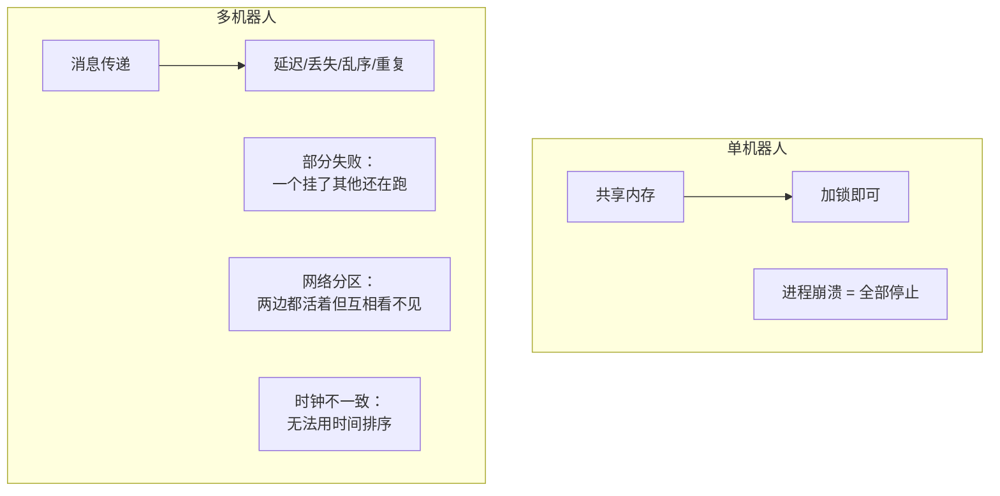

**困难一：部分失败（Partial Failure）**

单机上进程崩溃就是全部停止，状态很明确。分布式下，机器人 A 挂了，B、C、D 还在跑，而且**它们不知道 A 是挂了还是只是网络慢**。这两种情况需要完全不同的处理，但从外部看起来一模一样。

**困难二：无法区分"慢"和"死"**

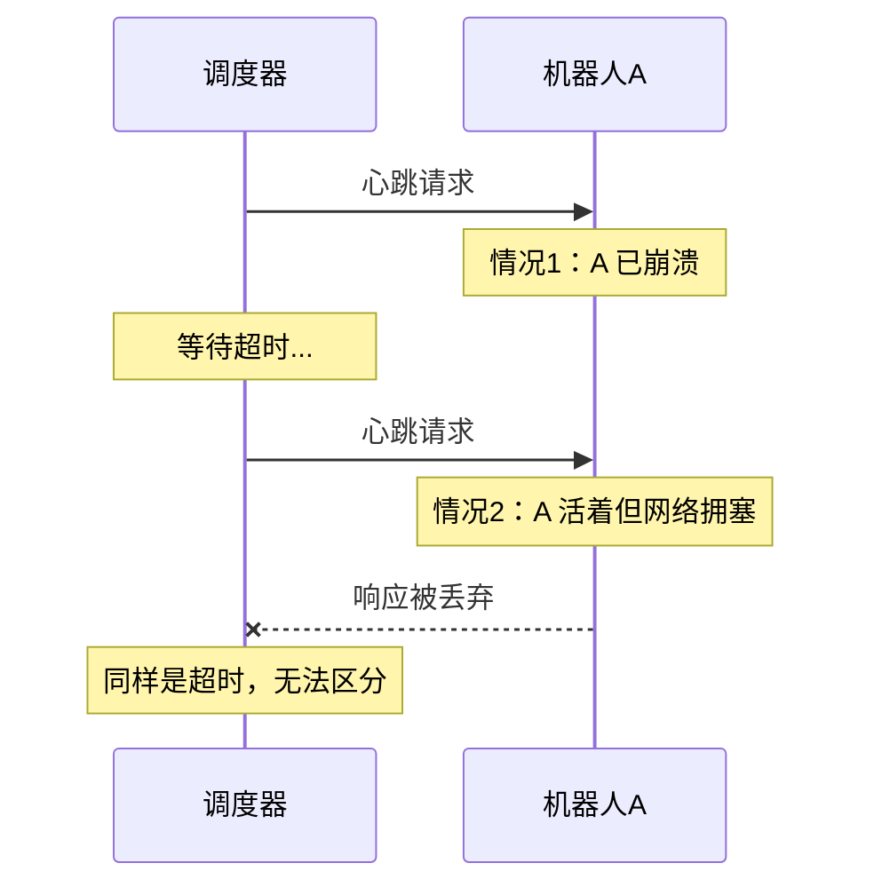

这是分布式系统的根本限制。你只能选择一个超时阈值，然后接受两类错误：判太快会误杀活着的节点，判太慢会让故障恢复变慢。

**困难三：网络分区（Network Partition）**

网络设备故障或无线信号中断时，集群可能裂成两半，两边内部都能通信，但互相不通。如果两边都认为"对方挂了，我接管"，就会出现两个调度器同时分配任务——这就是**脑裂（split brain）**。

**困难四：没有全局时钟**

不同机器的时钟会漂移（典型石英晶振误差约 $10^{-5}$，即每天约 1 秒）。即使用 NTP 同步，误差也在毫秒到几十毫秒。这意味着：

$$\text{机器 A 的 } t_1 > \text{机器 B 的 } t_2 \nRightarrow \text{事件 1 发生在事件 2 之后}$$

不能用时间戳判断因果顺序。

### 9.2.3 本章的解题思路

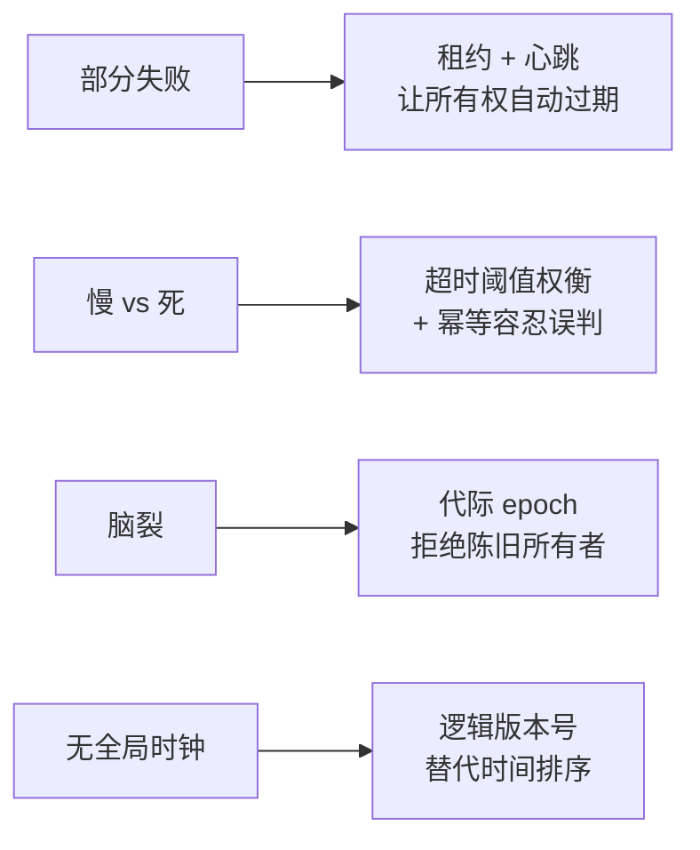

这四个机制组合起来，就能覆盖绝大多数机器人协同场景。

---

## 9.3 核心概念与术语

| 中文 | 英文 | 含义 |
| --- | --- | --- |
| 智能体 | Agent | 一个自主的机器人或计算单元 |
| 代际 | Epoch / Generation | 单调递增的编号，用于拒绝陈旧的所有者或消息 |
| 隔离令牌 | Fencing token | 代际的另一种叫法，强调"隔离旧持有者" |
| 租约 | Lease | 有时限的所有权，必须续期否则自动失效 |
| 心跳 | Heartbeat | 周期性的存活信号 |
| 快照 | Snapshot | 某一时刻的完整状态 |
| 增量 | Delta / Incremental update | 相对上一版本的变化 |
| 墓碑 | Tombstone | 删除标记，用于让"删除"这个事件也能传播 |
| 脑裂 | Split brain | 分区后出现多个"主"的错误状态 |
| 最终一致 | Eventual consistency | 停止更新后，所有副本最终收敛到同一值 |
| 因果一致 | Causal consistency | 有因果关系的事件在所有副本上顺序一致 |
| 幂等 | Idempotent | 重复执行与执行一次效果相同 |
| 收敛 | Convergence | 分区恢复后所有副本达成一致的过程 |

---

## 9.4 身份、代际与租约

### 9.4.1 身份的三个层次

一个 agent 的身份不只是一个 ID：

```cpp
struct AgentIdentity {
    uint32_t agent_id;        // 稳定标识：同一台机器人重启后不变
    uint64_t incarnation;     // 化身编号：每次进程启动递增
    uint64_t boot_time_ns;    // 启动时间：用于人工排查
    std::string version;      // 软件版本：用于兼容性判断
};
```

**为什么需要 `incarnation`（化身编号）**：

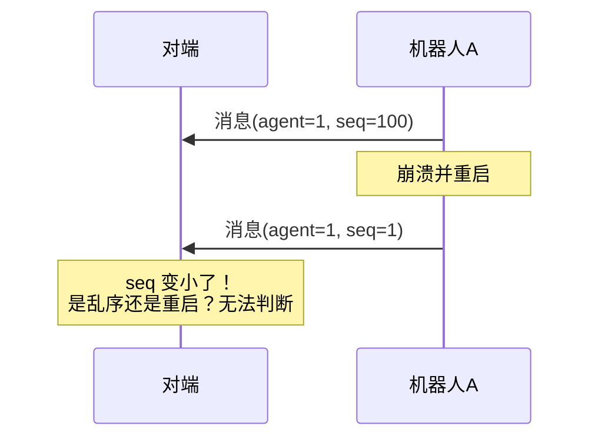

加上 incarnation 就清楚了：`(agent=1, incarnation=5, seq=1)` 明显是新一代的开始，对端应该重置对该 agent 的所有状态跟踪。

{: .important }
> `incarnation` 必须**持久化**（写文件或从外部服务获取），否则机器人重启后从 0 开始，无法区分"新一代"和"旧一代"。常见做法是启动时读文件加一再写回。

### 9.4.2 代际：解决脑裂的核心机制

代际（epoch）的思想很简单：**给所有权加一个单调递增的编号，所有操作都携带这个编号，接收方拒绝编号小于已知最大值的操作。**

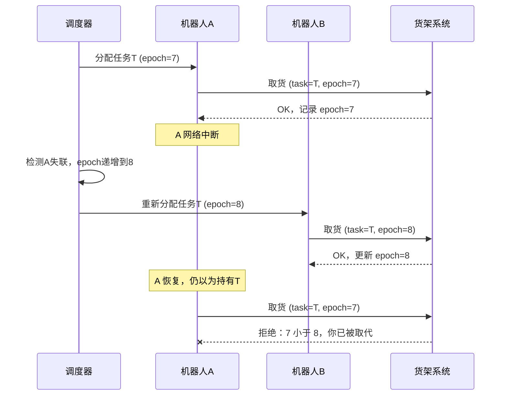

关键在于：**执行动作的一方（货架系统）也要检查 epoch**。如果只有调度器检查，A 仍然可能直接去操作货架。

```cpp
// 资源侧的 epoch 校验
class FencedResource {
public:
    // 返回 false 表示操作被拒绝（调用方持有的是陈旧所有权）
    bool execute(uint64_t caller_epoch, const Operation& op) {
        std::lock_guard lk(mu_);
        if (caller_epoch < current_epoch_) {
            rejected_stale_.fetch_add(1);
            return false;                      // 陈旧所有者，拒绝
        }
        if (caller_epoch > current_epoch_) {
            current_epoch_ = caller_epoch;     // 接受新所有者
        }
        apply(op);
        return true;
    }
private:
    std::mutex mu_;
    uint64_t current_epoch_ = 0;
    std::atomic<uint64_t> rejected_stale_{0};
    void apply(const Operation&);
};
```

### 9.4.3 租约：让所有权自动过期

代际解决了"谁说了算"，租约解决了"什么时候该换人"。

**租约的核心性质**：所有权有有效期，持有者必须在到期前续约，否则自动失效。

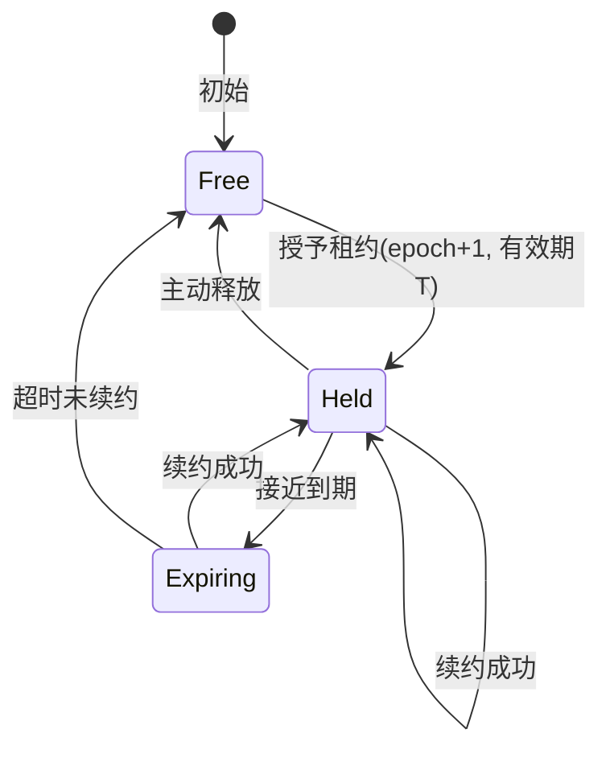

```cpp
// lease.hpp
#pragma once
#include <chrono>
#include <cstdint>
#include <mutex>
#include <optional>
#include <string>
#include <unordered_map>

namespace mas {

using Clock = std::chrono::steady_clock;

struct Lease {
    uint32_t holder_id = 0;
    uint64_t epoch = 0;
    Clock::time_point expires_at{};
};

class LeaseManager {
public:
    explicit LeaseManager(std::chrono::milliseconds ttl) : ttl_(ttl) {}

    // 申请或抢占租约。只有在租约空闲或已过期时才能获得。
    std::optional<Lease> acquire(const std::string& resource, uint32_t who) {
        std::lock_guard lk(mu_);
        auto now = Clock::now();
        auto& l = leases_[resource];
        if (l.holder_id != 0 && l.expires_at > now && l.holder_id != who)
            return std::nullopt;            // 别人持有且未过期

        l.holder_id = who;
        l.epoch = ++global_epoch_;          // 每次授予都递增，形成 fencing token
        l.expires_at = now + ttl_;
        return l;
    }

    // 续约：只有当前持有者且 epoch 匹配才能续
    bool renew(const std::string& resource, uint32_t who, uint64_t epoch) {
        std::lock_guard lk(mu_);
        auto it = leases_.find(resource);
        if (it == leases_.end()) return false;
        auto& l = it->second;
        if (l.holder_id != who || l.epoch != epoch) return false;
        if (l.expires_at <= Clock::now()) return false;   // 已过期，必须重新 acquire
        l.expires_at = Clock::now() + ttl_;
        return true;
    }

    void release(const std::string& resource, uint32_t who, uint64_t epoch) {
        std::lock_guard lk(mu_);
        auto it = leases_.find(resource);
        if (it == leases_.end()) return;
        if (it->second.holder_id == who && it->second.epoch == epoch)
            it->second.holder_id = 0;
    }

private:
    std::mutex mu_;
    std::chrono::milliseconds ttl_;
    uint64_t global_epoch_ = 0;
    std::unordered_map<std::string, Lease> leases_;
};

} // namespace mas
```

### 9.4.4 持有者侧：续约失败必须停止

租约机制只有在**持有者也遵守规则**时才安全：

```cpp
// 错误：续约失败只是记个日志，继续干活
void worker_loop() {
    while (running_) {
        if (!lease_mgr_.renew(res_, id_, epoch_))
            log_warn("renew failed");     // 危险！仍在执行
        do_work();
    }
}

// 正确：续约失败立即进入安全状态
void worker_loop() {
    while (running_) {
        if (!lease_mgr_.renew(res_, id_, epoch_)) {
            enter_safe_state();           // 停止运动、松开夹爪、报告
            return;                       // 不再执行任何带副作用的操作
        }
        do_work();
    }
}
```

{: .warning }
> 租约的安全性建立在一个时间假设上：**持有者检测到续约失败并停止，要快于其他人拿到新租约**。这要求续约周期明显小于 TTL。常见配置是续约周期等于 TTL 的三分之一，即 TTL 内有三次续约机会。

### 9.4.5 时钟漂移对租约的影响

租约依赖时间，而不同机器的时钟速率有差异。设最大时钟漂移率为 $\rho$（典型值 $10^{-5}$ 到 $10^{-4}$），租约 TTL 为 $T$，则两边对"何时过期"的认知最大相差：

$$\Delta = 2\rho T$$

TTL = 10 秒、$\rho = 10^{-4}$ 时：

$$\Delta = 2 \times 10^{-4} \times 10 = 2\ \text{ms}$$

相对于 10 秒的 TTL，2 ms 可以忽略。但如果 TTL 设为 1 小时：

$$\Delta = 2 \times 10^{-4} \times 3600 = 0.72\ \text{s}$$

这时就需要在过期判断上留出安全裕量。**结论：短租约对时钟漂移更鲁棒**，这也是租约通常设在秒级而非小时级的原因之一。

{: .note }
> 租约必须用**单调时钟**（`steady_clock`）计算，绝不能用墙上时钟。NTP 校时可能让墙上时钟突然跳变几秒，导致租约瞬间"过期"或"永不过期"。

---

## 9.5 故障检测：心跳与超时

### 9.5.1 检测速度与误判率的权衡

心跳的两个参数：发送周期 $P$ 和超时阈值 $T$。

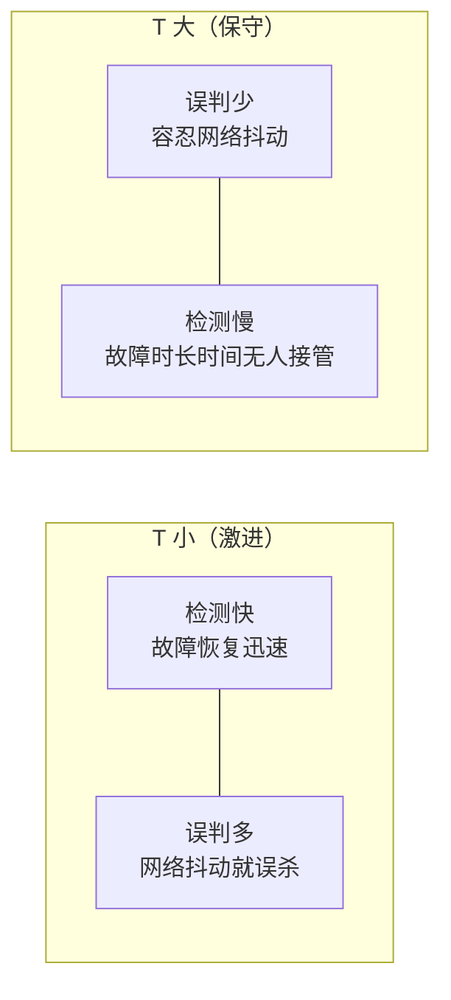

一个常用的经验公式：

$$T = P \times k + \text{RTT}_{p99}$$

其中 $k$ 是容忍连续丢失的心跳数（通常 3 到 5），$\text{RTT}_{p99}$ 是网络往返延迟的高分位。

**例**：$P = 1$ 秒，$k = 3$，$\text{RTT}_{p99} = 200$ ms：

$$T = 1 \times 3 + 0.2 = 3.2\ \text{秒}$$

即连续丢 3 个心跳（约 3 秒）后判定失联。

**误判率估算**：设单次心跳丢失概率为 $p$（独立），则连续丢 $k$ 次的概率：

$$P_{\text{误判}} = p^k$$

$p = 0.01$（1% 丢包）、$k = 3$ 时：

$$P_{\text{误判}} = 10^{-6}$$

每次心跳周期 1 秒，则平均约 $10^6$ 秒（约 11.6 天）误判一次。若把 $k$ 降到 2，误判率升到 $10^{-4}$，约 2.8 小时一次——这个差别在生产系统里非常显著。

### 9.5.2 心跳实现

```cpp
// failure_detector.hpp
#pragma once
#include <chrono>
#include <cstdint>
#include <mutex>
#include <unordered_map>
#include <vector>

namespace mas {

class FailureDetector {
public:
    FailureDetector(std::chrono::milliseconds period, int missed_threshold)
        : period_(period), threshold_(missed_threshold) {}

    // 收到某 agent 的心跳
    void on_heartbeat(uint32_t agent_id, uint64_t incarnation) {
        std::lock_guard lk(mu_);
        auto& s = states_[agent_id];
        if (incarnation > s.incarnation) {
            // 对端重启了：重置所有跟踪状态
            s = State{};
            s.incarnation = incarnation;
            s.restarted = true;
        }
        s.last_seen = Clock::now();
        s.alive = true;
    }

    // 周期调用，返回本轮新判定为失联的 agent
    std::vector<uint32_t> tick() {
        std::vector<uint32_t> dead;
        std::lock_guard lk(mu_);
        auto now = Clock::now();
        auto timeout = period_ * threshold_;
        for (auto& [id, s] : states_) {
            if (!s.alive) continue;
            if (now - s.last_seen > timeout) {
                s.alive = false;
                dead.push_back(id);
            }
        }
        return dead;
    }

    bool is_alive(uint32_t agent_id) {
        std::lock_guard lk(mu_);
        auto it = states_.find(agent_id);
        return it != states_.end() && it->second.alive;
    }

private:
    using Clock = std::chrono::steady_clock;
    struct State {
        Clock::time_point last_seen{};
        uint64_t incarnation = 0;
        bool alive = false;
        bool restarted = false;
    };
    std::mutex mu_;
    std::chrono::milliseconds period_;
    int threshold_;
    std::unordered_map<uint32_t, State> states_;
};

} // namespace mas
```

### 9.5.3 误判是必然的，系统要能容忍

{: .important }
> 无论超时设多大，误判都不可能完全消除（网络可能任意慢）。所以**不能依赖"检测一定正确"来保证安全**。正确的做法是：即使误判，也不会造成损害。这正是 epoch 的作用——被误判的 agent 即使还活着，它的旧 epoch 操作也会被拒绝。

这是一个重要的设计原则：**用安全机制（epoch）保证正确性，用检测机制（心跳）保证及时性**。两者职责分离。

---

## 9.6 状态同步：快照加增量

### 9.6.1 三种同步方式对比

| 方式 | 带宽 | 恢复能力 | 适用 |
| --- | --- | --- | --- |
| 只发全量 | 高 | 强：每条消息都能重建状态 | 状态小、频率低 |
| 只发增量 | 低 | 弱：丢一条就永久错乱 | 不可单独使用 |
| 快照 + 增量 | 低 | 强：缺口时请求快照 | **推荐** |

**带宽对比示例**：一个机器人的状态包含位置、速度、电量、任务列表，全量约 2 KB；每次变化的增量约 100 字节。10 Hz 更新、20 台机器人：

- 只发全量：$2\text{KB} \times 10 \times 20 = 400$ KB/s
- 快照加增量（每 5 秒一次快照）：$100\text{B} \times 10 \times 20 + 2\text{KB} \times 0.2 \times 20 = 20 + 8 = 28$ KB/s

带宽降到约十四分之一。

### 9.6.2 版本号与缺口检测

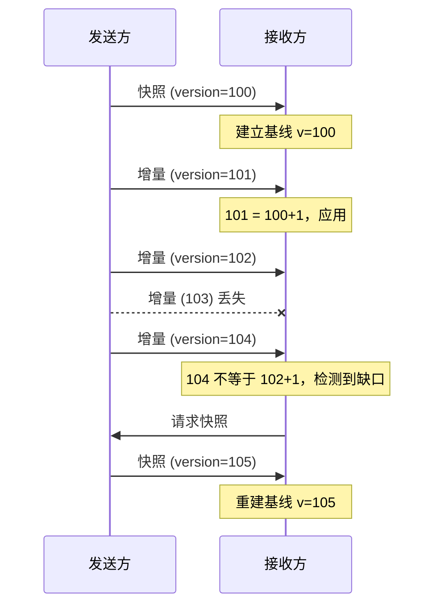

### 9.6.3 状态副本实现

```cpp
// state_replica.hpp
#pragma once
#include <cstdint>
#include <functional>
#include <vector>

namespace mas {

enum class UpdateKind : uint8_t { Snapshot = 0, Delta = 1 };

struct StateUpdate {
    uint32_t   owner_id = 0;
    uint64_t   incarnation = 0;   // 发送方化身，重启检测
    uint64_t   version = 0;       // 单调递增
    UpdateKind kind = UpdateKind::Delta;
    std::vector<uint8_t> payload;
};

enum class ApplyResult {
    Applied,          // 成功应用
    Duplicate,        // 重复，已忽略
    Stale,            // 陈旧（旧化身或旧版本），已拒绝
    GapDetected,      // 版本缺口，需要快照
};

class StateReplica {
public:
    using SnapshotFn = std::function<void(const std::vector<uint8_t>&)>;
    using DeltaFn    = std::function<void(const std::vector<uint8_t>&)>;

    StateReplica(SnapshotFn on_snapshot, DeltaFn on_delta)
        : on_snapshot_(std::move(on_snapshot)),
          on_delta_(std::move(on_delta)) {}

    ApplyResult apply(const StateUpdate& u) {
        // 1. 化身检查：对端重启则一切从头开始
        if (u.incarnation < incarnation_) return ApplyResult::Stale;
        if (u.incarnation > incarnation_) {
            incarnation_ = u.incarnation;
            version_ = 0;
            has_baseline_ = false;
        }

        // 2. 快照：无条件建立新基线
        if (u.kind == UpdateKind::Snapshot) {
            if (has_baseline_ && u.version < version_)
                return ApplyResult::Stale;      // 旧快照，不能倒退
            on_snapshot_(u.payload);
            version_ = u.version;
            has_baseline_ = true;
            need_snapshot_ = false;
            return ApplyResult::Applied;
        }

        // 3. 增量：必须有基线
        if (!has_baseline_) {
            need_snapshot_ = true;
            return ApplyResult::GapDetected;
        }
        if (u.version <= version_) return ApplyResult::Duplicate;
        if (u.version != version_ + 1) {
            need_snapshot_ = true;              // 中间丢了，增量不可用
            return ApplyResult::GapDetected;
        }

        on_delta_(u.payload);
        version_ = u.version;
        return ApplyResult::Applied;
    }

    bool need_snapshot() const { return need_snapshot_; }
    uint64_t version() const { return version_; }

private:
    SnapshotFn on_snapshot_;
    DeltaFn on_delta_;
    uint64_t incarnation_ = 0;
    uint64_t version_ = 0;
    bool has_baseline_ = false;
    bool need_snapshot_ = false;
};

} // namespace mas
```

### 9.6.4 逐条解释关键判断

**为什么 `u.version <= version_` 返回 Duplicate 而不是 Stale？**

因为重复到达是网络的正常行为（重传），不是错误。区分这两者能让指标更有意义：Duplicate 高说明重传多，Stale 高说明有陈旧节点在发消息。

**为什么增量必须严格等于 `version_ + 1`？**

增量是相对上一版本的差异。如果 v101 到 v103 之间丢了 v102，直接应用 v103 会得到错误的状态——因为 v103 描述的是相对 v102 的变化。这就是增量的脆弱之处，也是必须配快照的原因。

**为什么收到新化身要清空基线？**

对端重启后，它的版本号从头开始，且内部状态可能完全不同。继续用旧基线会得到错误结果。

### 9.6.5 集合状态与墓碑

同步一个"机器人列表"这类集合时，"删除"是个麻烦事：

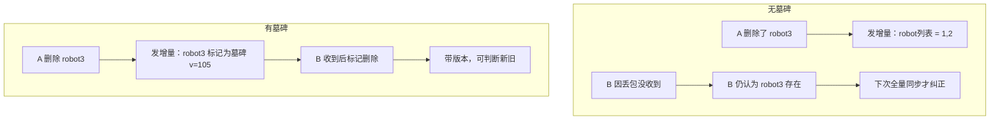

```cpp
struct Entry {
    uint64_t version;      // 该条目的最后修改版本
    bool deleted;          // 墓碑标记
    std::vector<uint8_t> data;
};

// 合并规则：版本大的赢
void merge_entry(std::unordered_map<uint32_t, Entry>& local,
                 uint32_t key, const Entry& remote) {
    auto it = local.find(key);
    if (it == local.end() || remote.version > it->second.version)
        local[key] = remote;          // 包括墓碑，也会被同步过去
}
```

{: .note }
> 墓碑不能永久保留（会无限增长内存），需要设置保留期（如 1 小时）后清理。保留期必须大于最坏的网络分区时长，否则清理后又收到旧的"新增"消息会导致已删除的条目复活。

---

## 9.7 任务协同

### 9.7.1 任务状态机

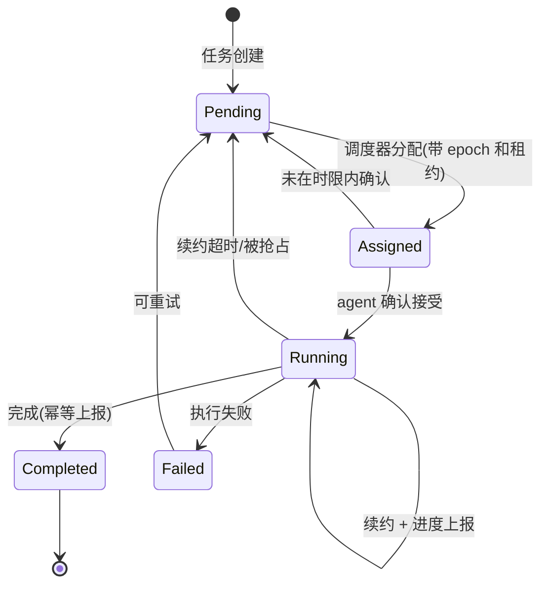

### 9.7.2 任务消息定义

```cpp
struct Task {
    uint64_t task_id;
    uint32_t owner_agent;      // 当前所有者，0 表示未分配
    uint64_t owner_epoch;      // 所有权代际，用于 fencing
    uint64_t lease_expire_ns;  // 租约到期（发送方单调时钟基准，需换算）
    uint64_t deadline_ns;      // 业务截止时间
    uint32_t state;            // Pending/Assigned/Running/...
    uint64_t idempotency_key;  // 幂等键，用于结果去重
    std::vector<uint8_t> spec; // 任务内容
};
```

### 9.7.3 幂等的结果上报

```cpp
// 结果去重：同一 idempotency_key 只处理一次
class ResultCollector {
public:
    // 返回 true 表示这是首次处理
    bool submit(uint64_t idempotency_key, const TaskResult& r) {
        std::lock_guard lk(mu_);
        auto [it, inserted] = seen_.try_emplace(idempotency_key, r);
        if (!inserted) {
            duplicates_.fetch_add(1);
            return false;             // 重复上报，忽略但返回成功给调用方
        }
        apply_side_effects(r);        // 只在首次执行副作用
        return true;
    }
private:
    std::mutex mu_;
    std::unordered_map<uint64_t, TaskResult> seen_;
    std::atomic<uint64_t> duplicates_{0};
    void apply_side_effects(const TaskResult&);
};
```

{: .warning }
> 幂等表也会无限增长。生产实现需要按时间或数量淘汰，淘汰窗口要大于最大重试时长。如果窗口太小，一个延迟很久的重传会被当成新请求重复执行。

### 9.7.4 任务分配的公平性与效率

简单的分配策略对比：

| 策略 | 优点 | 缺点 |
| --- | --- | --- |
| 轮询 | 简单、公平 | 忽略距离和负载 |
| 最近优先 | 减少行驶距离 | 可能让某些机器人过载 |
| 拍卖（Auction） | 兼顾成本和负载 | 需要多轮通信，延迟高 |
| 中心化最优分配 | 全局最优 | 调度器是单点，计算复杂度高 |

{: .note }
> 分配算法本身是运筹学问题，不是中间件的职责。中间件要提供的是：可靠的任务下发、明确的所有权语义、幂等的结果回收和超时接管。把算法和通信机制分开，算法才能独立演进。

---

## 9.8 一致性模型的选择

### 9.8.1 三种模型


### 9.8.2 CAP 的工程解读

CAP 定理说：网络分区（P）发生时，一致性（C）和可用性（A）只能选一个。在机器人场景下：

| 数据 | 分区时的选择 | 理由 |
| --- | --- | --- |
| 机器人位置广播 | 选 A（可用） | 读到几百毫秒前的位置无害 |
| 电量、状态 | 选 A | 同上 |
| 唯一充电桩分配 | 选 C（一致） | 两台机器人同时去会碰撞 |
| 安全停止指令 | 选 A + 本地兜底 | 收不到指令时本地自主停止 |

{: .important }
> 关键洞察：**不要给整个系统选一个一致性级别，要按数据分级**。绝大多数状态用最终一致就够，只有真正的互斥资源才值得付出共识的代价。

### 9.8.3 什么时候真的需要共识

需要共识（Raft/Paxos）的判断标准：

1. 存在**必须唯一**的决策（如"谁是主调度器"）。
2. 错误的后果**不可逆**（如两台机器人同时抓取同一物体导致碰撞）。
3. 无法用 epoch 加租约兜底（即资源侧无法做 fencing 检查）。

如果第 3 点不成立——也就是说资源侧能检查 epoch——那么租约加 fencing 通常就够了，不需要完整共识。这是工程上更常见的选择，因为它简单得多。

### 9.8.4 逻辑时钟：不用物理时间排序

Lamport 逻辑时钟的规则非常简单：

- 本地事件：$L \leftarrow L + 1$
- 发送消息：先 $L \leftarrow L + 1$，然后把 $L$ 附在消息里
- 接收消息（携带 $L_{msg}$）：$L \leftarrow \max(L, L_{msg}) + 1$

```cpp
class LamportClock {
public:
    uint64_t tick() { return ++counter_; }             // 本地事件
    uint64_t on_send() { return ++counter_; }          // 发送前
    uint64_t on_receive(uint64_t msg_clock) {          // 接收时
        uint64_t cur = counter_.load();
        uint64_t next = std::max(cur, msg_clock) + 1;
        counter_.store(next);
        return next;
    }
private:
    std::atomic<uint64_t> counter_{0};
};
```

**它保证什么**：如果事件 $a$ 因果先于 $b$，则 $L(a) < L(b)$。

**它不保证什么**：$L(a) < L(b)$ 不代表 $a$ 因果先于 $b$（可能只是并发）。要区分"并发"和"因果先后"需要向量时钟（Vector Clock），代价是每条消息携带 $O(n)$ 的时钟向量。

{: .note }
> 机器人场景里，大多数情况用单调递增的版本号（本质是每个 owner 一个独立的 Lamport 时钟）就够了。向量时钟主要用于需要检测并发冲突的场景（如多主写入）。

---

## 9.9 弱网与网络分区

### 9.9.1 分区期间的行为设计

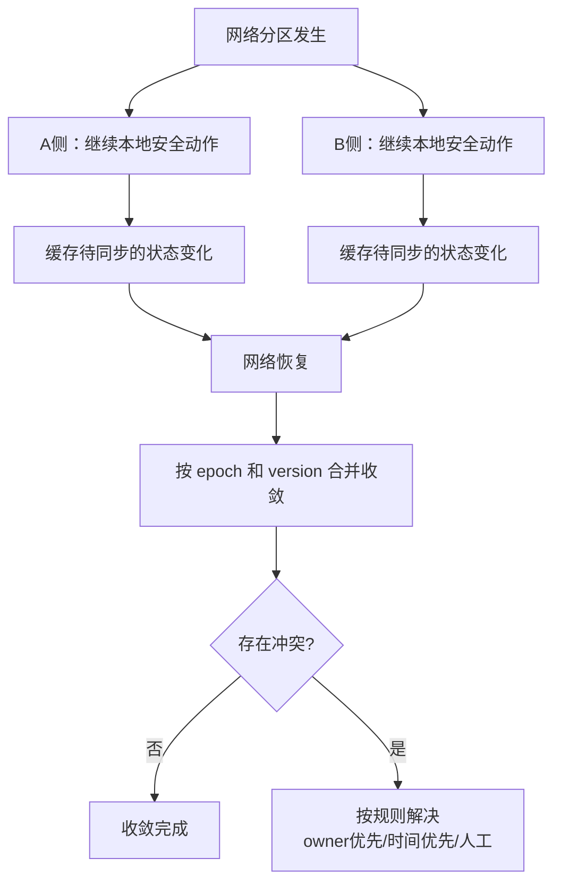

### 9.9.2 弱网下的分级策略

| 消息类型 | 弱网策略 | 理由 |
| --- | --- | --- |
| 心跳 | 高优先级、小包、可丢 | 丢几个不致命，但要保证能挤出去 |
| 控制指令 | 带 deadline，过期即丢 | 迟到的控制指令有害无益 |
| 状态广播 | 降频，只发关键字段 | 收敛比实时更重要 |
| 任务分配 | 可靠 + 幂等重试 | 必须送达，但可以慢 |
| 日志/录制 | 本地缓存，网络好时补传 | 完全可以延迟 |

```cpp
// 按网络质量动态调整发送策略
enum class NetworkQuality { Good, Degraded, Poor };

struct SyncPolicy {
    std::chrono::milliseconds state_period;
    bool send_full_state;
    bool send_debug_topics;
};

SyncPolicy policy_for(NetworkQuality q) {
    switch (q) {
        case NetworkQuality::Good:
            return {std::chrono::milliseconds(100), true,  true};
        case NetworkQuality::Degraded:
            return {std::chrono::milliseconds(500), false, false};
        case NetworkQuality::Poor:
            return {std::chrono::milliseconds(2000), false, false};
    }
    return {std::chrono::milliseconds(2000), false, false};
}
```

### 9.9.3 收敛时间的估算

分区恢复后，多久能收敛？主要取决于：

$$T_{\text{收敛}} = T_{\text{检测恢复}} + T_{\text{快照传输}} + T_{\text{应用}}$$

- $T_{\text{检测恢复}}$：通常是一个心跳周期
- $T_{\text{快照传输}}$：状态总量除以可用带宽
- $T_{\text{应用}}$：通常可忽略

**例**：20 台机器人，每台状态 2 KB，恢复后全部互发快照（最坏情况 $20 \times 19$ 对），带宽 10 Mbps：

$$T_{\text{快照}} = \frac{20 \times 19 \times 2\text{KB}}{10\text{Mbps} / 8} \approx \frac{760\text{KB}}{1.25\text{MB/s}} \approx 0.6\ \text{秒}$$

加上心跳检测 3 秒，总收敛约 3.6 秒。

{: .warning }
> 分区恢复瞬间所有节点同时发快照，会造成**流量风暴**。要给快照请求加随机抖动，把 0.6 秒的突发摊到几秒内。这与第 10 章的重试风暴是同一类问题。

---

## 9.10 能力发现与拓扑管理

### 9.10.1 能力描述

一个 agent 能做什么，不能只用一个枚举表示：

```cpp
struct Capability {
    std::string name;          // "transport" / "charge" / "inspect"
    uint32_t version;          // 能力接口版本
    // 约束条件
    double max_payload_kg;
    double max_speed_mps;
    std::vector<std::string> zones;   // 可作业区域
    // 当前可用性
    bool available;
    uint32_t current_load;     // 已接任务数
    uint32_t max_concurrent;
};
```

### 9.10.2 拓扑视图

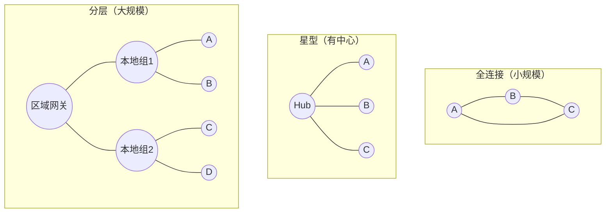

| 拓扑 | 连接数 | 适用规模 | 单点风险 |
| --- | --- | --- | --- |
| 全连接 | $O(n^2)$ | 小于 10 | 无 |
| 星型 | $O(n)$ | 10 到 100 | 中心是单点 |
| 分层 | $O(n)$ | 大于 100 | 网关是局部单点 |

**为什么全连接不能扩展**：20 台机器人全连接需要 $\frac{20 \times 19}{2} = 190$ 条连接，每台维护 19 个连接和 19 份状态跟踪。100 台就是 4950 条连接——发现流量和内存都会失控。

---

## 9.11 常见错误与陷阱

### 陷阱 1：用时间戳判断消息新旧

```cpp
// 错误：不同机器的时钟不可比
if (msg.timestamp > last_timestamp_) apply(msg);

// 正确：用同源单调递增的版本号
if (msg.version > last_version_) apply(msg);
```

### 陷阱 2：检测到失联就立即认定任务失败

失联可能只是网络抖动，agent 还在执行。立即重新分配会导致两台机器人做同一件事。必须先递增 epoch 让旧持有者失效，且资源侧要检查 epoch。

### 陷阱 3：租约续期周期等于 TTL

```cpp
// 错误：TTL 10s，每 10s 续一次 —— 一次丢包就过期
lease_ttl = 10s;  renew_period = 10s;

// 正确：留出重试余量
lease_ttl = 10s;  renew_period = 3s;   // 有 3 次机会
```

### 陷阱 4：增量更新没有版本连续性检查

```cpp
// 错误：来一条应用一条
void on_delta(const Delta& d) { apply(d); }

// 正确：检查连续性，缺口时请求快照
void on_delta(const Delta& d) {
    if (d.version != version_ + 1) { request_snapshot(); return; }
    apply(d); version_ = d.version;
}
```

### 陷阱 5：幂等表无限增长

去重表必须有淘汰策略，但淘汰窗口要大于最大重试时长，否则延迟重传会被当成新请求。

### 陷阱 6：分区恢复时所有节点同时全量同步

会造成流量风暴，可能把刚恢复的网络再次打垮。要加随机抖动分散。

### 陷阱 7：墓碑永久保留或过早清理

永久保留会内存泄漏；过早清理会导致已删除条目"复活"。保留期要大于最长分区时长。

### 陷阱 8：安全动作依赖网络

```cpp
// 错误：紧急停止要等云端确认
void emergency_stop() {
    send_to_cloud("stopping");
    wait_for_ack();          // 网络断了就永远停不下来
    motor_.stop();
}

// 正确：本地先执行，上报是异步的
void emergency_stop() {
    motor_.stop();                       // 立即执行
    async_report("stopped");             // 尽力上报
}
```

---

## 9.12 真实案例

### 案例 1：失联机器人重连造成双主搬运

**现象**：仓储系统中，两台机器人先后到达同一个货架取同一批货，第二台的机械臂撞上了第一台。

**排查**：日志显示机器人 A 在 14:23:05 失联（无线信号盲区），调度器在 14:23:08 把任务 T-7742 转给机器人 B。A 在 14:23:41 恢复连接，此时它仍在执行 T-7742，且距离货架比 B 更近。两台同时到达。

**根因**：任务转移只更新了调度器的内部表，没有任何机制阻止 A 继续执行。A 的本地状态里 T-7742 仍然是"自己的任务"。

**修复**：

1. 任务增加 `owner_epoch`。调度器每次转移所有权时递增 epoch。
2. 货架控制系统（资源侧）记录每个货架当前接受的 epoch，拒绝低于该值的操作请求。
3. A 侧增加租约续期：续期失败超过 3 次（约 9 秒）立即停止运动并进入待命状态。
4. A 恢复后向调度器同步状态，发现自己的 epoch 已过期，主动放弃任务。

**取舍**：增加了 epoch 字段和资源侧的校验逻辑，每次操作多一次比较；换来的是从协议层面杜绝双主，而不是依赖"检测足够快"。

**验证**：编写故障注入测试——随机让某台机器人断网 10 到 60 秒后恢复，运行 1000 次，断言任意时刻每个任务的活跃执行者数量恒为 1，且资源侧的 `rejected_stale` 计数与注入次数匹配。

### 案例 2：状态同步在弱网下永不收敛

**现象**：机器人进入信号较差的区域后，它在其他机器人视图里的位置信息停止更新，且网络恢复后也不自动恢复，必须重启进程。

**排查**：抓包发现，弱网期间大量增量更新丢失。接收方检测到版本缺口后设置了 `need_snapshot_ = true`，但**没有任何代码去真正请求快照**——这个标志位被写了却没被读。

**根因**：状态机设计完整，但缺少驱动它的循环。缺口检测只是记录了状态，没有触发恢复动作。

**修复**：

1. 增加周期性检查：发现 `need_snapshot()` 为真时，向对端发送快照请求。
2. 快照请求本身要带退避，避免网络仍然很差时反复请求加重拥塞。
3. 发送方也增加保底机制：每 5 秒无条件广播一次快照，即使没收到请求。

**取舍**：定期全量快照增加了带宽（按 9.6.1 的算法约 8 KB/s），但保证了"任何情况下最多 5 秒内自动收敛"，不再依赖请求响应链路正常。

**验证**：注入 30 秒的 90% 丢包率，断言恢复后 10 秒内所有节点的状态版本一致，且过程中没有出现状态倒退。

### 案例 3：心跳超时设置过激进导致频繁误判

**现象**：系统在网络良好时正常，但一到早高峰（大量机器人同时上报数据、网络拥塞）就出现任务频繁重新分配，机器人不断放下手上的活去接新任务，整体效率反而下降。

**排查**：统计显示早高峰期间心跳 RTT 的 p99 从 50 ms 升到 800 ms，而心跳超时配置为 $P=500\text{ms}$、$k=2$，即 1 秒。按 9.5.1 的公式，正确的阈值应该是：

$$T = 0.5 \times 2 + 0.8 = 1.8\ \text{秒}$$

配置的 1 秒明显偏小，导致拥塞时大量误判。

**根因**：超时阈值是在实验室网络（RTT p99 约 20 ms）下调出来的，没有考虑生产环境的拥塞情况。

**修复**：

1. 超时阈值改为 $P \times k + \text{RTT}_{p99}$，其中 $\text{RTT}_{p99}$ 由运行时测量的滑动窗口给出，自适应调整。
2. 增加"疑似失联"中间状态：超时后先标记为可疑并停止分配新任务，但不立即撤销租约；再过一个周期仍无心跳才判定失联。
3. 心跳消息设置为最高优先级，与数据流分离通道（第 1 章的控制平面与数据平面分离）。

**取舍**：自适应超时让故障检测时间在拥塞时变长（从 1 秒到约 2 秒），但消除了误判造成的任务抖动。对这个业务来说，多等 1 秒远优于错误地中断一次搬运。

**验证**：在注入网络拥塞（用 `tc netem` 增加 500 ms 延迟和抖动）的条件下运行 2 小时，断言误判次数为 0；同时注入真实的进程 kill，断言检测时间仍在 3 秒内。

---

## 9.13 动手实验与验收

### 实验 1：租约与代际

实现 `LeaseManager` 和资源侧的 epoch 校验，模拟：

- 机器人 A 获得租约，开始"执行"（打印日志）。
- 强制中断 A 的续约（模拟失联）。
- 等待 TTL 过期，让 B 获得租约。
- 恢复 A 的续约尝试。

**验收**：

- A 在续约失败后停止执行，日志中能看到"进入安全状态"。
- A 恢复后对资源的操作被拒绝，`rejected_stale` 计数增加。
- 任意时刻只有一个持有者在执行。

### 实验 2：状态同步收敛

实现 `StateReplica`，模拟两个节点同步一个包含 100 个条目的状态：

- 正常同步 1000 次增量。
- 随机丢弃 10% 的增量。
- 每 50 次发一次快照。

**验收**：

- 记录每次 `apply` 的返回值分布（Applied / Duplicate / Stale / GapDetected）。
- 最终两侧状态完全一致（可用哈希对比）。
- 统计从缺口出现到恢复一致的平均时间。

### 实验 3：故障检测参数扫描

用不同的 $(P, k)$ 组合，在注入 1%、5%、10% 丢包的条件下运行：

**验收**：填写下表并给出选型建议。

| P (ms) | k | 理论超时 | 实测误判次数/小时 | 实测检测延迟 p99 |
| --- | --- | --- | --- | --- |
| 500 | 2 | 1.0 s | | |
| 500 | 3 | 1.5 s | | |
| 1000 | 3 | 3.0 s | | |
| 1000 | 5 | 5.0 s | | |

### 实验 4：网络分区与收敛

模拟 6 个 agent，用 iptables 或应用层开关把它们分成 3 加 3 两组：

- 分区持续 30 秒，期间两侧都有状态更新。
- 恢复网络。

**验收**：

- 分区期间两侧各自可用（不阻塞）。
- 恢复后 10 秒内所有节点状态一致。
- 没有出现同一任务被两侧同时执行。
- 记录收敛耗时，与 9.9.3 的估算对比。

### 实验 5：幂等验证

对任务结果上报注入重复（每条消息随机重发 0 到 3 次）和乱序：

**验收**：

- 副作用（如计数器、日志条目）只发生一次。
- `duplicates` 计数与注入的重复数匹配。

---

## 9.14 本章小结与自查清单

### 核心结论

1. **多机器人的本质困难是部分失败、无法区分慢与死、分区和无全局时钟**，不是"节点变多了"。
2. **代际（epoch）保证正确性，心跳保证及时性**。两者职责分离：即使心跳误判，epoch 也能防止损害。
3. **租约让所有权自动过期**，避免"持有者失联后资源永久锁死"。续约周期必须明显小于 TTL。
4. **状态同步用快照加增量**：增量省带宽，快照保恢复；缺口检测必须真的触发快照请求。
5. **一致性要按数据分级**，不要给整个系统选一个级别。多数状态最终一致即可。
6. **误判不可避免，系统要能容忍误判而不产生损害**，这比追求"完美检测"更现实。

### 自查清单

- [ ] 我能说出分布式相比单机新增的四个本质困难。
- [ ] 我能解释为什么仅靠"检测失联后重新分配"无法防止双主。
- [ ] 我能写出 epoch 校验的代码，并说明为什么资源侧也必须检查。
- [ ] 我能计算心跳超时阈值，并估算误判率。
- [ ] 我能解释增量更新为什么必须严格连续，以及缺口时该怎么办。
- [ ] 我能说出墓碑的作用，以及保留期该如何设置。
- [ ] 我能判断一个场景是否真的需要共识协议。
- [ ] 我能估算分区恢复后的收敛时间，并说明如何避免流量风暴。

---

## 9.15 面试问题与参考答案

**问：多机器人系统相比单机器人，本质上多了哪些困难？**

答：主要是四个。第一是部分失败——单机进程崩溃就是全停，分布式下一个节点挂了其他还在跑，系统处于不确定状态。第二是无法区分"慢"和"死"——节点没响应可能是崩溃了，也可能只是网络拥塞，从外部看完全一样，这是理论上无法消除的限制。第三是网络分区——集群可能裂成互不可见的两半，如果两边都认为自己是主就会脑裂。第四是没有全局时钟——不同机器时钟有漂移，不能用时间戳判断因果顺序。这四个困难决定了分布式协议的设计：要用租约让所有权自动过期，用代际拒绝陈旧操作，用逻辑版本替代时间排序，并且要能容忍误判。

**问：怎样从根本上避免"双主"问题？**

答：核心是代际加隔离令牌（fencing token）。给所有权一个单调递增的 epoch，每次转移所有权就递增。关键在于：不仅调度器要记录 epoch，**执行动作的资源侧也必须校验 epoch**，拒绝小于当前值的请求。这样即使旧持有者因为网络恢复而重新出现，它携带的旧 epoch 也会被资源拒绝。为什么不能只靠"检测足够快"？因为无论超时设多小，都存在旧持有者还没意识到自己失去所有权的时间窗口。epoch 是从协议层面消除这个窗口，而不是缩小它。

**问：心跳超时应该怎么设？**

答：常用的经验公式是 $T = P \times k + \text{RTT}_{p99}$，其中 $P$ 是心跳周期，$k$ 是容忍连续丢失的心跳数（通常 3 到 5），$\text{RTT}_{p99}$ 是网络往返延迟的高分位。比如周期 1 秒、容忍 3 次、RTT p99 是 200 毫秒，超时就设 3.2 秒。误判率大致是单次丢包率的 $k$ 次方，1% 丢包、$k$ 等于 3 时约为百万分之一。实践中还有两个要点：一是 $\text{RTT}_{p99}$ 应该运行时测量并自适应，实验室调出来的值在生产拥塞时会导致大量误判；二是可以增加"疑似失联"中间状态，先停止分配新任务但不立即撤销租约，再确认一轮才判定失联。

**问：状态同步为什么要快照加增量结合？**

答：只发全量带宽太高——比如 20 台机器人、每台 2 KB 状态、10 Hz 更新就是 400 KB/s。只发增量则不可靠——增量是相对上一版本的差异，中间丢一条后面全部错乱，而且永远无法自愈。组合起来：正常发带版本号的增量省带宽，接收方检查版本连续性，发现缺口就请求快照重建基线。另外发送方最好也定期无条件广播快照作为保底，这样即使请求响应链路本身有问题，也能保证有界的收敛时间。实测中这个组合能把带宽降到只发全量的十分之一左右，同时保持强恢复能力。

**问：分区恢复后怎么收敛？**

答：分区期间两侧各自继续本地安全动作并缓存状态变化。恢复后按版本号和代际合并：版本大的赢，带 epoch 的所有权以高 epoch 为准。对于集合类状态，删除操作要用墓碑标记而不是直接移除，否则删除事件传播不过去。收敛时间大致是心跳检测时间加上快照传输时间。有个容易踩的坑：恢复瞬间所有节点同时全量同步会造成流量风暴，可能把刚恢复的网络再打垮，所以快照请求要加随机抖动分散开。

**问：什么时候需要 Raft 这类共识协议？**

答：判断标准有三条，要同时满足才值得引入。第一，存在必须唯一的决策，比如"谁是主调度器"。第二，错误的后果不可逆，比如两台机器人同时抓取同一物体导致碰撞。第三，无法用 epoch 加租约兜底——也就是资源侧没法做 fencing 校验。如果第三条不成立，租约加 fencing 通常就够了，实现简单得多，而且分区时仍然可用。实际机器人系统里大部分状态用最终一致就够，只有真正的互斥资源才值得付出共识的代价：共识需要多数派，延迟高，分区时少数派完全不可用。

**问：为什么不能用时间戳判断消息新旧？**

答：因为不同机器的时钟不可比。石英晶振典型漂移率是每天秒级，即使用 NTP 同步，误差也在毫秒到几十毫秒，而且 NTP 校时还可能让时钟突然跳变甚至倒退。所以 A 机器的时间戳大于 B 机器的时间戳，不能推出 A 的事件发生在后。正确做法是用同源单调递增的版本号——本质上是每个所有者维护一个 Lamport 时钟。如果需要跨节点的因果排序，就用 Lamport 逻辑时钟；如果还需要区分"并发"和"因果先后"，才需要向量时钟，但代价是每条消息携带 $O(n)$ 的向量。

**问：租约的 TTL 和续约周期怎么配？**

答：续约周期要明显小于 TTL，通常是 TTL 的三分之一左右，这样 TTL 内有三次续约机会，容忍偶发丢包。如果周期等于 TTL，一次丢包就会导致租约意外过期，引发不必要的所有权转移。TTL 本身的选择要权衡两点：太短会因为网络抖动频繁失效，太长则故障后资源要等很久才能被接管。另外 TTL 越长受时钟漂移影响越大——漂移误差约为 $2\rho T$，10 秒的 TTL 误差只有毫秒级，1 小时的 TTL 误差就到几百毫秒了。还有一点必须注意：租约计时一定要用单调时钟，用墙上时钟遇到 NTP 跳变会出严重问题。

**问：怎样保证任务不被重复执行？**

答：分三层。第一层是所有权层面，用 epoch 加 fencing 保证同一时刻只有一个合法执行者。第二层是执行层面，持有者检测到续约失败要立即进入安全状态，不再产生副作用。第三层是结果层面，用幂等键去重——每个任务实例有唯一的幂等键，结果上报时先查去重表，已存在就直接返回成功而不重复执行副作用。三层缺一不可：只有第一层，网络分区窗口内仍可能重复；只有第三层，物理动作已经做了两次，去重也来不及。另外幂等表要有淘汰策略，但窗口必须大于最大重试时长，否则延迟很久的重传会被当成新请求。

---

## 9.16 延伸阅读

| 主题 | 建议材料 | 关注点 |
| --- | --- | --- |
| 分布式系统基础 | 《Designing Data-Intensive Applications》第 8、9 章 | 部分失败、一致性模型、共识 |
| 租约与 fencing | Google Chubby 论文 | 租约设计与时钟假设 |
| 故障检测 | Phi Accrual Failure Detector 论文 | 自适应超时的另一种思路 |
| 逻辑时钟 | Lamport《Time, Clocks and the Ordering of Events》 | 因果关系的形式化定义 |
| 最终一致 | CRDT 相关综述 | 无冲突合并的数据结构设计 |
| 共识协议 | Raft 论文 | 领导选举、日志复制、成员变更 |
| 多机器人协同 | 多机器人任务分配（MRTA）综述 | 分配算法与通信机制的分工 |

{: .note }
> 本章刻意把"通信机制"和"分配算法"分开。前者是中间件的职责（可靠下发、所有权语义、幂等回收），后者是业务算法（谁做哪个任务最优）。面试时能清晰划出这条边界，本身就是加分项。
