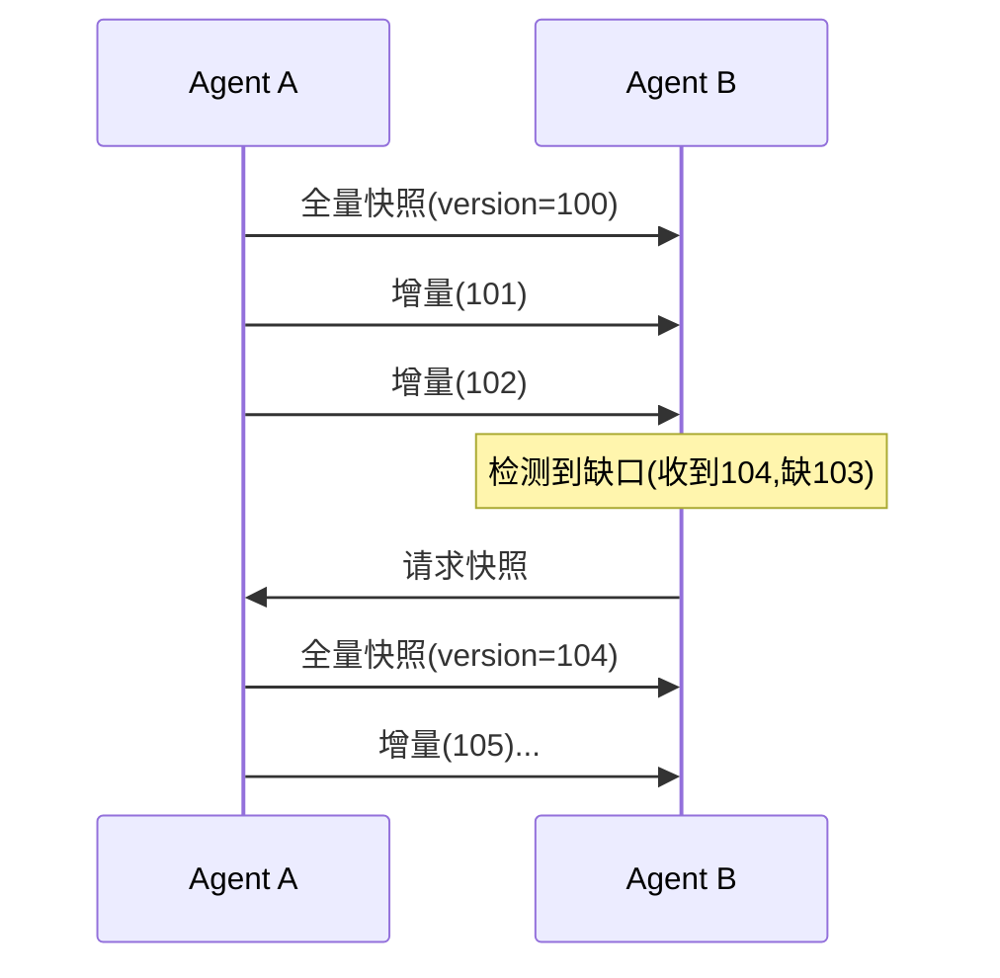
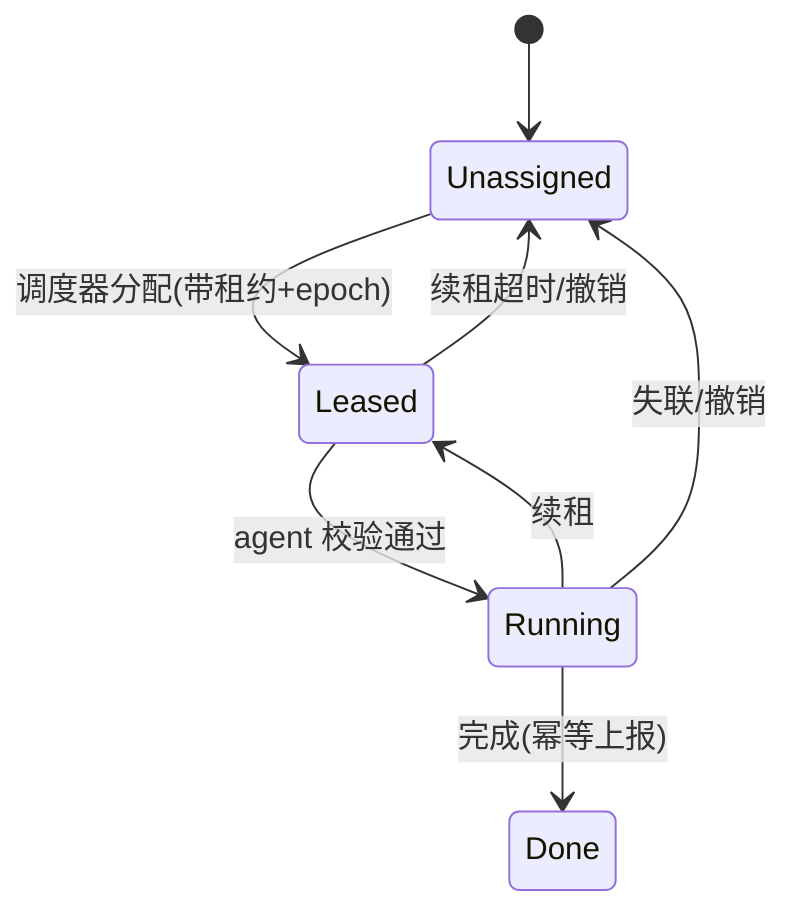
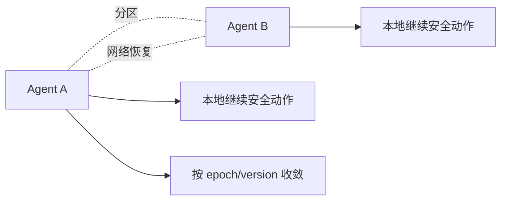

# 第 9 章：Multi-Agent 与分布式状态

## 本章目标

掌握多机器人协同通信中的身份、能力发现、状态同步、任务租约、弱网容错和最终收敛。不把单机 topic 总线简单复制到多智能体系统，而是理解分布式带来的乱序、重复、分区和一致性问题。

## 9.1 身份、epoch 与租约


每个 agent 需要：稳定 ID、启动 **epoch/generation**（每次重启递增）、能力列表（可版本化）、位置、健康状态。发现信息带 **TTL/lease**，不能相信"永久在线"。

## 9.2 状态同步：快照 + 增量



正常运行发带版本的**增量**（省带宽），检测到版本缺口或周期到达时请求**全量快照**（可恢复）。规则：

- 增量幂等：重复增量不产生额外效果。
- 旧版本不覆盖新版本（比较 version）。
- 集合状态用 owner + version + 删除标记（tombstone），或 CRDT 合并。

```cpp
struct StateUpdate {
    uint64_t version;      // 单调递增
    uint32_t owner_id;
    uint32_t owner_epoch;  // 防止旧 owner 的陈旧更新
    bool is_snapshot;      // true=全量, false=增量
    // ... payload
};

class StateReplica {
public:
    // 返回是否被应用
    bool apply(const StateUpdate& u) {
        if (u.owner_epoch < epoch_) return false;        // 旧代，拒绝
        if (u.owner_epoch > epoch_) { epoch_ = u.owner_epoch; version_ = 0; }
        if (u.is_snapshot) { version_ = u.version; return true; }
        if (u.version != version_ + 1) {                 // 缺口
            need_snapshot_ = true;
            return false;
        }
        version_ = u.version;
        return true;
    }
    bool need_snapshot() const { return need_snapshot_; }
private:
    uint64_t version_ = 0;
    uint32_t epoch_ = 0;
    bool need_snapshot_ = false;
};
```

## 9.3 任务协同与租约

任务消息至少含：task ID、owner、epoch、状态、deadline、幂等键。



agent 执行前校验租约和 epoch；续租失败则停止或进入安全状态；任务结果重复到达不能造成重复副作用（幂等键去重）。

## 9.4 弱网与网络分区



需处理：丢包、重复、乱序、延迟、断线、带宽变化、时钟漂移。**不要无限重试**，按语义设计：控制命令有 deadline 和幂等；状态通过快照收敛；日志本地缓存补传；安全事件持久化确认。

## 9.5 真实案例：失联机器人重连造成双主

仓储机器人 A 失联，调度器把搬运任务转给 B。A 延迟 30 秒后重连，仍以为自己拥有任务，继续去搬同一个货架——**两个机器人抢同一任务，可能碰撞**。

**根因**：任务没有 epoch/租约校验，重连的旧 owner 不知道自己已被取代。

**修复**：任务带 owner epoch；调度器转移时递增 epoch；A 重连后发出的、带旧 epoch 的执行消息被全体拒绝；A 收到"更高 epoch 已接管"后转为只读上报或安全停止。

**验证**：注入 A 失联 + 延迟重连，断言任意时刻只有一个 agent 持有有效租约、无双主执行。

## 9.6 一致性模型选择

| 模型 | 语义 | 适用场景 |
| --- | --- | --- |
| 强一致 | 所有节点同一时刻看到相同值 | 关键资源分配、单点决策 |
| 最终一致 | 网络恢复后收敛到相同值 | 位置/状态广播 |
| 因果一致 | 保持因果顺序 | 事件依赖 |

{: .warning }
> 多机器人系统很难也不必全用强一致。强一致需要共识（如 Raft），延迟高、分区时不可用。大多数状态广播用最终一致 + 版本收敛即可；只有真正的互斥资源才值得共识。

## 9.7 动手实验与验收

**实验**：
1. 模拟 5–20 个 agent，实现心跳、能力注册、状态快照/增量（用上面的 `StateReplica`）、任务租约 + epoch。
2. 注入网络分区、延迟、乱序、重复、带宽限制。
3. 制造"失联 + 延迟重连"，断言无双主任务。

**验收标准**：重连后能补齐状态；旧消息不覆盖新状态；任务执行幂等；网络恢复后拓扑和能力最终一致；所有超时和拒绝都有原因码。

## 9.8 面试问题与参考答案

**问：状态同步为什么要全量和增量结合？**

答：增量省带宽，全量提供恢复和基线。正常运行收增量；检测到版本缺口或周期到达时取快照建立新基线，再继续增量。这样兼顾带宽和恢复能力，同时能处理乱序、重复、丢失。

**问：为什么不能只依赖本地时间戳做因果排序？**

答：机器时钟可能漂移、跳变、不同步，本地时间不能可靠表达因果。顺序应用序列号、epoch 或逻辑版本（如 Lamport 时钟）；延迟测量用单调时钟；跨设备时间对齐需明确同步协议和误差边界。

**问：弱网下"可靠"的正确目标是什么？**

答：不是无限重试直到成功，而是让每类消息在**截止时间和业务风险内**达到可接受语义：状态可收敛、命令不产生重复副作用、日志可补传、安全事件可确认。可靠性必须和时效性、带宽、业务后果一起定义。

**问：如何避免"双主"问题？**

答：给资源/任务引入 epoch（fencing token）和租约。所有权转移时递增 epoch；执行操作携带 epoch，接收方拒绝低于当前的 epoch。旧 owner 即使重连，其旧 epoch 消息也会被拒绝。这是分布式锁的 fencing 思想。

**问：多机器人协同一定要用 Raft/Paxos 吗？**

答：不一定。共识保证强一致但代价高（延迟、分区不可用）。大多数状态广播用最终一致 + 版本收敛就够；只有真正需要全局唯一决策的互斥资源（如唯一充电桩分配）才值得引入共识。要按一致性需求分级，不要一刀切。
