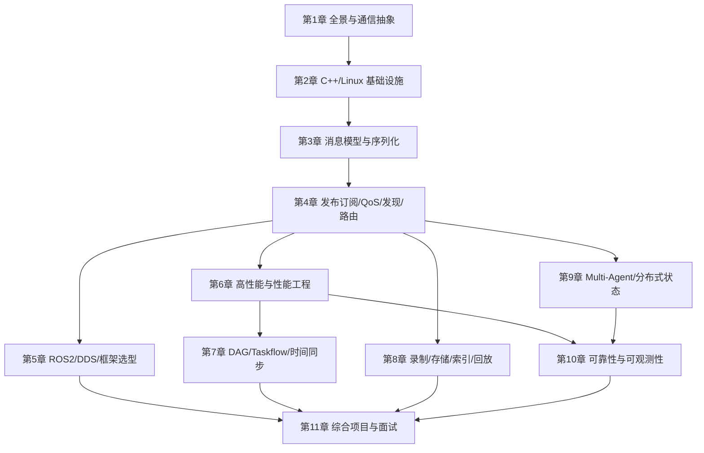
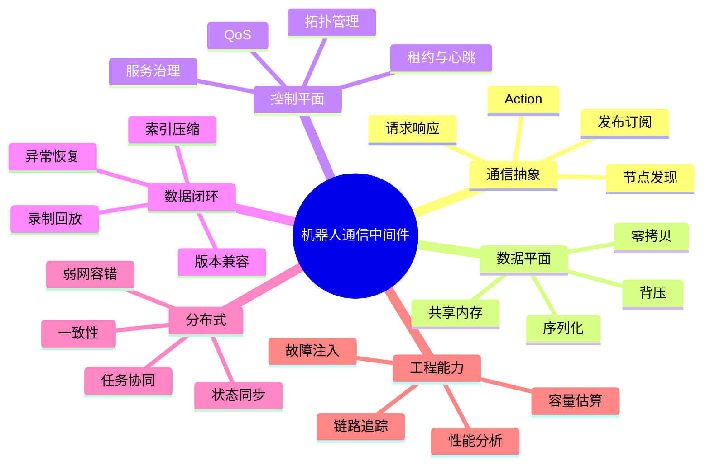
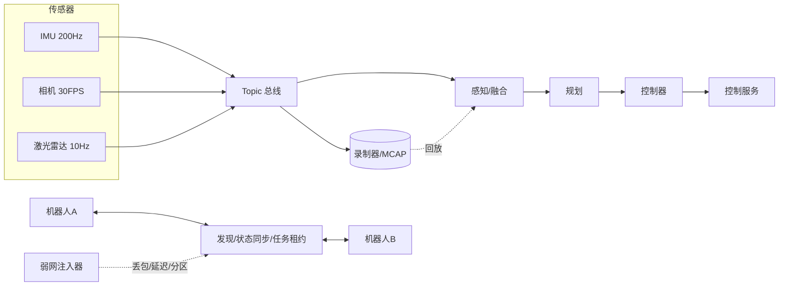

# 机器人通信中间件开发教程

这是一份**一站式、可自学**的中文教程。目标读者是已经具备 C++、Linux、Socket 和多线程经验，但缺少中间件开发经验的软件工程师。读完并完成每章实验后，你应当能够独立设计、实现、压测、诊断和演进一条真实的机器人数据通信链路，并从容应对中间件岗位的系统设计与深挖面试。

本教程不重复教学 C++ 语法、Socket 基础或线程基础，而是把你已有的能力连接到中间件的**设计判断、工程实现、失败处理和性能闭环**。

## 如何使用本教程

1. **按顺序学**：章节是单向递进的。先建立通信语义和失败模型，再谈实现；先能测量，再谈优化；先解决单机链路，再推广到多机与多智能体。
2. **动手做**：每章末尾都有"动手实验"和"验收标准"。只读不做无法形成能力，面试也会立刻暴露。
3. **对照岗位**：每个机制都用下面四个问题检验自己（贯穿全书的**四问法**）：

{: .important }
> **四问法**
> 1. 它解决哪个真实问题？
> 2. 正常路径经过哪些线程、队列、编码和网络边界？
> 3. 慢消费者、重复、乱序、断网、重启或版本变化时会怎样？
> 4. 哪个指标可以证明它工作正确且性能达标？

不要把"零拷贝""可靠""实时""高性能"当作结论。它们都必须有**边界、代价、测试条件和数据支撑**。

## 前置能力自测

开始前请确认你能回答（不能也没关系，教程会在相应章节补齐连接点）：

- [ ] 能用 `epoll` 写一个非阻塞 TCP 服务器，并处理部分读写。
- [ ] 理解 `std::mutex`、`std::condition_variable`、`std::atomic` 的内存序基础。
- [ ] 知道 `mmap`、`shm_open`、Unix domain socket 的用途差异。
- [ ] 能读懂 `perf top`、`pidstat`、`ss -s` 的基本输出。
- [ ] 理解 TCP 的字节流语义，知道它不保证"消息边界"。

## 岗位要求与章节映射

| 招聘要求 | 教程章节 | 学习结果 |
| --- | --- | --- |
| 单机、多机、云边端高性能通信 | 1、2、3、6 | 能按部署边界选择进程模型、IPC、网络和路由 |
| 发布订阅、服务调用、发现、QoS、路由 | 4 | 能设计通信语义、队列、匹配和背压 |
| ROS 2、Cyber RT、DORA、Zenoh、ZeroMQ | 5 | 能理解框架边界并做技术选型 |
| 图像、点云、IMU、控制数据链路 | 3、6 | 能围绕延迟、吞吐、抖动和丢帧做优化 |
| DAG、Taskflow、依赖触发、时间同步 | 7 | 能把通信和计算调度组合成确定性数据流 |
| 采集、缓存、压缩、索引、回放、上传 | 8 | 能实现可恢复的数据落盘链路 |
| Protobuf、FlatBuffers、IDL、MCAP | 3、8 | 能设计跨语言、可演进的数据契约和格式 |
| Multi-Agent、状态共享、任务协同 | 9 | 能处理弱网、乱序、重复、分区和状态收敛 |
| 超时、重试、重连、限流、追踪 | 10 | 能设计故障模型、可观测性和恢复机制 |
| 性能调优和故障定位 | 6、10、11 | 能用指标、trace 和压测证明工程结论 |

## 学习路线图



## 每章统一结构

每章固定采用下面六段结构，方便你把知识落到能力上：

1. **本章目标**：说明要获得的工程能力。
2. **核心概念**：建立模型和术语，配合架构/时序/状态图。
3. **工程实现**：给出可落到 C++/Linux 的设计方式和可运行代码。
4. **真实案例**：解释问题、根因、方案、取舍和验证方式。
5. **动手实验与验收**：用可观察结果验证是否学会。
6. **面试问题与参考答案**：训练设计取舍和故障分析表达。

## 章节路线

1. [中间件全景与通信抽象](chapter1.html)：节点、数据平面、控制平面、通信语义和消息生命周期。
2. [现代 C++ 与 Linux 基础设施](chapter2.html)：线程模型、有界队列、IPC、epoll 事件循环和消息分帧。
3. [消息模型与数据契约](chapter3.html)：消息头、Protobuf/FlatBuffers、零拷贝句柄和版本兼容。
4. [发布订阅、QoS、发现与路由](chapter4.html)：实现一个真正可用的进程内消息总线。
5. [ROS 2、DDS 与框架选型](chapter5.html)：从 RMW/DDS 原理到 executor 和技术选型。
6. [高性能通信与性能工程](chapter6.html)：延迟分解、直方图、零拷贝、背压和 perf 工作流。
7. [DAG、Taskflow 与时间同步](chapter7.html)：近似时间同步、触发策略和确定性执行。
8. [录制、存储、索引与回放](chapter8.html)：chunk、索引、CRC、崩溃恢复和回放。
9. [Multi-Agent 与分布式状态](chapter9.html)：epoch、租约、快照/增量和弱网收敛。
10. [可靠性与可观测性](chapter10.html)：超时重试、熔断、限流、trace 和故障注入。
11. [综合项目与面试](chapter11.html)：把全部能力串成一个项目并准备系统设计题。

## 知识体系全景



## 综合实战项目：机器人数据总线实验室

全书围绕一个贯穿项目展开，第 11 章给出完整拼装：



至少支持：

- IMU、图像、点云、控制指令四类不同 QoS 的数据。
- 同机 IPC（共享内存）和跨机网络两种传输路径。
- 有界队列、慢消费者隔离、断线重连和消息去重。
- Protobuf 或 FlatBuffers 消息版本演进与跨版本测试。
- MCAP/ROS bag 录制、索引、压缩、崩溃恢复和回放。
- Multi-Agent 心跳、能力发现、状态快照/增量、任务租约和 epoch。
- 端到端 trace、p50/p95/p99、吞吐、CPU、内存、带宽、磁盘和丢帧指标。

## 编译环境约定

全书代码基于 **C++20、Linux、GCC 11+ 或 Clang 14+**。除非特别说明，示例可用如下方式编译：

```bash
g++ -std=c++20 -O2 -pthread -fsanitize=address,undefined demo.cpp -o demo
```

生产热路径请去掉 sanitizer 并加 `-O2 -march=native`，用第 6 章的方法重新压测。
