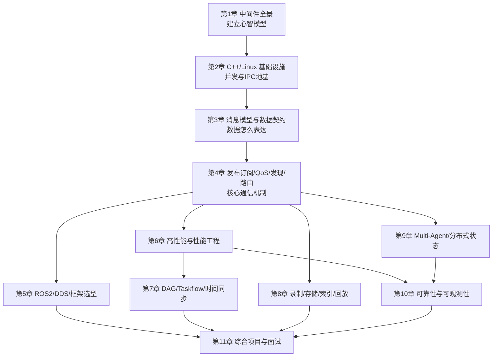
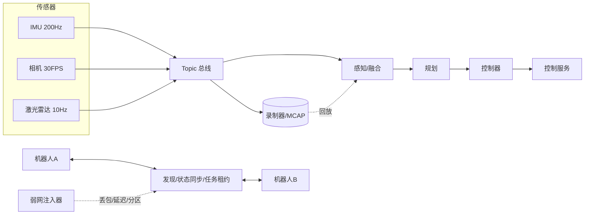

# 机器人通信中间件开发教程

> 一本面向工程实践的中文教材。从并发与系统底层的必要背景讲起，一路走到发布订阅、QoS、序列化、数据落盘、多智能体协同和性能工程，最终形成可以支撑机器人通信中间件岗位的完整能力。

## 前言：这本书要解决什么问题

搜索"中间件开发"，得到的大多是两类材料：一类是某个框架的 API 手册，告诉你 `create_publisher` 怎么调用；另一类是分布式系统理论论文，讨论共识算法的正确性证明。前者学完只会用工具，换个框架就不会了；后者读完仍然写不出一行能跑在机器人上的代码。

这本书想填补中间的空白：**讲清楚通信中间件内部到底发生了什么，为什么这样设计，什么时候会出错，以及怎样用数据证明你的实现是对的。**

书里的每个机制都按同一逻辑展开：

1. 不用它会出什么问题（动机）
2. 它的原理是什么（机制）
3. 怎么用 C++ 在 Linux 上实现（代码）
4. 什么情况下它会失效（陷阱）
5. 怎么测量和验证（数据）

## 读者定位

这本书假设你是**工作约 1 年的 C++ 开发者**：

| 能力 | 期望水平 | 本书如何处理 |
| --- | --- | --- |
| C/C++ 编程 | 能独立写和调试程序，接触过现代 C++ | 用到的现代特性（RAII、移动语义、`jthread`）会解释 |
| Linux 开发 | 能编译、运行、用 gdb 调试 | 用到的系统调用会解释语义和失败模式 |
| Socket 网络 | 写过 TCP/UDP 收发，理解 IP 与端口 | 补充字节流语义、分帧、拥塞等易错点 |
| 多线程与锁 | **了解**概念，实战不多 | **第 2 章系统补齐**：数据竞争、内存可见性、条件变量、死锁 |
| 中间件 | 没有系统经验 | 从零开始建立 |

{: .note }
> 如果你对多线程只是"听说过 mutex"，不要跳过第 2 章。它是全书地基，后面所有队列、线程池、共享内存的设计都建立在那些概念之上。

### 你不需要预先具备的

- 不需要用过 ROS、DDS 或任何机器人框架。
- 不需要懂分布式一致性理论（第 9 章从工程角度讲需要的部分）。
- 不需要有性能调优经验（第 6 章从"怎么测"开始教）。

### 基础补课索引

自测发现某项薄弱时，可以先看对应小节：

| 你不确定的问题 | 去哪一节 |
| --- | --- |
| 什么是数据竞争？为什么加锁能解决？ | 第 2 章 2.2 |
| 内存可见性、内存序需要懂多少？ | 第 2 章 2.3 |
| 条件变量为什么必须配 `while` 循环？ | 第 2 章 2.4 |
| 死锁怎么产生？怎么系统性避免？ | 第 2 章 2.5 |
| TCP 收到的数据为什么要"组帧"？ | 第 2 章 2.9 |
| `epoll` 水平触发和边沿触发有什么区别？ | 第 2 章 2.10 |
| p99 延迟是什么意思？为什么比平均值重要？ | 第 6 章 6.2 |

## 阅读方法

### 章节是递进的



建议**按顺序读第 1 到第 4 章**，它们构成最小完整知识链；之后可按兴趣调整顺序。

### 每章的固定结构

| 段落 | 作用 |
| --- | --- |
| 本章目标与前置知识 | 明确学完能做什么，需要先会什么 |
| 为什么需要 | 从问题出发，而不是从术语出发 |
| 核心概念与术语 | 中英对照，首次出现即解释 |
| 原理深入 | 机制、推导、时序图与状态机图 |
| 工程实现 | 完整可编译代码与逐段讲解 |
| 常见错误与陷阱 | 错误写法与正确写法对比 |
| 真实案例 | 问题 → 根因 → 方案 → 取舍 → 验证 |
| 动手实验与验收 | 可观察的结果，而不是"跑通了" |
| 本章小结与自查清单 | 复习锚点 |
| 面试问题与参考答案 | 训练表达和设计判断 |
| 延伸阅读 | 深入方向 |

### 贯穿全书的思考框架

每学一个机制，用这四个问题自检：

{: .important }
> **四问法**
> 1. **它解决哪个真实问题？** 不能只答"为了通信"。
> 2. **正常路径经过哪些线程、队列、编码和网络边界？** 要能画出来。
> 3. **失败时会怎样？** 慢消费者、重复、乱序、断网、重启、版本变化。
> 4. **哪个指标能证明它工作正常且性能达标？** 要有数字。

绝大多数面试失利，不是因为不知道术语，而是答不出第 3 和第 4 问。

## 术语约定

| 中文 | 英文 | 本书含义 |
| --- | --- | --- |
| 节点 | Node | 有身份和生命周期的计算单元（线程/进程/机器） |
| 话题 | Topic | 具名的数据流通道，多对多 |
| 发布订阅 | Pub-Sub | 生产者与消费者解耦的异步分发模式 |
| 服务 | Service | 一对一的请求-响应调用 |
| 动作 | Action | 长任务，带进度反馈和取消 |
| 服务质量 | QoS | 可靠性、深度、时限等行为契约 |
| 数据平面 | Data Plane | 承载业务数据的路径 |
| 控制平面 | Control Plane | 承载发现、配置、健康的路径 |
| 背压 | Backpressure | 下游处理不过来时反向限制上游 |
| 零拷贝 | Zero-copy | 数据传递过程中不产生额外复制 |
| 尾延迟 | Tail latency | 高分位（p99/p999）的延迟 |
| 租约 | Lease | 有时限的所有权，需续期 |
| 代际 | Epoch / Generation | 单调递增编号，用于拒绝陈旧消息 |

{: .warning }
> 本书刻意避免把"可靠""实时""高性能""零拷贝"当作褒义标签使用。它们都是**有代价的技术选择**，必须说明边界、成本和验证条件。看到这些词，就要追问"在什么条件下"。

## 岗位要求与章节映射

| 招聘要求 | 教程章节 | 学习结果 |
| --- | --- | --- |
| 单机、多机、云边端高性能通信 | 1、2、3、6 | 能按部署边界选择进程模型、IPC、网络和路由 |
| 发布订阅、服务调用、发现、QoS、路由 | 4 | 能设计通信语义、队列、匹配和背压 |
| ROS 2、Cyber RT、DORA、Zenoh、ZeroMQ | 5 | 能理解框架边界并做技术选型 |
| 图像、点云、IMU、控制数据链路 | 3、6 | 能围绕延迟、吞吐、抖动和丢帧做优化 |
| DAG、Taskflow、依赖触发、时间同步 | 7 | 能把通信和计算调度组合成确定性数据流 |
| 采集、缓存、压缩、索引、回放、上传 | 8 | 能实现可恢复的数据落盘链路 |
| Protobuf、FlatBuffers、IDL、MCAP | 3、8 | 能设计跨语言、可演进的数据契约和格式 |
| Multi-Agent、状态共享、任务协同 | 9 | 能处理弱网、乱序、重复、分区和状态收敛 |
| 超时、重试、重连、限流、追踪 | 10 | 能设计故障模型、可观测性和恢复机制 |
| 性能调优和故障定位 | 6、10、11 | 能用指标、trace 和压测证明工程结论 |

## 各章导读

### [第 1 章：中间件全景与通信抽象](chapter1.html)

建立心智模型。理解节点、话题、服务、动作的语义差异，区分数据平面与控制平面，跟踪一条消息的完整生命周期，学会用容量估算判断方案可行性。

**学完你能**：画出任意机器人系统的数据流图，为每条边标注频率、大小、时效性和失败策略。

### [第 2 章：现代 C++ 与 Linux 基础设施](chapter2.html)

全书地基，篇幅最长。系统补齐并发基础（数据竞争、内存可见性、条件变量、死锁），再实现生产级有界队列、线程池、共享内存 IPC、epoll 事件循环和消息分帧。

**学完你能**：写出不会死锁、不会数据竞争、能优雅停止、能背压的并发基础设施。

### [第 3 章：消息模型与数据契约](chapter3.html)

数据怎么表达。消息头设计、Protobuf 与 FlatBuffers 取舍、buffer pool 与零拷贝句柄、schema 版本演进规则。

**学完你能**：设计跨语言、跨版本安全的消息格式，实现同机零拷贝分发。

### [第 4 章：发布订阅、QoS、发现与路由](chapter4.html)

中间件的核心。亲手实现进程内消息总线，理解 QoS 兼容矩阵、租约式服务发现、慢消费者隔离和路由策略。

**学完你能**：解释任何 pub-sub 框架的内部结构，并诊断"偶尔收不到消息"这类问题。

### [第 5 章：ROS 2、DDS 与框架选型](chapter5.html)

工业界现状。ROS 2 分层架构、DDS 的 QoS 策略、executor 调度陷阱，以及 Zenoh/ZeroMQ/Cyber RT/DORA 的定位对比。

**学完你能**：画出 ROS 2 消息路径，诊断 executor 阻塞，基于语义而非品牌做选型。

### [第 6 章：高性能通信与性能工程](chapter6.html)

从"感觉快"到"证明快"。延迟分解、分位数统计、减少拷贝、批量权衡、perf 火焰图工作流、带宽容量估算。

**学完你能**：独立完成压测、定位瓶颈、用数据支撑优化结论。

### [第 7 章：DAG、Taskflow 与时间同步](chapter7.html)

通信驱动计算。触发策略对比、近似时间同步算法、线程池分组、四种时钟的选择。

**学完你能**：实现多传感器融合的时间对齐，避免单个慢输入拖垮整张计算图。

### [第 8 章：录制、存储、索引与回放](chapter8.html)

数据闭环。chunk + 索引 + CRC 的文件格式、崩溃恢复协议、压缩策略、确定性回放。

**学完你能**：实现一个断电后仍能恢复大部分数据的录制器。

### [第 9 章：Multi-Agent 与分布式状态](chapter9.html)

从单机到多机。epoch 与租约防双主、快照加增量的状态同步、任务协商、弱网与网络分区下的收敛。

**学完你能**：设计多机器人协同协议，并证明它在分区和重连后不会出现双主执行。

### [第 10 章：可靠性与可观测性](chapter10.html)

让系统可以失败。超时重试与指数退避、熔断器、连接状态机、限流降级、链路追踪、故障注入。

**学完你能**：设计故障模型并用注入实验证明系统可恢复、可定位。

### [第 11 章：综合项目与面试](chapter11.html)

把全部能力串成一个项目，并建立系统设计题的答题框架。

**学完你能**：完整讲述一个有数据支撑的中间件项目，应对深挖追问。

## 贯穿项目：机器人数据总线实验室

全书围绕一个逐步演进的项目展开，第 11 章给出完整拼装：



它最终要支持：

- IMU、图像、点云、控制指令四类不同 QoS 的数据流。
- 同机共享内存与跨机网络两条传输路径。
- 有界队列、慢消费者隔离、断线重连和消息去重。
- Protobuf 或 FlatBuffers 的消息版本演进与跨版本测试。
- MCAP 风格的录制、索引、压缩、崩溃恢复和回放。
- 多机器人心跳、能力发现、状态快照与增量、任务租约和 epoch。
- 端到端 trace 与 p50/p95/p99、吞吐、CPU、内存、带宽、磁盘、丢帧指标。

## 代码约定与编译环境

全书代码基于 **C++20、Linux、GCC 11+ 或 Clang 14+**。为聚焦主线，示例做了如下简化，实际工程需补齐：

- 省略部分错误检查（关键处用注释标注 `// 生产环境需检查`）。
- 省略完整的 `#include` 列表（保留关键头文件）。
- 用 `now_ns()` 表示获取单调纳秒时间戳：

```cpp
#include <chrono>
#include <cstdint>

inline uint64_t now_ns() {
    return std::chrono::duration_cast<std::chrono::nanoseconds>(
        std::chrono::steady_clock::now().time_since_epoch()).count();
}
```

学习阶段建议开启 sanitizer 编译：

```bash
# 学习与调试：地址和未定义行为检查
g++ -std=c++20 -O1 -g -pthread -fsanitize=address,undefined demo.cpp -o demo

# 并发问题排查：线程检查器（不能与 ASan 同时开启）
g++ -std=c++20 -O1 -g -pthread -fsanitize=thread demo.cpp -o demo

# 性能测试：关闭 sanitizer，开优化并保留符号
g++ -std=c++20 -O2 -g -pthread demo.cpp -o demo
```

{: .warning }
> 性能数据必须在**关闭 sanitizer** 的 `-O2` 构建下测量。ASan 通常让程序慢 2 倍以上，TSan 可能慢 5–15 倍，用它们测出的延迟没有参考价值。

## 配套代码：机器人数据总线实验室

书里的实现都在仓库的 [`code/`](https://github.com/cavemancave/mw-study/tree/main/code) 目录里，可以直接编译、跑测试、跑压测。
它不是又一个中间件框架，而是一组**最小可运行、可测量、可失败**的教学实现。

```bash
git clone https://github.com/cavemancave/mw-study.git
cd mw-study
cmake -S code -B build -DCMAKE_BUILD_TYPE=Debug -DRDB_WERROR=ON
cmake --build build --parallel
ctest --test-dir build --output-on-failure
```

| 模块 | 对应章节 | 它证明了什么 |
| --- | --- | --- |
| `rdb/concurrency/bounded_queue.h` | 2、4 | 三种溢出策略、优雅关闭、队列高水位可观测 |
| `rdb/concurrency/spsc_ring.h` | 2、6 | acquire/release 内存序与缓存行填充的实际效果 |
| `rdb/concurrency/thread_pool.h` | 2、7 | 有界任务队列、任务被拒绝的返回路径 |
| `rdb/msg/header.h` | 3、8 | 定长小端消息头、schema 指纹、解码必须校验 |
| `rdb/msg/buffer_pool.h` | 3、6 | 大消息复用内存、共享句柄扇出、池耗尽即背压信号 |
| `rdb/transport/framing.h` | 2、4 | 字节流分帧与长度前缀的安全上限 |
| `rdb/bus/qos.h` | 4、5 | RxO 兼容规则：可靠性、持久性、deadline |
| `rdb/bus/topic_bus.h` | 4 | 发布订阅内核：订阅者隔离、latch、lifespan |
| `rdb/metrics/histogram.h` | 6、10 | 用 p50/p90/p99/p999 描述延迟 |

[`code/README.md`](https://github.com/cavemancave/mw-study/blob/main/code/README.md) 里列出了 6 个实验和每个实验的**可观察验收标准**，例如：

- 实验 2：把 `sub[0]` 人为拖慢 5ms/条，验证它的 `dropped > 0` 而其他订阅者 `dropped == 0`，且发布速率不下降。
- 实验 3：同一条链路分别用 Reliable 和 BestEffort 跑一遍，把两组 p50/p99/p999 和丢弃数记成一张表。

{: .note }
> 代码在 GitHub Actions 上用 GCC 与 Clang、Debug 与 RelWithDebInfo、ASan 与 TSan 六组配置持续验证。
> 目前覆盖第 2、3、4、6 章的核心机制；跨进程传输、录制回放与多机状态同步会在后续加入。

## 如何检验学习效果

不要用"读完了"衡量，用下面三个标准：

1. **能画**：闭卷画出某个机制的架构图或时序图。
2. **能写**：不看书实现核心数据结构（有界队列、时间同步、chunk 恢复）。
3. **能答**：对每章面试题给出有取舍、有数据、有边界的回答。

三条都达到，你就具备了这个岗位要求的核心能力。
